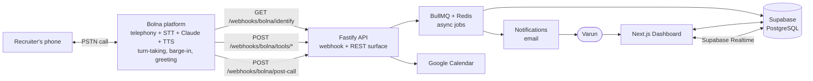

# 00 — Project Overview

> **RecruitPilot AI — Production-Grade AI Executive Voice Assistant**
> Document 00 of 21 · Foundation document · Read this before everything else.

---

## 1. Goal

Build a **production-grade AI Executive Voice Assistant** that answers recruiter phone calls on Varun Gandhi's behalf when he is unavailable.

When a recruiter calls Varun's dedicated number, the assistant must:

1. **Answer the call in real time** over the phone network (not an app — a real PSTN phone call).
2. **Immediately declare itself as an AI assistant** — it must *never* pretend to be Varun.
3. **Ask for permission** to collect information about the opportunity.
4. **Conduct a natural, low-latency voice conversation**: answer recruiter questions about Varun's profile and ask a predefined set of screening questions (company, role, tech stack, compensation range, location/remote policy, urgency, next steps).
5. **Use tools (function calling)** during the call: check Varun's Google Calendar for availability, send Varun's resume to the recruiter, save recruiter details, trigger notifications.
6. **After the call**: generate a full transcript, generate a structured summary, persist everything to the database, and notify Varun immediately.
7. **Remember**: support memory so a returning recruiter is recognized ("Welcome back — you called last week about the Staff Engineer role at Acme").

**The opening line is a hard product requirement:**

> "Hello. You've reached Varun Gandhi's AI Assistant. Varun is currently unavailable. With your permission, I can collect information regarding this opportunity and immediately notify him."

**How we build it (the pivot):** the live voice loop — telephony, speech-to-text, the LLM conversation, text-to-speech, interruption handling — is delegated to **Bolna** (https://www.bolna.ai), an India-first managed voice-agent platform. *We* build everything around that loop: the webhook endpoints Bolna calls during and after each call, the async job pipeline that turns raw calls into transcripts/summaries/notifications/memory, and the dashboard where Varun reviews everything. Doc 02 records why Bolna won (and what it replaced); the original hand-built pipeline design is preserved as an optional deep-learning phase in `docs/phase2-diy-reference/`.

**Secondary goal:** this project is a *learning vehicle*. Every document explains WHY before HOW, assumes zero prior configuration, and walks through every external service from account creation to verification. The finished system is interview-portfolio grade: real telephony, a real AI agent in production, clean architecture, CI/CD, and production deployment.

---

## 2. Theory

### 2.1 What is a voice agent, really?

A phone-call AI assistant is a **real-time streaming pipeline** of four AI/telecom systems glued together:

```
Caller's voice ──▶ Telephony ──▶ Speech-to-Text ──▶ LLM (brain) ──▶ Text-to-Speech ──▶ Caller's ear
```

Each hop must **stream** — humans perceive a conversational pause longer than ~1–1.5 seconds as "the line went dead" — and the caller can interrupt at any moment (barge-in). Building and operating that pipeline yourself means WebSocket session management, jitter buffers, endpointing decisions, and four vendor accounts. That is exactly the part we now **buy instead of build**: Bolna runs the entire loop as a managed service, with the LLM (Anthropic Claude) configured inside Bolna's agent settings.

What remains ours is the part no platform can do for us — **the business system around the call**:

```
                    ┌──────────────── Bolna (managed) ────────────────┐
Recruiter ──PSTN──▶ │ telephony + STT + Claude + TTS + barge-in       │
                    └───────────────┬─────────────────────────────────┘
                                    │ HTTPS webhooks (three surfaces)
                                    ▼
                    OUR Fastify API ──▶ BullMQ jobs ──▶ Supabase ──▶ Next.js dashboard
```

Bolna reaches into our system over plain HTTPS at three moments:

1. **Call start — identify**: "who is calling?" → we return the recruiter's record + memory, which Bolna injects into the agent's prompt as `{{variables}}`. This is the memory read path.
2. **Mid-call — tools**: Claude (inside Bolna) decides to check the calendar or send a resume → Bolna POSTs our tool endpoint, we respond with JSON, the agent speaks the result.
3. **Call end — post-call**: Bolna delivers the transcript, recording URL, and metadata → we enqueue the async job chain.

### 2.2 Why a managed platform is still an engineering project

| What Bolna owns | What we own |
|---|---|
| Answering the PSTN call | Knowing *who* is calling (identify endpoint + memory) |
| STT ⇄ Claude ⇄ TTS loop, barge-in, endpointing | Tool execution: calendar, resume, save, notify |
| Speaking the scripted greeting | Configuring that greeting (the disclosure is OUR rule) |
| Recording + raw transcript capture | Persistence, summaries, structured data, dashboard |
| Retrying webhook delivery | Idempotent handlers that tolerate those retries |
| Per-minute billing | Cost telemetry and the database of record |

The engineering discipline shifts from *audio latency* to *webhook latency and reliability*: our identify endpoint must answer in well under a second (the caller is literally waiting on the line while it runs), our tool endpoints must respond fast enough that the conversation doesn't stall, and our post-call handler must never lose a call record even when Bolna retries delivery.

### 2.3 Why the AI must declare itself

- **Ethics & trust**: impersonating a human erodes trust; recruiters who feel deceived will not engage.
- **Law**: multiple jurisdictions regulate AI voice disclosure on calls (e.g., US state laws on bot disclosure, TRAI guidelines evolving in India, EU AI Act transparency obligations). Declaring up front is the safe, future-proof default.
- **Product**: transparency *is the feature* — "Varun has an AI executive assistant" is a stronger impression than a failed impersonation.

This rule is enforced in three layers (defense in depth), and all three **survive the pivot**:

1. **Layer 1** — the disclosure greeting is Bolna's *scripted welcome message*, configured text played before the LLM produces anything (doc 06).
2. **Layer 2** — the system prompt forbids impersonation (doc 16).
3. **Layer 3** — a post-call job checks every transcript and flags violations (doc 16).

### 2.4 Key vocabulary (glossary)

| Term | Meaning |
|---|---|
| **PSTN** | Public Switched Telephone Network — the real phone network. |
| **Voice-agent platform** | Managed service (Bolna) bundling telephony + STT + LLM orchestration + TTS + turn-taking behind one API. |
| **Webhook** | Vendor calls *our* HTTP endpoint when an event happens (call start, tool call, call end). |
| **Identify endpoint** | Our GET endpoint Bolna hits at call start with the caller's number; the JSON we return becomes prompt variables. |
| **Custom function tool** | A tool the agent can call mid-conversation; defined in OpenAI function-calling JSON, executed by *our* HTTP endpoint (Bolna's `custom_task` mechanism). |
| **Dynamic variables** | `{{variable}}` placeholders in the Bolna agent prompt, filled from our identify response. |
| **execution_id** | Bolna's unique ID for one call execution — our correlation ID everywhere (logs, jobs, DB rows). |
| **Barge-in** | Caller interrupts while the assistant is speaking; the platform stops TTS. Handled *inside* Bolna now. |
| **Idempotency** | A handler/job is safe to run twice with the same input — required because webhooks and queues redeliver. |
| **Turn** | One exchange: caller speaks → assistant replies. |

---

## 3. Architecture

High-level view only — doc 01 goes deep.

### 3.1 The 30,000-ft picture



### 3.2 Two planes

- **Live-call webhook surface (during the call, latency-critical):** the three endpoints Bolna calls while a recruiter is on the line. Identify and tool responses feed directly into the live conversation, so they must be fast — anything slow (email, LLM summarization) is *enqueued*, never awaited.
- **Async plane (around the call, reliability-critical):** BullMQ jobs handle transcript persistence, summary generation (Claude API, direct), recruiter/opportunity upserts, notifications, memory updates, and recording downloads. Jobs retry on failure; the call never blocks on them.

This split is still the most important architectural decision in the project — it is why Redis/BullMQ remain in the stack. The rule of thumb: **if the recruiter is waiting on the line for it, it must be fast or enqueued-with-instant-ack; if Varun or the database is waiting for it, it must be a retryable job.**

### 3.3 Provider pattern (replaceability rule)

Every third-party service hides behind an interface owned by *our* domain layer. Bolna collapsed four vendor adapters into one — but the discipline is unchanged:

| Interface | Default implementation | Swappable with |
|---|---|---|
| `BolnaClient` | Bolna (executions API, recording download) | Vapi, Retell — or Phase 2 DIY pipeline |
| `LLMProvider` (summaries) | Claude direct API | GPT, Gemini |
| `CalendarProvider` | Google Calendar | Outlook/CalDAV |
| `StorageProvider` | Supabase Storage | S3 |
| `NotificationProvider` | Email | WhatsApp, SMS, Slack |

No feature module ever imports an SDK directly — only the interface. If Bolna disappoints, the exit is a config change plus one thin adapter, or executing the preserved DIY plan in `docs/phase2-diy-reference/`.

---

## 4. Folder Structure

Defined fully in doc 03; this is the shape you're building toward — a **monorepo**:

```
RecruitPilot_AI/
├── apps/
│   ├── api/                  # Fastify backend (TypeScript)
│   │   └── src/
│   │       ├── features/     # webhooks (Bolna surfaces), calls, recruiters, health, ...
│   │       ├── providers/    # bolna, google-calendar, supabase, email adapters
│   │       ├── core/         # domain interfaces (ports), config, errors, DI
│   │       ├── infra/        # prisma, redis, queues, logger
│   │       └── jobs/         # BullMQ consumers (the async plane)
│   └── web/                  # Next.js dashboard
├── packages/
│   └── shared/               # Zod schemas + types shared by api & web
├── docs/                     # ← the 21 documents (you are here)
│   └── phase2-diy-reference/ # preserved DIY voice-pipeline docs (optional Phase 2)
├── docker/                   # Dockerfiles, nginx config
├── .github/workflows/        # CI/CD
└── docker-compose.yml
```

---

## 5. Manual Steps

This document requires **no external accounts yet**. Your manual steps are preparation:

1. **Verify local machine prerequisites** (macOS):
   - Node.js ≥ 20 LTS — check with `node --version`. If missing, install from https://nodejs.org (download the LTS `.pkg`, run installer, click through, verify again).
   - Git — `git --version` (macOS ships it; if prompted, click "Install" on the Xcode Command Line Tools dialog).
   - Docker Desktop — https://www.docker.com/products/docker-desktop/ → Download for Mac (Apple Silicon or Intel — check  → About This Mac) → open the `.dmg` → drag to Applications → launch → accept license → wait for "Docker Desktop is running" (whale icon in the menu bar).
   - A code editor (VS Code: https://code.visualstudio.com).
2. **Create a dedicated project email folder / password manager vault.** You will create ~5 service accounts (Supabase, Bolna, Anthropic, AWS, GitHub if not existing). Store every API key in a password manager (1Password/Bitwarden) — *never* in chat logs, notes apps, or committed files.
3. **Decide the identity you'll use**: use one email (e.g., varun@digiqc.com or a personal one) consistently for all services so billing and access recovery stay simple.
4. **Read this document fully**, then read the call-flow narrative below until you can retell it from memory — every later document assumes it.

### 5.1 The life of a call (narrative — memorize this)

1. Recruiter dials the **Bolna-provisioned Indian number**.
2. Before the agent speaks, Bolna hits **`GET /webhooks/bolna/identify`** on our API with the caller's number → we look up the recruiter and their memory → return JSON → Bolna merges it into the agent prompt as `{{variables}}` (name, past opportunities, notes). A first-time caller gets a graceful "unknown caller" response instead.
3. Bolna plays the **scripted disclosure greeting** (Layer 1 — configured text, no LLM involved) declaring the AI identity and asking permission.
4. Bolna runs the **conversation loop internally**: caller speech → STT → Claude (with our prompt + injected memory) → TTS → caller's ear. Barge-in, endpointing, and turn-taking are handled by the platform.
5. When Claude decides to use a tool (`check_calendar`, `send_resume`, `save_recruiter`, `notify_varun`), Bolna **POSTs our tool endpoint**; we execute it (calendar read, synchronous) or enqueue it (resume email / notification — instant `{queued: true}` ack) and return JSON; the agent speaks a natural-language version of the result.
6. Call ends → Bolna **POSTs `/webhooks/bolna/post-call`** with the transcript, recording URL, and metadata → our handler validates the token, enqueues the job chain, and returns 200 immediately: persist transcript → generate summary (Claude API, direct) → upsert recruiter/opportunity → notify Varun → update memory → store recording (downloaded from Bolna's URL into Supabase Storage).
7. Varun opens the **Next.js dashboard** (Supabase Auth login) and sees the call, transcript, summary, and recruiter card — live via Supabase Realtime.

---

## 6. Official Links

| Service | Link | Used for |
|---|---|---|
| Node.js | https://nodejs.org | Runtime |
| Docker Desktop | https://www.docker.com/products/docker-desktop/ | Containers |
| Supabase | https://supabase.com | DB / Auth / Storage / Realtime |
| Bolna | https://www.bolna.ai | Managed voice agent (telephony + STT + LLM + TTS) |
| Bolna docs | https://www.bolna.ai/docs | Platform documentation root |
| Bolna pricing | https://www.bolna.ai/pricing | Prepaid credits, per-minute pricing |
| Anthropic Console | https://console.anthropic.com | Claude API (post-call summaries + memory) |
| AWS | https://aws.amazon.com | EC2 deployment, CloudWatch |
| GitHub | https://github.com | Repo + Actions CI/CD |
| Fastify | https://fastify.dev | Backend framework docs |
| Next.js | https://nextjs.org | Frontend framework docs |
| Prisma | https://www.prisma.io | ORM docs |
| BullMQ | https://docs.bullmq.io | Queue docs |

---

## 7. Commands

Nothing to run yet except environment verification:

```bash
node --version        # expect v20.x or v22.x (LTS)
npm --version         # expect 10.x+
git --version         # any recent version
docker --version      # expect 24.x+
docker compose version  # expect v2.x
```

---

## 8. Environment Variables

None yet. But adopt the **naming convention now** — every future doc follows it:

```
<SERVICE>_<PURPOSE>            # e.g. BOLNA_API_KEY, ANTHROPIC_API_KEY
NEXT_PUBLIC_<NAME>             # ONLY for values safe to expose in the browser
```

Rules established here, enforced everywhere:
- Secrets live in `.env` files that are **git-ignored** from the very first commit.
- A committed `.env.example` documents every variable with a placeholder and a comment.
- Production secrets live in GitHub Actions Secrets and on the server — never in the repo.

---

## 9. Verification

You are done with this document when:

```bash
node --version && docker --version && git --version
```

all succeed, **and** you can answer these from memory (self-quiz):

1. Which parts of the voice pipeline does Bolna own, and which parts do we build?
2. What are the three webhook surfaces Bolna calls on our API, and at what moment in a call does each fire?
3. Where does the recruiter's memory get *read* into a call, and where does it get *written*?
4. What runs on the live-call webhook surface vs the async plane, and what is the rule that decides?
5. Why does the assistant declare itself before the LLM says anything, and which of the three disclosure layers is a Bolna configuration?
6. If Bolna disappoints, what are the two exit paths?

If you can't answer one, re-read the relevant section — later docs build on these without re-explaining.

---

## 10. Common Mistakes

1. **Skipping the theory and jumping to config.** A managed platform hides the pipeline, not the system design. If you can't retell the life of a call, you can't debug why a tool call timed out or a post-call webhook was processed twice.
2. **Putting slow work in a webhook handler.** One `await sendEmail()` inside the tool endpoint and the agent goes silent mid-call. Webhook handlers respond fast; everything slow becomes a queued job with an instant ack.
3. **Coupling features to the Bolna API directly.** The day Bolna changes pricing or an endpoint, you rewrite half the app. The `BolnaClient` port and provider interfaces are non-negotiable — that's the insurance that made this pivot cheap in the first place.
4. **Treating the AI-disclosure greeting as an LLM behavior.** LLMs can be prompted out of behaviors; Bolna's scripted welcome message cannot. Layer 1 is configuration, not prompting.
5. **Committing a secret "just once to test."** Git history is forever; scanners find keys in minutes. Set up `.gitignore` before the first `.env` exists.
6. **Building all 21 steps' infrastructure at once.** Follow the documents in order; each verifies before the next begins.
7. **Assuming webhooks arrive exactly once.** Bolna may retry the post-call webhook; the same `execution_id` will land twice. Idempotency is a day-one requirement, not a hardening task.

---

## 11. Production Best Practices

Adopted from day one (each detailed in its own doc):

- **12-Factor App**: config from environment, stateless processes, logs as event streams (Pino), disposability.
- **Observability first**: every call gets a correlation ID (Bolna's `execution_id`) that threads through logs, jobs, and DB rows.
- **Graceful degradation**: if one of our tool endpoints fails mid-call, the agent must speak a graceful fallback ("I'll make sure Varun follows up on that") — never dead air, never a raw error.
- **Idempotency**: webhook handlers and jobs must tolerate duplicate delivery (vendors retry) — keyed by `execution_id`.
- **Webhook response budgets as SLOs**: identify < 500 ms, tool calls < 800 ms, post-call ack < 1 s. Measured, not hoped for (doc 01).
- **Cost awareness**: Bolna minutes and Claude tokens are metered; we log per-call cost from the start.

---

## 12. Security

Security posture established now, enforced in every subsequent doc (deep dive: doc 18):

- **Secrets management**: password manager for humans, `.env` (git-ignored) for local dev, GitHub Secrets + server-side env for production. Rotate any key that ever leaks, immediately.
- **Least privilege**: separate API keys per environment (dev/prod) where vendors allow it; scoped keys over master keys.
- **Webhook authenticity**: every inbound Bolna request must present our Bearer token (`BOLNA_WEBHOOK_TOKEN`, generated by us) — anyone on the internet can POST to a public URL.
- **PII by design**: recruiter names, numbers, and transcripts are personal data. Access-controlled (Supabase RLS), never logged in plaintext application logs, deletable on request. Note that transcripts and recordings also transit Bolna's platform — Indian data residency is available and preferred (doc 05).
- **Recording & consent**: the greeting asks permission before collecting information — this is a product, legal, and ethical control in one.
- **The assistant never impersonates a human** — enforced in configuration (Layer 1), prompt (Layer 2), and post-call checks (Layer 3).

---

## 13. Checklist

- [ ] Node.js ≥ 20 installed and verified
- [ ] Git installed and verified
- [ ] Docker Desktop installed, running, and verified
- [ ] Code editor installed
- [ ] Password manager ready for the ~5 upcoming service accounts
- [ ] Single project email identity decided
- [ ] Life-of-a-call narrative (§5.1) understood and retellable
- [ ] The three webhook surfaces and their timing memorized
- [ ] Self-quiz in §9 passed
- [ ] Glossary terms (§2.4) familiar
- [ ] Understood: one document at a time, verify before proceeding

---

## 14. Next Step

Proceed to **`01_SYSTEM_ARCHITECTURE.md`** — the complete system design: C4-style diagrams with Bolna as the external managed system, the three webhook surfaces and their response budgets, the event-driven async plane, data flow, failure modes, and idempotency — the contracts that govern every technical decision that follows.
