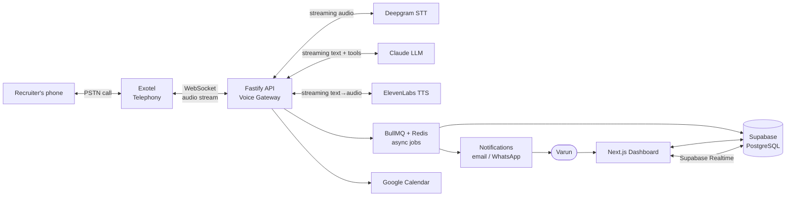

# 00 — Project Overview

> **RecruitPilot AI — Production-Grade AI Executive Voice Assistant**
> Document 00 of 21 · Foundation document · Read this before everything else.

---

## 1. Goal

Build a **production-grade AI Executive Voice Assistant** that answers recruiter phone calls on Varun Gandhi's behalf when he is unavailable.

When a recruiter calls Varun's dedicated number, the assistant must:

1. **Answer the call in real time** over the phone network (not an app — a real PSTN phone call).
2. **Immediately declare itself as an AI assistant** — it must *never* pretend to be Varun.
3. **Ask for permission** to collect information about the opportunity.
4. **Conduct a natural, low-latency voice conversation**: answer recruiter questions about Varun's profile and ask a predefined set of screening questions (company, role, tech stack, compensation range, location/remote policy, urgency, next steps).
5. **Use tools (function calling)** during the call: check Varun's Google Calendar for availability, send Varun's resume to the recruiter, save recruiter details, trigger notifications.
6. **After the call**: generate a full transcript, generate a structured summary, persist everything to the database, and notify Varun immediately.
7. **Remember**: support memory so a returning recruiter is recognized ("Welcome back — you called last week about the Staff Engineer role at Acme").

**The opening line is a hard product requirement:**

> "Hello. You've reached Varun Gandhi's AI Assistant. Varun is currently unavailable. With your permission, I can collect information regarding this opportunity and immediately notify him."

**Secondary goal:** this project is a *learning vehicle*. Every document explains WHY before HOW, assumes zero prior configuration, and walks through every external service from account creation to verification. The finished system is interview-portfolio grade: real telephony, real-time AI, clean architecture, CI/CD, and production deployment.

---

## 2. Theory

### 2.1 What is a voice agent, really?

A phone-call AI assistant is a **real-time streaming pipeline** of four AI/telecom systems glued together:

```
Caller's voice ──▶ Telephony ──▶ Speech-to-Text ──▶ LLM (brain) ──▶ Text-to-Speech ──▶ Caller's ear
                   (Exotel)       (Deepgram)         (Claude)         (ElevenLabs)
```

Each hop is a separate vendor, a separate network connection, and a separate failure mode. The core engineering challenge is **latency**: humans perceive a conversational pause longer than ~1–1.5 seconds as "the line went dead." So every stage must **stream** — we never wait for a full sentence to finish before starting the next stage.

### 2.2 Why this is harder than a chatbot

| Chatbot | Voice agent |
|---|---|
| User waits happily for 5s | >1.5s silence feels broken |
| Input arrives as complete text | Input is a continuous audio stream; you must *decide* when the person finished talking (endpointing) |
| Output rendered instantly | Output must be synthesized to audio and streamed back |
| User can't interrupt | Caller *will* interrupt mid-sentence (barge-in) — assistant must stop talking |
| Stateless request/response | Long-lived stateful WebSocket session per call |

### 2.3 Why the AI must declare itself

- **Ethics & trust**: impersonating a human erodes trust; recruiters who feel deceived will not engage.
- **Law**: multiple jurisdictions regulate AI voice disclosure on calls (e.g., US state laws on bot disclosure, TRAI guidelines evolving in India, EU AI Act transparency obligations). Declaring up front is the safe, future-proof default.
- **Product**: transparency *is the feature* — "Varun has an AI executive assistant" is a stronger impression than a failed impersonation.

This rule is enforced in three layers (defense in depth): the scripted greeting is played before the LLM produces anything, the system prompt forbids impersonation, and post-call transcript checks flag violations.

### 2.4 Key vocabulary (glossary)

| Term | Meaning |
|---|---|
| **PSTN** | Public Switched Telephone Network — the real phone network. |
| **STT / ASR** | Speech-to-Text / Automatic Speech Recognition (Deepgram). |
| **TTS** | Text-to-Speech (ElevenLabs). |
| **LLM** | Large Language Model (Claude) — the conversational brain. |
| **Endpointing** | Detecting that the speaker has finished their utterance. |
| **Barge-in** | Caller interrupts while the assistant is speaking; assistant must stop. |
| **VAD** | Voice Activity Detection — is anyone speaking right now? |
| **Function calling / tool use** | LLM emits a structured request ("check_calendar") that our code executes, then feeds the result back. |
| **Webhook** | Vendor calls *our* HTTP endpoint when an event happens (e.g., incoming call). |
| **μ-law (mulaw) 8kHz** | Telephone-grade audio encoding; telephony streams use it — we transcode to/from what STT/TTS expect. |
| **Turn** | One exchange: caller speaks → assistant replies. |

---

## 3. Architecture

High-level view only — `01_SYSTEM_ARCHITECTURE.md` goes deep.

### 3.1 The 30,000-ft picture



### 3.2 Two planes

- **Real-time plane (during the call, latency-critical):** Exotel ⇄ Fastify WebSocket ⇄ Deepgram ⇄ Claude ⇄ ElevenLabs. Nothing slow (DB writes, emails) is allowed on this path.
- **Async plane (around the call, reliability-critical):** BullMQ jobs handle transcript persistence, summary generation, resume email, notifications, memory updates. Jobs retry on failure; the call never blocks on them.

This split is the single most important architectural decision in the project — it is why Redis/BullMQ exist in the stack.

### 3.3 Provider pattern (replaceability rule)

Every third-party service hides behind an interface owned by *our* domain layer:

| Interface | Default implementation | Swappable with |
|---|---|---|
| `TelephonyProvider` | Exotel | Twilio, Plivo |
| `SpeechProvider` (STT) | Deepgram | Whisper, AssemblyAI |
| `LLMProvider` | Claude | GPT, Gemini |
| `VoiceProvider` (TTS) | ElevenLabs | Cartesia, PlayHT |
| `StorageProvider` | Supabase Storage | S3 |
| `NotificationProvider` | Email | WhatsApp, SMS, Slack |

No feature module ever imports an SDK directly — only the interface. Vendor SDKs live in one folder each, behind dependency injection.

---

## 4. Folder Structure

Defined fully in `03_FOLDER_STRUCTURE.md`; this is the shape you're building toward — a **monorepo**:

```
RecruitPilot_AI/
├── apps/
│   ├── api/                  # Fastify backend (TypeScript)
│   │   └── src/
│   │       ├── features/     # feature-based modules (calls, recruiters, agent, ...)
│   │       ├── providers/    # Exotel, Deepgram, Claude, ElevenLabs adapters
│   │       ├── core/         # domain interfaces, DI container, config, errors
│   │       └── infra/        # prisma, redis, queues, logger
│   └── web/                  # Next.js dashboard
├── packages/
│   └── shared/               # Zod schemas + types shared by api & web
├── docs/                     # ← the 21 documents (you are here)
├── docker/                   # Dockerfiles, nginx config
├── .github/workflows/        # CI/CD
└── docker-compose.yml
```

---

## 5. Manual Steps

This document requires **no external accounts yet**. Your manual steps are preparation:

1. **Verify local machine prerequisites** (macOS):
   - Node.js ≥ 20 LTS — check with `node --version`. If missing, install from https://nodejs.org (download the LTS `.pkg`, run installer, click through, verify again).
   - Git — `git --version` (macOS ships it; if prompted, click "Install" on the Xcode Command Line Tools dialog).
   - Docker Desktop — https://www.docker.com/products/docker-desktop/ → Download for Mac (Apple Silicon or Intel — check  → About This Mac) → open the `.dmg` → drag to Applications → launch → accept license → wait for "Docker Desktop is running" (whale icon in the menu bar).
   - A code editor (VS Code: https://code.visualstudio.com).
2. **Create a dedicated project email folder / password manager vault.** You will create ~7 service accounts (Supabase, Exotel, Deepgram, Anthropic, ElevenLabs, AWS, GitHub if not existing). Store every API key in a password manager (1Password/Bitwarden) — *never* in chat logs, notes apps, or committed files.
3. **Decide the identity you'll use**: use one email (e.g., varun@digiqc.com or a personal one) consistently for all services so billing and access recovery stay simple.
4. **Read this document fully**, then read the call-flow narrative below until you can retell it from memory — every later document assumes it.

### 5.1 The life of a call (narrative — memorize this)

1. Recruiter dials Varun's Exotel number (an Indian virtual number).
2. Exotel's flow answers and opens a **WebSocket** to our Fastify server, streaming caller audio (8kHz μ-law).
3. Our server plays the **scripted greeting** (pre-synthesized audio — instant, no LLM involved) declaring the AI identity and asking permission.
4. Caller speaks → audio chunks stream to **Deepgram** → interim + final transcripts stream back.
5. On endpoint (caller finished), the transcript goes to **Claude** with the system prompt, conversation history, memory of this recruiter, and tool definitions.
6. Claude streams a reply; sentences are forwarded to **ElevenLabs** as they complete; synthesized audio streams back through the WebSocket to the caller. If Claude instead emits a tool call (`check_calendar`, `send_resume`, `save_recruiter`, `notify_varun`), our code executes it and returns the result to Claude, which then speaks the outcome.
7. If the caller interrupts mid-reply (**barge-in**), we stop TTS playback instantly and go back to listening.
8. Call ends → a `call.completed` event enqueues BullMQ jobs: persist transcript → generate summary (Claude, non-realtime) → save recruiter/opportunity records → send Varun a notification → update memory.
9. Varun opens the **Next.js dashboard** (Supabase Auth login) and sees the call, transcript, summary, and recruiter card — live via Supabase Realtime.

---

## 6. Official Links

| Service | Link | Used for |
|---|---|---|
| Node.js | https://nodejs.org | Runtime |
| Docker Desktop | https://www.docker.com/products/docker-desktop/ | Containers |
| Supabase | https://supabase.com | DB / Auth / Storage / Realtime |
| Exotel | https://exotel.com | Telephony (India) |
| Deepgram | https://deepgram.com | Speech-to-Text |
| Anthropic Console | https://console.anthropic.com | Claude API |
| ElevenLabs | https://elevenlabs.io | Text-to-Speech |
| AWS | https://aws.amazon.com | EC2 deployment, CloudWatch |
| GitHub | https://github.com | Repo + Actions CI/CD |
| Fastify | https://fastify.dev | Backend framework docs |
| Next.js | https://nextjs.org | Frontend framework docs |
| Prisma | https://www.prisma.io | ORM docs |
| BullMQ | https://docs.bullmq.io | Queue docs |

---

## 7. Commands

Nothing to run yet except environment verification:

```bash
node --version        # expect v20.x or v22.x (LTS)
npm --version         # expect 10.x+
git --version         # any recent version
docker --version      # expect 24.x+
docker compose version  # expect v2.x
```

---

## 8. Environment Variables

None yet. But adopt the **naming convention now** — every future doc follows it:

```
<SERVICE>_<PURPOSE>            # e.g. DEEPGRAM_API_KEY, EXOTEL_API_TOKEN
NEXT_PUBLIC_<NAME>             # ONLY for values safe to expose in the browser
```

Rules established here, enforced everywhere:
- Secrets live in `.env` files that are **git-ignored** from the very first commit.
- A committed `.env.example` documents every variable with a placeholder and a comment.
- Production secrets live in GitHub Actions Secrets and on the server — never in the repo.

---

## 9. Verification

You are done with this document when:

```bash
node --version && docker --version && git --version
```

all succeed, **and** you can answer these from memory (self-quiz):

1. What are the four hops of the voice pipeline, in order, with the vendor for each?
2. Why must every stage stream instead of waiting for complete outputs?
3. What is barge-in and why does it matter?
4. What runs on the real-time plane vs the async plane, and why is the split necessary?
5. Why does the assistant declare itself before the LLM says anything?
6. Name the five provider interfaces and what each hides.

If you can't answer one, re-read the relevant section — later docs build on these without re-explaining.

---

## 10. Common Mistakes

1. **Skipping the theory and jumping to code.** You'll copy-paste a pipeline that "works" but be unable to debug 3-second latency or dropped audio. Understanding the streaming model *is* the project.
2. **Putting slow work on the real-time path.** One `await db.save()` inside the audio loop adds jitter and stutters the call. Real-time plane = memory only; everything else is a queued job.
3. **Coupling to vendor SDKs directly in features.** The day Exotel changes pricing or Deepgram is down, you rewrite half the app. The provider interfaces are non-negotiable.
4. **Treating the AI-disclosure greeting as an LLM behavior.** LLMs can be prompted out of behaviors; a hard-coded scripted greeting cannot. Guarantee it in code.
5. **Committing a secret "just once to test."** Git history is forever; scanners find keys in minutes. Set up `.gitignore` before the first `.env` exists.
6. **Building all 21 steps' infrastructure at once.** Follow the documents in order; each verifies before the next begins.
7. **Ignoring Indian telephony realities.** Exotel KYC and number provisioning take days, not minutes — start `05_EXOTEL_SETUP.md` early once you reach it.

---

## 11. Production Best Practices

Adopted from day one (each detailed in its own doc):

- **12-Factor App**: config from environment, stateless processes, logs as event streams (Pino), disposability.
- **Observability first**: every call gets a correlation ID (`callSid`) that threads through logs, jobs, and DB rows.
- **Graceful degradation**: if Deepgram/Claude/ElevenLabs fails mid-call, the assistant plays a scripted apology and offers to take a message — never dead air.
- **Idempotency**: webhook handlers and jobs must tolerate duplicate delivery (vendors retry).
- **Latency budget as an SLO**: end-of-caller-speech → first assistant audio ≤ 1.5s (p95). Measured, not hoped for.
- **Cost awareness**: every vendor call is metered; we log per-call cost (STT minutes, LLM tokens, TTS characters) from the start.

---

## 12. Security

Security posture established now, enforced in every subsequent doc (deep dive: `18_SECURITY.md`):

- **Secrets management**: password manager for humans, `.env` (git-ignored) for local dev, GitHub Secrets + server-side env for production. Rotate any key that ever leaks, immediately.
- **Least privilege**: separate API keys per environment (dev/prod) where vendors allow it; scoped keys over master keys.
- **Webhook authenticity**: every inbound webhook (Exotel) must be verified (signature/allowlist) — anyone on the internet can POST to a public URL.
- **PII by design**: recruiter names, numbers, and transcripts are personal data. Access-controlled (Supabase RLS), never logged in plaintext application logs, deletable on request.
- **Recording & consent**: the greeting asks permission before collecting information — this is a product, legal, and ethical control in one.
- **The assistant never impersonates a human** — enforced in code, prompt, and review.

---

## 13. Checklist

- [ ] Node.js ≥ 20 installed and verified
- [ ] Git installed and verified
- [ ] Docker Desktop installed, running, and verified
- [ ] Code editor installed
- [ ] Password manager ready for the ~7 upcoming service accounts
- [ ] Single project email identity decided
- [ ] Life-of-a-call narrative (§5.1) understood and retellable
- [ ] Self-quiz in §9 passed
- [ ] Glossary terms (§2.4) familiar
- [ ] Understood: one document at a time, verify before proceeding

---

## 14. Next Step

Proceed to **`01_SYSTEM_ARCHITECTURE.md`** — the complete system design: C4-style diagrams, the real-time voice pipeline in detail, the event-driven async plane, data flow, failure modes, and the latency budget that governs every technical decision that follows.
