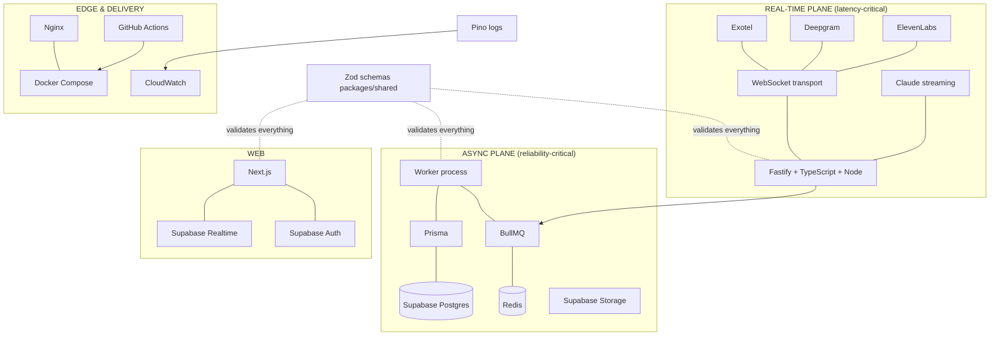

# 02 — Tech Stack

> **RecruitPilot AI — Production-Grade AI Executive Voice Assistant**
> Document 02 of 21 · Prerequisites: `00_PROJECT_OVERVIEW.md`, `01_SYSTEM_ARCHITECTURE.md`

---

## 1. Goal

Turn the stack from a list of names into a set of **defensible engineering decisions**. For every technology you should be able to answer, in an interview or a design review:

1. What problem does it solve *in this system*?
2. What were the alternatives, and why were they rejected?
3. Where exactly does it sit in the architecture (which plane, which container)?
4. What does it cost (money, latency, complexity)?

---

## 2. Theory

### 2.1 How a Tech Lead evaluates technology

Never "it's popular" or "I know it." The evaluation framework used for every row below:

- **Fitness**: does it solve *our specific* problem (real-time streaming voice) better than alternatives?
- **Operational cost**: who patches it, backs it up, scales it? Managed > self-hosted unless latency/control demands otherwise.
- **Ecosystem maturity**: docs, TypeScript support, community, hiring pool.
- **Escape hatch**: how painful is replacement? (Our Provider Pattern makes vendor swaps cheap *by design*; framework swaps are always expensive, so frameworks get more scrutiny.)
- **Boring where possible**: innovation budget is spent on the voice pipeline — everything else should be the most boring, proven option available.

### 2.2 The stack at a glance

| Layer | Choice | One-line why |
|---|---|---|
| Language | TypeScript | one language across api/web/shared; types catch integration bugs |
| Runtime | Node.js ≥ 20 LTS | event-loop model is ideal for stream-shuffling I/O workloads |
| Backend framework | Fastify | fastest mainstream Node framework; first-class plugins, WS, Zod integration |
| Frontend | Next.js (App Router) | production React defaults; pairs natively with Supabase Auth |
| Database | Supabase PostgreSQL | managed Postgres + Auth + Storage + Realtime in one, Mumbai region |
| ORM | Prisma | type-safe queries generated from one schema file; migrations included |
| Auth | Supabase Auth | managed, integrates with RLS; we never store passwords |
| File storage | Supabase Storage | recordings + resume; signed URLs; same vendor as DB |
| Live updates | Supabase Realtime | dashboard updates without polling; free with the DB |
| Queue | BullMQ | mature Redis-based job queue: retries, backoff, dead-letter, scheduling |
| Cache/queue backbone | Redis 7 | microsecond in-memory ops; BullMQ requirement; session/memory cache |
| Voice transport | WebSocket | native protocol of Exotel/Deepgram/ElevenLabs media streams |
| Telephony | Exotel | Indian numbers + compliance; voice streaming over WS |
| STT | Deepgram | lowest-latency streaming STT with endpointing built in |
| LLM | Claude | best-in-class instruction following + tool use; streaming |
| TTS | ElevenLabs | natural voices; WebSocket streaming; low-latency Flash model |
| Containers | Docker + Compose | identical envs dev↔prod; one-file orchestration at our scale |
| Reverse proxy | Nginx | TLS, WS upgrade, single hardened public surface |
| CI/CD | GitHub Actions | lives with the repo; free tier sufficient; huge action ecosystem |
| Monitoring | CloudWatch | native on EC2; logs + metrics + alarms without extra vendors |
| Logging | Pino | fastest structured JSON logger for Node; Fastify's default |
| API docs | Swagger (OpenAPI) | generated from the same Zod schemas that validate requests |
| Validation | Zod | one schema → runtime validation + static types + OpenAPI |
| Testing | Vitest | fast, TS-native, one test runner for api/web/shared |

---

## 3. Architecture

Where each piece sits (planes from doc 01):



### 3.1 Decision records (the "why" for each choice)

Each entry is a mini-ADR (Architecture Decision Record): context → decision → alternatives rejected.

#### TypeScript (language)
- **Context**: 5 vendor SDKs, dozens of event/message shapes crossing process boundaries (API ↔ worker ↔ web). Shape mismatches are the dominant bug class.
- **Decision**: TypeScript everywhere, `strict: true`, no `any` at boundaries.
- **Rejected**: Plain JS (runtime surprises), Python backend (splits the codebase into two languages; Node's streaming/WS story fits telephony better; you'd lose shared types with Next.js).

#### Node.js ≥ 20 LTS (runtime)
- **Context**: our server does almost no computation — it shuffles audio buffers and API streams between vendors. Classic I/O-bound workload.
- **Decision**: Node LTS. The single-threaded event loop handles thousands of concurrent socket events cheaply; native `WebSocket`, `fetch`, and test runner are built in.
- **Rejected**: Bun (attractive speed, but ecosystem edge cases in WS/Prisma not worth risk on a production telephony path), Deno (smaller ecosystem), Go (great fit technically, wrong fit for a TS-learning monorepo).

#### Fastify (backend framework)
- **Context**: need HTTP (REST + webhooks) and WebSocket servers with validation, DI-friendly structure, and minimal per-request overhead on a box that also handles live audio.
- **Decision**: Fastify. ~2× Express throughput, schema-first validation, `@fastify/websocket`, `fastify-type-provider-zod` (Zod → validation + OpenAPI in one), encapsulated plugin system that maps cleanly to feature modules, Pino built in.
- **Rejected**: Express (aging, no schema story, middleware model encourages spaghetti), NestJS (excellent DI but heavy abstraction + decorator magic — you'd learn Nest, not Node), Hono (great for edge; thinner ecosystem for long-lived WS + plugins).

#### Next.js App Router (frontend)
- **Context**: dashboard for one primary user (Varun): call list, transcripts, summaries, recruiter cards, settings, live updates.
- **Decision**: Next.js App Router with Server Components; Supabase JS client for auth/reads/realtime; Fastify API for commands.
- **Rejected**: Vite + React SPA (fine, but you lose SSR/auth-cookie integration Supabase documents first-class), Remix (viable; smaller Supabase ecosystem), plain HTML dashboards (not portfolio-grade).

#### Supabase PostgreSQL + Auth + Storage + Realtime (data platform)
- **Context**: we need a relational DB (calls ↔ recruiters ↔ opportunities are relational to the bone), login for exactly one/few users, file storage for recordings/resume, and live dashboard updates. Solo maintainer — zero appetite for operating databases.
- **Decision**: Supabase = managed Postgres with those three adjacent problems solved in the same console, same region (Mumbai available), with Row Level Security as the authorization backbone.
- **Rejected**: Raw RDS Postgres (DIY auth/storage/realtime), Firebase (NoSQL contorts relational data; vendor-locked query model), PlanetScale/MySQL (no RLS, no bundled auth/storage), MongoDB (transcript documents fit, but relations + reporting favor SQL; no free bundled auth).

#### Prisma (ORM)
- **Context**: type-safe DB access from TypeScript; migrations as reviewable artifacts.
- **Decision**: Prisma — `schema.prisma` is the single source of truth; generated client gives autocompleted, type-checked queries; `prisma migrate` produces SQL migration files we commit.
- **Rejected**: Drizzle (excellent, closer to SQL — legitimate second choice; Prisma chosen for maturity of migrate tooling + docs for learners), Kysely (query builder only, no migration story), raw SQL (max control, zero safety net while learning).

#### BullMQ + Redis (queue + cache)
- **Context**: doc 01's async plane needs guaranteed, retryable, observable background jobs (transcript, summary, notify, memory) and the real-time plane needs a sub-millisecond scratchpad (active call state, rate limits).
- **Decision**: BullMQ (jobs: retries, exponential backoff, dead-letter queues, delayed jobs, repeatable jobs) on Redis 7 (also used for caching). One Redis serves both at our scale.
- **Rejected**: SQS (per-call latency + no local dev parity without localstack), RabbitMQ (another server to operate; BullMQ features suffice), pg-boss (Postgres-based queue — respectable, but couples queue load to the DB and Redis is needed for caching anyway), setTimeout/cron in-process (lost on restart — not production).

#### WebSocket (voice transport)
- **Context**: continuous bidirectional audio, ~50 frames/sec each way, per call.
- **Decision**: WebSocket — it is literally the protocol Exotel/Deepgram/ElevenLabs expose for streaming; no translation layers.
- **Rejected**: HTTP polling (latency disaster), gRPC (vendors don't speak it for media), WebRTC (superior for browser↔browser audio, irrelevant for PSTN vendor streams; huge complexity).

#### Exotel (telephony)
- **Context**: recruiters call an **Indian** phone number; Indian telecom is heavily regulated (KYC, DLT); we need programmatic answer + bidirectional audio streaming.
- **Decision**: Exotel — Indian carrier relationships and compliance handled, voice streaming (WS) product, webhooks for call lifecycle.
- **Rejected**: Twilio (gold-standard API but Indian number provisioning/compliance is harder and costlier for India-first use), Plivo (viable alternative — our `TelephonyProvider` interface keeps it one adapter away), SIP trunk + Asterisk (self-hosted telephony = a second full-time job).

#### Deepgram (STT)
- **Context**: transcribe Indian-accented English (and possibly Hinglish) from 8kHz phone audio, streaming, with the transcriber deciding when the speaker finished (endpointing) — inside a 300–400ms budget slice.
- **Decision**: Deepgram Nova family — streaming-first API, built-in endpointing + interim results + VAD events, telephony audio support (μ-law), strong accuracy/latency ratio, generous free credits to learn with.
- **Rejected**: OpenAI Whisper API (batch-oriented; no true streaming endpointing), Google/Azure STT (streaming exists but latency + pricing less favorable; heavier SDKs), self-hosted Whisper (GPU ops burden + latency).

#### Claude (LLM)
- **Context**: the brain must follow a strict persona contract (never impersonate Varun), reliably call tools mid-conversation, handle interruptions, and stream tokens fast enough for the 600ms first-sentence slice.
- **Decision**: Anthropic Claude — top-tier instruction adherence (critical for the "never pretend to be Varun" hard rule), native tool-use API, token streaming, prompt caching (cuts repeated system-prompt cost/latency). Model tiers let us split duties: fast/cheap model for live turns, stronger model for post-call summaries.
- **Rejected**: OpenAI GPT (capable peer; Claude preferred for instruction-following discipline on persona rules), Gemini (fine models, less mature tool-use ergonomics at decision time), self-hosted Llama (GPU cost + quality gap for reliable tool use). `LLMProvider` interface keeps all of them one adapter away.

#### ElevenLabs (TTS)
- **Context**: the assistant's voice IS the product's first impression; needs streaming input (we feed sentences as Claude generates) and streaming output, first audio inside ~200ms.
- **Decision**: ElevenLabs — most natural commodity voices, WebSocket streaming API accepting incremental text, low-latency model tier (Flash) built for conversational agents.
- **Rejected**: Amazon Polly / Google / Azure TTS (robotic by comparison — undermines the product), Cartesia (impressive latency, newer/less proven at decision time — strong future swap candidate via `VoiceProvider`), OpenAI TTS (no incremental-text streaming ergonomics at decision time).

#### Docker + Docker Compose (containers)
- **Context**: five processes (nginx, api, worker, web, redis) must run identically on your Mac and on EC2.
- **Decision**: one multi-stage Dockerfile per app; `docker-compose.yml` for local dev and `docker-compose.prod.yml` for the server.
- **Rejected**: Kubernetes (doc 01 §3.7 — wrong scale), PM2 on bare EC2 ("works on my machine" rot; no env parity), Nix (steeper learning curve than the payoff here).

#### Nginx (reverse proxy)
- **Context**: one public entrypoint must terminate TLS, upgrade WebSockets (Exotel's stream + dashboard realtime), route `/api` vs web, and shield internals.
- **Decision**: Nginx — battle-tested, first-class WS `Upgrade` handling, simple config, tiny footprint.
- **Rejected**: Caddy (automatic TLS is lovely — legitimate alternative; Nginx chosen for ubiquity + interview relevance), Traefik (shines with container orchestrators we don't run), AWS ALB (adds cost + config surface; Nginx on-box is simpler at one instance).

#### GitHub Actions (CI/CD)
- **Context**: repo already on GitHub; need lint/typecheck/test on PR and build/deploy on merge to main.
- **Decision**: GitHub Actions — zero extra vendors, secrets manager included, marketplace actions for SSH deploys and GHCR pushes.
- **Rejected**: Jenkins (self-hosted maintenance), GitLab CI (wrong platform), CircleCI (another vendor for no gain).

#### CloudWatch (monitoring) + Pino (logging)
- **Context**: on EC2, we need: where are the logs, is the box healthy, alert me when the latency SLO breaks or a queue backs up.
- **Decision**: Pino emits structured JSON (fastest Node logger, ~5× Winston in benchmarks, Fastify-native) → CloudWatch agent ships logs → metric filters + alarms (doc 15). CloudWatch is already there on EC2; no new vendor.
- **Rejected**: Winston (slower, less structured-first), Datadog/Grafana Cloud (superior UX, real monthly cost — swap later if needed), ELK self-hosted (operating Elasticsearch to watch one box is absurd).

#### Zod (validation) + Swagger/OpenAPI (docs)
- **Context**: every boundary (HTTP body, webhook, WS message, queue payload, env vars) needs runtime validation; API needs live documentation.
- **Decision**: Zod schemas in `packages/shared` as the single source of shape truth → `fastify-type-provider-zod` derives request validation AND OpenAPI spec → Swagger UI served at `/docs`. Env vars validated with a Zod schema at boot (fail fast on missing config).
- **Rejected**: Joi/Yup (no/weak TS inference), class-validator (decorator style, pairs with Nest not Fastify), JSON Schema by hand (Zod generates it instead).

#### Vitest (testing)
- **Context**: one runner for unit tests (providers mocked), integration tests, and shared-package tests, with native TS/ESM support and no transpile config.
- **Decision**: Vitest — Jest-compatible API, dramatically faster, first-class TS/ESM, works identically in api/web/shared workspaces.
- **Rejected**: Jest (ESM/TS friction, slower), node:test (built-in and improving, but thinner mocking/watch ergonomics), Mocha/Chai (assembly required).

---

## 4. Folder Structure

How the stack maps to the monorepo (full detail in `03_FOLDER_STRUCTURE.md`):

```
RecruitPilot_AI/
├── apps/
│   ├── api/          # Fastify, Pino, BullMQ producers+consumers, providers, Prisma client
│   └── web/          # Next.js, Supabase Auth/Realtime clients
├── packages/
│   └── shared/       # Zod schemas (events, DTOs, env), shared types
├── prisma/           # schema.prisma + migrations (owned by api, root-level for tooling)
├── docker/           # Dockerfiles, nginx/nginx.conf
├── .github/workflows/# GitHub Actions pipelines
├── docker-compose.yml            # local dev (redis, api, worker, web)
└── docker-compose.prod.yml       # EC2 (adds nginx, certbot)
```

Version pins we adopt (LTS/current-stable policy — always verify latest stable when you reach each setup doc):

| Tool | Version policy |
|---|---|
| Node.js | 22 LTS (≥20 acceptable) |
| TypeScript | ^5.x, `strict: true` |
| Fastify | ^5.x |
| Next.js | ^15.x |
| Prisma | latest stable |
| Zod | ^4.x (or ^3.23+ — match `fastify-type-provider-zod` compatibility) |
| BullMQ | ^5.x |
| Redis | 7.x (Docker image `redis:7-alpine`) |
| Vitest | ^3.x |

---

## 5. Manual Steps

Still no accounts — that starts in doc 04. This document's manual work is **due diligence**, the habit of verifying claims before building on them:

1. **Skim each vendor's pricing page** (links in §6) and write down, in your own notes: Deepgram per-minute streaming price, Claude per-million-token price for one fast and one strong model, ElevenLabs monthly tier + character limits, Exotel approximate per-minute + number rental. You'll compute a per-call cost in §9.
2. **Confirm current versions**: visit the Fastify, Next.js, Prisma, Zod release pages and note latest stable — update the table above if it moved.
3. **Read one page deeply per real-time vendor** (30 min total):
   - Deepgram: "Live Streaming Audio" concepts page (interim results, endpointing).
   - Anthropic: "Streaming" + skim "Tool use".
   - ElevenLabs: "WebSockets" API page.
   These three pages define the contracts our whole voice pipeline is built on.

---

## 6. Official Links

| Tech | Docs | Pricing (where relevant) |
|---|---|---|
| TypeScript | https://www.typescriptlang.org/docs/ | — |
| Node.js | https://nodejs.org/docs/latest/api/ | — |
| Fastify | https://fastify.dev/docs/latest/ | — |
| Next.js | https://nextjs.org/docs | — |
| Supabase | https://supabase.com/docs | https://supabase.com/pricing |
| Prisma | https://www.prisma.io/docs | — |
| BullMQ | https://docs.bullmq.io | — |
| Redis | https://redis.io/docs/latest/ | — |
| Exotel | https://developer.exotel.com | https://exotel.com/pricing/ |
| Deepgram | https://developers.deepgram.com | https://deepgram.com/pricing |
| Anthropic | https://docs.anthropic.com | https://docs.anthropic.com/en/docs/about-claude/pricing |
| ElevenLabs | https://elevenlabs.io/docs | https://elevenlabs.io/pricing |
| Docker | https://docs.docker.com | — |
| Nginx | https://nginx.org/en/docs/ | — |
| GitHub Actions | https://docs.github.com/actions | https://github.com/pricing |
| CloudWatch | https://docs.aws.amazon.com/cloudwatch/ | https://aws.amazon.com/cloudwatch/pricing/ |
| Pino | https://getpino.io | — |
| Zod | https://zod.dev | — |
| Swagger/OpenAPI | https://swagger.io/specification/ | — |
| Vitest | https://vitest.dev | — |

---

## 7. Commands

Nothing to install yet. Preview of the toolchain check (already done in doc 00):

```bash
node --version && npm --version && docker --version && git --version
```

---

## 8. Environment Variables

None introduced. This document *finalizes the owners* of each future variable group (established in doc 01 §8): every vendor section above corresponds to exactly one env block, introduced by its own setup doc (04–08, 13, 15, 16).

---

## 9. Verification

You pass this document when you can:

1. **Defend any three choices out loud** as mini-ADRs: context → decision → strongest rejected alternative → why it lost. (Practice the ones you'd be grilled on: Fastify vs NestJS, Supabase vs Firebase, BullMQ vs SQS.)
2. **Compute the rough cost of one 5-minute recruiter call** using the pricing you gathered in §5:
   - STT: 5 min × Deepgram streaming rate
   - LLM: assume ~15 turns ≈ 20–40k input + 2–4k output tokens (system prompt re-sent per turn — prompt caching matters!) × Claude fast-model rate
   - TTS: ~2,500–4,000 characters × ElevenLabs rate (or against plan quota)
   - Telephony: 5 min × Exotel per-minute
   - Sanity check: total should land in the **₹15–₹40 (~$0.20–$0.50)** range. If your math says ₹500, find the error — this exercise is the point.
3. **Name each technology's plane** (real-time / async / edge / web) without looking at §3.
4. State which two stack elements are the *hardest to replace later* (answer: Postgres/Prisma data model and the Fastify app skeleton — everything vendor-facing is Provider-Pattern-cheap).

---

## 10. Common Mistakes

1. **Resume-driven choices**: adding Kafka/K8s/microservices "to learn them" on a system whose scale doesn't need them. Learn them where they're honest fits; here they'd be liabilities you must operate.
2. **Choosing batch STT for a streaming problem**: Whisper-style APIs look cheaper per minute until you realize you can't endpoint a live caller — architecture fit beats price.
3. **Ignoring token re-send economics**: a naive agent re-sends the full system prompt + history every turn. Without prompt caching, a long call multiplies LLM cost ~10×. This is why §9's cost exercise exists.
4. **Two validation libraries** (e.g., Joi in api, Zod in web): shape truth fragments immediately. One library, one shared package, everywhere.
5. **Untyped boundaries**: TypeScript inside services but `any` at HTTP/queue/WS edges — precisely where bugs enter. Zod at every boundary is the rule.
6. **Pinning nothing / pinning everything**: no lockfile discipline breaks builds; pinning majors forever accrues security debt. Policy: lockfile committed, minor/patch auto-updated (Dependabot — doc 14), majors reviewed deliberately.
7. **Treating rejected alternatives as bad tech**: Twilio, Drizzle, Caddy, Cartesia are excellent — they lost narrowly *for this context*. Contexts change; the Provider Pattern is our insurance policy.

---

## 11. Production Best Practices

- **One version manifest**: Node version in `.nvmrc` + `engines` field; CI and Dockerfiles read the same value — dev/CI/prod never drift.
- **Lockfile is law**: `package-lock.json` committed; CI uses `npm ci` (never `npm install`) for reproducible builds.
- **Model IDs are config, not code**: `ANTHROPIC_MODEL_REALTIME` / `ANTHROPIC_MODEL_SUMMARY` env vars — model upgrades without deploys.
- **Cost telemetry from day one**: per-call record of STT seconds, LLM tokens (in/out/cached), TTS characters, telephony minutes → the dashboard shows ₹/call. You cannot optimize what you don't measure.
- **Free-tier awareness**: Deepgram credits, ElevenLabs monthly quota, Supabase free-project pausing after inactivity, Exotel trial limits — each setup doc flags its tier's cliff edges so a demo never dies mid-interview.
- **Boring-core discipline**: novelty is quarantined in the providers layer; the core (Fastify/Postgres/Redis patterns) stays conventional so any senior engineer can navigate it.

---

## 12. Security

Stack-level security posture (per-service hardening lives in each setup doc; deep dive in `18_SECURITY.md`):

- **Supply chain**: `npm ci` + lockfile, Dependabot alerts on, `npm audit` in CI failing on high/critical, no postinstall-heavy obscure packages. Every dependency is code you ship.
- **Key blast radius**: each vendor key does exactly one thing and lives only in the api container env. A leaked ElevenLabs key ≠ database access. Separate dev and prod keys everywhere vendors allow.
- **RLS as the authorization floor**: even if the web app is fully compromised, Supabase Row Level Security caps what the anon/user key can read. The service-role key (bypasses RLS) exists **only** in the api/worker environment, never in web.
- **Structured logs are a PII surface**: Pino redaction paths configured for phone numbers, transcripts, and tokens *before* the first real call is ever logged (doc 09).
- **TLS everywhere**: Nginx terminates public TLS; every vendor connection is WSS/HTTPS; no plaintext hop carries audio or transcripts.

---

## 13. Checklist

- [ ] Can state each technology's job in one sentence (§2.2 table, from memory)
- [ ] Can defend 3+ choices as mini-ADRs including the rejected alternative
- [ ] Read the three streaming-contract pages (Deepgram live, Anthropic streaming/tools, ElevenLabs WS)
- [ ] Gathered current pricing; computed per-call cost; result in sane range
- [ ] Verified current stable versions of Fastify / Next.js / Prisma / Zod
- [ ] Understood which choices are cheap to swap (providers) vs expensive (DB schema, framework)
- [ ] Understood the two-plane placement of every component (§3 diagram)
- [ ] Version policy noted (.nvmrc + lockfile + `npm ci`)

---

## 14. Next Step

Proceed to **`03_FOLDER_STRUCTURE.md`** — the monorepo layout in full: Clean Architecture layers made physical, the dependency rule that keeps providers replaceable, where every kind of file lives, and the npm workspaces wiring that makes `packages/shared` importable from both apps.
