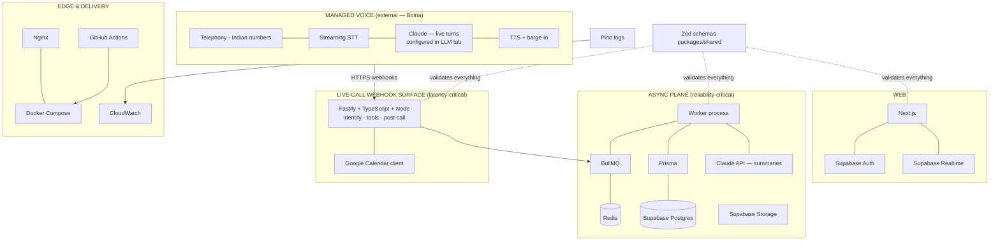

# 02 — Tech Stack

> **RecruitPilot AI — Production-Grade AI Executive Voice Assistant**
> Document 02 of 21 · Prerequisites: `00_PROJECT_OVERVIEW.md`, `01_SYSTEM_ARCHITECTURE.md`

---

## 1. Goal

Turn the stack from a list of names into a set of **defensible engineering decisions**. For every technology you should be able to answer, in an interview or a design review:

1. What problem does it solve *in this system*?
2. What were the alternatives, and why were they rejected?
3. Where exactly does it sit in the architecture (which plane, which container)?
4. What does it cost (money, latency, complexity)?

This document also records the project's pivotal decision as a full ADR: **buying the voice pipeline (Bolna) instead of building it** — including the cost math and the rejected alternatives.

---

## 2. Theory

### 2.1 How a Tech Lead evaluates technology

Never "it's popular" or "I know it." The evaluation framework used for every row below:

- **Fitness**: does it solve *our specific* problem (an India-first phone-answering AI agent) better than alternatives?
- **Operational cost**: who patches it, backs it up, scales it? Managed > self-hosted unless latency/control demands otherwise. This principle, applied honestly to the voice pipeline itself, is what produced the Bolna decision.
- **Ecosystem maturity**: docs, TypeScript support, community, hiring pool.
- **Escape hatch**: how painful is replacement? (Our Provider Pattern makes vendor swaps cheap *by design*; framework swaps are always expensive, so frameworks get more scrutiny. Bolna gets the same treatment: one adapter surface, two documented exits.)
- **Boring where possible**: the innovation budget is spent on the agent's behavior and the data around it — everything else should be the most boring, proven option available.

### 2.2 The stack at a glance

| Layer | Choice | One-line why |
|---|---|---|
| Language | TypeScript | one language across api/web/shared; types catch integration bugs |
| Runtime | Node.js ≥ 20 LTS | event-loop model is ideal for I/O-bound webhook + job workloads |
| Backend framework | Fastify | fastest mainstream Node framework; first-class plugins, Zod integration |
| Frontend | Next.js (App Router) | production React defaults; pairs natively with Supabase Auth |
| Database | Supabase PostgreSQL | managed Postgres + Auth + Storage + Realtime in one, Mumbai region |
| ORM | Prisma | type-safe queries generated from one schema file; migrations included |
| Auth | Supabase Auth | managed, integrates with RLS; we never store passwords |
| File storage | Supabase Storage | recordings + resume; signed URLs; same vendor as DB |
| Live updates | Supabase Realtime | dashboard updates without polling; free with the DB |
| Queue | BullMQ | mature Redis-based job queue: retries, backoff, dead-letter, scheduling |
| Cache/queue backbone | Redis 7 | microsecond in-memory ops; BullMQ requirement |
| **Voice platform** | **Bolna** | managed telephony + STT + LLM orchestration + TTS + barge-in, India-first, one bill |
| LLM (live turns) | Claude, *inside Bolna* | configured in Bolna's LLM tab; best instruction adherence for the persona contract |
| LLM (summaries/memory) | Claude, direct API | post-call summarization + memory distillation from the worker |
| Containers | Docker + Compose | identical envs dev↔prod; one-file orchestration at our scale |
| Reverse proxy | Nginx | TLS, single hardened public surface (plain HTTPS now) |
| CI/CD | GitHub Actions | lives with the repo; free tier sufficient; huge action ecosystem |
| Monitoring | CloudWatch | native on EC2; logs + metrics + alarms without extra vendors |
| Logging | Pino | fastest structured JSON logger for Node; Fastify's default |
| API docs | Swagger (OpenAPI) | generated from the same Zod schemas that validate requests |
| Validation | Zod | one schema → runtime validation + static types + OpenAPI |
| Testing | Vitest | fast, TS-native, one test runner for api/web/shared |

The one structural change from the original design: a single **Bolna** row replaces four rows (Exotel telephony, Deepgram STT, ElevenLabs TTS, WebSocket voice transport). That original stack is preserved — with all its ADRs — in `docs/phase2-diy-reference/`.

---

## 3. Architecture

Where each piece sits (planes from doc 01):



### 3.1 Decision records (the "why" for each choice)

Each entry is a mini-ADR (Architecture Decision Record): context → decision → alternatives rejected.

#### ⭐ Voice platform: Bolna (THE pivotal ADR)

- **Context**: the product needs an AI agent answering a real Indian phone number with sub-1.5s conversational latency, barge-in, and mid-call tool use. The original plan was a hand-built pipeline: Exotel (telephony) + Deepgram (STT) + Claude (LLM) + ElevenLabs (TTS), glued by custom WebSocket orchestration on our EC2 box. That plan is sound engineering — and an estimated **2–3 months** of pipeline work (barge-in, jitter buffers, endpointing tuning, socket lifecycle management) before the *product* work even starts, plus four vendor accounts and an always-on EC2 instance to operate.
- **Decision**: **Bolna** (https://www.bolna.ai) — an India-first managed voice-agent platform that bundles telephony (Indian numbers including DLT/140-series compliance), streaming STT, TTS, turn-taking/barge-in, and LLM orchestration behind one platform. Anthropic Claude is a supported LLM in Bolna's agent config, so the brain stays Claude. Our system integrates via three webhook surfaces (doc 01) and a thin `BolnaClient` adapter (executions API, recording download).
- **Cost math** (the part you must be able to reproduce on a whiteboard):
  - Bolna: **~6¢/min** standard (volume pricing ~4.5¢/min), billed in **30-second pulses**, **prepaid credits** ($10–$5,000), **no subscription**, **$5 free signup credits**. LLM cost is separate when using your own Anthropic key.
  - At our realistic volume (**~10–30 calls/month**, ~5 min each = 50–150 min): 150 min × 6¢ ≈ **$9 ≈ ₹750/month** of platform usage; with number rental and Claude summary tokens, the all-in figure lands around **₹1,500/month**.
  - DIY at the same volume: EC2 box (always on) + four vendor accounts (Exotel number rental + minutes, Deepgram, ElevenLabs subscription tier, Claude) — the *same or more money*, plus 2–3 months of unbuilt product. At tiny volume, the managed platform is not a premium; it is the cheaper option.
- **Rejected alternatives**:
  | Alternative | Approx. price | Why it lost |
  |---|---|---|
  | **Vapi** | ~$0.05/min + underlying vendor costs | Strong platform, but Indian telephony needs SIP trunking you assemble yourself — the India compliance burden lands back on us. |
  | **Retell** | ~$0.07/min | Same story: SIP needed for India; pricier per minute. |
  | **ElevenLabs Agents** | ~$0.08/min | Best-in-class voices, highest per-minute price, and again SIP needed for Indian numbers. |
  | **DIY pipeline** | vendor sum + EC2 + 2–3 months of engineering | Maximum learning and control; kept as **optional Phase 2**, fully documented in `docs/phase2-diy-reference/` — not the fastest path to a working product. |
- **Why Bolna won**: India-first telephony with compliance handled (the exact thing every competitor outsources back to us), plus price, plus Claude support, plus Indian data residency.
- **Escape hatch**: the provider-pattern discipline stays. Bolna is ONE adapter surface; the agent prompt, tool definitions (OpenAI function-calling JSON), and our webhook handlers are largely portable. If Bolna disappoints: swap to Vapi/Retell (config + thin adapter change) or execute Phase 2 DIY.

#### TypeScript (language)
- **Context**: webhook payloads, queue messages, and DTOs crossing process boundaries (API ↔ worker ↔ web). Shape mismatches are the dominant bug class — doubly so when one side of the contract (Bolna) is vendor-controlled.
- **Decision**: TypeScript everywhere, `strict: true`, no `any` at boundaries.
- **Rejected**: Plain JS (runtime surprises), Python backend (splits the codebase into two languages; you'd lose shared types with Next.js).

#### Node.js ≥ 20 LTS (runtime)
- **Context**: our server does almost no computation — it answers webhooks, queries Postgres, and shuffles jobs. Classic I/O-bound workload.
- **Decision**: Node LTS. The event loop handles concurrent I/O cheaply; native `fetch` and test runner are built in.
- **Rejected**: Bun (attractive speed, ecosystem edge cases not worth risk on a production path), Deno (smaller ecosystem), Go (great fit technically, wrong fit for a TS-learning monorepo).

#### Fastify (backend framework)
- **Context**: need an HTTP server (three Bolna webhook surfaces + dashboard REST) with schema validation, DI-friendly structure, and predictable low overhead — our webhook response times are now the user-facing latency (doc 01 §3.5).
- **Decision**: Fastify. ~2× Express throughput, schema-first validation, `fastify-type-provider-zod` (Zod → validation + OpenAPI in one), encapsulated plugin system that maps cleanly to feature modules, Pino built in.
- **Rejected**: Express (aging, no schema story, middleware model encourages spaghetti), NestJS (excellent DI but heavy abstraction + decorator magic — you'd learn Nest, not Node), Hono (great for edge; thinner plugin ecosystem).

#### Next.js App Router (frontend)
- **Context**: dashboard for one primary user (Varun): call list, transcripts, summaries, recruiter cards, settings, live updates.
- **Decision**: Next.js App Router with Server Components; Supabase JS client for auth/reads/realtime; Fastify API for commands.
- **Rejected**: Vite + React SPA (fine, but you lose SSR/auth-cookie integration Supabase documents first-class), Remix (viable; smaller Supabase ecosystem), plain HTML dashboards (not portfolio-grade).

#### Supabase PostgreSQL + Auth + Storage + Realtime (data platform)
- **Context**: we need a relational DB (calls ↔ recruiters ↔ opportunities are relational to the bone), login for exactly one/few users, file storage for recordings/resume, and live dashboard updates. Solo maintainer — zero appetite for operating databases.
- **Decision**: Supabase = managed Postgres with those three adjacent problems solved in the same console, same region (Mumbai available), with Row Level Security as the authorization backbone.
- **Rejected**: Raw RDS Postgres (DIY auth/storage/realtime), Firebase (NoSQL contorts relational data; vendor-locked query model), PlanetScale/MySQL (no RLS, no bundled auth/storage), MongoDB (transcript documents fit, but relations + reporting favor SQL; no free bundled auth).

#### Prisma (ORM)
- **Context**: type-safe DB access from TypeScript; migrations as reviewable artifacts; one indexed phone-number lookup must serve the identify budget.
- **Decision**: Prisma — `schema.prisma` is the single source of truth; generated client gives autocompleted, type-checked queries; `prisma migrate` produces SQL migration files we commit.
- **Rejected**: Drizzle (excellent, closer to SQL — legitimate second choice; Prisma chosen for maturity of migrate tooling + docs for learners), Kysely (query builder only, no migration story), raw SQL (max control, zero safety net while learning).

#### BullMQ + Redis (queue + cache)
- **Context**: doc 01's async plane needs guaranteed, retryable, observable background jobs (transcript, summary, notify, memory, recording download) — and the tool endpoints need somewhere to *instantly* park slow work (`send_resume`, `notify_varun`) before returning `{queued: true}` inside the 800ms budget.
- **Decision**: BullMQ (jobs: retries, exponential backoff, dead-letter queues, delayed jobs) on Redis 7 (also used for caching, e.g., calendar free/busy).
- **Rejected**: SQS (no local dev parity without localstack), RabbitMQ (another server to operate; BullMQ features suffice), pg-boss (couples queue load to the DB; Redis is wanted for caching anyway), setTimeout/cron in-process (lost on restart — not production).

#### Claude (LLM — two consumption paths)
- **Context**: the brain must follow a strict persona contract (never impersonate Varun), reliably call tools mid-conversation, and produce faithful post-call summaries. After the pivot, Claude is consumed in **two places**: (a) **live turns inside Bolna** — selected in the agent's LLM tab (Claude models are documented as supported), so conversation latency is Bolna's problem; (b) **direct API from our worker** for post-call summaries and memory distillation (`ANTHROPIC_MODEL_SUMMARY`), where prompt caching still cuts repeated-instruction cost.
- **Decision**: Anthropic Claude for both paths — top-tier instruction adherence (critical for the "never pretend to be Varun" hard rule), native tool use, and one model family to understand instead of two.
- **Rejected**: OpenAI GPT (capable peer; Claude preferred for instruction-following discipline on persona rules), Gemini (fine models, less mature tool-use ergonomics at decision time), self-hosted Llama (GPU cost + quality gap for reliable tool use). The `LLMProvider` port (summaries) and Bolna's LLM dropdown (live turns) each keep alternatives one change away.

#### Docker + Docker Compose (containers)
- **Context**: five processes (nginx, api, worker, web, redis) must run identically on your Mac and on EC2.
- **Decision**: one multi-stage Dockerfile per app; `docker-compose.yml` for local dev and `docker-compose.prod.yml` for the server.
- **Rejected**: Kubernetes (doc 01 §3.7 — wrong scale), PM2 on bare EC2 ("works on my machine" rot; no env parity), Nix (steeper learning curve than the payoff here).

#### Nginx (reverse proxy)
- **Context**: one public entrypoint must terminate TLS, route `/api` vs web, and shield internals. Simpler than the DIY design — no WebSocket voice path to upgrade, just HTTPS webhooks and the dashboard.
- **Decision**: Nginx — battle-tested, simple config, tiny footprint, body-size limits and rate posture at the edge.
- **Rejected**: Caddy (automatic TLS is lovely — legitimate alternative; Nginx chosen for ubiquity + interview relevance), Traefik (shines with container orchestrators we don't run), AWS ALB (adds cost + config surface; Nginx on-box is simpler at one instance).

#### GitHub Actions (CI/CD)
- **Context**: repo already on GitHub; need lint/typecheck/test on PR and build/deploy on merge to main.
- **Decision**: GitHub Actions — zero extra vendors, secrets manager included, marketplace actions for SSH deploys and GHCR pushes.
- **Rejected**: Jenkins (self-hosted maintenance), GitLab CI (wrong platform), CircleCI (another vendor for no gain).

#### CloudWatch (monitoring) + Pino (logging)
- **Context**: on EC2, we need: where are the logs, is the box healthy, alert me when a webhook budget breaks or a queue backs up.
- **Decision**: Pino emits structured JSON (fastest Node logger, Fastify-native) → CloudWatch agent ships logs → metric filters + alarms (doc 15). CloudWatch is already there on EC2; no new vendor.
- **Rejected**: Winston (slower, less structured-first), Datadog/Grafana Cloud (superior UX, real monthly cost — swap later if needed), ELK self-hosted (operating Elasticsearch to watch one box is absurd).

#### Zod (validation) + Swagger/OpenAPI (docs)
- **Context**: every boundary (Bolna webhook payloads, HTTP bodies, queue payloads, env vars) needs runtime validation; API needs live documentation. Bolna's payloads are vendor-controlled — validate what we rely on, pass through what we don't (`.passthrough()`).
- **Decision**: Zod schemas in `packages/shared` as the single source of shape truth → `fastify-type-provider-zod` derives request validation AND OpenAPI spec → Swagger UI served at `/docs`. Env vars validated with a Zod schema at boot (fail fast on missing config).
- **Rejected**: Joi/Yup (no/weak TS inference), class-validator (decorator style, pairs with Nest not Fastify), JSON Schema by hand (Zod generates it instead).

#### Vitest (testing)
- **Context**: one runner for unit tests (providers mocked), webhook contract tests against recorded Bolna fixtures (doc 19), and shared-package tests, with native TS/ESM support.
- **Decision**: Vitest — Jest-compatible API, dramatically faster, first-class TS/ESM, works identically in api/web/shared workspaces.
- **Rejected**: Jest (ESM/TS friction, slower), node:test (built-in and improving, but thinner mocking/watch ergonomics), Mocha/Chai (assembly required).

---

## 4. Folder Structure

How the stack maps to the monorepo (full detail in doc 03):

```
RecruitPilot_AI/
├── apps/
│   ├── api/          # Fastify, Pino, webhook surfaces, BullMQ producers+consumers, providers, Prisma client
│   └── web/          # Next.js, Supabase Auth/Realtime clients
├── packages/
│   └── shared/       # Zod schemas (events, DTOs, env), shared types
├── prisma/           # schema.prisma + migrations (owned by api, root-level for tooling)
├── docker/           # Dockerfiles, nginx/nginx.conf
├── .github/workflows/# GitHub Actions pipelines
├── docker-compose.yml            # local dev (redis, api, worker, web)
└── docker-compose.prod.yml       # EC2 (adds nginx, certbot)
```

Version pins we adopt (LTS/current-stable policy — always verify latest stable when you reach each setup doc):

| Tool | Version policy |
|---|---|
| Node.js | 22 LTS (≥20 acceptable) |
| TypeScript | ^5.x, `strict: true` |
| Fastify | ^5.x |
| Next.js | ^15.x |
| Prisma | latest stable |
| Zod | ^4.x (or ^3.23+ — match `fastify-type-provider-zod` compatibility) |
| BullMQ | ^5.x |
| Redis | 7.x (Docker image `redis:7-alpine`) |
| Vitest | ^3.x |

Bolna itself is not versioned in our lockfile — it is a platform. Our defense against its API evolving is the `BolnaClient` adapter + `.passthrough()` validation, not a pin.

---

## 5. Manual Steps

Still no accounts — that starts in doc 04. This document's manual work is **due diligence**, the habit of verifying claims before building on them:

1. **Verify the Bolna pricing claims** at https://www.bolna.ai/pricing: per-minute rate, 30-second pulse billing, prepaid credit tiers, free signup credits. Note anything that moved since this doc was written.
2. **Verify Claude support in Bolna**: skim https://www.bolna.ai/docs/providers/llm-model/anthropic and https://www.bolna.ai/docs/agent-setup/llm-tab — confirm which Claude models are selectable.
3. **Check Anthropic pricing** for the summary model (one strong model's per-million-token price) — you'll compute a per-call cost in §9.
4. **Confirm current versions**: visit the Fastify, Next.js, Prisma, Zod release pages and note latest stable — update the table above if it moved.
5. **Read the three contract pages our integration is built on** (30 min total):
   - Bolna: "Identify incoming callers" (our identify surface).
   - Bolna: "Custom function calls" (the `custom_task` tool format).
   - Bolna: "Analytics tab" (post-call webhook + summarization/extraction).

---

## 6. Official Links

| Tech | Docs | Pricing (where relevant) |
|---|---|---|
| TypeScript | https://www.typescriptlang.org/docs/ | — |
| Node.js | https://nodejs.org/docs/latest/api/ | — |
| Fastify | https://fastify.dev/docs/latest/ | — |
| Next.js | https://nextjs.org/docs | — |
| Supabase | https://supabase.com/docs | https://supabase.com/pricing |
| Prisma | https://www.prisma.io/docs | — |
| BullMQ | https://docs.bullmq.io | — |
| Redis | https://redis.io/docs/latest/ | — |
| Bolna | https://www.bolna.ai/docs | https://www.bolna.ai/pricing |
| Bolna × Anthropic | https://www.bolna.ai/docs/providers/llm-model/anthropic | — |
| Bolna custom tools | https://www.bolna.ai/docs/tool-calling/custom-function-calls | — |
| Bolna caller identification | https://www.bolna.ai/docs/customizations/identify-incoming-callers | — |
| Anthropic | https://docs.anthropic.com | https://docs.anthropic.com/en/docs/about-claude/pricing |
| Docker | https://docs.docker.com | — |
| Nginx | https://nginx.org/en/docs/ | — |
| GitHub Actions | https://docs.github.com/actions | https://github.com/pricing |
| CloudWatch | https://docs.aws.amazon.com/cloudwatch/ | https://aws.amazon.com/cloudwatch/pricing/ |
| Pino | https://getpino.io | — |
| Zod | https://zod.dev | — |
| Swagger/OpenAPI | https://swagger.io/specification/ | — |
| Vitest | https://vitest.dev | — |

---

## 7. Commands

Nothing to install yet. Preview of the toolchain check (already done in doc 00):

```bash
node --version && npm --version && docker --version && git --version
```

---

## 8. Environment Variables

None introduced. This document *finalizes the owners* of each future variable group (established in doc 01 §8): `BOLNA_API_KEY` / `BOLNA_AGENT_ID` / `BOLNA_WEBHOOK_TOKEN` arrive with docs 05/06/08; `ANTHROPIC_API_KEY` / `ANTHROPIC_MODEL_SUMMARY` with doc 07; data-platform vars with doc 04; the rest with docs 13, 15, 16. Notably *absent* forever: STT/TTS/telephony vendor keys and any realtime-model var — the live-turn LLM is Bolna agent configuration, not our env.

---

## 9. Verification

You pass this document when you can:

1. **Defend the Bolna ADR out loud** as if in a design review: context → decision → each rejected alternative (Vapi, Retell, ElevenLabs Agents, DIY) → the single sentence for why each lost → both escape hatches.
2. **Compute the rough cost of one 5-minute recruiter call**:
   - Voice platform: 5 min × ~6¢/min = ~30¢ ≈ **₹25** (billed in 30s pulses — a 4:40 call bills as 5:00)
   - LLM (summary + memory, direct API): ~**₹5**/call at summary-model rates
   - Sanity check: total ≈ **₹30–40 per call**. At 30 calls/month ≈ ₹900–1,200 usage + number rental → the ~₹1,500/month all-in figure from the ADR. If your math says ₹500/call, find the error — this exercise is the point.
3. **Name each technology's plane** (managed voice / live-call webhook surface / async / edge / web) without looking at §3.
4. State which two stack elements are the *hardest to replace later* (answer: the Postgres/Prisma data model and the Fastify app skeleton — the voice platform is deliberately NOT on this list; that's what the adapter + portable tool definitions buy us).

---

## 10. Common Mistakes

1. **Resume-driven choices**: rebuilding the voice pipeline "to learn streaming" when the product goal is a working assistant. The learning path exists — it's `docs/phase2-diy-reference/`, sequenced *after* the product ships, not instead of it.
2. **Reading "managed platform" as "no engineering"**: the webhook budgets (doc 01 §3.5), idempotency, and tool fallback design are real engineering — they're just aimed at the right layer now.
3. **Ignoring pulse billing**: Bolna bills in 30-second pulses. Cost estimates that multiply exact seconds by the per-minute rate undershoot; round up per call.
4. **Two validation libraries** (e.g., Joi in api, Zod in web): shape truth fragments immediately. One library, one shared package, everywhere.
5. **Untyped boundaries**: TypeScript inside services but `any` at HTTP/queue edges — precisely where bugs enter. Zod at every boundary is the rule; for Bolna payloads, validate what you use and `.passthrough()` the rest.
6. **Pinning nothing / pinning everything**: no lockfile discipline breaks builds; pinning majors forever accrues security debt. Policy: lockfile committed, minor/patch auto-updated (Dependabot — doc 14), majors reviewed deliberately.
7. **Treating rejected alternatives as bad tech**: Vapi, Retell, ElevenLabs Agents, Drizzle, Caddy are excellent — they lost narrowly *for this context* (India-first telephony being the decisive axis). Contexts change; the adapter surface is our insurance policy.

---

## 11. Production Best Practices

- **One version manifest**: Node version in `.nvmrc` + `engines` field; CI and Dockerfiles read the same value — dev/CI/prod never drift.
- **Lockfile is law**: `package-lock.json` committed; CI uses `npm ci` (never `npm install`) for reproducible builds.
- **Model IDs are config, not code**: `ANTHROPIC_MODEL_SUMMARY` env var for the direct-API path; the live-turn model is Bolna agent config — both changeable without a code deploy.
- **Cost telemetry from day one**: per-call record of Bolna call duration (execution metadata), summary tokens (in/out/cached) → the dashboard shows ₹/call. You cannot optimize what you don't measure.
- **Prepaid-credit awareness**: Bolna is prepaid — an empty credit balance means the number stops answering. Monitor the balance; alert before it runs dry (doc 15). Same vigilance for Supabase free-project pausing after inactivity.
- **Boring-core discipline**: novelty is quarantined in the providers layer and the Bolna agent config; the core (Fastify/Postgres/Redis patterns) stays conventional so any senior engineer can navigate it.

---

## 12. Security

Stack-level security posture (per-service hardening lives in each setup doc; deep dive in doc 18):

- **Supply chain**: `npm ci` + lockfile, Dependabot alerts on, `npm audit` in CI failing on high/critical, no postinstall-heavy obscure packages. Every dependency is code you ship.
- **Key blast radius**: `BOLNA_API_KEY` is the highest-value key in the system (agent CRUD + executions + recordings access) — api/worker environment only, rotated on any suspicion. `BOLNA_WEBHOOK_TOKEN` is *our* secret configured into Bolna; verify it with a constant-time compare. Separate dev and prod keys everywhere vendors allow.
- **RLS as the authorization floor**: even if the web app is fully compromised, Supabase Row Level Security caps what the anon/user key can read. The service-role key (bypasses RLS) exists **only** in the api/worker environment, never in web.
- **Structured logs are a PII surface**: Pino redaction paths configured for phone numbers, transcripts, and tokens *before* the first real call is ever logged (doc 09).
- **TLS everywhere**: Nginx terminates public TLS; every vendor connection is HTTPS; no plaintext hop carries transcripts. Transcripts/recordings also transit Bolna — prefer its Indian data-residency option (doc 05).

---

## 13. Checklist

- [ ] Can state each technology's job in one sentence (§2.2 table, from memory)
- [ ] Can defend the Bolna ADR including all four rejected alternatives and the cost math
- [ ] Can defend 2+ other choices as mini-ADRs (practice: Fastify vs NestJS, Supabase vs Firebase, BullMQ vs SQS)
- [ ] Read the three Bolna contract pages (identify, custom function calls, analytics tab)
- [ ] Verified Bolna pricing + Claude support; computed per-call cost (₹30–40) and monthly figure (~₹1,500)
- [ ] Verified current stable versions of Fastify / Next.js / Prisma / Zod
- [ ] Understood which choices are cheap to swap (providers, voice platform) vs expensive (DB schema, framework)
- [ ] Understood the plane placement of every component (§3 diagram)
- [ ] Version policy noted (.nvmrc + lockfile + `npm ci`)

---

## 14. Next Step

Proceed to **`03_FOLDER_STRUCTURE.md`** — the monorepo layout in full: Clean Architecture layers made physical, the dependency rule that keeps providers replaceable (the very rule that made this pivot a folder swap instead of a rewrite), where every kind of file lives, and the npm workspaces wiring that makes `packages/shared` importable from both apps.
