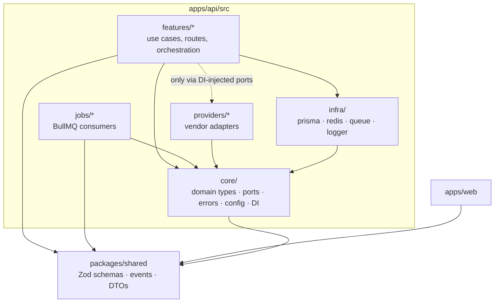

# 03 — Folder Structure

> **RecruitPilot AI — Production-Grade AI Executive Voice Assistant**
> Document 03 of 21 · Prerequisites: `00`–`02` · This file is the **canonical reference** for every path used in docs 04–20.

---

## 1. Goal

Fix the physical layout of the monorepo so that:

- **Clean Architecture is enforced by folders**, not by discipline — the import direction is visible in every path.
- Every provider (Exotel, Deepgram, Claude, ElevenLabs, Supabase) is **one folder, one adapter, replaceable** without touching features.
- Features are **vertical slices** (routes + service + repository + tests together), not horizontal layers scattered across the tree.
- `packages/shared` gives api and web **one source of shape truth** (Zod schemas, types, event definitions).
- Any engineer (or you, six months from now) can predict where a file lives before looking.

---

## 2. Theory

### 2.1 Clean Architecture in one paragraph

Code is arranged in rings. The **core** (domain types, business rules, port interfaces) sits in the middle and depends on nothing. Around it, **features** (use cases) depend only on the core. On the outside, **infrastructure** (frameworks, databases, vendor SDKs) depends inward. The iron law — the **Dependency Rule** — is that source code dependencies only point inward. The core never imports Fastify, Prisma, or any vendor SDK. This is what makes the system testable (core runs without any vendor) and swappable (vendors are plugins).

### 2.2 Ports and Adapters (why `core/ports` + `providers` exist)

A **port** is an interface the core *declares it needs* — e.g., `LLMProvider` with `streamChat()`. An **adapter** is an outside implementation of that port — e.g., `ClaudeLLMProvider` wrapping the Anthropic SDK. Features call ports; dependency injection decides at boot which adapter satisfies each port. Swapping Claude for GPT = writing one new adapter + changing one DI binding. Zero feature code changes. This is the Provider Pattern rule from doc 00 §3.3 made physical.

### 2.3 Feature-based (vertical) vs layer-based (horizontal) folders

Layer-based trees (`controllers/`, `services/`, `models/` at top level) scatter one feature across the whole tree — adding a "calls" endpoint touches four distant folders, and nothing tells you what the *system does*. Feature-based trees put everything about `calls` in `features/calls/` — the tree reads like the product ("voice, agent, calls, recruiters, notifications"), changes are localized, and deleting a feature is deleting a folder. We use feature folders inside each app, with the shared rings (`core`, `infra`, `providers`) alongside them.

### 2.4 Monorepo with npm workspaces

One repository, multiple packages (`apps/api`, `apps/web`, `packages/shared`), linked by **npm workspaces**: the root `package.json` declares `"workspaces"`, npm hoists dependencies, and `@recruitpilot/shared` is importable from both apps as a normal package — no publishing, no version skew, atomic cross-package refactors in one commit. Alternatives (Turborepo, Nx, pnpm) add caching/task-graphs we don't need yet; plain npm workspaces is the boring, sufficient choice (doc 02 §2.1).

---

## 3. Architecture

The dependency rule, as a diagram — arrows are the ONLY allowed import directions:



Forbidden imports (the review checklist): `core → anything except shared`, `features → providers directly` (must go through a port), `shared → anything` (it is the innermost ring), `web → api internals` (web talks HTTP/Supabase only).

---

## 4. Folder Structure

The complete tree. Paths here are cited by every subsequent document.

```
RecruitPilot_AI/
├── apps/
│   ├── api/                                # Fastify backend (docs 09, 12, 16, 17)
│   │   ├── src/
│   │   │   ├── core/                       # ← innermost ring (no framework imports)
│   │   │   │   ├── domain/                 # entities: Call, Recruiter, Opportunity, Memory
│   │   │   │   ├── ports/                  # THE provider interfaces
│   │   │   │   │   ├── llm.provider.ts             # LLMProvider
│   │   │   │   │   ├── speech.provider.ts          # SpeechProvider (STT)
│   │   │   │   │   ├── voice.provider.ts           # VoiceProvider (TTS)
│   │   │   │   │   ├── telephony.provider.ts       # TelephonyProvider
│   │   │   │   │   ├── storage.provider.ts         # StorageProvider
│   │   │   │   │   ├── notification.provider.ts    # NotificationProvider
│   │   │   │   │   └── calendar.provider.ts        # CalendarProvider
│   │   │   │   ├── errors/                 # AppError hierarchy, error codes
│   │   │   │   ├── config/                 # env schema (Zod) + typed config loader
│   │   │   │   └── di/                     # container: port → adapter bindings
│   │   │   ├── features/                   # ← vertical slices
│   │   │   │   ├── voice/                  # WS gateway: session, audio in/out, barge-in (doc 17)
│   │   │   │   │   ├── voice.gateway.ts
│   │   │   │   │   ├── voice.session.ts
│   │   │   │   │   ├── audio/              # μ-law↔PCM transcode, buffering
│   │   │   │   │   └── voice.routes.ts     # WS route registration + Exotel webhook
│   │   │   │   ├── agent/                  # the brain (doc 16)
│   │   │   │   │   ├── agent.orchestrator.ts   # turn loop, state machine
│   │   │   │   │   ├── agent.prompts.ts        # system prompt builder
│   │   │   │   │   ├── tools/                  # check_calendar, send_resume,
│   │   │   │   │   │                           #   save_recruiter, notify_varun
│   │   │   │   │   └── memory/                 # recruiter memory read/write
│   │   │   │   ├── calls/                  # CRUD + queries over call records
│   │   │   │   │   ├── calls.routes.ts
│   │   │   │   │   ├── calls.service.ts
│   │   │   │   │   ├── calls.repository.ts     # Repository Pattern (doc 11)
│   │   │   │   │   └── calls.test.ts
│   │   │   │   ├── recruiters/             # same shape as calls/
│   │   │   │   ├── opportunities/          # same shape
│   │   │   │   ├── notifications/          # same shape
│   │   │   │   └── settings/               # greeting text, questions config
│   │   │   ├── providers/                  # ← adapters (each imports its own SDK ONLY here)
│   │   │   │   ├── exotel/                 # implements TelephonyProvider (doc 05)
│   │   │   │   ├── deepgram/               # implements SpeechProvider   (doc 06)
│   │   │   │   ├── claude/                 # implements LLMProvider      (doc 07)
│   │   │   │   ├── elevenlabs/             # implements VoiceProvider    (doc 08)
│   │   │   │   ├── supabase/               # implements StorageProvider  (doc 04)
│   │   │   │   ├── google-calendar/        # implements CalendarProvider (doc 16)
│   │   │   │   └── email/                  # implements NotificationProvider
│   │   │   ├── infra/                      # framework/tech plumbing
│   │   │   │   ├── prisma/                 # PrismaClient singleton
│   │   │   │   ├── redis/                  # Redis connection factory
│   │   │   │   ├── queue/                  # BullMQ queues + event bus publisher
│   │   │   │   └── logger/                 # Pino setup + redaction (doc 09)
│   │   │   ├── jobs/                       # BullMQ consumers (async plane, doc 01 §3.6)
│   │   │   │   ├── persist-transcript.job.ts
│   │   │   │   ├── generate-summary.job.ts
│   │   │   │   ├── upsert-recruiter.job.ts
│   │   │   │   ├── notify-varun.job.ts
│   │   │   │   ├── update-memory.job.ts
│   │   │   │   └── store-recording.job.ts
│   │   │   ├── app.ts                      # Fastify instance: plugins, routes, hooks
│   │   │   ├── server.ts                   # entrypoint: API mode
│   │   │   └── worker.ts                   # entrypoint: worker mode (same image, doc 01)
│   │   ├── package.json                    # name: @recruitpilot/api
│   │   ├── tsconfig.json
│   │   └── vitest.config.ts
│   └── web/                                # Next.js dashboard (doc 10)
│       ├── src/
│       │   ├── app/                        # App Router
│       │   │   ├── (auth)/login/           # Supabase Auth pages
│       │   │   ├── (dashboard)/
│       │   │   │   ├── calls/              # list + [id] detail (transcript, summary)
│       │   │   │   ├── recruiters/
│       │   │   │   └── settings/
│       │   │   └── layout.tsx
│       │   ├── components/
│       │   ├── lib/
│       │   │   ├── supabase/               # browser + server clients
│       │   │   └── api.ts                  # typed fetch wrapper → Fastify
│       │   └── hooks/                      # useRealtimeCalls etc.
│       ├── package.json                    # name: @recruitpilot/web
│       └── tsconfig.json
├── packages/
│   └── shared/                             # innermost shared ring
│       ├── src/
│       │   ├── events/                     # domain events (doc 01 §2.4) as Zod schemas
│       │   ├── schemas/                    # DTOs: call, recruiter, opportunity, settings
│       │   ├── constants/                  # event names, queue names, error codes
│       │   └── index.ts
│       └── package.json                    # name: @recruitpilot/shared
├── prisma/
│   ├── schema.prisma                       # single source of DB truth (doc 11)
│   └── migrations/
├── docker/
│   ├── api.Dockerfile                      # multi-stage (doc 13)
│   ├── web.Dockerfile
│   └── nginx/
│       └── nginx.conf                      # TLS, WS upgrade (docs 13, 15)
├── .github/
│   └── workflows/
│       ├── ci.yml                          # lint, typecheck, test, build (doc 14)
│       └── deploy.yml                      # build → GHCR → EC2 (doc 14)
├── docs/                                   # ← these 21 documents
├── docker-compose.yml                      # local dev
├── docker-compose.prod.yml                 # EC2
├── package.json                            # root: workspaces + scripts
├── .nvmrc                                  # Node version pin (doc 02 §11)
├── .env.example                            # every variable, documented, no secrets
├── .gitignore                              # .env*, node_modules, dist, .next
└── README.md
```

### 4.1 Anatomy of one feature slice (the repeating pattern)

```
features/calls/
├── calls.routes.ts       # Fastify routes; Zod schemas from @recruitpilot/shared; NO logic
├── calls.service.ts      # use cases; depends on ports + repository; NO Fastify, NO Prisma
├── calls.repository.ts   # ALL Prisma queries for calls; returns domain types
└── calls.test.ts         # Vitest; service tested with mocked repository/ports
```

Route → Service → Repository, each layer mockable. The Repository Pattern isolates Prisma exactly like providers isolate vendors.

### 4.2 What a port looks like (illustrative)

```typescript
// apps/api/src/core/ports/llm.provider.ts
import type { ChatMessage, ToolDefinition, LLMStreamEvent } from "@recruitpilot/shared";

export interface LLMProvider {
  streamChat(input: {
    system: string;
    messages: ChatMessage[];
    tools: ToolDefinition[];
    signal: AbortSignal;          // barge-in cancellation (doc 01 §3.4)
  }): AsyncIterable<LLMStreamEvent>; // text deltas | tool calls | stop
}
```

Note what is absent: nothing Anthropic-specific. `providers/claude/claude.provider.ts` implements this; `core/di` binds it.

---

## 5. Manual Steps

Nothing to create yet — the tree is scaffolded by commands in docs 09/10. Today you internalize the rules:

1. **Play "where does it live?"** — cover the tree and place each of these: a Zod schema for the `call.completed` event; the code that converts μ-law→PCM; the Prisma query fetching last 20 calls; the Anthropic SDK import; the greeting text default; the BullMQ consumer that emails Varun. (Answers: `packages/shared/src/events/` · `features/voice/audio/` · `features/calls/calls.repository.ts` · `providers/claude/` only · `features/settings/` (DB-backed, doc 01 §11) · `jobs/notify-varun.job.ts`.)
2. **Trace one import chain** on paper: `calls.routes.ts` → `calls.service.ts` → `calls.repository.ts` → `infra/prisma`. Confirm every arrow points inward or sideways-through-a-port, never outward.
3. **Spot the violation** (drill): `agent.orchestrator.ts` adds `import Anthropic from "@anthropic-ai/sdk"`. Which rule breaks? (Feature importing a vendor SDK — must use the `LLMProvider` port; the SDK import is legal only inside `providers/claude/`.)

---

## 6. Official Links

| Topic | Link |
|---|---|
| npm workspaces | https://docs.npmjs.com/cli/v10/using-npm/workspaces |
| Clean Architecture (Uncle Bob) | https://blog.cleancoder.com/uncle-bob/2012/08/13/the-clean-architecture.html |
| Ports & Adapters (Alistair Cockburn) | https://alistair.cockburn.us/hexagonal-architecture/ |
| Fastify plugin encapsulation | https://fastify.dev/docs/latest/Reference/Plugins/ |
| Next.js project structure | https://nextjs.org/docs/app/getting-started/project-structure |
| Prisma monorepo guidance | https://www.prisma.io/docs/guides/turborepo |
| TypeScript project references | https://www.typescriptlang.org/docs/handbook/project-references.html |

---

## 7. Commands

Preview of the scaffold (executed for real in doc 09 — shown here so the structure isn't magic):

```bash
mkdir -p apps/api/src/{core/{domain,ports,errors,config,di},features,providers,infra,jobs}
mkdir -p apps/web packages/shared/src/{events,schemas,constants} prisma docker/nginx .github/workflows

# root package.json workspaces field that links everything:
#   "workspaces": ["apps/*", "packages/*"]
npm init -y                      # then edit workspaces field
node -e "console.log('workspace check')"    # real verification comes in doc 09
```

Guard the dependency rule mechanically (added to CI in doc 14):

```bash
npm i -D dependency-cruiser      # lints import directions against rules in .dependency-cruiser.cjs
npx depcruise apps/api/src --validate
```

---

## 8. Environment Variables

None introduced. This doc fixes **where they live**:

| File | Purpose | Committed? |
|---|---|---|
| `.env` | local secrets (root, loaded by compose + apps) | ❌ git-ignored |
| `.env.example` | every var, placeholder + comment | ✅ committed |
| GitHub Secrets | CI/CD + production values | vendor-side |
| `apps/api/src/core/config/` | Zod schema validating ALL vars at boot | ✅ (schema, not values) |

---

## 9. Verification

You pass this document when:

1. The "where does it live?" game (§5.1) — 6/6 correct.
2. You can recite the four forbidden imports (§3) and why each breaks the architecture.
3. You can explain to a rubber duck: port vs adapter, and what changes (exactly) when Claude is swapped for GPT.
4. You can name the three entrypoints of `apps/api` and why two exist (`server.ts` vs `worker.ts` — doc 01's process split; `app.ts` is shared wiring).
5. Given a new requirement — "also notify via Slack" — you can list the files touched: `providers/slack/` (new adapter), `core/di` (binding), *maybe* `core/ports/notification.provider.ts` (only if the port's contract must grow). Zero feature files.

---

## 10. Common Mistakes

1. **`utils/` and `helpers/` dumping grounds** — they become dependency magnets importing everything. If code has a home (a feature, a provider, shared), put it there; if it truly doesn't, it probably belongs in `packages/shared`.
2. **Leaking Prisma types upward** — repositories returning `Prisma.CallGetPayload<...>` couple every service to the ORM. Repositories map to domain/shared types at the boundary.
3. **The "quick" direct SDK import** — one `import Anthropic` inside a feature "just for now" and the Provider Pattern is dead. This is why dependency-cruiser runs in CI: the rule must be mechanical, not aspirational.
4. **Barrel-file everything** (`index.ts` re-exporting entire folders) — creates circular imports and kills tree-shaking. Barrels only at package boundaries (`packages/shared/src/index.ts`).
5. **Sharing server-only code through `shared`** — `packages/shared` is imported by the *browser* bundle; a Node-only import (fs, Prisma) in it breaks web builds and can leak logic. Shared = pure types/schemas/constants only.
6. **Splitting too early into micro-packages** — `packages/{logger,errors,config,...}` multiplies build config for zero benefit at this size. One shared package until it visibly hurts.
7. **Tests in a parallel `__tests__/` tree** — tests belong next to the code they test (`calls.test.ts` beside `calls.service.ts`); distance breeds staleness.

---

## 11. Production Best Practices

- **Dependency rule in CI**: dependency-cruiser config committed at root; PRs violating import direction fail before review.
- **`tsconfig` path discipline**: `@recruitpilot/shared` resolved via workspaces (real package), not `paths` aliases into another package's `src` — keeps builds honest and Docker layers cacheable (doc 13).
- **One Prisma schema at repo root**: both migration tooling (CI) and `apps/api` read `prisma/schema.prisma`; the generated client is a dependency of api only — web never touches the DB directly.
- **Same image, two entrypoints**: `server.ts`/`worker.ts` keep one Docker build for both processes; the entrypoint is a compose `command:` — versions can never drift between API and worker.
- **README per non-obvious folder**: `providers/README.md` states the adapter contract rules; `core/ports/README.md` states "no SDK types may appear here."
- **Feature flags via `settings`**: behavior toggles (e.g., "ask compensation question") are DB config surfaced in the dashboard, not env vars — changeable without deploys (doc 01 §11).

---

## 12. Security

Structure-level security (details in `18_SECURITY.md`):

- **Secret files can't be committed by construction**: `.gitignore` includes `.env*` (except `.env.example`) from the first commit — the tree is born safe, not patched safe.
- **Key isolation follows folder isolation**: only `providers/*` adapters read vendor keys (via injected config); a grep for `process.env` outside `core/config` should return zero — that's a CI check too.
- **`packages/shared` is public-by-definition**: it ships in the browser bundle; therefore no secrets, no server URLs with credentials, no internal hostnames ever go there.
- **Webhook surface is one folder**: all unauthenticated-inbound code (Exotel webhooks/WS) lives in `features/voice/` — the audit surface for signature verification (doc 05/18) is a single, known place.
- **RLS keeps web honest**: `apps/web` has no Prisma and no service-role key by structure; even a compromised web build reads only what Supabase RLS grants the logged-in user (doc 04/11).

---

## 13. Checklist

- [ ] Dependency Rule stated from memory; all four forbidden imports known
- [ ] Port vs adapter explained; Claude→GPT swap traced to exact files
- [ ] Feature slice anatomy (routes/service/repository/test) memorized
- [ ] "Where does it live?" 6/6
- [ ] Why `server.ts` + `worker.ts` exist (one image, two processes) understood
- [ ] `packages/shared` browser-safety rule understood (no Node-only code)
- [ ] Env file locations table understood; `.env.example` convention adopted
- [ ] dependency-cruiser noted for CI enforcement (doc 14)

---

## 14. Next Step

Proceed to **`04_SUPABASE_SETUP.md`** — the first external service, set up for real: account creation, Mumbai-region project, every key explained (anon vs service-role), Auth, Storage buckets for recordings/resume, Realtime, and the two Prisma connection strings — each step verified before doc 05.
