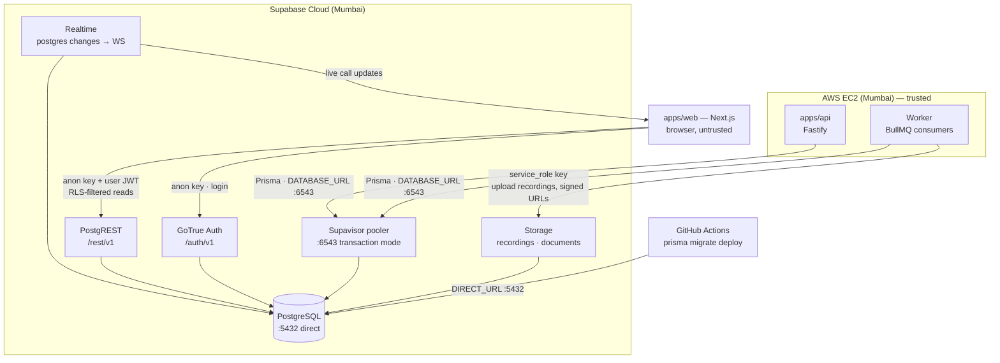

# 04 — Supabase Setup

> **RecruitPilot AI — Production-Grade AI Executive Voice Assistant**
> Document 04 of 21 · Prerequisites: docs 00–03

---

## 1. Goal

Stand up the project's entire **data layer** as one managed service — before any application code exists:

- A Supabase project in **Mumbai (`ap-south-1`)** — the same region as our EC2 instance, because the latency budget (doc 01 §3.5) leaves no room for cross-region database hops.
- The **three keys** (URL, anon, service_role) understood and stored correctly — this is the single highest-stakes secret-handling moment in the project so far.
- The **two Postgres connection strings** (pooled :6543 for runtime, direct :5432 for migrations) captured for Prisma in doc 11.
- **Auth** configured for exactly one user (Varun), with public signups disabled.
- **Storage** with two private buckets: `recordings` (call audio) and `documents` (the resume the agent sends).
- **Realtime** understood, ready to enable per-table once tables exist (doc 11).

By the end, every credential doc 09–11 needs is in your password manager and `.env`, and every claim is verified with a real command — not assumed.

---

## 2. Theory

### 2.1 What Supabase actually is

Supabase is **not** a proprietary database. It is a **managed PostgreSQL instance** with four open-source servers running next to it, all reading and writing the *same* Postgres:

| Layer | Component | What it gives us |
|---|---|---|
| Database | PostgreSQL 15+ | The single source of truth: calls, recruiters, opportunities, memory (doc 11) |
| REST API | **PostgREST** | Auto-generated HTTP API over every table — the web dashboard reads through this |
| Auth | **GoTrue** | Users, sessions, JWTs — Varun's dashboard login |
| Files | **Storage** (Postgres-backed metadata + object store) | Call recordings, resume PDF |
| Live updates | **Realtime** (listens to Postgres replication) | Dashboard updates the instant a call row changes |

The unifying insight: **it's all one Postgres**. A row inserted by our worker via Prisma is instantly visible to PostgREST (web reads), instantly streamed by Realtime (live dashboard), and instantly governed by the same security rules. That's why we chose it over "Postgres on EC2 + roll our own auth + S3 + a WebSocket relay" — four builds collapse into one signup (doc 01 §3.2 placement table).

### 2.2 Row Level Security — our authorization floor

Normally, authorization lives in application code: `if (user.id !== row.ownerId) throw 403`. One forgotten check = data leak. **Row Level Security (RLS)** moves authorization *into Postgres itself*: every table carries policies like "a row is visible only when `auth.uid() = user_id`", and Postgres enforces them on **every query from every client** — PostgREST, Realtime, even a stray SQL console session using the wrong role.

Why this is our *floor*, not a feature: doc 03 §12 established that `apps/web` has no Prisma and no privileged key by structure. The browser talks to PostgREST directly. The **only** thing standing between a compromised browser bundle and the full recruiter database is RLS. So our stance is absolute:

> **RLS is enabled on every table, always, from the first migration. A table without RLS is a bug, not a default.**

New Supabase tables created via the dashboard have RLS on by default; tables created via SQL/Prisma migrations do **not** — doc 11 adds `ENABLE ROW LEVEL SECURITY` migrations explicitly.

### 2.3 anon key vs service_role key — the two personalities

Supabase issues two API keys. They look similar (both are long JWTs). Their semantics are opposites:

| | `anon` key | `service_role` key |
|---|---|---|
| RLS | **Bound by RLS** — sees only what policies allow | **Bypasses RLS entirely** — sees and writes everything |
| Intended holder | Browsers, mobile apps — *public by design* | Trusted servers only (our api + worker) |
| If leaked | Attacker gets… whatever an anonymous visitor gets (with good RLS: nothing) | Attacker gets **the entire database** |
| Our usage | `apps/web` (as `NEXT_PUBLIC_SUPABASE_ANON_KEY`) | `apps/api` / worker env only (doc 03 §12) |

The mental model: the anon key is a *door key to the lobby* — RLS decides which rooms open. The service_role key is the *master key that ignores every lock*. This is why the single worst mistake in this document is prefixing the service_role key with `NEXT_PUBLIC_` (§10).

> **Naming note:** Supabase has been migrating dashboards from "anon / service_role" to "**publishable** / **secret**" key naming (new key format `sb_publishable_...` / `sb_secret_...`). Use whatever your dashboard shows: **publishable = anon** (RLS-bound), **secret = service_role** (RLS-bypassing). Verify in dashboard — UI evolves.

### 2.4 Connection pooling — why there are two connection strings

Postgres connections are expensive: each one is a full OS process on the server, and free-tier Supabase allows only a few dozen direct connections. Meanwhile our runtime opens connections eagerly (Prisma keeps a pool; API + worker are separate processes; restarts leak old connections briefly). Left unmanaged, you exhaust the limit and every query fails with `too many connections` — typically at the worst possible moment.

The fix is a **connection pooler** (Supabase runs Supavisor, PgBouncer-compatible) sitting in front of Postgres. Clients connect to the pooler; the pooler multiplexes hundreds of client connections onto a handful of real Postgres connections. In **transaction mode** (port **6543**), a real connection is borrowed only for the duration of one transaction, then returned — maximum sharing.

The cost of transaction mode: **no session state**. Prepared statements, `SET` commands, advisory locks — anything assuming "my next query hits the same connection" breaks. Two consequences we must respect:

| Use case | Connection | Why |
|---|---|---|
| **Runtime queries** (Prisma Client in api/worker) | Pooled, port **6543** → `DATABASE_URL` | Short transactions, many concurrent clients — exactly what transaction pooling is for. Requires `?pgbouncer=true` so Prisma disables prepared statements. |
| **Migrations & introspection** (`prisma migrate`, `db pull`) | Direct/session, port **5432** → `DIRECT_URL` | Migrations take locks and use session state; they need one real, stable connection. Prisma reads `directUrl` from the schema for exactly this (doc 11). |

Remember it as: **6543 = the app talking, 5432 = the schema changing.**

---

## 3. Architecture

Where Supabase sits in the container view (doc 01 §3.2), with every access path and the key/port it uses:



The trust boundary is the punchline: everything **left of Supabase** (EC2, CI) holds privileged credentials; everything **below** (the browser) holds only the anon key and is contained by RLS. No privileged path ever reaches the browser.

---

## 4. Folder Structure

Nothing new is created in the repo today — this doc produces *credentials*, not code. But it determines the contents of files defined in doc 03:

| Path (doc 03) | What this doc contributes |
|---|---|
| `.env` (root, git-ignored) | All seven variables from §8, real values |
| `.env.example` (committed) | The same seven, placeholders + comments |
| `apps/api/src/providers/supabase/` | The `StorageProvider` adapter (doc 12) will consume `SUPABASE_URL` + `SUPABASE_SERVICE_ROLE_KEY` |
| `apps/api/src/core/config/` | Zod env schema (doc 09) will validate all seven at boot |
| `apps/web/src/lib/supabase/` | Browser/server clients (doc 10) consume the two `NEXT_PUBLIC_*` vars |
| `prisma/schema.prisma` | `datasource db { url = env("DATABASE_URL") directUrl = env("DIRECT_URL") }` (doc 11) |

---

## 5. Manual Steps

Click-level, from absolute zero. Have your password manager open before you start.

### 5.1 Create the account

1. Go to **https://supabase.com** → click **Start your project**.
2. Sign up. **Choose "Continue with GitHub"** — recommended because (a) you'll create a GitHub account anyway for CI/CD (doc 14), (b) one less password to manage, (c) GitHub's 2FA then protects Supabase too. Use the project identity you fixed in doc 00 §5 (varun@digiqc.com on the GitHub account).
3. If you used email signup instead: check your inbox and **verify the email** before continuing — an unverified account can't create projects.

### 5.2 Create the organization and project

1. First login prompts you to create an **organization** — name it `recruitpilot`, type Personal, **Free plan**.
2. Click **New Project** and fill in:
   - **Name:** `recruitpilot-ai`
   - **Database Password:** click **Generate a password**. Immediately copy it into your password manager as `Supabase recruitpilot-ai DB password`. **You cannot retrieve this password later** — Supabase never shows it again; if lost, your only option is *resetting* it (Project Settings → Database → Reset database password), which breaks every stored connection string until you update them.
   - **Region:** **Mumbai (`ap-south-1`)**. Non-negotiable: our EC2 lives in ap-south-1 (doc 01 §3.2) and the latency budget already sits at ~1,450 ms of a 1,500 ms allowance (doc 01 §3.5). A Singapore or Frankfurt database adds 40–150 ms per round trip to the async plane and, worse, to every dashboard read.
   - **Plan:** Free. Roughly 500 MB database + 1 GB storage — plenty for this build; check current limits at https://supabase.com/pricing.
3. Click **Create new project** and wait ~2 minutes for provisioning ("Setting up project…" → green **Active** dot).

### 5.3 Collect the API credentials

1. In the left sidebar: **Project Settings** (gear icon) → **API** (may be labeled "API Keys" — verify in dashboard, UI evolves).
2. Copy three values into your password manager, then into `.env` (§8):
   - **Project URL** — like `https://abcdefghijklmnop.supabase.co` → `SUPABASE_URL`
   - **anon / publishable key** → `SUPABASE_ANON_KEY`
   - **service_role / secret key** (click **Reveal**) → `SUPABASE_SERVICE_ROLE_KEY`
3. Per §2.3: if your dashboard shows the newer naming, **publishable = anon** and **secret = service_role**. Treat the secret key with the same paranoia as a root password — it bypasses RLS.

### 5.4 Collect the connection strings

1. Click the **Connect** button (top bar of the dashboard) — or Project Settings → Database → Connection string. Verify in dashboard — this UI has moved between releases.
2. You'll see multiple tabs/modes. Capture two:
   - **Transaction pooler** (port **6543**) → this becomes `DATABASE_URL`. Looks like:
     `postgresql://postgres.<project-ref>:<PASSWORD>@aws-0-ap-south-1.pooler.supabase.com:6543/postgres`
   - **Direct connection** (or "Session mode", port **5432**) → this becomes `DIRECT_URL`.
3. Replace `<PASSWORD>` (or `[YOUR-PASSWORD]`) in both with the DB password from your password manager. If the password contains `@ : / # ?`, URL-encode it (`@` → `%40` etc.) or regenerate one without special characters.
4. Append Prisma's pooler parameters to `DATABASE_URL` only: `?pgbouncer=true&connection_limit=1` (explained in §8).

### 5.5 Configure Auth for a single user

Only Varun ever logs in — the dashboard is a one-person cockpit. So we allow email/password auth but slam the public door shut:

1. Sidebar → **Authentication** → **Sign In / Providers** (older UI: "Providers"). Confirm **Email** is enabled (it is by default).
2. In the same area find **Allow new users to sign up** and turn it **OFF** (older UI: this lives under Authentication → Settings / Sign In options — verify in dashboard, UI evolves). With signups open, *anyone* who finds your project URL could create an account; RLS would still fence them off from data, but there is no reason to allow it at all — defense in depth.
3. While here, leave **Confirm email** ON (default) — harmless for one user, safer if settings ever change.
4. Create Varun's user manually: **Authentication** → **Users** → **Add user** → **Create new user**:
   - Email: `varun@digiqc.com`
   - Password: generate a strong one, store it in the password manager as `RecruitPilot dashboard login`
   - Check **Auto Confirm User** if offered (skips the verification email — we created it ourselves).
5. Note the created user's **UUID** (visible in the users table) — doc 11's RLS policies will reference the authenticated user, and it's useful for debugging.

### 5.6 Create the Storage buckets (both PRIVATE)

1. Sidebar → **Storage** → **New bucket**:
   - Name: `recordings` · **Public bucket: OFF**. Call recordings are PII-laden audio of real people (doc 00 §12); a public bucket means anyone with the URL can listen. Create.
2. **New bucket** again:
   - Name: `documents` · **Public bucket: OFF**. Create.
3. Upload the resume: open the `documents` bucket → **Upload file** → select Varun's resume PDF → ensure the stored name is exactly **`resume.pdf`** (rename the local file first, or use the dashboard's rename after upload). The `send_resume` tool (doc 16) fetches `documents/resume.pdf` by this exact path.
4. **How private files get shared — signed URLs:** a private bucket serves nothing anonymously. Instead, a *trusted* client (our api/worker, holding the service_role key) asks Storage to mint a **signed URL** — a time-limited link with a cryptographic token (e.g., valid 24 h). The recruiter's email gets that link, not the file's permanent address. Expiry passes → link dies. This is how `send_resume` and dashboard recording playback both work (docs 12, 16).

### 5.7 Understand Realtime (enable later, in doc 11)

Realtime streams row changes to the dashboard by listening to Postgres **logical replication** — tables must be *added to a publication* (`supabase_realtime`) before their changes flow. There are no tables yet, so there is nothing to enable today. In doc 11, after `prisma migrate` creates the schema, you will:

- Dashboard path: **Database** → **Replication** (or Publications) → toggle the `calls` (and later `notifications`) tables into `supabase_realtime` — verify in dashboard, UI evolves;
- or SQL: `ALTER PUBLICATION supabase_realtime ADD TABLE calls;`

That single toggle is what makes doc 00 §5.1 step 9 ("dashboard updates live") work with zero polling code.

---

## 6. Official Links

| Topic | Link |
|---|---|
| Supabase signup | https://supabase.com |
| Pricing / current free-tier limits | https://supabase.com/pricing |
| Architecture (Postgres + PostgREST + GoTrue…) | https://supabase.com/docs/guides/getting-started/architecture |
| Row Level Security guide | https://supabase.com/docs/guides/database/postgres/row-level-security |
| API keys (anon/publishable vs secret) | https://supabase.com/docs/guides/api/api-keys |
| Connecting to the database (pooler modes) | https://supabase.com/docs/guides/database/connecting-to-postgres |
| Prisma with Supabase | https://supabase.com/docs/guides/database/prisma |
| Auth overview (GoTrue) | https://supabase.com/docs/guides/auth |
| Storage & signed URLs | https://supabase.com/docs/guides/storage |
| Realtime (postgres changes) | https://supabase.com/docs/guides/realtime/postgres-changes |

---

## 7. Commands

Nothing to install for Supabase itself (it's a cloud service), but stage your credentials so §9's verification works. From the repo root:

```bash
# 1. Ensure .env can never be committed (doc 03 §12 — born safe)
grep -q "^\.env" .gitignore || printf ".env\n.env.*\n!.env.example\n" >> .gitignore

# 2. Create .env with the seven variables (fill real values from §5.3/§5.4)
cat >> .env <<'EOF'
# --- Supabase (doc 04) ---
SUPABASE_URL=https://<project-ref>.supabase.co
SUPABASE_ANON_KEY=<anon-or-publishable-key>
SUPABASE_SERVICE_ROLE_KEY=<service_role-or-secret-key>
DATABASE_URL=postgresql://postgres.<project-ref>:<PASSWORD>@aws-0-ap-south-1.pooler.supabase.com:6543/postgres?pgbouncer=true&connection_limit=1
DIRECT_URL=postgresql://postgres.<project-ref>:<PASSWORD>@<direct-host>:5432/postgres
NEXT_PUBLIC_SUPABASE_URL=https://<project-ref>.supabase.co
NEXT_PUBLIC_SUPABASE_ANON_KEY=<anon-or-publishable-key>
EOF

# 3. Mirror the same block with placeholders into .env.example (committed)

# 4. Load into the current shell for the verification commands in §9
set -a && source .env && set +a
```

Copy the exact host strings from the dashboard's Connect dialog — pooler hostnames vary by project and have changed over time (verify in dashboard).

---

## 8. Environment Variables

Seven variables enter the project — the first real entries in `.env` / `.env.example`. Naming and storage follow doc 00 §8 and doc 03 §8.

| Variable | Value | Used by | Stored in |
|---|---|---|---|
| `SUPABASE_URL` | Project URL | api + worker (Storage adapter, doc 12) | `.env` local · GitHub Secrets + server env for prod |
| `SUPABASE_ANON_KEY` | anon / publishable key | api (rarely — user-scoped ops) | `.env` · GitHub Secrets |
| `SUPABASE_SERVICE_ROLE_KEY` | service_role / secret key | **api + worker ONLY** — never web (doc 03 §12) | `.env` · GitHub Secrets |
| `DATABASE_URL` | Pooled string, **:6543**, `?pgbouncer=true&connection_limit=1` | Prisma Client at runtime (api + worker) | `.env` · GitHub Secrets |
| `DIRECT_URL` | Direct string, **:5432** | Prisma migrate/introspect (`directUrl`, doc 11) — local + CI | `.env` · GitHub Secrets |
| `NEXT_PUBLIC_SUPABASE_URL` | Same value as `SUPABASE_URL` | web (browser Supabase client, doc 10) | `.env` · GitHub Secrets (baked into web build) |
| `NEXT_PUBLIC_SUPABASE_ANON_KEY` | Same value as `SUPABASE_ANON_KEY` | web (browser Supabase client) | `.env` · GitHub Secrets |

Why the duplication (`SUPABASE_URL` vs `NEXT_PUBLIC_SUPABASE_URL`)? The `NEXT_PUBLIC_` prefix is a *contract*, not decoration (doc 00 §8): Next.js inlines such values into the browser bundle. Keeping separate names means a reviewer can verify at a glance that **no variable both holds a secret and carries the public prefix**. The URL and anon key are safe to expose — that is precisely what the anon key is for (§2.3). The service_role key gets no public twin, ever.

Why `?pgbouncer=true&connection_limit=1` on `DATABASE_URL`? `pgbouncer=true` tells Prisma the connection passes through a transaction-mode pooler, so it disables prepared statements (which need session state, §2.4). `connection_limit=1` caps *each Prisma Client's* internal pool at one connection — sane for our small always-on processes and generous free-tier headroom; the pooler does the real multiplexing, so a big client-side pool buys nothing and burns pooler slots (api + worker = 2 connections total instead of Prisma's default `num_cpus × 2 + 1` each).

---

## 9. Verification

Prove every subsystem works *now*, while the surface area is tiny. With `.env` loaded into your shell (§7 step 4):

**1. PostgREST is alive and the anon key is valid** — expect a JSON body (the OpenAPI description of your — currently empty — schema), not an error:

```bash
curl -s "$SUPABASE_URL/rest/v1/" -H "apikey: $SUPABASE_ANON_KEY" | head -c 300
# expect: {"swagger":"2.0","info":{...   (any JSON = pass; "Invalid API key" = wrong key)
```

**2. Auth (GoTrue) is healthy:**

```bash
curl -s "$SUPABASE_URL/auth/v1/health" -H "apikey: $SUPABASE_ANON_KEY"
# expect JSON like: {"version":"...","name":"GoTrue","description":"..."}
```

**3. Direct database connectivity (`DIRECT_URL`)** — this is what `prisma migrate` will use in doc 11:

```bash
# Option A — psql (brew install libpq && brew link --force libpq):
psql "$DIRECT_URL" -c "select version();"
# expect: PostgreSQL 15.x ... one row

# Option B — no psql needed; let Prisma prove it:
npx prisma db pull --url "$DIRECT_URL" --print
# expect: "The introspected database was empty" — that ERROR-looking message is a PASS:
# it means Prisma authenticated, connected, and found (correctly) zero tables.
# expect FAIL modes: P1000 = bad password; timeout = wrong host/port or paused project (§10)
```

**4. Varun's login works** — password grant against GoTrue, exactly what the dashboard will do:

```bash
curl -s -X POST "$SUPABASE_URL/auth/v1/token?grant_type=password" \
  -H "apikey: $SUPABASE_ANON_KEY" -H "Content-Type: application/json" \
  -d '{"email":"varun@digiqc.com","password":"<dashboard password>"}' | head -c 300
# expect: {"access_token":"eyJ...  → Auth user exists and credentials are right
# expect FAIL: {"error_description":"Invalid login credentials"} → recheck §5.5 step 4
```

**5. Storage state is correct** — in the dashboard, confirm: both buckets show **Private**, and `documents` contains `resume.pdf`.

**6. Signups really are closed** — rerun the command from step 4 but against `/auth/v1/signup` with a made-up email; expect an error like `"Signups not allowed for this instance"`.

**Self-quiz** (pass = answer from memory):

1. Anon key vs service_role key — which is RLS-bound, which bypasses RLS, and which app gets which?
2. Why two connection strings? Which port does Prisma *migrate* use, and why can't it use the pooler?
3. Why are both buckets private, and how does a recruiter still receive the resume?
4. What does `?pgbouncer=true` actually change in Prisma's behavior?
5. If you lose the database password, what are your options? (Reset only — and then update both connection strings.)

---

## 10. Common Mistakes

1. **`NEXT_PUBLIC_SUPABASE_SERVICE_ROLE_KEY`.** The catastrophic one: the prefix inlines the RLS-bypassing key into the browser bundle — full database read/write for anyone who opens DevTools. The service_role key never gets a `NEXT_PUBLIC_` twin; doc 09's config schema and code review both check for this.
2. **Using the direct connection (:5432) as the app's runtime `DATABASE_URL`.** Works fine in dev with one process; in prod, api + worker + redeploy overlap exhausts the direct connection limit and every query dies with `too many connections`. Runtime = pooled :6543, always.
3. **Forgetting `?pgbouncer=true` on the pooled URL.** Prisma tries prepared statements through a transaction-mode pooler → intermittent `prepared statement "s0" already exists` errors that look like ghosts. The parameter is not optional.
4. **Wrong region.** A project created in the default region (often US) cannot be moved with a click — you'd migrate data to a new project. 200+ ms per DB round trip demolishes dashboard feel and async-plane throughput. Double-check **Mumbai `ap-south-1`** *before* clicking Create.
5. **Free-tier project pausing.** Free projects **pause after ~7 days of inactivity** — API and DB return errors until resumed. During the build you'll touch it daily; if it pauses (holiday week), dashboard → project → **Restore/Resume** button, wait a minute, everything returns intact. Production on free tier must account for this (§11).
6. **Losing the DB password.** It is shown once, at creation. Not stored = gone; reset breaks `DATABASE_URL` and `DIRECT_URL` everywhere until updated (.env, GitHub Secrets, server). Password manager, immediately, no exceptions.
7. **Leaving public signups enabled.** Anyone can then mint a valid authenticated JWT for your project. RLS *should* still protect data — but "should" is not a security posture for a one-user system. Close the door (§5.5).
8. **Making buckets public "to test quickly".** Public recordings of recruiter calls is a privacy incident, not a shortcut. Private + signed URLs from day one; the test path is the real path.

---

## 11. Production Best Practices

- **Separate dev and prod projects.** Two Supabase projects (`recruitpilot-ai-dev`, `recruitpilot-ai`) = separate keys, separate data, and a migration rehearsal stage. Free tier allows two active projects, so this costs nothing. Doc 14's deploy pipeline targets the prod project's secrets only.
- **Know the pause rule before go-live.** A paused prod database is an outage. Options: log a daily heartbeat query (fragile), or upgrade to a paid plan when the system goes truly live — paid projects don't pause. Decide consciously at doc 15, not during an incident.
- **Point-in-Time Recovery (PITR)** — restore the DB to any second, not just the latest daily backup — is a **paid add-on**. Free tier gives daily backups (7-day retention at time of writing — check current limits at https://supabase.com/pricing). For a call-log system, losing "up to 24 h" may be acceptable initially; revisit when the data becomes irreplaceable.
- **Watch the usage page monthly.** Dashboard → Settings/Usage (or Reports) shows DB size, storage, egress against plan limits. Call recordings are the growth driver here — μ-law audio ≈ 0.5 MB/min, so 1 GB storage ≈ ~2,000 call-minutes. Set a reminder before the ceiling surprises you.
- **Treat Supabase keys like every other secret** (doc 00 §12): password manager for humans, `.env` git-ignored locally, GitHub Secrets + server env in prod, rotate on any suspicion of leak — no special-casing because "it's just the database".

---

## 12. Security

The data layer's posture, set today and enforced in docs 11 and 18:

- **RLS on by default, everywhere.** Every table created in doc 11 ships with `ENABLE ROW LEVEL SECURITY` plus explicit policies (Varun's authenticated user: read; nothing else). No policy = nobody reads via PostgREST — fail closed, exactly right. The service_role path (api/worker) is unaffected because it bypasses RLS by design.
- **Key blast radius, mapped:** anon key leaked → attacker sees what RLS grants an anonymous stranger (nothing). Dashboard password leaked → attacker sees what RLS grants Varun (everything — hence a strong unique password + the closed-signup door). service_role key leaked → full database — hence it exists *only* in api/worker env (doc 03 §12) and GitHub Secrets, and a repo-wide grep for it must only ever hit `.env` (git-ignored) — never source, never `packages/shared`, never client code.
- **Rotation path (know it before you need it):** Project Settings → API → regenerate/revoke keys (with the new key system, create a new secret key, roll it out, delete the old — verify in dashboard, UI evolves). Rotating invalidates the old key everywhere at once — update `.env`, GitHub Secrets, and the server env in the same change. Database password resets separately (Project Settings → Database).
- **Bucket policies are RLS too.** Storage authorizes via policies on `storage.objects`. Our private buckets have **no anonymous-read policies at all**: the worker writes and mints signed URLs with the service_role key (policy-exempt); the dashboard receives short-lived signed URLs from our API. No standing public access anywhere.
- **Backups are a security control, not just ops.** Ransomware-style deletion (or a bad migration) is recoverable only as far as your backup story reaches: free tier = daily, 7 days. Acceptable for the build phase; reassess with PITR (§11) before the data matters.
- **Auth hardening for one user:** signups disabled (§5.5), email confirmation on, and once the dashboard exists — enable MFA on the Supabase *dashboard account itself* (GitHub 2FA covers this if you signed up via GitHub), since whoever controls the Supabase console controls everything above.

---

## 13. Checklist

- [ ] Supabase account created (GitHub sign-in), organization `recruitpilot` exists
- [ ] Project `recruitpilot-ai` **Active** in Mumbai `ap-south-1`, Free plan
- [ ] DB password generated and stored in password manager (understood: retrievable never, resettable only)
- [ ] `SUPABASE_URL`, anon/publishable key, service_role/secret key captured (mapping to new key names understood)
- [ ] `DATABASE_URL` (pooled :6543, `?pgbouncer=true&connection_limit=1`) and `DIRECT_URL` (:5432) in `.env`
- [ ] All seven variables in `.env` (git-ignored) and mirrored as placeholders in `.env.example`
- [ ] Email auth on, **public signups disabled**, `varun@digiqc.com` user created manually
- [ ] Buckets `recordings` and `documents` created, both **Private**; `documents/resume.pdf` uploaded
- [ ] Signed-URL model understood (private bucket + time-limited links)
- [ ] Realtime model understood (per-table publication — actual enabling deferred to doc 11)
- [ ] All four curl/psql verifications in §9 pass, including Varun's login token
- [ ] Signup endpoint confirmed closed (§9 step 6)
- [ ] Self-quiz (§9) passed from memory
- [ ] Free-tier pause rule and restore path known

---

## 14. Next Step

Proceed to **`05_EXOTEL_SETUP.md`** — the telephony layer: Exotel account and KYC (start it immediately — doc 00 warned this takes days, not minutes), buying the virtual number recruiters will dial, building the call flow that opens the WebSocket to our server, and webhook security. After it, a real phone number rings into your architecture.
