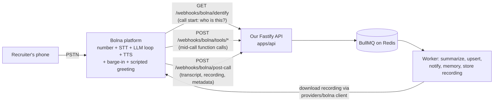

# 05 — Bolna Setup

> **RecruitPilot AI — Production-Grade AI Executive Voice Assistant**
> Document 05 of 21 · Prerequisites: docs 00–04

---

## 1. Goal

Give the assistant its entire voice stack in one account: **Bolna** (https://www.bolna.ai), the India-first managed voice-agent platform this project standardized on (the ADR with the full decision and rejected alternatives lives in doc 02). By the end of this document you will have:

- A **Bolna account** with the $5 free signup credits, and a clear mental model of the **prepaid credit** pricing (~6¢/min, billed in 30-second pulses, no subscription).
- The **`BOLNA_API_KEY`** — the credential our backend uses for the executions API and agent CRUD — stored safely.
- Our own **`BOLNA_WEBHOOK_TOKEN`** generated (`openssl rand -hex 32`) — the Bearer token Bolna will present on every webhook it sends us, and that our API will verify (doc 08).
- A **first agent created** via the dashboard Quick Start, and its **`BOLNA_AGENT_ID`** recorded.
- An **Indian phone number** purchased (or the compliance process started — the 140/160-series regulated-number path has lead time, like Exotel KYC did in the old plan), and **linked to the agent** so inbound calls reach it.

What you will *not* do here: configure the agent's brain, voice, or webhooks. That's deliberately split out — doc 06 configures the agent tab-by-tab, doc 08 defines the webhook contract our API implements.

---

## 2. Theory

### 2.1 What a managed voice-agent platform actually is

The DIY plan (preserved in `docs/phase2-diy-reference/`) required assembling four vendors and one hard engineering problem:

```
Exotel (telephony) ⇄ our WebSocket gateway ⇄ Deepgram (STT) ⇄ Claude (LLM) ⇄ ElevenLabs (TTS)
                      └── plus: jitter buffers, barge-in, turn-taking, latency budgets
```

Bolna collapses that entire diagram into **one platform**: it owns the phone number, answers the call, streams audio to its own STT, runs the LLM turn loop (Claude, configured in its LLM tab — doc 06), synthesizes the reply, and handles barge-in and turn-taking internally. Our code never touches an audio byte.

If you're coming from React Native, the analogy is **Expo vs bare RN**: the DIY pipeline is bare RN with hand-rolled native modules — maximal control, months of plumbing. Bolna is Expo — the platform owns the hard native layer, and you interact with it through a managed config surface plus well-defined extension points. Our extension points are three HTTPS webhook surfaces (doc 08): caller identification, tool calls, and post-call data.

### 2.2 What we still build (and why the project is still interesting)

Bolna runs the *conversation*; everything that makes this an executive assistant rather than a demo is still ours:

| Concern | Who owns it |
|---|---|
| Telephony, STT, TTS, barge-in, turn loop | **Bolna** (managed) |
| Who is calling + what we remember about them (memory read) | **Us** — identify webhook (doc 08) |
| Calendar checks, saving recruiters, sending the resume, notifying Varun | **Us** — tool webhooks (doc 08) + BullMQ jobs |
| Transcript persistence, Claude summaries, memory updates, recording storage | **Us** — async plane (docs 01, 16) |
| Dashboard | **Us** — Next.js (doc 10) |
| AI disclosure (all three layers) | **Shared** — Layer 1 is Bolna's scripted welcome message (doc 06), Layers 2–3 are ours (doc 16) |

### 2.3 The prepaid credit model and the cost math

Bolna is **prepaid, no subscription**: you load credits ($10 up to $5,000 at a time) and calls draw them down. Sign-up includes **$5 free credits** — enough for meaningful testing before spending anything.

- **~6¢/minute** standard rate (volume pricing ~4.5¢/min exists, irrelevant at our scale).
- **Billed in 30-second pulses** — a 10-second call costs half a minute, not a full one.
- **LLM cost is separate if you bring your own Anthropic key** (BYOK — doc 07 discusses when that's worth it).
- **Number rental**: a purchased number is free for 30 days on some plans, then rented monthly.

At our volume (~10–30 calls/month, ~5 min each): ≈ 150 min × 6¢ ≈ $9/month of talk time, plus number rental and Claude — **≈ ₹1,500/month all-in**, and a single 5-minute call ≈ ₹30–40 (Bolna minutes + Claude summary). The doc 02 ADR shows this is at or below DIY cost once you count the EC2 box and four vendor accounts DIY needed. Prices drift — treat https://www.bolna.ai/pricing as authoritative, not this paragraph.

### 2.4 Indian numbers and the regulatory reality (start early, again)

The Indian telecom rules that made Exotel KYC slow (TRAI/DoT, DLT registration, business verification) did not disappear — Bolna just fronts them for you. Two paths exist:

- **Standard numbers** — purchasable via the dashboard/API with little friction; fine for development and testing.
- **Regulated 140/160-series numbers** — India's designated series for transactional/service and telemarketing traffic. Bolna publishes guidance for obtaining these (see §6); expect a compliance/verification process with **lead time measured in days, not minutes**. If the assistant will make or take business calls at scale, this is the correct, compliant path.

**Practical consequence, same as the old doc 05 said about KYC:** start the number acquisition **today**, then keep reading while it processes. Bolna also supports bringing telephony from Plivo/Twilio/Exotel if you ever need a specific carrier — we don't, at our scale.

### 2.5 The provider-pattern discipline survives the pivot

Doc 00's rule stands: no vendor is load-bearing in our *code*. Bolna is one adapter surface — a thin client in `providers/bolna/` (executions fetch, recording download) plus webhook routes shaped by *our* Zod schemas, not Bolna's SDK types. If Bolna disappoints, the exits are: swap to Vapi/Retell (config + thin adapter change), or execute the DIY Phase 2 preserved in `docs/phase2-diy-reference/`. The switching cost is deliberately kept at "one adapter + one dashboard's worth of config," and this document is where you start seeing why that stays true.

---

## 3. Architecture

### 3.1 Where Bolna sits

Bolna is the **only** component touching the PSTN, and the only external system that calls *into* our API. Everything it needs from us arrives over three plain HTTPS webhook surfaces — no WebSocket voice path, no `/voice/stream`, no public real-time surface at all (doc 01):



Two credentials, two directions:

- **`BOLNA_API_KEY`** — *we* call *Bolna* (executions API, recording downloads, agent CRUD). Lives only in our server env, used only inside `providers/bolna/`.
- **`BOLNA_WEBHOOK_TOKEN`** — *Bolna* calls *us*. We generate it, paste it into Bolna's webhook config, and verify it as a Bearer token on every inbound webhook (doc 08, doc 12's TOKEN auth class).

### 3.2 What this document wires vs what later docs wire

| Piece | Wired in |
|---|---|
| Account, credits, API key, webhook token generated | **This doc** |
| Agent exists (Quick Start defaults) + `BOLNA_AGENT_ID` | **This doc** |
| Number purchased + linked to agent for inbound | **This doc** |
| Agent's LLM/voice/greeting/inbound/analytics tabs | Doc 06 |
| Webhook endpoints implemented + tool JSONs pasted | Docs 08, 09 |
| First real end-to-end call | Doc 17 |

### 3.3 Mapping to the folder structure (doc 03)

| Responsibility | Path |
|---|---|
| Thin Bolna API client (fetch execution, download recording) | `apps/api/src/providers/bolna/` |
| `BolnaClient` port (interface — no Bolna types elsewhere) | `apps/api/src/core/ports/bolna.client.ts` |
| Webhook routes (implemented in docs 08–09) | `apps/api/src/features/webhooks/` |
| `BOLNA_*` env validation | `apps/api/src/core/config/` (Zod, fail-fast) |

---

## 4. Folder Structure

Nothing is created in the repo by this document — today's outputs are an account, credentials, and dashboard state. Files this doc's outcomes will feed:

```
apps/api/src/
├── core/
│   ├── ports/bolna.client.ts       # port — executions fetch, recording download
│   └── config/                     # BOLNA_API_KEY / BOLNA_AGENT_ID / BOLNA_WEBHOOK_TOKEN
│                                   # validated by the Zod env schema at boot
├── providers/bolna/                # the ONLY place importing anything Bolna-specific
│   ├── bolna.client.ts             # implements the port over Bolna's REST API
│   └── bolna.types.ts              # response types (Zod .passthrough(), doc 08 rule)
└── features/webhooks/              # identify / tools / post-call routes (docs 08–09)
.env                                # ← the three variables from §8 land here today
.env.example                        # ← documented placeholders, committed
```

---

## 5. Manual Steps

Click-level, from zero. Bolna's dashboard evolves — menu names may differ slightly; the *sequence* holds. When in doubt: verify in https://www.bolna.ai/docs.

### 5.1 Create the account

1. Go to **https://www.bolna.ai** → **Sign up** (or start from the docs Quick Start).
2. Register with the project email (varun@digiqc.com per doc 00) → verify the email.
3. You land in the dashboard with **$5 free credits** — confirm you can see the credit balance (usually under Billing/Usage). No card needed yet; add prepaid credits only when the free credits run out.

### 5.2 Dashboard tour (5 minutes, saves an hour later)

Locate these areas (names approximate):

- **Agents** — where agents are created and configured (the tabs doc 06 walks through).
- **Phone numbers** — buy and manage numbers, link them to agents.
- **Executions / Call logs** — every call's transcript, recording, and metadata; your ground truth when debugging (doc 17).
- **API keys / Developer settings** — where `BOLNA_API_KEY` comes from.
- **Billing / Usage** — credit balance and per-call spend.

### 5.3 Get the API key

1. Dashboard → **API keys** (under settings/developer area).
2. Create a key, name it `recruitpilot-server`.
3. **Copy it immediately** into the password manager (doc 00), then into `.env` as `BOLNA_API_KEY`. Never into committed files, chat logs, or the web app.

### 5.4 Generate OUR webhook token

Bolna will call three public HTTPS endpoints on our API. We gate them with a long random Bearer token **we** generate — same edge-auth idea as the old plan's WebSocket token, now applied to webhooks (doc 08 §12):

```bash
openssl rand -hex 32
```

Store the output as `BOLNA_WEBHOOK_TOKEN` (§8). In doc 06 you paste this token into Bolna's webhook/tool configuration (the `api_token` field of each tool, and the auth setting on the identify and post-call webhooks); our API compares it on every request.

### 5.5 Create the agent (Quick Start)

1. Dashboard → **Agents** → **Create agent** (follow the Quick Start flow at https://www.bolna.ai/docs if the dashboard offers a guided path).
2. Name it `recruitpilot-assistant`. Accept defaults for everything else — **doc 06 replaces every default deliberately**; today the agent only needs to exist.
3. Find and record the **agent ID** (visible in the agent's settings/URL, and retrievable via the v2 agent API — see §7). This becomes `BOLNA_AGENT_ID`.

> Full agent CRUD also exists as an API (https://www.bolna.ai/docs/api-reference/agent/v2/create) — useful later for config-as-code (§11), but create the first agent in the dashboard so you *see* every tab you're about to configure in doc 06.

### 5.6 Buy the Indian number (start the compliant path today)

1. Dashboard → **Phone numbers** → **Buy number**.
2. For development: a standard Indian number is fine — pick one, note the E.164 form (`+91XXXXXXXXXX`).
3. For production business calling: read Bolna's regulated-number guidance (140/160-series) at https://www.bolna.ai/docs/guides/inbound/obtaining-regulated-phone-numbers and **start that process now** — it has compliance lead time. The dev number keeps you unblocked meanwhile.
4. Note the rental terms: free for 30 days on some plans, then monthly rental (check the pricing page and the purchase screen).

### 5.7 Link the number to the agent (inbound)

1. Phone numbers → your number → set its **inbound agent** to `recruitpilot-assistant` (per https://www.bolna.ai/docs/guides/inbound/buying-phone-numbers — the dashboard exposes an agent-assignment control on the number or on the agent's inbound tab).
2. **A number that isn't linked to the agent does nothing** — this is the new-stack equivalent of the classic "flow not assigned to the ExoPhone" mistake (§10.4).

### 5.8 Place a smoke-test call

Dial the number from your own phone. With Quick Start defaults you'll hear *some* default agent behavior — that's the point: it proves **PSTN → number → agent** wiring before any of our code exists. The agent will sound generic and know nothing; doc 06 fixes that.

---

## 6. Official Links

| Topic | Link |
|---|---|
| Bolna home / signup | https://www.bolna.ai |
| Docs root (Quick Start) | https://www.bolna.ai/docs |
| Pricing (credits, per-minute rate, number rental) | https://www.bolna.ai/pricing |
| Buying phone numbers (inbound guide) | https://www.bolna.ai/docs/guides/inbound/buying-phone-numbers |
| Regulated Indian numbers (140/160-series) | https://www.bolna.ai/docs/guides/inbound/obtaining-regulated-phone-numbers |
| Inbound tab (number → agent linking) | https://www.bolna.ai/docs/agent-setup/inbound-tab |
| Agent CRUD API (v2 create) | https://www.bolna.ai/docs/api-reference/agent/v2/create |
| Executions API (get execution) | https://www.bolna.ai/docs/api-reference/executions/get_execution |
| Anthropic models on Bolna | https://www.bolna.ai/docs/providers/llm-model/anthropic |
| TRAI (regulator context) | https://www.trai.gov.in |

---

## 7. Commands

```bash
# 1. Generate our webhook Bearer token (once; store in password manager + .env)
openssl rand -hex 32

# 2. Verify the API key works by fetching an execution / agent via Bolna's REST API.
#    Copy the EXACT base URL, path, and auth header from the API reference pages —
#    do not trust memory or this file for the path shape:
#      https://www.bolna.ai/docs/api-reference/agent/v2/create
#      https://www.bolna.ai/docs/api-reference/executions/get_execution
export BOLNA_API_KEY="..."

# Illustrative shape only — substitute the documented endpoint:
curl -s -H "Authorization: Bearer $BOLNA_API_KEY" \
  "<base-url-from-api-reference>/<agent-or-executions-path>" | head -c 500

# A 200 with JSON proves the key; a 401 means the key is wrong or copied with whitespace.
```

After your §5.8 smoke-test call, fetch that call's execution via the executions API and **save the JSON response as a fixture** — it is the first real sample of the payload shapes doc 08's schemas will validate.

---

## 8. Environment Variables

Three variables enter the project today. Per doc 00 conventions: real values in git-ignored `.env` + password manager; placeholders + comments in committed `.env.example`; production values in GitHub Secrets/server env (docs 14–15). All the old `EXOTEL_*`, `DEEPGRAM_*`, `ELEVENLABS_*`, and `VOICE_WS_AUTH_TOKEN` variables are **gone** — if you see them referenced anywhere, that content belongs to `docs/phase2-diy-reference/`.

| Variable | Purpose | Where used | Where stored |
|---|---|---|---|
| `BOLNA_API_KEY` | Our access to Bolna's REST API (executions, recordings, agent CRUD). Full-power secret. | `providers/bolna/` only | `.env` / GitHub Secrets (rotate on any leak) |
| `BOLNA_AGENT_ID` | The production agent's id — used to filter executions and sanity-check webhook payloads | `providers/bolna/`, `features/webhooks/` | `.env` (config, not secret) |
| `BOLNA_WEBHOOK_TOKEN` | Bearer token **we** generated (`openssl rand -hex 32`); Bolna presents it on identify/tool/post-call requests; our API verifies it (doc 08) | `features/webhooks/` auth guard + Bolna dashboard config | `.env` / GitHub Secrets |

```
# .env.example excerpt
BOLNA_API_KEY=bn-xxxxxxxxxxxxxxxx        # bolna.ai dashboard → API keys
BOLNA_AGENT_ID=xxxxxxxx-xxxx-...         # Agents → recruitpilot-assistant → id
BOLNA_WEBHOOK_TOKEN=<openssl rand -hex 32>  # WE generate; pasted into Bolna webhook/tool config
```

All three are validated at boot by the Zod env schema in `apps/api/src/core/config/` (doc 09's fail-fast rule) — the server refuses to start with any missing.

---

## 9. Verification

Work through these in order:

1. **Account live** — dashboard loads; credit balance shows the $5 free credits.
2. **API key works** — the §7 curl (with the documented endpoint) returns 200 JSON.
3. **Agent exists** — `recruitpilot-assistant` listed under Agents; its id recorded as `BOLNA_AGENT_ID`.
4. **Number active and linked** — number listed under Phone numbers with the agent assigned for inbound.
5. **Smoke-test call answered** — dialing the number reaches the default agent (any coherent answer counts; configuration comes in doc 06).
6. **Execution visible** — the smoke-test call appears in Executions/Call logs; you fetched it via the API and saved the JSON as a fixture.
7. **Self-quiz** (from memory):
   1. Which parts of the old five-box pipeline does Bolna absorb, and which three extension points remain ours?
   2. What is the difference in direction and purpose between `BOLNA_API_KEY` and `BOLNA_WEBHOOK_TOKEN`, and who generated each?
   3. Why do 30-second billing pulses matter for short calls?
   4. What are the two number types, and why must the 140/160-series process start early?
   5. If Bolna disappoints, what are the two exits, and why is the switching cost small?

---

## 10. Common Mistakes

1. **Treating the pivot as "no telecom compliance anymore."** Bolna fronts India's rules; it doesn't repeal them. The regulated-number path still has lead time — start it in parallel, exactly like the old KYC advice.
2. **Skipping the fixture step.** The first real execution JSON (§7) is the cheapest contract insurance you will ever collect — doc 08's Zod schemas are written against *observed* payloads, not documentation memory.
3. **Confusing the two credentials.** Pasting `BOLNA_API_KEY` into the webhook auth config (or the webhook token into the client) creates confusing 401s in both directions. API key = we→Bolna; webhook token = Bolna→us.
4. **Number not linked to the agent.** The number exists, the agent exists, calls go nowhere (or to a default). Linking is a separate explicit step (§5.7) — same failure mode as the unassigned ExoPhone flow.
5. **Burning free credits on long idle test calls.** Billing is per 30-second pulse and the meter runs while you "umm" at the agent. Keep smoke tests short; save real conversation testing for doc 17 when there's something to test.
6. **Reading old docs 05/06/08 from git history or `phase2-diy-reference/` and following them.** They describe a pipeline we no longer build. Reference material only.

---

## 11. Production Best Practices

- **Config-as-code for the agent**: once doc 06's configuration is final, fetch the agent's JSON via the v2 agent API and commit it (secrets stripped) as `docs/fixtures/bolna-agent.json`. Dashboard-only config is unreviewable and unrecoverable; a committed export makes agent changes diffable and restorable.
- **Track credit balance like a fuel gauge**: prepaid means calls *stop* at zero — not degrade, stop. Check the balance in the dashboard weekly at minimum; when the worker exists, a scheduled job can alert on low balance if Bolna exposes balance via API (verify against https://www.bolna.ai/docs).
- **Per-call cost telemetry continues** (doc 00's rule): log Bolna minutes (from the post-call payload/executions API) alongside Claude summary tokens, keyed by `execution_id` — cost surprises are found in dashboards, not invoices.
- **Keep the vendor's call log as ground truth**: when "the call never reached us," check Bolna's Executions view first — did Bolna even attempt the webhook? — before debugging our stack. Same discipline the old suite applied to Exotel's logs.
- **Data residency**: Bolna offers Indian data residency options — confirm your account/plan is set for Indian servers before production traffic (PII implications in doc 18).
- **Honesty about drift**: prices, plan gates, dashboard layout, and API shapes change at Bolna's pace, not ours. Before implementation (docs 08–09) and before production (doc 15), re-verify against https://www.bolna.ai/docs and https://www.bolna.ai/pricing.

---

## 12. Security

- **`BOLNA_API_KEY` is a high-value secret** (doc 18): it can read every transcript and recording of every call, and mutate agents. It lives only in the API/worker container env, read only inside `providers/bolna/` (doc 03's `process.env` grep rule), redacted from Pino logs (doc 09). Rotate immediately on any suspected leak.
- **`BOLNA_WEBHOOK_TOKEN` is our edge auth**: without it, anyone on the internet could POST fabricated post-call payloads or fake tool calls to our public endpoints. It is a 256-bit random value, compared with a constant-time check (doc 08 §12), never logged. Rotating it means updating `.env` *and* the Bolna dashboard config, in that order, during a no-call window.
- **PII now transits Bolna**: recruiter phone numbers, voices, and everything they say pass through Bolna's platform before reaching us. This is a deliberate, documented trade (doc 02 ADR); mitigations: Indian data residency, our own storage of canonical records (doc 04), and doc 18's transcript-handling rules. Our own logs still mask phone numbers to the last 4 digits (`+91••••••7842`).
- **Blast radius discipline**: Bolna credentials never appear in `apps/web`, `packages/shared`, event payloads, or the browser. The web app talks to *our* API only.

---

## 13. Checklist

- [ ] Bolna account created with the project email; email verified; $5 credits visible
- [ ] Dashboard toured: Agents, Phone numbers, Executions, API keys, Billing located
- [ ] `BOLNA_API_KEY` created, stored in password manager, proven by a 200 from the §7 curl
- [ ] `BOLNA_WEBHOOK_TOKEN` generated via `openssl rand -hex 32` and stored
- [ ] Agent `recruitpilot-assistant` created via Quick Start; `BOLNA_AGENT_ID` recorded
- [ ] Indian number purchased (E.164 noted); regulated 140/160-series process started if going to production
- [ ] Number linked to the agent for inbound
- [ ] Smoke-test call placed; call visible in Executions
- [ ] Execution JSON fetched via API and saved as a fixture for doc 08
- [ ] All three `BOLNA_*` vars in `.env` (git-ignored) and documented in `.env.example`
- [ ] Understood: pricing model, the two credentials' directions, the compliance lead time
- [ ] Self-quiz (§9.7) passed

---

## 14. Next Step

Proceed to **`06_BOLNA_AGENT_CONFIG.md`** — turning the default Quick Start agent into *our* agent, tab by tab: Claude in the LLM tab, transcriber and voice selection, the mandatory scripted disclosure greeting (Layer 1) as the welcome message, call-duration limits, the inbound tab pointed at our identify endpoint, and the analytics tab pointed at our post-call webhook.
