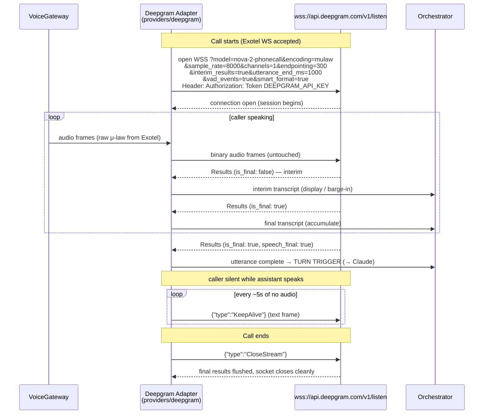

# 06 — Deepgram Setup

> **RecruitPilot AI — Production-Grade AI Executive Voice Assistant**
> Document 06 of 21 · Prerequisites: docs 00–05

---

## 1. Goal

Set up **Deepgram** — the ears of the assistant — from zero account to a verified, working API key:

- Understand **how streaming speech recognition actually works** (interim results, endpointing, VAD) — this knowledge is what lets you tune the 300ms endpointing slice of the latency budget (doc 01 §3.5) instead of guessing.
- Create a Deepgram account, project, and a **scoped dev API key** named `recruitpilot-dev`.
- Learn the exact WebSocket contract our `providers/deepgram/` adapter (doc 03 §4) will implement: connection URL, query params for telephony audio, message types, KeepAlive, CloseStream.
- Verify the key works with real `curl` commands **before** any application code exists.
- Introduce `DEEPGRAM_API_KEY`, `DEEPGRAM_MODEL`, and `DEEPGRAM_ENDPOINTING_MS` into the environment.

By the end, Deepgram is a service you understand and can debug — not a black box that "does STT."

---

## 2. Theory

### 2.1 How streaming ASR works (the mental model)

A speech recognizer is two models cooperating:

1. An **acoustic model** converts small windows of audio (tens of milliseconds) into probabilities over sounds/sub-word units.
2. A **language model** ranks which word sequences those sounds most plausibly form ("recruiter" is likelier than "rec router" after "I am a").

In *batch* transcription, the recognizer sees the whole file and picks the globally best sentence. In **streaming** transcription, audio arrives in ~20ms frames and the recognizer must guess *as it listens* — which means its current best hypothesis is provisional and can be **revised** as more audio arrives. Hear "I work at Goo—" and the best guess is "goo"; 200ms later it becomes "Google." This revision behavior is not a bug — it is the fundamental nature of incremental decoding, and it shapes our whole integration.

### 2.2 Interim vs final results (`is_final`)

Deepgram streams back JSON result messages, each carrying `is_final`:

| | `is_final: false` (interim) | `is_final: true` (final) |
|---|---|---|
| Meaning | Current best guess; **will change** | Deepgram commits: this chunk won't be revised |
| Arrival | Continuously, every few hundred ms | When a chunk of audio is fully decoded |
| Our use | UI/debug display, barge-in detection ("caller started talking → cancel TTS") | Accumulate into the utterance we send to Claude |
| Danger | Acting on it as if it were final → double-triggering the LLM on text that then changes | Safe to act on |

**Why do interim results exist at all?** Latency. Waiting for finals only means waiting for Deepgram's confidence, which arrives in bursts. Interims give you *something* within ~300ms of speech starting — that's what makes live captions possible and, critically for us, what lets the orchestrator detect **barge-in** the instant a caller starts talking over the assistant (doc 01 §3.4), long before any final arrives.

### 2.3 Endpointing (`speech_final`) — the decision that owns 300ms of our budget

Recognizing words is not enough — a voice agent must decide **when the caller has finished their turn**. That decision is **endpointing**: Deepgram watches for a configurable stretch of silence after speech, and when it sees one, it marks the current final result with `speech_final: true`. That flag is *the* trigger for a turn: it is the moment the orchestrator sends the utterance to Claude.

The silence threshold is a genuine tradeoff, and doc 01 §3.5 allocated **300ms** to it:

| Threshold | Consequence |
|---|---|
| Too short (e.g., 100ms) | Callers get cut off mid-thought — a natural pause ("we're offering... umm... 45 lakhs") triggers a turn on "we're offering", and the assistant answers a half-sentence. Feels rude and broken. |
| Too long (e.g., 1000ms) | Every single turn carries 1000ms of dead air *before the pipeline even starts* — your whole 1.5s budget is gone before Claude sees a word. Feels laggy and broken. |
| **300ms (our default)** | Aggressive but workable for structured Q&A calls; combined with `utterance_end_ms` as a safety net (below). Tuned via `DEEPGRAM_ENDPOINTING_MS`, not code, so we can adjust from real call data. |

There is no perfect number — 300ms is a starting hypothesis you will revisit once real recruiters (who pause, think, and speak Indian English at varied cadence) hit the system.

### 2.4 `utterance_end_ms` and UtteranceEnd events (the safety net)

Endpointing works on the *audio* level (silence detection inside the acoustic stream). It has a known failure mode: background noise, breaths, or line hum can prevent Deepgram from ever seeing "silence," so `speech_final` never fires and the assistant just... waits.

`utterance_end_ms` is a second, independent mechanism at the *word* level: if no new **word** has arrived in the transcript stream for N milliseconds (minimum 1000), Deepgram sends a separate **`UtteranceEnd`** message. Our orchestrator treats it as a fallback trigger:

- **Primary:** `speech_final: true` → turn starts (fast path, ~300ms).
- **Fallback:** `UtteranceEnd` arrives and we have unconsumed final text → turn starts anyway (slow path, ~1000ms, but never dead air).

Slow, thoughtful speakers and noisy phone lines are handled by the fallback; snappy speakers get the fast path. Both mechanisms coexist by design.

### 2.5 VAD events

With `vad_events=true`, Deepgram also emits **`SpeechStarted`** messages the moment voice activity begins. We use this as the earliest possible barge-in signal — even before the first interim transcript, `SpeechStarted` while the assistant is in SPEAKING state means "human is talking, shut up now." VAD (Voice Activity Detection, glossary in doc 00 §2.4) answers only "is anyone speaking?", not "what are they saying" — which is why it's the fastest signal available.

### 2.6 Keyterm / keyword boosting

Generic ASR models have never heard "Varun Gandhi" and will happily transcribe it as "Varoon Gandy." Deepgram lets you **boost** specific terms so the language model prefers them when the acoustics are ambiguous — `keyterm` on nova-3, `keywords` on nova-2 (check the docs for your chosen model's parameter). Our boost list is exactly the vocabulary recruiters use on these calls:

- Names: `Varun`, `Gandhi`, `Varun Gandhi`
- Tech terms: `Node.js`, `TypeScript`, `Fastify`, `Kubernetes`, `PostgreSQL`, company names
- Indian compensation vocabulary: `lakhs`, `LPA`, `CTC`, `notice period`

Per doc 01 §11 (config over code), this list lives in **settings** (DB-backed, editable in the dashboard), not hardcoded — when Varun learns React Native, no deploy is needed for Deepgram to hear it.

### 2.7 Telephony audio reality: 8kHz μ-law, no transcoding needed

Doc 00 §5.1 established that Exotel streams caller audio as **8kHz μ-law (mulaw)** — narrow telephone-grade audio, one byte per sample. Here is the good news that saves us an entire processing step: **Deepgram accepts raw encodings directly** via query parameters:

```
encoding=mulaw&sample_rate=8000&channels=1
```

Tell Deepgram what the bytes are, then forward Exotel's frames **untouched**. No μ-law→PCM conversion, no WAV header construction, no resampling on the STT leg. Every transcoding step you don't do is latency you don't pay and code you don't debug. (The TTS *return* leg is different — ElevenLabs output must be converted for Exotel; that's doc 08's problem.)

Also understand what 8kHz means for accuracy: telephone audio cuts off frequencies above ~4kHz, losing the consonant crispness of studio audio. This is precisely why phone-call-tuned models exist (next section) — they were trained on this degraded, band-limited reality.

### 2.8 Model choice: phonecall-tuned vs general

Deepgram ships model families (nova-2, nova-3, ...) with domain variants. Two candidates matter to us:

| Model | Character |
|---|---|
| `nova-2-phonecall` | nova-2 trained/tuned specifically on telephony audio (8kHz, compression artifacts, line noise) |
| `nova-3` (general) | Newer general architecture; stronger overall, includes `keyterm` boosting; check whether a phonecall variant exists when you read this |

**Recommendation: start with the phonecall-tuned model** (`nova-2-phonecall`) because our input is *exactly* the audio it was tuned for, then **A/B test** against the newest general model on real call recordings — accuracy on *your* callers is the only benchmark that matters. Model lists evolve quickly; check https://developers.deepgram.com/docs/models-languages-overview for the current lineup before committing. Because `DEEPGRAM_MODEL` is an env var (§8), switching costs nothing.

### 2.9 Language, accents, and formatting

- **Indian English:** Deepgram's `language=en` (or `en-IN` where supported — check the model's language list) handles Indian English accents; the nova family is trained on diverse accents. If accuracy on real calls disappoints, this is another A/B axis.
- **`smart_format=true`:** formats numbers, currencies, dates ("forty five lakhs" → "45 lakhs", phone numbers as digits) — essential because transcripts feed both Claude and the dashboard, and "twenty five LPA" as digits is far more useful downstream.
- **`punctuate=true`:** adds punctuation and capitalization (implied by smart_format, but be explicit). Claude reasons noticeably better over punctuated text, and Varun reads transcripts, not word soup.

---

## 3. Architecture

### 3.1 Where Deepgram sits: port meets adapter

Doc 03 fixed the physical contract: the core declares **`SpeechProvider`** in `apps/api/src/core/ports/speech.provider.ts`, and the Deepgram adapter in `apps/api/src/providers/deepgram/` implements it. The VoiceGateway and AgentOrchestrator only ever see the port — they push audio bytes in and consume transcript events out, with zero knowledge that Deepgram exists:

| Concern | Lives in |
|---|---|
| `SpeechProvider` interface (audio in → transcript events out) | `apps/api/src/core/ports/speech.provider.ts` |
| Deepgram WS client, URL/params, KeepAlive timer, reconnect logic | `apps/api/src/providers/deepgram/` |
| `DEEPGRAM_*` env validation | `apps/api/src/core/config/` (Zod schema) |
| Port → adapter binding | `apps/api/src/core/di/` |

Swapping Deepgram for Whisper or AssemblyAI = one new adapter + one DI binding (doc 00 §3.3). No feature file changes.

### 3.2 Streaming session lifecycle

One Deepgram WebSocket session lives exactly as long as one call:



Contract details the adapter must honor:

- **Auth is a header, not a query param**: `Authorization: Token <DEEPGRAM_API_KEY>` on the WS upgrade request. Never put the key in the URL (URLs end up in logs).
- **KeepAlive**: if Deepgram receives no audio for ~10 seconds it closes the socket — and the assistant speaking a long answer is exactly such a gap. The adapter sends a `{"type":"KeepAlive"}` text message every ~5s of audio silence to hold the session open mid-call.
- **CloseStream**: on call end, send `{"type":"CloseStream"}` rather than just dropping the socket — this makes Deepgram flush any buffered final results, so you don't lose the caller's last words from the transcript.
- **Reconnect-once policy** (doc 01's graceful-degradation rule): if the socket drops mid-call, the adapter attempts **one** immediate reconnect (same params, resume streaming). If that fails too, it surfaces a provider-failure event and the orchestrator plays the scripted apology ("I'm having trouble hearing you...") — never a silent retry loop while the caller talks into the void.

---

## 4. Folder Structure

Files this document's setup feeds into (created for real in docs 09 and 17):

```
apps/api/src/
├── core/
│   ├── ports/
│   │   └── speech.provider.ts        # SpeechProvider port — audio in, transcript events out
│   └── config/                       # Zod env schema gains DEEPGRAM_API_KEY,
│                                     #   DEEPGRAM_MODEL, DEEPGRAM_ENDPOINTING_MS
├── providers/
│   └── deepgram/
│       ├── deepgram.provider.ts      # implements SpeechProvider: WS client, params,
│       │                             #   KeepAlive timer, reconnect-once, event mapping
│       └── deepgram.types.ts         # raw Deepgram message shapes (Results, UtteranceEnd,
│                                     #   SpeechStarted) — never leak past this folder
.env                                  # DEEPGRAM_API_KEY=... (git-ignored)
.env.example                          # documented placeholder (committed)
```

Rule reminder from doc 03: Deepgram's SDK/message types are legal **only** inside `providers/deepgram/`. The orchestrator consumes our own domain-shaped transcript events, not Deepgram JSON.

---

## 5. Manual Steps

Click-level, from zero. Console UIs evolve — where a menu may have moved, this says so; the *concepts* (project, key, scope, usage) are stable.

### 5.1 Create the account

1. Open **https://deepgram.com** → click **Sign Up** (top right).
2. Choose a signup method: **GitHub**, **Google**, or **email + password**. Use the project identity decided in doc 00 §5 (varun@digiqc.com) so all vendor accounts share one recovery path.
3. If you used email/password: check your inbox for the verification email → click the verification link. (Check spam if it hasn't arrived in ~2 minutes.)
4. You land in the **Deepgram Console** — bookmark **https://console.deepgram.com**.

### 5.2 Free credits

Deepgram grants free credits on signup — **historically $200** with no card required, which at streaming STT rates is a *lot* of testing minutes. **Check the current offer** at signup and at https://deepgram.com/pricing — amounts and terms change. No credit card is needed for this document.

### 5.3 Console tour (2 minutes, do it now)

Orient yourself — verify exact names in the console, the UI evolves:

- **Projects** — Deepgram organizes everything (keys, usage, billing) under projects. A default project was created for you at signup.
- **API Keys** — per-project key management (under the project's **Settings** or a dedicated **API Keys** section).
- **Usage** — minutes consumed, request logs. This is where you'll watch free-credit burn (§5.6).
- **Billing** — credit balance, payment method (later, doc 15).
- **Playground / docs links** — a browser-based transcription tester; useful for eyeballing model behavior without code.

### 5.4 Create (or adopt) the project

You can simply use the **default project** for development — rename it for clarity:

1. Open the project switcher / **Settings**.
2. Rename the default project to `recruitpilot` (or create a new project with that name if you prefer a clean slate).

One project is enough for now; prod separation comes via a separate key (and optionally a separate project) in doc 15.

### 5.5 Create the API key — read all steps before clicking

1. In the console, go to your project → **Settings** → **API Keys** (or the **API Keys** nav item — verify in console, UI evolves).
2. Click **Create a New API Key**.
3. **Name / comment:** `recruitpilot-dev` — the name encodes purpose *and* environment, matching the dev/prod key separation rule from doc 00 §12.
4. **Scope / permissions:** Deepgram offers roles like **Member**, **Admin**, (and possibly **Owner**). Choose the **narrowest scope that permits transcription usage** — Member is sufficient for sending audio and reading results; Admin-scoped keys can manage the project and other keys, which our server never needs. Least privilege (doc 00 §12).
5. **Expiration:** for the dev key, either no expiry or a long expiry is acceptable — but if you set an expiry, put the date in your password manager entry so a "mystery 401" months from now takes seconds to diagnose, not hours.
6. Click **Create Key**. **The full key is shown exactly once — copy it NOW.** Once you close this dialog, the console will only ever show a masked stub; a lost key means creating a new one.
7. Store it immediately in **both** places:
   - Password manager (1Password/Bitwarden): entry `Deepgram — recruitpilot-dev`, with key, scope, creation date, expiry.
   - Project root `.env` (git-ignored since doc 00): `DEEPGRAM_API_KEY=<paste>`.
8. Add the placeholder to `.env.example` (committed): see §8.

### 5.6 Find the usage dashboard

Console → your project → **Usage**. After you run the §7 verification curls, a request should appear here — that's part of §9 verification. Get in the habit of glancing at this page during development: streaming STT is billed per minute of audio, and a bug that leaves sockets open (forgotten CloseStream) burns credits silently.

### 5.7 Prod key — not yet

Do **not** create the production key now. Doc 15 creates `recruitpilot-prod` during deployment, stored only in GitHub Actions Secrets and on the EC2 host — never on your laptop. One key per environment means a leaked dev key never endangers prod (doc 00 §12).

---

## 6. Official Links

| Topic | Link |
|---|---|
| Deepgram home / signup | https://deepgram.com |
| Console | https://console.deepgram.com |
| Live streaming STT docs | https://developers.deepgram.com/docs/live-streaming-audio |
| Models & languages overview | https://developers.deepgram.com/docs/models-languages-overview |
| Endpointing | https://developers.deepgram.com/docs/endpointing |
| Interim results | https://developers.deepgram.com/docs/interim-results |
| UtteranceEnd / utterance_end_ms | https://developers.deepgram.com/docs/utterance-end |
| VAD events | https://developers.deepgram.com/docs/start-of-speech-detection |
| Keyterm / keyword boosting | https://developers.deepgram.com/docs/keyterm |
| Encoding & sample rate params | https://developers.deepgram.com/docs/encoding |
| KeepAlive | https://developers.deepgram.com/docs/keep-alive |
| Pricing | https://deepgram.com/pricing |

---

## 7. Commands

All runnable now — no application code required. Load the key into your shell first:

```bash
# from the repo root, where .env lives
export DEEPGRAM_API_KEY=$(grep '^DEEPGRAM_API_KEY=' .env | cut -d= -f2)
echo "key loaded: ${DEEPGRAM_API_KEY:0:6}..."   # prints first 6 chars only — never echo the full key
```

**Verify the key with a real transcription** (REST, prerecorded — Deepgram hosts a public sample file for exactly this):

```bash
curl -X POST "https://api.deepgram.com/v1/listen?model=nova-2&smart_format=true" \
  -H "Authorization: Token $DEEPGRAM_API_KEY" \
  -H "Content-Type: application/json" \
  -d '{"url":"https://dpgr.am/spacewalk.wav"}'
```

Expected: a JSON response containing `results.channels[0].alternatives[0].transcript` with text about a spacewalk. Pipe through `| python3 -m json.tool` to read it comfortably.

**Verify project access** (also confirms the key's scope can read the project):

```bash
curl https://api.deepgram.com/v1/projects \
  -H "Authorization: Token $DEEPGRAM_API_KEY"
```

Expected: JSON listing your project(s) with `project_id` and name (`recruitpilot`).

**Optional — poke the live WebSocket endpoint** to see the streaming handshake with your own eyes:

```bash
brew install websocat   # one-time; a curl-for-WebSockets tool

websocat -H "Authorization: Token $DEEPGRAM_API_KEY" \
  "wss://api.deepgram.com/v1/listen?model=nova-2&encoding=mulaw&sample_rate=8000&channels=1"
```

If the connection opens (no 401), auth and params are accepted. Note: you won't get transcripts from this alone — the live endpoint needs **real binary audio bytes**, which a keyboard can't produce; if you send nothing, Deepgram closes the socket after ~10 seconds. That closure is not an error — it is a live demonstration of exactly why the adapter needs KeepAlive (§3.2). Press Ctrl+C to exit. The real streaming test happens with actual call audio in doc 17.

---

## 8. Environment Variables

Add to `.env` (real values) and `.env.example` (placeholders + comments), following the doc 00 §8 convention:

```bash
# .env.example — Deepgram STT (doc 06)
DEEPGRAM_API_KEY=your-deepgram-api-key-here     # console.deepgram.com → project → API Keys; scoped Member; shown once
DEEPGRAM_MODEL=nova-2-phonecall                 # model is config, not code (doc 02 §11) — A/B swappable without deploy
DEEPGRAM_ENDPOINTING_MS=300                     # silence threshold for speech_final; owns 300ms of the latency budget (doc 01 §3.5)
```

| Variable | Required | Default | Used by |
|---|---|---|---|
| `DEEPGRAM_API_KEY` | ✅ | — | `providers/deepgram/` only (via injected config); validated at boot by the Zod schema in `core/config/` |
| `DEEPGRAM_MODEL` | ✅ | `nova-2-phonecall` | `providers/deepgram/` — becomes the `model=` query param on the WS URL |
| `DEEPGRAM_ENDPOINTING_MS` | optional | `300` | `providers/deepgram/` — becomes the `endpointing=` query param; tune from real-call data, never by editing code |

Reminder of the doc 03 §12 rule: `process.env` is read **only** in `core/config/`; the adapter receives typed config through DI. And per doc 01 §3.2 — this key exists only in the API container's environment, never in web, never in the browser.

---

## 9. Verification

You are done with this document when **all** of the following hold:

1. **Transcription curl (§7) returns a transcript** — JSON contains readable text about a spacewalk, not an error object.
2. **Projects curl returns your project** — you can see `project_id` and the name you set.
3. **Key visible (masked) in console** — project → API Keys shows `recruitpilot-dev` with the scope you chose.
4. **Usage page shows the test request** — console → Usage lists at least one request from today (may take a minute to appear). This confirms the metering loop you'll monitor for cost.
5. **Key stored twice** — password manager entry exists; `.env` has the real value; `.env.example` has the placeholder; `git status` shows `.env` is *not* staged.

And the self-quiz (from memory — later docs assume these):

1. What is the difference between an **interim** result, a **final** result (`is_final`), and `speech_final`? Which one triggers a turn, and what are the other two used for?
2. Why does `encoding=mulaw&sample_rate=8000&channels=1` matter — what work does it save us, and where does that saving show up?
3. What does **KeepAlive** prevent, exactly, and during which phase of a call is it most needed?
4. Which slice of the doc 01 §3.5 latency budget does endpointing own, and what breaks if you set it to 100ms? To 1000ms?
5. What is `UtteranceEnd` a safety net *for*, and why can't endpointing alone be trusted on a noisy phone line?

---

## 10. Common Mistakes

1. **Transcoding μ-law→WAV/PCM before sending to Deepgram.** Needless — Deepgram takes raw mulaw when you declare it via query params. The conversion adds latency, CPU, and a whole class of buffering bugs on the hottest path in the system. Declare, don't convert.
2. **Acting on interim results as if final.** Interims *change*. Sending them to Claude means double-triggering the LLM on text that then rewrites itself — you get two overlapping answers to two versions of half a sentence. Interims are for display and barge-in only.
3. **Endpointing set too aggressive.** 100–150ms feels "snappy" in a quiet demo, then real callers with natural pauses get interrupted mid-thought on every turn. Start at 300ms and tune from recordings, not vibes.
4. **Ignoring `UtteranceEnd`.** Rely on `speech_final` alone and a slow speaker on a noisy line produces the worst failure mode a voice agent has: infinite dead air while both sides wait for the other.
5. **Leaking the key into client code or URLs.** The key belongs in the `Authorization: Token` header, from the API container's env, full stop. In a query string it lands in access logs; in the web app it lands in everyone's browser DevTools.
6. **Forgetting KeepAlive.** Deepgram closes the socket after ~10s without audio — and the assistant delivering a long answer is precisely a >10s audio gap. Symptom: transcription mysteriously dead from turn two onward. The §7 websocat experiment shows you this timeout live.
7. **Not monitoring free-credit burn.** Streaming is billed per audio minute; a leaked loop or an un-closed socket (missing CloseStream) meters silently. Check the Usage page during development, and wire per-call minute tracking into cost telemetry (doc 02 §11) when the adapter is built.

---

## 11. Production Best Practices

- **Pin the model via env** (`DEEPGRAM_MODEL`) — model upgrades are deliberate, A/B-tested config changes (dev first, then prod), never a surprise from a hardcoded string edit.
- **Log Deepgram's `request_id`** — every response (REST and streaming metadata) carries one; log it alongside our `callSid` (doc 01 §3.8). When transcription misbehaves, Deepgram support asks for the `request_id` first — having it turns a ticket from days into hours.
- **Track STT minutes per call** in the cost telemetry established in doc 02 §11: audio-seconds streamed × rate, recorded on the call record. Per-call unit economics, not a monthly bill surprise.
- **Keyterm list in settings, not code** — recruiter vocabulary changes (new companies, new tech on the resume); Varun edits it in the dashboard (doc 01 §11), zero deploys.
- **Reconnect-once-then-degrade** — one immediate reconnect attempt on socket drop, then the scripted apology path (doc 00 §11). Unbounded retry loops on the real-time plane turn one vendor blip into 30 seconds of a caller talking to nobody.
- **Alert on p95 of the endpointing→turn-trigger gap** — this is your slice of the latency SLO regression test (doc 01 §11); if it creeps, either the threshold changed or Deepgram's behavior did, and you want to know which before callers do.

---

## 12. Security

- **Scope keys per project, least privilege** — the runtime key is Member-scoped on the `recruitpilot` project only; it can transcribe but cannot mint keys or change billing. Admin actions stay with your human console login.
- **Separate dev/prod keys** — `recruitpilot-dev` on your laptop, `recruitpilot-prod` (doc 15) only in GitHub Secrets + the EC2 environment. A leaked laptop never compromises production.
- **Rotation lives in the console** — project → API Keys: create replacement → deploy new value → delete old key. Rotate immediately on any suspected leak (doc 00 §12), and rotating is also the recovery for a lost key, since values are shown only once.
- **Transcripts are PII.** Everything Deepgram returns — names, phone numbers, compensation figures — is recruiter personal data flowing into our DB. The Pino redaction rules from doc 02 §12 apply: transcript *content* never appears in plaintext application logs; log event names, `callSid`, and lengths, not words. At rest, transcripts sit behind Supabase RLS (doc 04/11).
- **Deepgram's own data handling** — Deepgram may use submitted audio to improve models depending on account/plan settings. Find the data-usage / model-improvement opt-out in the console (project or account **Settings** → look for data usage / privacy — verify in console, UI evolves) and set it consciously; recruiter call audio is not yours to donate. Review their policy at https://deepgram.com/privacy.

---

## 13. Checklist

- [ ] Deepgram account created (varun@digiqc.com), email verified
- [ ] Free-credit balance sighted in console (current offer noted)
- [ ] Project named `recruitpilot` (default renamed or new)
- [ ] API key `recruitpilot-dev` created — narrowest usable scope, copied at creation
- [ ] Key in password manager AND `.env`; placeholder + comment in `.env.example`; `.env` untracked
- [ ] Transcription curl returns a real transcript
- [ ] Projects curl returns the project
- [ ] Usage page shows today's test request
- [ ] Understood: interim vs final vs `speech_final`, and which triggers a turn
- [ ] Understood: `endpointing=300` tradeoff and the `UtteranceEnd` fallback
- [ ] Understood: raw mulaw via query params — no transcoding on the STT leg
- [ ] Understood: KeepAlive (~10s idle timeout) and CloseStream (flush finals)
- [ ] Self-quiz (§9) passed
- [ ] Prod key deliberately NOT created (waits for doc 15)

---

## 14. Next Step

Proceed to **`07_CLAUDE_SETUP.md`** — the brain: Anthropic account and API key, model selection for the real-time turn loop (latency vs capability), streaming responses, tool-use (function calling) fundamentals for `check_calendar`/`send_resume`/`save_recruiter`/`notify_varun`, and the prompt-size discipline the 600ms TTFT budget slice demands.
