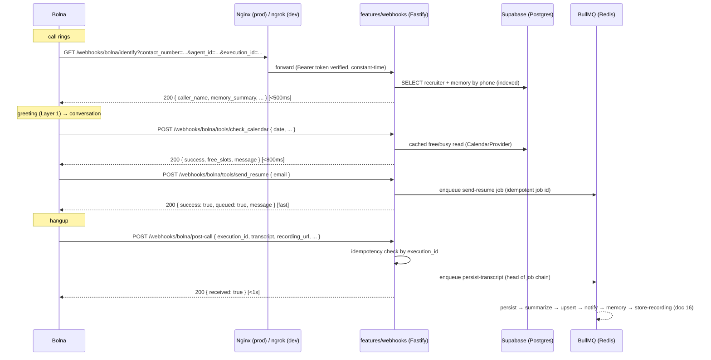

# 08 — Bolna Webhooks

> **RecruitPilot AI — Production-Grade AI Executive Voice Assistant**
> Document 08 of 21 · Prerequisites: docs 00–07

---

## 1. Goal

Define **the contract** between Bolna and our API — the single most load-bearing interface in the system. Every request Bolna will ever send us, and every response we will ever send back, is specified here:

- The **three webhook surfaces**: `GET /webhooks/bolna/identify` (caller identification / memory read), `POST /webhooks/bolna/tools/*` (four mid-call function calls), `POST /webhooks/bolna/post-call` (execution-completed data).
- The **four tool definitions** in Bolna's `custom_task` JSON format — the exact blocks you paste into the agent's tools section (doc 06 §5.9).
- **Bearer-token authentication** via `BOLNA_WEBHOOK_TOKEN` on all three surfaces.
- **Latency budgets**: identify **<500ms**, tool calls **<800ms**, post-call ack **<1s** — and the design rule (execute-or-enqueue) that makes them achievable.
- **Idempotency by `execution_id`** and **graceful tool-failure fallbacks** — the two properties that make live calls survive our bugs.

This is a *contract* document: it specifies shapes and invariants. Implementation lands in doc 09 (routes/plugins) and doc 16 (handler logic); testing in doc 19.

---

## 2. Theory

### 2.1 Our entire public surface is now three webhooks

The DIY design's hardest public surface — a bidirectional WebSocket carrying live audio — is gone (preserved in `docs/phase2-diy-reference/`). What replaced it is almost boring, and that's the win: three HTTPS endpoints receiving JSON. If you've built REST APIs, nothing here is exotic. What *is* different from a normal REST API is **who the client is and when it calls**:

| Surface | When Bolna calls it | A human is waiting? | Budget |
|---|---|---|---|
| `GET /identify` | Call start, before the greeting | Yes — listening to ring tone | **<500ms** |
| `POST /tools/*` | Mid-conversation, when Claude picks a tool | Yes — mid-sentence silence (softened by `pre_call_message`) | **<800ms** |
| `POST /post-call` | After hangup | No | **<1s to ack** (then async) |

The first two run **during a live call** — they are the "fast plane." The third triggers the "reliable plane" (BullMQ, doc 01). Same two-plane philosophy as the old architecture; the fast plane just shrank from an audio pipeline to two HTTP handlers.

### 2.2 The execute-or-enqueue rule

An RN analogy: a webhook handler on the fast plane is like a touch handler on the UI thread — anything slow you `await` inline janks the experience for a person in real time. The rule for every fast-plane handler:

- **Execute inline** only work that is reliably fast: an indexed DB read (identify), a cached calendar lookup or a single-row upsert (tools).
- **Enqueue everything else** and return immediately: sending the resume email, notifying Varun. The handler returns `{"queued": true, ...}` in tens of milliseconds; BullMQ does the real work with retries. The agent can honestly tell the recruiter "I've sent it" because the *commitment* (durable job in Redis) is made, even though the SMTP conversation hasn't happened yet.

Never `await` an external vendor (email, Anthropic) inside a fast-plane handler. The two tools that look async-shaped (`send_resume`, `notify_varun`) are enqueue-only by design.

### 2.3 Idempotency by `execution_id`

Every Bolna call has an **execution id** — it appears in the identify query params and the post-call payload, and it is our correlation id across logs, jobs, and the `Call` row (docs 01, 11 — it replaces the old `callSid` concept). Webhook senders retry on timeouts and non-2xx responses; Bolna's exact retry policy must be **verified against https://www.bolna.ai/docs/agent-setup/analytics-tab** — but we don't need to know it to be safe. We design as if every webhook can arrive **at least once, possibly many times**:

- **Post-call**: all side effects keyed by `execution_id`. First delivery enqueues the job chain; a duplicate finds the key already recorded and returns 200 as a no-op. (200, not an error — the vendor retried because it wasn't sure; reassure it.)
- **Identify**: naturally idempotent — a pure read.
- **Tools**: `save_recruiter` is an upsert (idempotent by phone/email). `send_resume`/`notify_varun` use a BullMQ job id derived from `execution_id` + tool name + normalized args, so a duplicate tool call cannot double-send an email.

### 2.4 Authentication: one Bearer token, three surfaces

All three endpoints are public URLs; anyone on the internet can send requests to them. The gate is `BOLNA_WEBHOOK_TOKEN` (generated in doc 05 §5.4): we configure it in Bolna's dashboard (identify auth, analytics webhook auth, and each tool's `api_token` field), and Bolna presents it as `Authorization: Bearer <token>`. Our side verifies it with a **constant-time comparison** before any parsing or DB work — a mismatch is a 401 with an empty body and a log line, nothing more. This is doc 12's TOKEN auth class; the identify/tool/post-call routes are the only routes in it.

Bearer-token support for caller identification is documented (https://www.bolna.ai/docs/customizations/identify-incoming-callers); `api_token` on tools is part of the `custom_task` format (§2.5). Verify the analytics webhook's auth mechanism against https://www.bolna.ai/docs/agent-setup/analytics-tab — if it turns out to deliver the token differently (header name, query param), the auth guard adapts, the token doesn't.

### 2.5 The `custom_task` format — how a Bolna tool is defined

Bolna's custom function calls (https://www.bolna.ai/docs/tool-calling/custom-function-calls) are **OpenAI function-calling JSON plus Bolna extension fields**:

- The standard part: `name`, `description`, `parameters` (a JSON Schema) — this is what Claude sees when deciding whether and how to call the tool. Description quality directly drives tool-selection quality (doc 16 owns the prose).
- `"key": "custom_task"` — a **mandatory literal** marking this as an HTTP-executing tool.
- `"value": { method, url, param, api_token, headers }` — how Bolna turns the LLM's function call into an HTTP request to us:
  - `method` / `url` — the request Bolna makes (our endpoint).
  - `param` — a template for the request body/query where **`%(param_name)s`** (Python-style substitution) is replaced with the argument values Claude produced. This is the bridge from "LLM decided `email=priya@techcorp.com`" to "HTTP body contains that email."
  - `api_token` — our `BOLNA_WEBHOOK_TOKEN`, sent as the Bearer token.
  - `headers` — e.g. `Content-Type: application/json`.
- `pre_call_message` (optional) — a phrase the agent **speaks while the HTTP call executes** ("Let me check that for you") — free latency masking; use it on every tool.

The **response JSON we return is fed back to Claude**, which phrases a natural-language version for the caller. So our responses are designed to be *speakable*: small, flat, self-describing fields — not database dumps.

> **Verify before pasting**: the exact top-level nesting (whether `name`/`parameters` sit beside or inside a wrapper object) and the `param` templating details must be checked against https://www.bolna.ai/docs/tool-calling/custom-function-calls — the §3.3 blocks encode the documented fields, but Bolna's schema is authoritative on arrangement.

### 2.6 Graceful failure: the agent must never say "HTTP 500"

A tool failure mid-call is a *conversation* problem, not just an engineering one. The design rule: **our handlers convert failures into speakable JSON**, returning HTTP 200 with `{"success": false, "message": "<what the agent should convey>"}` rather than a 5xx. Why: Claude receives the response body and can relay `"I couldn't reach Varun's calendar just now — I'll make sure he gets back to you with times."` What Bolna does when a tool returns 5xx or times out (error text to the LLM? silent skip?) must be verified against the custom-function-calls docs — by returning structured failure at the application level, we stop depending on the answer. Every handler wraps its work in a timeout (§11) so even a hung dependency degrades into a graceful message inside budget.

---

## 3. Architecture

### 3.1 The three surfaces in one call



### 3.2 Surface 1 — `GET /webhooks/bolna/identify`

**Purpose**: the memory read path (docs 06 §2.3, 16). Bolna calls it at call start; the returned JSON becomes the prompt's `{{variables}}`.

**Request** (per https://www.bolna.ai/docs/customizations/identify-incoming-callers — Bolna sends these as query params):

```
GET /webhooks/bolna/identify?contact_number=%2B919876543210&agent_id=<id>&execution_id=<id>
Authorization: Bearer <BOLNA_WEBHOOK_TOKEN>
```

Validated with Zod — known params typed, `.passthrough()` for anything extra Bolna adds later:

```typescript
const IdentifyQuery = z.object({
  contact_number: z.string(),   // E.164, may arrive URL-encoded
  agent_id: z.string(),
  execution_id: z.string(),
}).passthrough();
```

**Response** — flat string values; **each key must exactly match a `{{variable}}` in the doc 16 prompt** (the coupling doc 06 §4 warns about):

```json
// Known caller:
{
  "known_caller": "true",
  "caller_name": "Priya Sharma",
  "caller_company": "TechCorp",
  "memory_summary": "Spoke 12 Jan about a senior RN role in Bengaluru; Varun asked for JD; awaiting budget range."
}
// Unknown caller — SAME shape, neutral values, still HTTP 200:
{
  "known_caller": "false",
  "caller_name": "",
  "caller_company": "",
  "memory_summary": "No previous conversations with this caller."
}
```

**Invariants**: always 200 (unknown caller is not an error — a 4xx/timeout here degrades the whole call's personalization, and Bolna's failure behavior is its own unknown, §12 of doc 06); always the full key set (missing keys = empty variables); **only speakable, non-private content** (§12); respond in **<500ms** — one indexed query by phone number, no joins-of-everything, no external calls. `agent_id` is checked against `BOLNA_AGENT_ID` (mismatch → log + neutral response).

### 3.3 Surface 2 — `POST /webhooks/bolna/tools/*` — the four tools

One route per tool: `/webhooks/bolna/tools/check_calendar`, `/save_recruiter`, `/send_resume`, `/notify_varun`. Request bodies are **whatever we write in each tool's `param` template** — we control both sides of this contract, which is why the definitions below and the Zod schemas in `features/webhooks/tools/` must move together. All requests carry the Bearer token via `api_token`. All responses are 200 + speakable JSON (§2.6).

Below, `<HOST>` = your ngrok host (dev) or `api.<domain>` (prod). Verify top-level arrangement against https://www.bolna.ai/docs/tool-calling/custom-function-calls before pasting (§2.5).

**Tool 1 — `check_calendar`** (synchronous read; CalendarProvider with cached Google free/busy — doc 16):

```json
{
  "name": "check_calendar",
  "description": "Check Varun's calendar availability for a given date so the recruiter can be offered realistic time slots. Use when the caller asks about Varun's availability or wants to schedule a conversation.",
  "parameters": {
    "type": "object",
    "properties": {
      "date": { "type": "string", "description": "The date to check, in YYYY-MM-DD format (Asia/Kolkata)." }
    },
    "required": ["date"]
  },
  "key": "custom_task",
  "value": {
    "method": "POST",
    "url": "https://<HOST>/webhooks/bolna/tools/check_calendar",
    "param": "{\"date\": \"%(date)s\"}",
    "api_token": "<BOLNA_WEBHOOK_TOKEN>",
    "headers": { "Content-Type": "application/json" }
  },
  "pre_call_message": "Let me check Varun's calendar for you."
}
```

Response (success / failure):

```json
{ "success": true, "date": "2026-07-10", "free_slots": ["10:00–10:30", "16:00–17:00"], "message": "Varun has availability on Thursday morning and late afternoon." }
{ "success": false, "message": "The calendar could not be reached right now. Varun will follow up directly to schedule." }
```

**Tool 2 — `save_recruiter`** (fast DB upsert, acceptable inline):

```json
{
  "name": "save_recruiter",
  "description": "Save or update the recruiter's details once they have shared them. Use as soon as the caller provides their name, company, or the role they are hiring for.",
  "parameters": {
    "type": "object",
    "properties": {
      "name":       { "type": "string", "description": "The recruiter's full name as stated." },
      "company":    { "type": "string", "description": "The company or agency they represent." },
      "role_title": { "type": "string", "description": "The role they are hiring for, if mentioned." },
      "email":      { "type": "string", "description": "Their email address, if provided. Repeat it back before saving." }
    },
    "required": ["name"]
  },
  "key": "custom_task",
  "value": {
    "method": "POST",
    "url": "https://<HOST>/webhooks/bolna/tools/save_recruiter",
    "param": "{\"name\": \"%(name)s\", \"company\": \"%(company)s\", \"role_title\": \"%(role_title)s\", \"email\": \"%(email)s\"}",
    "api_token": "<BOLNA_WEBHOOK_TOKEN>",
    "headers": { "Content-Type": "application/json" }
  },
  "pre_call_message": "One moment while I note that down."
}
```

Response: `{ "success": true, "message": "Details saved." }` — the handler upserts by phone (from the call context) / email; upsert = idempotent by nature.

**Tool 3 — `send_resume`** (enqueue-only — returns instantly, BullMQ sends the email):

```json
{
  "name": "send_resume",
  "description": "Email Varun's resume to the recruiter. ONLY use after the recruiter has explicitly stated their email address on this call; never guess or reuse an address they did not state.",
  "parameters": {
    "type": "object",
    "properties": {
      "email": { "type": "string", "description": "The recipient email address exactly as the recruiter stated it on this call." }
    },
    "required": ["email"]
  },
  "key": "custom_task",
  "value": {
    "method": "POST",
    "url": "https://<HOST>/webhooks/bolna/tools/send_resume",
    "param": "{\"email\": \"%(email)s\"}",
    "api_token": "<BOLNA_WEBHOOK_TOKEN>",
    "headers": { "Content-Type": "application/json" }
  },
  "pre_call_message": "Sending that over to you now."
}
```

Response: `{ "success": true, "queued": true, "message": "The resume is on its way to priya@techcorp.com." }` — `queued: true` is the honest contract: a durable job exists (idempotent job id, §2.3); the worker delivers with retries. Failure to *enqueue* (Redis down) → `success: false` + graceful message.

**Tool 4 — `notify_varun`** (enqueue-only; destination is server-configured — never a tool argument):

```json
{
  "name": "notify_varun",
  "description": "Send Varun an immediate notification summarizing this opportunity. Use near the end of the call, or immediately if the recruiter says the matter is urgent.",
  "parameters": {
    "type": "object",
    "properties": {
      "summary": { "type": "string", "description": "2-3 sentence summary: who called, company, role, compensation if stated, and requested next step." },
      "urgency": { "type": "string", "enum": ["normal", "urgent"], "description": "urgent only if the recruiter stated time pressure." }
    },
    "required": ["summary"]
  },
  "key": "custom_task",
  "value": {
    "method": "POST",
    "url": "https://<HOST>/webhooks/bolna/tools/notify_varun",
    "param": "{\"summary\": \"%(summary)s\", \"urgency\": \"%(urgency)s\"}",
    "api_token": "<BOLNA_WEBHOOK_TOKEN>",
    "headers": { "Content-Type": "application/json" }
  },
  "pre_call_message": "Let me flag this to Varun right away."
}
```

Response: `{ "success": true, "queued": true, "message": "Varun has been notified." }`. Note what the parameters do **not** include: a destination. Varun's contact channel is server config — an LLM argument that chooses where notifications go is a prompt-injection payload waiting to happen (§12).

### 3.4 Surface 3 — `POST /webhooks/bolna/post-call`

**Purpose**: the trigger for the entire async plane. Bolna POSTs execution data after the call ends (configured on the analytics tab, doc 06 §5.8).

**Request**: JSON containing — per the brief's verified facts — the **execution id, transcript, recording URL, telephony metadata, and Bolna's optional summary/extracted data**. The **exact field names are not pinned here**: verify against https://www.bolna.ai/docs/agent-setup/analytics-tab and, above all, against the **first real captured payload** (the fixture discipline from doc 05 §7). The schema is written defensively:

```typescript
const PostCallPayload = z.object({
  // the one field we truly require — names may differ; adapt after capturing a real payload:
  id: z.string().optional(),
  execution_id: z.string().optional(),
  transcript: z.unknown().optional(),
  recording_url: z.string().optional(),
  summary: z.unknown().optional(),
  extracted_data: z.unknown().optional(),
}).passthrough();                       // keep EVERYTHING Bolna sends — never discard unknown fields
```

The handler requires an execution id (from whichever field carries it), **stores the raw payload verbatim** (doc 11's `Call.rawPayload`), and treats everything else as optional — anything missing can be back-filled by the pull path (`get_execution` via `providers/bolna/`, https://www.bolna.ai/docs/api-reference/executions/get_execution).

**Handler sequence** (the whole thing, in order — nothing else belongs here):

1. Verify Bearer token (constant-time) → else 401.
2. Parse with the passthrough schema; extract `execution_id` → unparseable/missing id: log raw body, 400.
3. **Idempotency check** on `execution_id` (§2.3) → duplicate: 200 `{"received": true, "duplicate": true}`, stop.
4. Persist the raw payload + enqueue `persist-transcript` (head of the doc 16 job chain).
5. Return 200 `{"received": true}` — total **<1s**; the summary, upserts, notification, memory update, and recording download all happen in the worker.

### 3.5 Route summary (feeds doc 12's route table)

| Route | Method | Auth (doc 12 class) | Budget | Handler style |
|---|---|---|---|---|
| `/webhooks/bolna/identify` | GET | TOKEN (Bearer) | <500ms | read-only, always-200 |
| `/webhooks/bolna/tools/check_calendar` | POST | TOKEN | <800ms | execute inline (cached read) |
| `/webhooks/bolna/tools/save_recruiter` | POST | TOKEN | <800ms | execute inline (upsert) |
| `/webhooks/bolna/tools/send_resume` | POST | TOKEN | <800ms | enqueue, return `queued` |
| `/webhooks/bolna/tools/notify_varun` | POST | TOKEN | <800ms | enqueue, return `queued` |
| `/webhooks/bolna/post-call` | POST | TOKEN | <1s ack | idempotent enqueue |

---

## 4. Folder Structure

```
apps/api/src/features/webhooks/          # the ONLY unauthenticated-inbound surface (doc 03)
├── webhooks.routes.ts                   # route registration + Bearer-token guard (preHandler)
├── auth.guard.ts                        # constant-time token compare — used by every route here
├── identify.handler.ts                  # §3.2 — recruiter+memory lookup → variables JSON
├── identify.schema.ts                   # IdentifyQuery / IdentifyResponse (Zod)
├── tools/
│   ├── check-calendar.handler.ts        # → CalendarProvider port (google-calendar adapter)
│   ├── save-recruiter.handler.ts        # → Prisma upsert
│   ├── send-resume.handler.ts           # → enqueue send-resume job
│   ├── notify-varun.handler.ts          # → enqueue notify job
│   └── tools.schemas.ts                 # request/response Zod schemas — mirror §3.3 params
├── post-call.handler.ts                 # §3.4 — verify, dedupe, persist raw, enqueue, 200
└── post-call.schema.ts                  # PostCallPayload (.passthrough())
docs/fixtures/
├── bolna-identify-request.json          # captured real requests/payloads — the source of truth
├── bolna-tool-call-*.json               #   for these schemas (doc 19 replays them as tests)
└── bolna-post-call.json
```

Doc 03's dependency rules apply: handlers use `core/ports` (CalendarProvider, queue) — never import vendor SDKs directly.

---

## 5. Manual Steps

The code side lands in doc 09; the manual work here is planting this contract in Bolna's dashboard:

1. **Paste the four tool definitions** (§3.3) into the agent's tools/custom-functions section (located in doc 06 §5.9): open https://www.bolna.ai/docs/tool-calling/custom-function-calls side-by-side, confirm the current expected nesting, and adapt the four blocks — substituting your real `<HOST>` and `BOLNA_WEBHOOK_TOKEN`.
2. **Confirm the two webhook URLs + tokens** from doc 06 (§5.7 identify, §5.8 post-call) match this doc's routes exactly — path typos here surface as "Bolna never calls us" mysteries in doc 17.
3. **Capture real fixtures** as soon as the endpoints exist (doc 09): run a test call through ngrok, save the exact identify request, one tool-call body per tool, and the full post-call payload into `docs/fixtures/`. Then **reconcile the Zod schemas against them** — reality outranks both this document and Bolna's docs.
4. **Record verified answers** to the contract unknowns as comments in the schema files: post-call retry policy and exact field names (analytics-tab docs), identify-timeout behavior (identify docs), tool 5xx/timeout behavior (custom-function-calls docs).

---

## 6. Official Links

| Topic | Link |
|---|---|
| Docs root | https://www.bolna.ai/docs |
| Custom function calls (`custom_task` format, `%(param)s`, `pre_call_message`) | https://www.bolna.ai/docs/tool-calling/custom-function-calls |
| Identify incoming callers (query params, Bearer auth) | https://www.bolna.ai/docs/customizations/identify-incoming-callers |
| Analytics tab (post-call webhook, summarization/extraction) | https://www.bolna.ai/docs/agent-setup/analytics-tab |
| Executions API — the pull path (`get_execution`) | https://www.bolna.ai/docs/api-reference/executions/get_execution |
| Dynamic variables filled from identify JSON | https://www.bolna.ai/docs/guides/prompting/using-context |
| Inbound tab | https://www.bolna.ai/docs/agent-setup/inbound-tab |

---

## 7. Commands

curl fixtures for each surface — usable against localhost during doc 09 development and kept as the manual smoke suite (doc 19 automates them):

```bash
export T="$BOLNA_WEBHOOK_TOKEN"; export H="http://localhost:3000"

# Surface 1: identify — expect 200 + full variable set in <500ms
curl -s -w '\n%{time_total}s\n' -H "Authorization: Bearer $T" \
  "$H/webhooks/bolna/identify?contact_number=%2B919876543210&agent_id=$BOLNA_AGENT_ID&execution_id=test-exec-001"

# Auth negative: expect 401, empty body
curl -s -o /dev/null -w '%{http_code}\n' \
  "$H/webhooks/bolna/identify?contact_number=%2B919876543210&agent_id=x&execution_id=y"

# Surface 2: each tool — expect 200 + speakable JSON in <800ms
curl -s -w '\n%{time_total}s\n' -X POST -H "Authorization: Bearer $T" -H "Content-Type: application/json" \
  -d '{"date": "2026-07-10"}'                       "$H/webhooks/bolna/tools/check_calendar"
curl -s -X POST -H "Authorization: Bearer $T" -H "Content-Type: application/json" \
  -d '{"name":"Priya Sharma","company":"TechCorp","role_title":"Senior RN Dev","email":"priya@techcorp.com"}' \
                                                    "$H/webhooks/bolna/tools/save_recruiter"
curl -s -X POST -H "Authorization: Bearer $T" -H "Content-Type: application/json" \
  -d '{"email": "priya@techcorp.com"}'              "$H/webhooks/bolna/tools/send_resume"
curl -s -X POST -H "Authorization: Bearer $T" -H "Content-Type: application/json" \
  -d '{"summary": "Priya from TechCorp, senior RN role, wants a call this week.", "urgency": "urgent"}' \
                                                    "$H/webhooks/bolna/tools/notify_varun"

# Surface 3: post-call — run TWICE; second run must be a 200 no-op (idempotency)
curl -s -X POST -H "Authorization: Bearer $T" -H "Content-Type: application/json" \
  -d @docs/fixtures/bolna-post-call.json            "$H/webhooks/bolna/post-call"
curl -s -X POST -H "Authorization: Bearer $T" -H "Content-Type: application/json" \
  -d @docs/fixtures/bolna-post-call.json            "$H/webhooks/bolna/post-call"
# expected second response: {"received":true,"duplicate":true} — and exactly ONE job chain in BullMQ
```

---

## 8. Environment Variables

This document consumes doc 05's variables; it is the primary reader of one of them:

| Variable | Role here |
|---|---|
| `BOLNA_WEBHOOK_TOKEN` | Verified (constant-time) by `auth.guard.ts` on all six routes; the same value sits in Bolna's identify config, analytics config, and each tool's `api_token` |
| `BOLNA_AGENT_ID` | Cross-checked against the `agent_id` in identify requests — a mismatch means a misconfigured or foreign agent is pointed at us |
| `BOLNA_API_KEY` | Not used by the webhook handlers themselves — only by the worker's pull path (`get_execution`, recording download) via `providers/bolna/` |

No new variables. Boot-time Zod validation (doc 09) already requires all three.

---

## 9. Verification

1. **Auth gate** — every route returns 401 without the token, 200 with it (§7's negative test); the 401 path does zero DB work (check logs).
2. **Identify contract** — known-number and unknown-number requests both return 200 with the **complete key set**, matching doc 16's variable list character-for-character; measured `time_total` < 0.5s.
3. **Tool contract** — all four §7 curls return speakable JSON; `send_resume`/`notify_varun` return `queued: true` and a job is visible in BullMQ; repeating the same `send_resume` call does **not** create a second job.
4. **Failure fallback** — stop Redis (or point CalendarProvider at a dead host) and re-run the tool curls: still 200, `success: false`, message a human could speak; nothing hangs past the timeout.
5. **Post-call idempotency** — the double-POST in §7 yields one job chain and a `duplicate: true` second response.
6. **Real-traffic reconciliation** — after doc 09 + a live test call: captured fixtures in `docs/fixtures/` and every schema reconciled against them.
7. **Self-quiz** (from memory):
   1. Which two surfaces run during a live call, what are their budgets, and where do the budgets come from?
   2. State the execute-or-enqueue rule. Which two tools are enqueue-only, and what does `queued: true` promise?
   3. What does `"key": "custom_task"` mark, and what does `%(email)s` in a `param` template get replaced with?
   4. Why does a *failed* calendar lookup return HTTP 200? What would the agent do with a 500?
   5. Why is idempotency keyed by `execution_id`, and what must a duplicate post-call delivery return?
   6. Why is `notify_varun`'s destination absent from its parameters?

---

## 10. Common Mistakes

1. **Awaiting slow work in a fast-plane handler.** One inline SMTP send in `send_resume` = 3–10s of dead air mid-call. If it touches a network beyond our DB/Redis/cached-calendar, it's a job.
2. **Trusting documented payload shapes over captured ones.** Writing strict Zod schemas from docs (or from this file), then breaking on the first real webhook. `.passthrough()` + fixture reconciliation (§5.3) is the order of operations.
3. **Returning rich nested objects from tools.** Claude must *speak* the response; a nested database dump produces rambling robot monologue. Flat, small, with a ready-made `message` field.
4. **Non-idempotent post-call handling.** Bolna retries (policy unverified — assume aggressive); without the `execution_id` check, Varun gets three notification emails per call and the transcript persists thrice.
5. **Key drift between identify and the prompt.** `memory_summary` vs `memorySummary` — no error, just an agent with amnesia (doc 06 §10.3). Pin with a shared constant and a contract test (doc 19).
6. **404-ing unknown callers on identify.** Unknown is the common case, not an error; a non-200 hands Bolna an undefined failure path at the worst moment (call start). Neutral 200, always.
7. **`param` template ↔ Zod schema mismatch.** Renaming a field in `tools.schemas.ts` without updating the dashboard's `param` template (or vice versa) — the request arrives with the old shape. The two live in different systems; §5's discipline is to change them together.
8. **Escaping/encoding surprises in `param`.** LLM-produced strings can contain quotes; `%(summary)s` inside hand-written JSON can produce invalid bodies. Verify how Bolna escapes substituted values against the custom-function-calls docs, and make the Zod parse failure path log the raw body so you see it when it happens.

---

## 11. Production Best Practices

- **Timeout every dependency below the budget**: calendar lookups wrapped at ~600ms, DB ops at ~500ms, with the graceful-failure JSON as the timeout result. The budget is a promise to a person mid-conversation, not an aspiration.
- **Measure the budgets continuously**: per-route latency histograms tagged by route (Pino + doc 15's monitoring); alert when p95 approaches budget — before callers hear it. Correlation id on every log line = `execution_id`.
- **Warm the calendar cache** (doc 16): the CalendarProvider refreshes free/busy on a schedule so `check_calendar` reads memory/Redis, not Google, inside a call. Cold-hit path still exists, still inside the timeout.
- **Keep the pull path as backfill**: if a post-call webhook never arrives (outage, ngrok down during dev), a periodic reconcile job lists recent executions via the API and back-fills missing calls. The webhook is an optimization; the executions API is the source of truth.
- **Version the contract**: schemas, tool JSONs (§3.3), and fixtures move in the same commit; a contract test (doc 19) diffs the dashboard-exported tool config (doc 05 §11's agent export) against the repo's copies.
- **Re-verify the unknowns before launch** (§5.4): retry policy, identify-failure behavior, tool-error behavior, exact post-call fields — sweep the §6 links during doc 15's pre-launch pass and update the schema comments.

---

## 12. Security

The three surfaces are our **entire unauthenticated-inbound attack surface** (doc 18), deliberately confined to `features/webhooks/` — one folder to audit.

- **Bearer token, constant-time compare** (`crypto.timingSafeEqual` over equal-length buffers): a plain `===` leaks timing information that theoretically permits byte-by-byte token recovery. The guard runs as a Fastify `preHandler` before any parsing; 401s are cheap and unlogged-in-detail (no echoing what was sent).
- **Body limits and rate posture** (doc 09, doc 12): small JSON bodies only (post-call is the largest; cap generously at ~1MB, tools at a few KB); webhook routes are token-gated and exempt from user rate limits but carry an abuse ceiling at Nginx (doc 15) — a leaked token must not enable a resource-exhaustion attack while we rotate.
- **The identify response is bounded by "may be spoken aloud"**: name, company, a memory summary written for saying to the caller. Never internal notes, never other recruiters' data, never Varun's private schedule details (free/busy slots only, via the tool). Whatever we return, a caller can extract by asking — assume they will.
- **Tool authorization rules are server-side, not prompt-side** (doc 18): `send_resume` sends only to the address in *this* tool call (the prompt requires it to be stated on-call, but the handler enforces format and logs every send); `notify_varun`'s destination is server config (§3.3); `check_calendar` is read-only free/busy. A fully prompt-injected agent can, at worst, send Varun's *public resume* to one attacker-stated email and spam Varun — annoying, bounded, audited.
- **Prompt injection flows through us**: tool arguments (`summary`, `name`, …) are LLM-generated from untrusted caller speech, and they land in our DB, notification emails, and dashboard. Sanitize for the destination (HTML-escape in emails/dashboard — doc 10), never `eval`-adjacent anything, and treat them as user input in every downstream system.
- **PII**: `contact_number` is personal data — masked in logs to last-4 (`+91••••••7842`), full value only in the DB under RLS (docs 04, 11). Raw post-call payloads contain full transcripts; they inherit the same handling class (doc 18).
- **Token rotation drill** (doc 05 §12): new token in `.env` → restart → update all six dashboard fields (identify, post-call, four tools) → confirm with a test call → retire the old value. Practice it once before you need it.

---

## 13. Checklist

- [ ] The three surfaces, their budgets, and execute-or-enqueue understood (can redraw §3.1 from memory)
- [ ] Identify request/response contract understood; response keys pinned to doc 16's variable list
- [ ] Four tool definitions adapted from §3.3, nesting verified against the custom-function-calls docs, pasted into the agent
- [ ] `pre_call_message` set on all four tools
- [ ] `api_token` = `BOLNA_WEBHOOK_TOKEN` on all four tools; Bearer auth confirmed on identify + post-call configs
- [ ] Post-call handler sequence understood: verify → parse (passthrough) → dedupe by `execution_id` → persist raw → enqueue → 200
- [ ] Graceful-failure rule understood: tools return 200 + `success:false` + speakable message, never a bare 5xx
- [ ] §7 curl suite saved; idempotency double-POST test understood
- [ ] Fixture discipline committed to: capture real payloads (doc 09/17), reconcile schemas, commit to `docs/fixtures/`
- [ ] Contract unknowns listed for verification: retry policy, identify-failure behavior, tool-error behavior, exact post-call fields (§5.4)
- [ ] Security invariants understood: constant-time compare, speakable-only identify data, server-side tool authorization, PII masking
- [ ] Self-quiz (§9.7) passed

---

## 14. Next Step

Proceed to **`09_FASTIFY_SETUP.md`** — implementing the server this contract lives in: the Fastify plugin architecture, the Zod-validated fail-fast config loader, Pino logging with redaction, and the `features/webhooks/` routes that turn this document's shapes into running, testable code.
