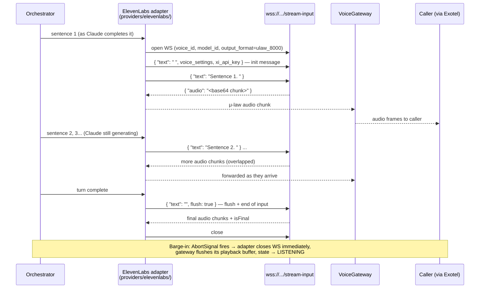

# 08 — ElevenLabs Setup

> **RecruitPilot AI — Production-Grade AI Executive Voice Assistant**
> Document 08 of 21 · Prerequisites: docs 00–07

---

## 1. Goal

Set up **ElevenLabs** — the Text-to-Speech (TTS) stage of the pipeline, the voice the recruiter actually hears:

- Create an ElevenLabs account, choose a **professional stock voice** (deliberately *not* a clone of Varun — see §2.7), and obtain the API key + voice ID.
- Understand **why time-to-first-byte, not total synthesis time, is the metric that matters** — and how our 200ms budget slice (doc 01 §3.5) is met with the `eleven_flash_v2_5` model and the WebSocket streaming-input API.
- Understand the **output format decision**: `ulaw_8000` to match Exotel's telephone-grade audio directly, with a transcode fallback if the plan tier doesn't allow it.
- Verify everything with real API calls — including synthesizing and auditioning the mandatory greeting from doc 00 — before writing any adapter code.

By the end, the last external AI vendor on the real-time plane is configured, and `ELEVENLABS_*` variables are in `.env`, verified working.

---

## 2. Theory

### 2.1 How neural TTS works (high level)

Classic TTS (the robotic voices of GPS units) stitched together pre-recorded phonemes — concatenative synthesis. It was fast but unmistakably artificial: no natural prosody (rhythm, stress, intonation), no emotional contour.

Modern **neural TTS** is generative: a deep learning model trained on thousands of hours of human speech learns the mapping from text → acoustic features → audio waveform. Roughly:

1. **Text analysis**: the input text is normalized ("₹40L" → "forty lakh rupees") and converted to phonetic + linguistic features.
2. **Acoustic model**: a neural network predicts a spectrogram — a time-frequency picture of the speech — including prosody: where to pause, which word to stress, how the pitch rises at a question.
3. **Vocoder**: a second network converts the spectrogram into an actual audio waveform, sample by sample.

The result is speech that carries intent — the difference between reading words and *saying* them. Crucially for us, prosody is predicted from **context**: the model needs to see a full clause or sentence to decide intonation. This single fact drives our entire integration design (see §2.4 and §2.5).

### 2.2 Latency anatomy: time-to-first-byte is the only number that matters

Suppose synthesizing a 6-second reply takes 900ms total. Is that fast or slow? **Wrong question.** The caller doesn't wait for the whole reply to be synthesized — audio streams. What the caller experiences is the silence before the *first* audio arrives: the **time-to-first-byte (TTFB)** of audio.

```
Text in ──▶ [ TTFB: silence the caller hears ] ──▶ first audio chunk ──▶ chunks keep flowing while playback happens
```

Once the first chunk arrives, synthesis only needs to stay *faster than real time* (generate 1 second of audio in under 1 second) and the caller never notices. Our latency budget (doc 01 §3.5) allocates **200ms to "ElevenLabs first audio chunk"** — that is a TTFB budget, and it is why model choice (§2.3) and streaming input (§2.4) are non-negotiable.

### 2.3 Model tiers: Flash vs Multilingual

ElevenLabs ships multiple model families with an explicit latency/quality tradeoff:

| Model | Character | Latency (TTFB) | Use in this project |
|---|---|---|---|
| `eleven_flash_v2_5` | Built for conversational agents; slightly less expressive | Lowest (~75ms model inference; well inside our 200ms slice with network) | **Every live call turn** — the default |
| `eleven_multilingual_v2` | Highest quality, richest prosody, 29 languages | Noticeably slower TTFB | **Optional**: pre-synthesized static phrases (greeting, fallbacks) generated once at build time, where latency is irrelevant |

The rule: **flash for anything the caller is waiting on; multilingual only for offline, one-time synthesis** where we can afford to spend seconds for maximum polish. (Model names and latency figures evolve — verify against https://elevenlabs.io/docs/models before locking in.)

### 2.4 The WebSocket streaming-INPUT API — why it exists

The REST TTS endpoint takes complete text and returns audio. But in our pipeline, the text doesn't exist yet when we want to start speaking — Claude is still generating it, token by token (doc 01 §3.4 pipelining). Waiting for Claude's full reply before calling TTS would stack the two vendors' latencies serially and blow the budget.

The **streaming-input WebSocket** solves this:

```
wss://api.elevenlabs.io/v1/text-to-speech/{voice_id}/stream-input?model_id=eleven_flash_v2_5&output_format=ulaw_8000
```

We open one WS session per assistant turn and:

- **Send text incrementally** — a sentence at a time, as Claude completes each one.
- **Receive audio incrementally** — base64-encoded chunks stream back as soon as they're synthesized.

Both directions overlap: sentence 1's audio is playing to the caller while Claude is still generating sentence 3 and sentence 2 is being synthesized. This is the pipelining trick from doc 01 §3.4, made concrete.

### 2.5 `chunk_length_schedule` — the buffering tradeoff

Remember §2.1: prosody needs context. If the model synthesized every 3 characters as they arrived, speech would sound flat and choppy. So the streaming-input API **buffers** incoming text before generating, controlled by `chunk_length_schedule` — an array like `[120, 160, 250, 290]` meaning "wait for ~120 characters before generating the first audio, ~160 before the second," and so on.

The tradeoff:

| Smaller values | Larger values |
|---|---|
| Lower TTFB (audio starts sooner) | Higher TTFB |
| Worse prosody (less context per chunk) | Better prosody (full-clause intonation) |

Two escape hatches make this manageable:

- We send **complete sentences** (not raw token drips), so each message already carries prosodic context — see doc 16 for the sentence-splitting logic in the orchestrator.
- A **flush** (§3.3) forces immediate generation of whatever is buffered, so the end of a turn is never stuck waiting for the buffer to fill.

Start with the API default; tune only if measured TTFB demands it.

### 2.6 Output formats: why `ulaw_8000`

Exotel streams telephone audio as **8kHz μ-law** (doc 00 §2.4). ElevenLabs can output many formats — mp3 at various bitrates, raw PCM at several sample rates, and **`ulaw_8000`**: μ-law-encoded 8kHz mono, the exact wire format the phone network uses.

Choosing `ulaw_8000` means audio chunks from ElevenLabs are forwarded to Exotel's WebSocket **byte-for-byte, zero transcoding** — zero CPU, zero added latency, zero code to get wrong. This is the default.

**Caveat (verify against current docs):** some output formats and low-latency options have historically been gated by plan tier (e.g., μ-law/PCM outputs requiring a paid plan). Check https://elevenlabs.io/docs/api-reference/text-to-speech and your plan's limits. **Fallback:** request `pcm_16000` and transcode PCM 16kHz → μ-law 8kHz ourselves in `features/voice/audio/` (the transcode module that doc 03 already reserves a home for). Costs a few ms of CPU per chunk — acceptable, but the direct path is better.

### 2.7 Voice settings — the four knobs

Every synthesis request accepts `voice_settings`:

| Setting | What it does | Conversational starting point |
|---|---|---|
| `stability` | Low = expressive but variable between generations; high = consistent but monotone | **~0.5** — balanced; raise if the voice "drifts" between turns |
| `similarity_boost` | How closely output adheres to the original voice's timbre; too high can amplify artifacts from the source recording | **~0.75** |
| `style` | Style exaggeration; amplifies the speaking style at a latency + stability cost | **0** — keep off for live calls (latency) |
| `use_speaker_boost` | Boosts similarity to the speaker; small latency cost | **false** for live calls; true is fine for pre-synthesized assets |

Tune in the playground (§5, step 7) with *the same model* you'll ship — voices sound different per model (§10, mistake 1).

### 2.8 Voice cloning ethics: why we deliberately do NOT clone Varun

ElevenLabs can clone a voice from minutes of audio. We could make the assistant sound exactly like Varun. **We choose not to**, deliberately:

- **Consistency with our own disclosure rule** (doc 00 §2.3): the assistant declares "You've reached Varun Gandhi's **AI Assistant**" in its first breath. Speaking in Varun's cloned voice while claiming to be an AI is a mixed signal at best, deceptive at worst. A distinct, professional stock voice *reinforces* the honesty — the recruiter's ears and the words agree.
- **Deepfake sensitivity**: voice cloning is at the center of fraud concerns in India (voice-clone scam calls are a documented, growing problem; regulators including TRAI and MeitY are actively responding) and globally (EU AI Act transparency obligations, US state robocall/impersonation laws). A recruiter who later learns "that was a clone of his real voice" loses trust permanently; one who learns "that was his AI assistant, and it said so" is impressed.
- **Policy**: ElevenLabs' own terms require verified consent for cloning. We'd pass that bar (it's Varun's voice), but passing a policy check doesn't make it the right product call.

The product stance from doc 00 stands: **transparency is the feature.** Pick a voice that sounds professional and warm, and let it be obviously *not* Varun.

---

## 3. Architecture

### 3.1 Where ElevenLabs sits

ElevenLabs is hidden behind the `VoiceProvider` port (doc 03 §4: `apps/api/src/core/ports/voice.provider.ts`), implemented by the adapter in `apps/api/src/providers/elevenlabs/`. The orchestrator and voice gateway never import the ElevenLabs SDK or touch its WebSocket protocol directly — they see only the port:

```typescript
// apps/api/src/core/ports/voice.provider.ts (illustrative)
export interface VoiceProvider {
  streamSpeech(input: {
    sentences: AsyncIterable<string>;   // sentence-chunks from the orchestrator
    signal: AbortSignal;                // barge-in cancellation (doc 01 §3.4)
  }): AsyncIterable<Uint8Array>;        // μ-law 8kHz audio chunks
}
```

Swapping ElevenLabs for Cartesia or PlayHT = one new adapter + one DI binding change (doc 00 §3.3). Zero orchestrator changes.

### 3.2 One streaming-input session per assistant turn



Protocol details the adapter owns (doc 17 implements this):

- **Init message**: the first WS message carries the API key, `voice_settings`, and optionally `chunk_length_schedule`. Convention: `"text": " "` (a single space) marks it as initialization.
- **Text messages**: each sentence sent as `{ "text": "..." }`. Trailing space after each sentence matters — it signals a word boundary to the buffer.
- **Flush / end**: `{ "text": "", "flush": true }` (or the empty-text final message per current docs) forces the buffer to synthesize immediately and signals no more input. Without it, the tail of the last sentence can sit in the buffer forever. Verify the exact final-message semantics against https://elevenlabs.io/docs/api-reference/websockets — this API has evolved.
- **Barge-in**: the orchestrator's `AbortSignal` (same one that cancels the Claude stream, doc 01 §3.4) closes the WS mid-synthesis. Closing is the cancellation — there is no "cancel" message. This also releases the concurrent-session slot (§10, mistake 5).

### 3.3 Pre-synthesized static phrases

The scripted greeting, apology/fallback phrases, and "let me check that" fillers are **not** synthesized live (doc 00 §5.1 step 3, doc 01 §11 graceful degradation). They are generated **once** via the REST endpoint (using `eleven_multilingual_v2` for maximum quality — latency is irrelevant offline) and stored as `ulaw_8000` raw audio files.

**Where do they live?** Decision: **bundled in the repo at `apps/api/assets/audio/`** (e.g., `greeting.ulaw`, `fallback-stt-down.ulaw`, `fallback-llm-down.ulaw`, `taking-message.ulaw`). Rationale:

- They are **build artifacts** of a config change (greeting text), not user data — repo + Docker image is their natural home, exactly like compiled code.
- They are tiny (a 10-second μ-law 8kHz phrase ≈ 80KB), so repo bloat is a non-issue.
- **Zero-vendor fallback rule** (doc 01 §10, mistake 5): fallback audio must be playable when *every* vendor — including Supabase Storage — is unreachable. A file on local disk inside the container is the only storage that satisfies this. Supabase Storage buckets stay reserved for call recordings and the resume (doc 04).

A small script (`apps/api/scripts/synthesize-assets.ts`, written in doc 17) regenerates them whenever the greeting text in `settings` changes; regenerating is a deliberate build step, not a runtime dependency.

---

## 4. Folder Structure

Files this document's service touches (full tree in doc 03):

```
apps/api/
├── assets/
│   └── audio/                          # pre-synthesized static phrases (§3.3)
│       ├── greeting.ulaw               # the mandatory doc-00 greeting
│       ├── fallback-stt-down.ulaw
│       ├── fallback-llm-down.ulaw
│       └── taking-message.ulaw
├── scripts/
│   └── synthesize-assets.ts            # one-shot REST synthesis of the above (doc 17)
└── src/
    ├── core/
    │   ├── ports/
    │   │   └── voice.provider.ts       # VoiceProvider port — no ElevenLabs types
    │   └── config/                     # ELEVENLABS_* validated by Zod env schema
    ├── providers/
    │   └── elevenlabs/                 # THE ONLY place ElevenLabs specifics exist
    │       ├── elevenlabs.provider.ts  # implements VoiceProvider (WS streaming-input)
    │       ├── elevenlabs.ws.ts        # session open/init/flush/close protocol
    │       └── elevenlabs.provider.test.ts
    └── features/voice/audio/           # μ-law↔PCM transcode — ONLY needed if
                                        # ulaw_8000 output is unavailable (§2.6 fallback)
```

Dependency rule check (doc 03 §3): `providers/elevenlabs/` imports from `core/ports` and `core/config` only; no feature ever imports from `providers/elevenlabs/`.

---

## 5. Manual Steps

From zero to a working key + chosen voice. Click-level:

1. **Create the account.** Go to https://elevenlabs.io → **Sign up** (top right) → sign up with Google or email (use the single project identity from doc 00 §5.3, e.g., varun@digiqc.com) → if email signup, open the verification email and click the link.
2. **Understand the tier you're on.** The free tier exists and includes a monthly credit/character quota (historically ~10,000 credits/characters per month — **check the current quota** at https://elevenlabs.io/pricing, it changes). Two things to note before relying on the free tier:
   - **Commercial use** and some features require a paid plan (Starter/Creator — see the pricing page).
   - **Conversational-latency features and the `ulaw_8000` output format may require specific plans** — verify against current docs before assuming. If gated, either upgrade (Starter is inexpensive) or use the `pcm_16000` transcode fallback (§2.6).
3. **Tour the dashboard.** After login you land at https://elevenlabs.io/app — left sidebar has Speech Synthesis (the playground), Voices, and usage information. Spend two minutes clicking around; nothing here can break anything.
4. **Pick a voice.** Sidebar → **Voices** → **Voice Library** (the community/stock catalog):
   - Filter/search for **professional, conversational** voices in English — choose male or female per preference. **Indian-English voices exist**: search "Indian" in the library to find accents that will sound natural to recruiters calling an Indian number.
   - Click a voice to hear samples. Shortlist 2–3 (you'll want a second candidate configured anyway — §11).
   - Click **Add to My Voices** (sometimes labeled "+ Add") on your chosen voice.
5. **Copy the Voice ID.** Sidebar → **My Voices** → on your voice's card, open the **three-dots (⋯) menu → Copy Voice ID** (a ~20-character string like `pNInz6obpgDQGcFmaJgB`). Alternatively, get it via the API once your key exists (§7, first command lists all voices with IDs). Store it — this becomes `ELEVENLABS_VOICE_ID`.
6. **Create the API key.** Click your **profile icon (bottom-left)** → **API Keys** → **Create API Key** → name it (e.g., `recruitpilot-dev`) → if key scoping/restriction options are offered, restrict it to Text-to-Speech only (least privilege, doc 00 §12) → **Create** → **copy it immediately** — it is shown once. Into the password manager, then into `.env`. Never into chat logs, notes apps, or committed files.
7. **Audition settings in the playground before committing.** Sidebar → **Speech Synthesis** (also called Text to Speech) → select your voice → **select `eleven_flash_v2_5` as the model** (critical — this is what live calls will use, and voices sound different per model) → paste the mandatory greeting from doc 00:

   > "Hello. You've reached Varun Gandhi's AI Assistant. Varun is currently unavailable. With your permission, I can collect information regarding this opportunity and immediately notify him."

   Generate. Then open the settings sliders and play with `stability` and `similarity_boost` around the §2.7 starting points until it sounds professional and warm. Note your final values — they go into the adapter's default `voice_settings` (doc 17).

---

## 6. Official Links

| Topic | Link |
|---|---|
| ElevenLabs home / signup | https://elevenlabs.io |
| Dashboard | https://elevenlabs.io/app |
| Pricing & plan gates (verify quotas here) | https://elevenlabs.io/pricing |
| Models overview (Flash vs Multilingual) | https://elevenlabs.io/docs/models |
| Text-to-Speech API reference | https://elevenlabs.io/docs/api-reference/text-to-speech |
| WebSocket streaming input | https://elevenlabs.io/docs/api-reference/websockets |
| Voice Library | https://elevenlabs.io/app/voice-library |
| Voice settings explained | https://elevenlabs.io/docs/speech-synthesis/voice-settings |
| Latency optimization guide | https://elevenlabs.io/docs/api-reference/reducing-latency |
| Terms / voice cloning policy | https://elevenlabs.io/terms-of-use |

---

## 7. Commands

All runnable now with just the key + voice ID in your shell environment (`export ELEVENLABS_API_KEY=...` etc., or `source .env` style loading).

**List your voices** (also the API way to find the voice ID from step 5):

```bash
curl https://api.elevenlabs.io/v1/voices -H "xi-api-key: $ELEVENLABS_API_KEY"
```

**Synthesize a test file and play it** (macOS — `open` launches the default audio player; mp3 output here because your laptop can't play raw μ-law directly):

```bash
curl -X POST "https://api.elevenlabs.io/v1/text-to-speech/$ELEVENLABS_VOICE_ID?output_format=mp3_44100_128" \
  -H "xi-api-key: $ELEVENLABS_API_KEY" \
  -H "Content-Type: application/json" \
  -d '{"text":"Hello. You have reached Varun Gandhi'"'"'s AI Assistant.","model_id":"eleven_flash_v2_5"}' \
  -o /tmp/greeting-test.mp3 && open /tmp/greeting-test.mp3
```

(That `'"'"'` in the middle is the shell-safe way to embed an apostrophe inside a single-quoted string — it closes the quote, adds a double-quoted `'`, and reopens.)

**Check subscription tier and remaining character quota:**

```bash
curl https://api.elevenlabs.io/v1/user/subscription -H "xi-api-key: $ELEVENLABS_API_KEY"
```

---

## 8. Environment Variables

Added to `.env` (git-ignored) and documented in `.env.example` (committed with placeholders) per doc 00 §8. All four are read only by the Zod env schema in `apps/api/src/core/config/` and injected into the adapter — a `process.env` reference anywhere else fails the doc 03 §12 grep check.

| Variable | Value | Used by | Notes |
|---|---|---|---|
| `ELEVENLABS_API_KEY` | from §5 step 6 | `providers/elevenlabs/` (via config) | Secret. API container env only — never web, never browser (doc 03 §12). |
| `ELEVENLABS_VOICE_ID` | from §5 step 5 | adapter — WS URL path + REST calls | Config, not code (doc 02 §11): changing the assistant's voice is an env edit + restart, zero code changes. |
| `ELEVENLABS_MODEL_ID` | `eleven_flash_v2_5` (default) | adapter — WS query param | Overridable per environment; the asset-synthesis script (§3.3) overrides to `eleven_multilingual_v2` explicitly. |
| `ELEVENLABS_OUTPUT_FORMAT` | `ulaw_8000` (default) | adapter — WS query param; gateway audio path | Set to `pcm_16000` to activate the transcode fallback (§2.6) if your plan gates μ-law output. |

```
# .env.example excerpt
ELEVENLABS_API_KEY=xi-xxxxxxxxxxxxxxxxxxxxxxxx   # elevenlabs.io → profile → API Keys
ELEVENLABS_VOICE_ID=xxxxxxxxxxxxxxxxxxxx         # My Voices → ⋯ → Copy Voice ID
ELEVENLABS_MODEL_ID=eleven_flash_v2_5            # flash = live calls; multilingual = offline assets
ELEVENLABS_OUTPUT_FORMAT=ulaw_8000               # matches Exotel; pcm_16000 = transcode fallback
```

---

## 9. Verification

You are done with this document when all four checks pass:

1. **Voices list** — the first §7 command returns JSON containing your chosen voice with its `voice_id` matching `ELEVENLABS_VOICE_ID`.
2. **Test synthesis** — `/tmp/greeting-test.mp3` plays, and the voice sounds like your playground audition (same voice, same `eleven_flash_v2_5` model — if it sounds different, you tested with a different model, see §10 mistake 1).
3. **Subscription check** — the subscription curl returns your tier and `character_count`/`character_limit`; you know your remaining monthly quota, and you've confirmed on https://elevenlabs.io/pricing whether your tier permits `ulaw_8000` output and commercial use.
4. **The mandatory greeting** (doc 00's exact text) synthesized and auditioned — you'd be comfortable with a recruiter hearing exactly this.

**Self-quiz** (from memory, per the doc 00 convention):

1. Flash vs Multilingual — what does each optimize for, and which do we use where?
2. Why `ulaw_8000` and not mp3 or PCM? What's the fallback if the plan gates it, and where does the fallback code live?
3. What does `chunk_length_schedule` trade against what, and what two design choices make its defaults safe for us?
4. Why is TTS latency measured as time-to-first-byte rather than total synthesis time?
5. Why do we deliberately *not* clone Varun's voice, given that we technically could with his consent?

---

## 10. Common Mistakes

1. **Auditioning a voice with one model, shipping another.** Voices sound noticeably different per model — a voice chosen on the playground's default (often multilingual) can sound flatter or brighter on flash. Always audition with `eleven_flash_v2_5` selected (§5 step 7).
2. **Ignoring `output_format` and transcoding needlessly.** Defaulting to mp3, then decoding mp3 → PCM → μ-law on the real-time path burns CPU and latency for nothing. Request `ulaw_8000` and forward bytes directly; only transcode if the plan forces `pcm_16000` (§2.6).
3. **Hitting the monthly character quota mid-demo.** TTS is metered per character; a few long test sessions can drain a free tier. Monitor with the subscription curl (§7), log characters per call (§11), and remember: pre-synthesized static phrases (§3.3) cost their characters exactly once, ever.
4. **Sending word-by-word instead of sentence-chunks to stream-input.** Feeding Claude's raw token drips into the WS starves the prosody model of context (§2.5) — output sounds flat and choppy. The orchestrator buffers to sentence boundaries before sending (doc 16).
5. **Not closing WS sessions.** Plans have **concurrent-session limits**; a session leaked on barge-in or error counts against it until timeout, and a few leaks means the next caller's synthesis is rejected. The AbortSignal → close path (§3.2) must be airtight, including on exceptions.
6. **Putting the key anywhere near the frontend.** There is no legitimate reason for `ELEVENLABS_API_KEY` outside the API container's environment. In web code or a `NEXT_PUBLIC_` var it ships to every browser (doc 01 §12, doc 03 §12).

---

## 11. Production Best Practices

- **Pre-synthesize all static and fallback phrases at build time** (§3.3). This is the zero-vendor fallback rule from doc 01: when ElevenLabs itself is down mid-call, the scripted apology plays from local disk — never dead air.
- **Cache common short replies keyed by text hash.** Replies like "Let me check Varun's calendar" recur across calls with identical text; a small in-memory (or Redis) cache of `sha256(text + voiceId + modelId + settings) → ulaw bytes` returns them at zero latency and zero character cost. Bounded size, LRU eviction.
- **Log characters used per call** as part of the per-call cost telemetry (doc 00 §11, doc 01 §3.8): TTS characters alongside STT minutes and LLM tokens, all keyed by `CallSid`. Cost surprises are found in dashboards, not invoices.
- **Keep a second candidate voice ID configured** (e.g., `ELEVENLABS_VOICE_ID_FALLBACK`). Voice Library voices get removed or deprecated; when your voice vanishes, recovery is an env change, not an emergency re-audition.
- **Monitor concurrency against your plan's limit.** Track open WS sessions as a gauge metric; alert when approaching the tier's concurrent-request cap — that's the signal to upgrade *before* callers hear failures.
- **Honesty about drift:** quotas, plan gates, message formats, and model names change at ElevenLabs' pace, not ours. Before implementation (doc 17) and before production (doc 15), re-verify against https://elevenlabs.io/pricing and https://elevenlabs.io/docs — treat this document's specifics as "true as of writing, verify before relying."

---

## 12. Security

- **Key placement**: `ELEVENLABS_API_KEY` lives only in the API container's environment (doc 03 §12) — read by `core/config`, injected into `providers/elevenlabs/`, redacted from Pino logs (doc 09). Never in `apps/web`, never in `packages/shared`, never in event payloads.
- **Rotate on leak, immediately** (doc 00 §12): profile → API Keys → delete the compromised key, create a new one, update `.env` and GitHub Secrets. Scoped/restricted keys (if your plan offers them) shrink the blast radius to TTS only.
- **Voice cloning consent rules**: ElevenLabs' terms require verified consent to clone a voice. Our stance goes further — we don't clone at all (§2.7), so there is no consent artifact to manage and no impersonation risk to audit. If this ever changes, it changes through a deliberate ethics review, not a config tweak.
- **Synthesized-audio provenance awareness**: every word the recruiter hears from this system is synthetic, and the greeting says so. Keep it that way — the disclosure greeting is enforced in code (doc 00 §2.3), and call recordings stored in Supabase (doc 04) preserve exactly what was said, forming an audit trail if anyone ever disputes what "the AI" claimed.
- **Untrusted text in, audio out**: the text we synthesize includes LLM output influenced by untrusted caller speech (doc 01 §12 trust boundaries). Prompt-injection defenses live in the orchestrator — but be aware the TTS stage will faithfully speak whatever it's given, which is one more reason the orchestrator, not ElevenLabs, is where output control belongs.

---

## 13. Checklist

- [ ] ElevenLabs account created with the project email; email verified
- [ ] Current pricing/quota page reviewed; plan tier confirmed adequate (commercial use, `ulaw_8000`, concurrency)
- [ ] Professional stock voice chosen from Voice Library (Indian-English considered), added to My Voices
- [ ] Voice audited in playground **with `eleven_flash_v2_5`** and doc-00 greeting text
- [ ] Voice ID copied → `ELEVENLABS_VOICE_ID`
- [ ] API key created (scoped if available), stored in password manager → `ELEVENLABS_API_KEY`
- [ ] All four `ELEVENLABS_*` vars in `.env` and documented in `.env.example`
- [ ] `curl /v1/voices` returns the chosen voice
- [ ] Test mp3 synthesized and auditioned; `/v1/user/subscription` shows quota
- [ ] Decision understood: flash live / multilingual offline; `ulaw_8000` with `pcm_16000` fallback
- [ ] Static assets plan understood: repo `apps/api/assets/audio/`, synthesized once, zero-vendor fallback
- [ ] Ethics stance internalized: distinct stock voice, no cloning, disclosure-first
- [ ] Self-quiz (§9) passed

---

## 14. Next Step

Proceed to **`09_FASTIFY_SETUP.md`** — with every external AI vendor now configured (Deepgram, Claude, ElevenLabs) plus Supabase and Exotel, it's time to scaffold the backend that connects them: the Fastify application, TypeScript + workspace wiring, the Zod-validated config loader that consumes all the env vars collected in docs 04–08, structured logging with Pino, and the plugin architecture the voice gateway and REST routes will hang from.
