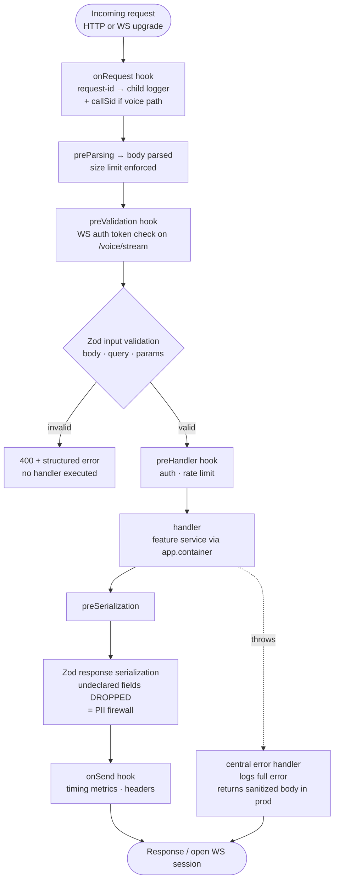

# 09 — Fastify Setup

> **RecruitPilot AI — Production-Grade AI Executive Voice Assistant**
> Document 09 of 21 · Prerequisites: docs 00–08

---

## 1. Goal

Turn the paper architecture of docs 00–03 into a **running Fastify backend** — the container that will host the voice gateway, the REST API, and the agent orchestrator:

- Scaffold the **monorepo for real** (docs 03 §7 previewed it; today you execute it): npm workspaces, `@recruitpilot/api`, `@recruitpilot/web`, `@recruitpilot/shared`.
- Understand Fastify's **plugin + encapsulation model** deeply enough to know *why* it maps one-to-one onto the feature folders of doc 03.
- Build the boot skeleton: **env validation that fails fast** (doc 02), **Pino structured logging with PII redaction** (doc 02 §12), **Zod-validated routes**, **auto-generated Swagger docs**, and **graceful shutdown** (doc 01 §11).
- End with a verified `GET /health` returning 200, Swagger UI rendering at `/docs`, and a boot that *refuses to start* when configuration is broken.

By the end, `npm run dev -w apps/api` gives you a server that is small but shaped exactly like production — every later doc (voice gateway 17, agent 16, REST API 12) plugs into what you build today.

---

## 2. Theory

### 2.1 Why Fastify (30-second recap of doc 02)

We rejected Express (no first-class async, no schema validation, slower JSON serialization) and NestJS (decorator-heavy DI framework — powerful, but a second framework to learn on top of the domain, and its magic hides the request lifecycle we need to reason about for latency). Fastify gives us raw speed, native WebSocket support via `@fastify/websocket`, schema-first validation, and Pino built in — with almost no abstraction between us and Node's HTTP layer.

### 2.2 Everything is a plugin

Fastify has exactly one composition primitive: the **plugin**. A route file is a plugin. The CORS middleware is a plugin. Your entire application is a tree of plugins registered on one root instance:

```typescript
await app.register(somePlugin, options);
```

A plugin is just an async function receiving a Fastify instance. This uniformity matters: there is no separate concept for "middleware" vs "router" vs "module" — you learn one mental model and it composes all the way up.

### 2.3 Encapsulation contexts (the killer feature)

When you `register()` a plugin, Fastify creates a **child context**. The child *inherits* everything from its parent (decorators, hooks, other plugins) — but anything the child adds stays **invisible to its parent and siblings**.

```
root (logger, config, cors — everyone inherits these)
├── features/voice     ← registers @fastify/websocket + a WS auth hook; ONLY voice sees them
├── features/calls     ← registers an auth preHandler; ONLY calls routes get auth-checked
└── features/settings  ← its hooks/decorators never leak into voice or calls
```

This is why Fastify maps perfectly onto doc 03's vertical feature slices: **each `features/*` folder is one encapsulated plugin**. A hook added for `calls` routes cannot accidentally run on the latency-critical voice WebSocket path. Encapsulation makes the "two planes" rule (doc 01 §2.3) enforceable in the framework, not just in review.

One escape hatch exists — wrapping a plugin in `fastify-plugin` (`fp()`) *breaks out* of encapsulation and attaches things to the parent. You use it deliberately for cross-cutting concerns (config, DI container, logger decorations) that *should* be visible everywhere. Rule of thumb: infrastructure plugins use `fp()`; feature plugins never do.

### 2.4 Decorators

`app.decorate("config", cfg)` attaches a value to the Fastify instance; `app.decorateRequest(...)` attaches per-request values. Decorators are how plugins publish capabilities downward: the config plugin decorates `app.config`, the DI plugin decorates `app.container`, and every feature plugin reads them with full TypeScript types (via declaration merging). Decorators respect encapsulation — decorate inside a child context and only that subtree sees it.

### 2.5 The hooks lifecycle

Every request flows through a fixed pipeline of hook points:

```
onRequest → preParsing → preValidation → [validate] → preHandler → handler → preSerialization → [serialize] → onSend → onResponse
```

The five you will actually use:

| Hook | Runs | We use it for |
|---|---|---|
| `onRequest` | before body parsing | request-id + `callSid` correlation into a child logger (doc 01 §3.8) |
| `preValidation` | before schema validation | WS auth token check on the Exotel path (doc 05) |
| `preHandler` | after validation, before handler | dashboard auth, rate-limit decisions |
| `onSend` | after serialization, before write | security headers, response timing metrics |
| `onClose` | server shutdown | graceful drain: close WS sessions, disconnect Redis/Prisma |

### 2.6 Schema-based validation AND serialization

Fastify compiles JSON Schemas per route, for both directions:

- **Input validation** (`body`, `querystring`, `params`): malformed requests are rejected with a 400 *before* your handler runs — your handler code never sees garbage.
- **Response serialization** (`response: { 200: schema }`): Fastify compiles the schema into a specialized serializer that is **2–3× faster than `JSON.stringify`** *and* — far more importantly for us — **only fields declared in the schema are ever emitted**. If a service accidentally returns a recruiter object containing a raw phone number or an internal cost field, the serializer silently drops anything undeclared. Response schemas are simultaneously a performance feature and a **PII leak firewall** (doc 00 §12). This is why doc 10's dashboard can trust API responses to have a fixed shape.

### 2.7 The Zod type provider

Writing raw JSON Schema by hand duplicates what we already have — Zod schemas in `packages/shared` (doc 03). `fastify-type-provider-zod` closes the loop: you attach Zod schemas to routes and get **three things from one definition**:

1. **Runtime validation/serialization** (Zod compiled into the Fastify pipeline).
2. **Static types** — `request.body` is fully typed with zero casts.
3. **OpenAPI generation** — `@fastify/swagger` reads the same schemas, so the docs at `/docs` can never drift from reality (doc 12 builds on this).

One schema, three guarantees. This is the "single source of shape truth" rule from doc 03 §1, extended to the HTTP boundary.

### 2.8 Pino: logs as structured events

Fastify's built-in logger *is* Pino — the fastest Node JSON logger. Two disciplines from day one:

- **Structured, not sprintf**: `log.info({ callSid, durationMs }, "call ended")` — machine-queryable in CloudWatch (doc 15), not string soup.
- **Request-scoped child loggers**: every request gets `request.log`, already carrying the request-id; we add `callSid` at WebSocket accept. `console.log` has neither — using it orphans the line from its call (doc 01 §3.8).

Pino also provides **redaction**: declared paths (`req.headers.authorization`, `*.phone`, `*.transcript`) are replaced with `[REDACTED]` before the line is written. This is a PII control (doc 02 §12), not cosmetics — transcripts and phone numbers are personal data (doc 00 §12) and must never sit in plaintext logs.

### 2.9 `@fastify/websocket` for the voice gateway

The voice gateway (doc 17) is a WebSocket route. `@fastify/websocket` upgrades HTTP connections in-process on the same port — no separate WS server, and the WS route participates in Fastify's routing, hooks (auth in `preValidation` *before* upgrade), and logging like any other route. This is why we chose Fastify's native WS support over a standalone `ws` server bolted alongside.

### 2.10 Dependency injection: a composition root, not a framework

Docs 01/03 mandate that features depend on **ports**, with adapters bound at boot. NestJS solves this with decorators and reflection; we rejected that (doc 02) — the magic obscures boot order and adds a compile-time dependency on experimental metadata. Instead we use the simplest thing that works: **manual constructor injection with a composition root**.

A **composition root** is the *single place* in the app where concrete classes are instantiated and wired together — for us, `core/di/container.ts`. Everywhere else, code receives its dependencies as constructor parameters and only knows interfaces:

```typescript
// core/di/container.ts — the ONLY file that knows which adapter is real
const llm: LLMProvider = new ClaudeLLMProvider(config.anthropic);
const speech: SpeechProvider = new DeepgramSpeechProvider(config.deepgram);
const orchestrator = new AgentOrchestrator({ llm, speech, voice, memory });
```

Swap Claude for GPT: one line changes, here, and nowhere else (doc 03 §2.2). Tests construct services with fakes — no container mocking, no framework. The container is exposed to routes via a decorator (`app.container`), installed with `fp()` so every feature context inherits it.

---

## 3. Architecture

### 3.1 Request lifecycle through plugins and hooks



### 3.2 How `app.ts` composes the application

`app.ts` is a factory (`buildApp()`) that registers plugins in strict order — order matters because later plugins read decorations from earlier ones:

| # | Plugin | Why this position |
|---|---|---|
| 1 | env config (`core/config`, wrapped in `fp()`) | Zod-validates `process.env`; everything downstream reads `app.config`. Fails fast — nothing else loads if config is broken. |
| 2 | logger options (passed at `Fastify({ logger })` construction) | Pino level + redaction must exist before the first log line. |
| 3 | DI container (`core/di`, `fp()`) | Instantiates adapters using validated config; decorates `app.container`. |
| 4 | `@fastify/sensible` | Standard HTTP errors (`app.httpErrors.notFound()`) + utilities. |
| 5 | `@fastify/cors` | Locked to the dashboard origin (from config, not `*`). |
| 6 | `@fastify/swagger` + `@fastify/swagger-ui` | Must register *before* routes so it captures their schemas. |
| 7 | `@fastify/websocket` | WS upgrade support for the voice gateway. |
| 8 | feature routes (`features/*`) | Each an encapsulated plugin: `voice`, `calls`, `recruiters`, `opportunities`, `notifications`, `settings`, plus `/health` + `/ready`. |

### 3.3 Two entrypoints, one wiring

Per doc 01 §3.2, API and worker are **separate processes from the same image**:

- `server.ts` → `buildApp()` → `app.listen()` — real-time plane (HTTP + WS).
- `worker.ts` → same config + DI container, **no HTTP listener** — boots BullMQ consumers (doc 13) on the async plane.

Both share `core/config`, `core/di`, and `infra/logger`; neither duplicates wiring. A version can never drift between them because there is nothing to drift.

### 3.4 Graceful shutdown (doc 01 §11 made concrete)

On SIGTERM/SIGINT: stop accepting new connections → let in-flight requests and active calls finish (bounded wait) → run `onClose` hooks (close WS sessions politely, disconnect Prisma/Redis) → exit 0. Without this, every deploy drops any call in progress — unacceptable for a phone product. `server.ts` (§5.6) implements it; doc 13's Docker `stop_grace_period` and doc 15's deploy flow depend on it.

---

## 4. Folder Structure

Today's work creates the skeleton of the canonical tree (doc 03 §4). Files marked ✚ are written in this doc; folders marked ○ are created empty, filled by later docs:

```
RecruitPilot_AI/
├── apps/
│   ├── api/
│   │   ├── src/
│   │   │   ├── core/
│   │   │   │   ├── domain/          ○ (doc 11)
│   │   │   │   ├── ports/           ○ (docs 05–08, 16)
│   │   │   │   ├── errors/          ○ (doc 12)
│   │   │   │   ├── config/          ✚ env.ts — Zod schema + fail-fast loader
│   │   │   │   └── di/              ✚ container.ts — composition root (grows per doc)
│   │   │   ├── features/
│   │   │   │   └── health/          ✚ health.routes.ts — /health + /ready
│   │   │   ├── providers/           ○ (docs 04–08)
│   │   │   ├── infra/
│   │   │   │   └── logger/          ✚ logger.ts — Pino options + redaction
│   │   │   ├── jobs/                ○ (doc 13)
│   │   │   ├── app.ts               ✚ buildApp(): plugin composition
│   │   │   ├── server.ts            ✚ API entrypoint + graceful shutdown
│   │   │   └── worker.ts            ✚ stub (real consumers in doc 13)
│   │   ├── package.json             ✚ @recruitpilot/api
│   │   ├── tsconfig.json            ✚ strict
│   │   └── vitest.config.ts         ✚
│   └── web/                         ○ scaffolded in doc 10
│       └── package.json             ✚ @recruitpilot/web (placeholder)
├── packages/
│   └── shared/
│       ├── src/{events,schemas,constants}/  ○ filled from doc 11 on
│       └── package.json             ✚ @recruitpilot/shared
├── prisma/                          ○ (doc 11)
├── docker/nginx/                    ○ (doc 13)
├── .github/workflows/               ○ (doc 14)
├── package.json                     ✚ root: workspaces + scripts
├── .nvmrc                           ✚ 22
├── .gitignore                       ✚ FIRST — before any .env exists (doc 00 rule)
└── .env.example                     ✚ every var, placeholder + comment
```

---

## 5. Manual Steps

Work from the repo root. Every path matches doc 03 exactly.

### 5.1 `.gitignore` FIRST, then the tree

The doc 00 rule: the ignore file exists **before** the first `.env` can. Create `.gitignore` at the root:

```gitignore
node_modules/
dist/
.next/
.env
.env.*
!.env.example
*.log
coverage/
```

Then the directory skeleton (identical to doc 03 §7's preview, now for real):

```bash
mkdir -p apps/api/src/{core/{domain,ports,errors,config,di},features/health,providers,infra/logger,jobs}
mkdir -p apps/web packages/shared/src/{events,schemas,constants} prisma docker/nginx .github/workflows
```

### 5.2 Root workspace wiring

Create `.nvmrc` containing exactly:

```
22
```

Run `npm init -y` at the root, then edit the root `package.json` to:

```json
{
  "name": "recruitpilot-ai",
  "private": true,
  "workspaces": ["apps/*", "packages/*"],
  "engines": { "node": ">=22" },
  "scripts": {
    "dev": "npm run dev -w apps/api",
    "test": "npm run test --workspaces --if-present",
    "typecheck": "npm run typecheck --workspaces --if-present"
  }
}
```

`"private": true` prevents accidental `npm publish`; `engines` + `.nvmrc` pin Node 22 for humans, CI, and Docker alike (doc 02 §11).

### 5.3 Per-workspace `package.json`

```bash
cd apps/api && npm init -y && cd ../..
cd apps/web && npm init -y && cd ../..
cd packages/shared && npm init -y && cd ../..
```

Edit each `name` to `@recruitpilot/api`, `@recruitpilot/web`, `@recruitpilot/shared`, and set `"private": true` in all three. In `apps/api/package.json` add:

```json
{
  "name": "@recruitpilot/api",
  "private": true,
  "type": "module",
  "scripts": {
    "dev": "tsx watch src/server.ts",
    "start": "node dist/server.js",
    "build": "tsc -p tsconfig.json",
    "test": "vitest run",
    "typecheck": "tsc --noEmit"
  }
}
```

### 5.4 Install dependencies (workspace-targeted)

```bash
npm i fastify @fastify/websocket @fastify/cors @fastify/sensible @fastify/swagger @fastify/swagger-ui fastify-type-provider-zod zod pino pino-pretty -w apps/api
npm i -D typescript tsx vitest @types/node -w apps/api
npm i zod -w packages/shared
```

`-w apps/api` records the dependency in that workspace's `package.json` while npm hoists the actual install to root `node_modules` — one install tree, three packages (doc 03 §2.4).

### 5.5 `apps/api/tsconfig.json` — strict or it didn't happen

```json
{
  "compilerOptions": {
    "target": "ES2022",
    "module": "NodeNext",
    "moduleResolution": "NodeNext",
    "lib": ["ES2022"],
    "strict": true,
    "noUncheckedIndexedAccess": true,
    "exactOptionalPropertyTypes": true,
    "noImplicitOverride": true,
    "verbatimModuleSyntax": true,
    "skipLibCheck": true,
    "outDir": "dist",
    "rootDir": "src",
    "sourceMap": true
  },
  "include": ["src"]
}
```

`strict: true` is non-negotiable — a voice pipeline juggling five vendor payload shapes without strict null checks is a runtime-crash factory. `noUncheckedIndexedAccess` catches the classic `array[0]` on an empty transcript chunk.

### 5.6 The core source files (illustrative — short but real)

**`apps/api/src/core/config/env.ts`** — fail-fast at boot (doc 02):

```typescript
import { z } from "zod";

const EnvSchema = z.object({
  NODE_ENV: z.enum(["development", "test", "production"]).default("development"),
  PORT: z.coerce.number().default(3000),
  HOST: z.string().default("0.0.0.0"),
  LOG_LEVEL: z.enum(["debug", "info", "warn", "error"]).default("info"),
  // Vendor vars from docs 04–08 join this schema as their docs are completed,
  // e.g.: DATABASE_URL: z.string().url(), ANTHROPIC_API_KEY: z.string().min(1), ...
});

export type AppConfig = z.infer<typeof EnvSchema>;

export function loadConfig(): AppConfig {
  const parsed = EnvSchema.safeParse(process.env);
  if (!parsed.success) {
    // Print WHICH vars are wrong, then refuse to boot. Never limp along half-configured.
    console.error("❌ Invalid environment:", parsed.error.flatten().fieldErrors);
    process.exit(1);
  }
  return parsed.data;
}
```

**`apps/api/src/infra/logger/logger.ts`** — Pino with PII redaction (doc 02 §12):

```typescript
import type { LoggerOptions } from "pino";

export function loggerOptions(level: string, isDev: boolean): LoggerOptions {
  return {
    level,
    redact: {
      paths: [
        "req.headers.authorization",
        "*.phone", "*.phoneNumber", "*.callerNumber",
        "*.transcript", "*.transcriptText",
        "*.apiKey", "*.token",
      ],
      censor: "[REDACTED]",
    },
    transport: isDev ? { target: "pino-pretty" } : undefined, // prod: raw JSON to stdout
  };
}
```

**`apps/api/src/features/health/health.routes.ts`** — first feature plugin, Zod-schema'd:

```typescript
import type { FastifyInstance } from "fastify";
import { z } from "zod";

const HealthResponse = z.object({
  status: z.literal("ok"),
  uptimeSeconds: z.number(),
});

export async function healthRoutes(app: FastifyInstance) {
  app.get("/health", {
    schema: { response: { 200: HealthResponse } }, // serialization schema = shape guarantee
  }, async () => ({ status: "ok" as const, uptimeSeconds: process.uptime() }));

  app.get("/ready", async (_req, reply) => {
    // doc 11/13 add real checks: Prisma ping, Redis ping. For now: alive = ready.
    return reply.code(200).send({ ready: true });
  });
}
```

**`apps/api/src/app.ts`** — plugin composition:

```typescript
import Fastify from "fastify";
import cors from "@fastify/cors";
import sensible from "@fastify/sensible";
import swagger from "@fastify/swagger";
import swaggerUi from "@fastify/swagger-ui";
import websocket from "@fastify/websocket";
import { serializerCompiler, validatorCompiler, jsonSchemaTransform,
         type ZodTypeProvider } from "fastify-type-provider-zod";
import { loadConfig } from "./core/config/env.js";
import { loggerOptions } from "./infra/logger/logger.js";
import { healthRoutes } from "./features/health/health.routes.js";

export async function buildApp() {
  const config = loadConfig();                       // 1. config FIRST — fail fast
  const isDev = config.NODE_ENV === "development";

  const app = Fastify({
    logger: loggerOptions(config.LOG_LEVEL, isDev),  // 2. Pino + redaction
    trustProxy: true,                                // behind Nginx (doc 15)
    bodyLimit: 1_048_576,                            // 1 MiB — nobody POSTs more than that here
  }).withTypeProvider<ZodTypeProvider>();

  app.setValidatorCompiler(validatorCompiler);       // Zod → validation
  app.setSerializerCompiler(serializerCompiler);     // Zod → serialization
  app.decorate("config", config);

  await app.register(sensible);                      // 4. httpErrors helpers
  await app.register(cors, { origin: [/* dashboard origin from config, doc 10 */] });
  await app.register(swagger, {                      // 6. before routes!
    openapi: { info: { title: "RecruitPilot API", version: "0.1.0" } },
    transform: jsonSchemaTransform,
  });
  await app.register(swaggerUi, { routePrefix: "/docs" });
  await app.register(websocket);                     // 7. voice gateway plugs in (doc 17)

  await app.register(healthRoutes);                  // 8. feature plugins (encapsulated)
  return app;
}
```

**`apps/api/src/server.ts`** — entrypoint with graceful shutdown (doc 01 §11):

```typescript
import { buildApp } from "./app.js";

const app = await buildApp();

const shutdown = async (signal: string) => {
  app.log.info({ signal }, "shutdown: draining");
  // app.close() stops accepting connections, waits for in-flight requests,
  // then runs onClose hooks (WS sessions, Prisma, Redis — added in docs 11/13/17).
  await app.close();
  process.exit(0);
};
process.on("SIGTERM", () => void shutdown("SIGTERM"));
process.on("SIGINT", () => void shutdown("SIGINT"));

await app.listen({ port: app.config.PORT, host: app.config.HOST });
```

**`apps/api/src/worker.ts`** — stub for now (real consumers in doc 13):

```typescript
import { loadConfig } from "./core/config/env.js";
const config = loadConfig();       // same fail-fast config, no HTTP listener
console.log(`worker booted (${config.NODE_ENV}) — BullMQ consumers arrive in doc 13`);
```

### 5.7 `.env.example` and your local `.env`

Create `.env.example` at the root (committed) and copy it to `.env` (git-ignored — verify with `git status` that it does NOT appear):

```bash
# --- runtime (doc 09) ---
NODE_ENV=development
PORT=3000
HOST=0.0.0.0
LOG_LEVEL=info
# --- vendor vars appended here as docs 04–08 keys are wired into core/config ---
```

### 5.8 Smoke test

Create `apps/api/src/app.test.ts`:

```typescript
import { describe, it, expect } from "vitest";
import { buildApp } from "./app.js";

describe("app", () => {
  it("GET /health returns ok", async () => {
    const app = await buildApp();
    const res = await app.inject({ method: "GET", url: "/health" }); // no real socket needed
    expect(res.statusCode).toBe(200);
    expect(res.json().status).toBe("ok");
    await app.close();
  });
});
```

`app.inject()` is Fastify's built-in fake-request tester — full pipeline (hooks, validation, serialization) with no network. This is why `buildApp()` is a factory separate from `listen()`.

---

## 6. Official Links

| Topic | Link |
|---|---|
| Fastify docs | https://fastify.dev/docs/latest/ |
| Plugin encapsulation guide | https://fastify.dev/docs/latest/Reference/Encapsulation/ |
| Hooks reference | https://fastify.dev/docs/latest/Reference/Hooks/ |
| Validation & serialization | https://fastify.dev/docs/latest/Reference/Validation-and-Serialization/ |
| fastify-type-provider-zod | https://github.com/turkerdev/fastify-type-provider-zod |
| @fastify/websocket | https://github.com/fastify/fastify-websocket |
| @fastify/swagger | https://github.com/fastify/fastify-swagger |
| Pino redaction | https://getpino.io/#/docs/redaction |
| npm workspaces | https://docs.npmjs.com/cli/v10/using-npm/workspaces |
| tsx (TS runner) | https://tsx.is |
| Vitest | https://vitest.dev |

---

## 7. Commands

The full sequence from empty repo to verified server:

```bash
# 0. Node version (matches .nvmrc)
nvm use 22 || nvm install 22

# 1. gitignore FIRST, then tree (§5.1)
mkdir -p apps/api/src/{core/{domain,ports,errors,config,di},features/health,providers,infra/logger,jobs}
mkdir -p apps/web packages/shared/src/{events,schemas,constants} prisma docker/nginx .github/workflows

# 2. root + workspaces (§5.2–5.3), then install
npm i fastify @fastify/websocket @fastify/cors @fastify/sensible @fastify/swagger @fastify/swagger-ui fastify-type-provider-zod zod pino pino-pretty -w apps/api
npm i -D typescript tsx vitest @types/node -w apps/api
npm i zod -w packages/shared

# 3. write the source files from §5.5–5.7, then:
cp .env.example .env

# 4. run it
npm run dev -w apps/api

# 5. verify (second terminal)
curl -s localhost:3000/health          # {"status":"ok","uptimeSeconds":...}
curl -s localhost:3000/ready           # {"ready":true}
open http://localhost:3000/docs        # Swagger UI

# 6. tests + types
npm run test -w apps/api               # vitest smoke test green
npm run typecheck -w apps/api          # zero errors
```

---

## 8. Environment Variables

Introduced by this document (runtime config for `apps/api`):

| Variable | Default | Purpose |
|---|---|---|
| `NODE_ENV` | `development` | `development` \| `test` \| `production`; switches pretty vs JSON logs, error verbosity |
| `PORT` | `3000` | Fastify listen port (Nginx proxies to it in prod, doc 15) |
| `HOST` | `0.0.0.0` | Bind address — **must** be `0.0.0.0` inside Docker or the container is unreachable (doc 13) |
| `LOG_LEVEL` | `info` | Pino level; `debug` locally when chasing issues |

**The bigger picture:** `core/config/env.ts` is the **single aggregation point** for every variable in the system. As you complete each vendor doc, its keys join the same Zod schema so *one* boot-time check covers everything:

| Group | Variables | Source doc |
|---|---|---|
| Supabase | `SUPABASE_URL`, `SUPABASE_SERVICE_ROLE_KEY`, `DATABASE_URL`, `DIRECT_URL` | 04 (+11) |
| Exotel | `EXOTEL_ACCOUNT_SID`, `EXOTEL_API_KEY`, `EXOTEL_API_TOKEN`, `EXOTEL_SUBDOMAIN`, `EXOTEL_VIRTUAL_NUMBER`, `VOICE_WS_AUTH_TOKEN` | 05 |
| Deepgram | `DEEPGRAM_API_KEY`, `DEEPGRAM_MODEL` | 06 |
| Anthropic | `ANTHROPIC_API_KEY`, `ANTHROPIC_MODEL_REALTIME`, `ANTHROPIC_MODEL_SUMMARY` | 07 |
| ElevenLabs | `ELEVENLABS_API_KEY`, `ELEVENLABS_VOICE_ID` | 08 |
| Redis | `REDIS_URL` | 13 |

A missing key from *any* group kills the boot with a named error — you find out at deploy time, not mid-call.

---

## 9. Verification

You are done with this document when all of these pass:

1. **Health endpoint**: `curl -s localhost:3000/health` returns HTTP 200 with `{"status":"ok","uptimeSeconds":...}`.
2. **Swagger UI renders** at http://localhost:3000/docs and lists `/health` with its response schema — generated from the Zod schema, written by nobody.
3. **Fail-fast works — test it by breaking it**: set `PORT=notanumber` in `.env` (or delete a required var once vendor keys exist) and start the server. It must print the offending field and exit non-zero. This failure *is the feature*: a misconfigured server that refuses to boot beats one that boots and drops calls.
4. **Logs are structured + redacted**: with `NODE_ENV=production node` (or pino-pretty disabled) each line is one JSON object; log a test object containing a `phone` field and confirm `[REDACTED]` appears in output.
5. **Smoke test green**: `npm run test -w apps/api` passes; `npm run typecheck -w apps/api` reports zero errors.
6. **Graceful shutdown**: with the dev server running, `kill -TERM <pid>` — you see the `shutdown: draining` log line and a clean exit, not a killed process.

Self-quiz (no notes):

1. What does plugin encapsulation guarantee, and why does it map onto doc 03's feature folders?
2. Why do we declare **response** schemas, not just input schemas? (Two answers: speed, and field-leak firewall.)
3. What is a composition root, and which file is ours?
4. Why manual constructor injection instead of NestJS-style decorator DI? (Doc 02's rejection: second framework, hidden boot order, reflection magic.)
5. Which plugin must register first, and what breaks if a route plugin loads before it?

---

## 10. Common Mistakes

1. **Registering routes before the config plugin loads.** The route reads `app.config.SOMETHING` → `undefined` → a cryptic crash three files away. Plugin order in `app.ts` is a contract: config → logger → DI → everything else.
2. **Async plugin registered without `await` (or missing `fastify-plugin` where needed).** Forgetting `await app.register(...)` lets later plugins run before earlier ones finish; conversely, wrapping a *feature* plugin in `fp()` leaks its hooks to every sibling — auth meant for `calls` suddenly runs on the voice WS path and adds latency. Know which side of encapsulation each plugin belongs on.
3. **`console.log` instead of `request.log`.** The line carries no request-id and no `callSid`; when a call misbehaves at 2 a.m. you cannot correlate it with anything (doc 01 §3.8). Grep for `console.log` in `src/` should return zero — add it to CI later (doc 14).
4. **Validating input but not response serialization.** Handlers returning raw service objects leak internal fields (cost data, phone numbers, Prisma metadata) to the dashboard and beyond. Every route gets a `response` schema — the serializer drops anything undeclared.
5. **Binding to `localhost`/`127.0.0.1` inside Docker.** The port mapping exists, but the process only listens on the container's loopback — connection refused from outside, always at the worst moment (doc 13). `HOST=0.0.0.0` is the default in our schema for exactly this reason.
6. **Skipping graceful shutdown.** Every deploy then hard-kills in-flight calls: mid-sentence dead air for the recruiter, half-written jobs in the queue. `app.close()` + SIGTERM handler is 10 lines; write them on day one, not after the first angry redeploy.

---

## 11. Production Best Practices

- **Correlation into child loggers**: `onRequest` assigns a request-id (Fastify does this natively); the voice gateway (doc 17) additionally creates `request.log.child({ callSid })` at WS accept, so *every* subsequent log line in the session carries the call's identity (doc 01 §3.8).
- **`/health` vs `/ready` are different questions**: `/health` = "is the process alive?" (Docker healthcheck restarts on failure, doc 13); `/ready` = "can it serve? DB + Redis reachable?" (deploy verification gates on it, doc 15). Conflating them makes Docker restart a healthy process during a transient DB blip.
- **`trustProxy: true`** — behind Nginx (doc 15) Fastify must read `X-Forwarded-For`/`X-Forwarded-Proto` or every request appears to come from `127.0.0.1`, which breaks rate limiting and logging. Set only because we control the proxy in front.
- **Keep-alive tuning**: Node's default `keepAliveTimeout` (5s) is *shorter* than Nginx's default upstream keep-alive (75s) — the classic cause of sporadic 502s. In doc 15 we set Fastify's `keepAliveTimeout` above Nginx's; noted here so the setting doesn't look arbitrary later.
- **Schema-derived OpenAPI stays current by construction**: because `/docs` is generated from the same Zod schemas that validate traffic, documentation drift is impossible — doc 12 builds the full REST API on this guarantee.
- **`buildApp()` as a factory**: separating construction from `listen()` gives free integration testing (`app.inject()`), a shared wiring point for `server.ts`/`worker.ts`, and clean per-test instances.

---

## 12. Security

Boot-layer security posture (deep dive: `18_SECURITY.md`):

- **`@fastify/helmet`** — one plugin adds the standard security headers (CSP, `X-Content-Type-Options`, etc.). Registered with the other infrastructure plugins in doc 12 when the REST surface grows; noted now so the slot in `app.ts` is reserved.
- **CORS locked to the dashboard origin** — never `origin: true`/`*` on an API holding call transcripts. The allowed origin comes from config, so dev (`localhost:3001`) and prod (dashboard domain) differ without code changes.
- **Rate limiting on public REST, not on the Exotel WS path**: `@fastify/rate-limit` protects the dashboard-facing endpoints from abuse. The `/voice/stream` path is deliberately excluded — its protection is the `VOICE_WS_AUTH_TOKEN` verified in `preValidation` plus Exotel's IP allowlist (doc 05); rate-limiting legitimate telephony traffic would drop real calls under normal load.
- **Body size limits** (`bodyLimit: 1 MiB` in §5.6) — nothing in this API accepts large uploads; capping the parser is free DoS insurance.
- **Pino redaction is a PII control, not a nicety**: phone numbers, transcripts, and auth headers never reach disk or CloudWatch in plaintext (docs 00 §12, 02 §12). Redaction paths are reviewed whenever a new loggable object shape is introduced.
- **Error handler never leaks internals in production**: a central `setErrorHandler` logs the full error (stack, context) server-side, but the response body in production is `{ error: { code, message } }` — no stack traces, no file paths, no query fragments. Stack traces in HTTP responses are reconnaissance gifts. (Full error taxonomy in doc 12.)

---

## 13. Checklist

- [ ] `.gitignore` created before any `.env` existed; `git status` shows `.env` untracked
- [ ] Monorepo scaffolded exactly per doc 03 tree; root `workspaces: ["apps/*","packages/*"]`
- [ ] `.nvmrc` = `22`; `engines` field set; all three packages named `@recruitpilot/*`
- [ ] Dependencies installed with `-w apps/api`; `tsconfig.json` has `strict: true`
- [ ] `core/config/env.ts` Zod schema in place; boot fails loudly on bad config (tested by breaking it)
- [ ] Pino redaction configured and verified (`[REDACTED]` observed)
- [ ] `app.ts` plugin order understood: config → logger → DI → sensible → cors → swagger → websocket → features
- [ ] `curl localhost:3000/health` → 200; Swagger UI renders at `/docs`
- [ ] Vitest smoke test and typecheck green
- [ ] SIGTERM produces a drain log and clean exit
- [ ] Self-quiz (§9) passed: encapsulation, response schemas, composition root, manual DI rationale

---

## 14. Next Step

Proceed to **`10_NEXTJS_SETUP.md`** — scaffold `apps/web` for real: Next.js App Router in the workspace, Supabase Auth wiring for Varun's login, the typed fetch wrapper to this Fastify API, Tailwind + the dashboard shell — and the CORS origin you left as a config value today gets its real address.
