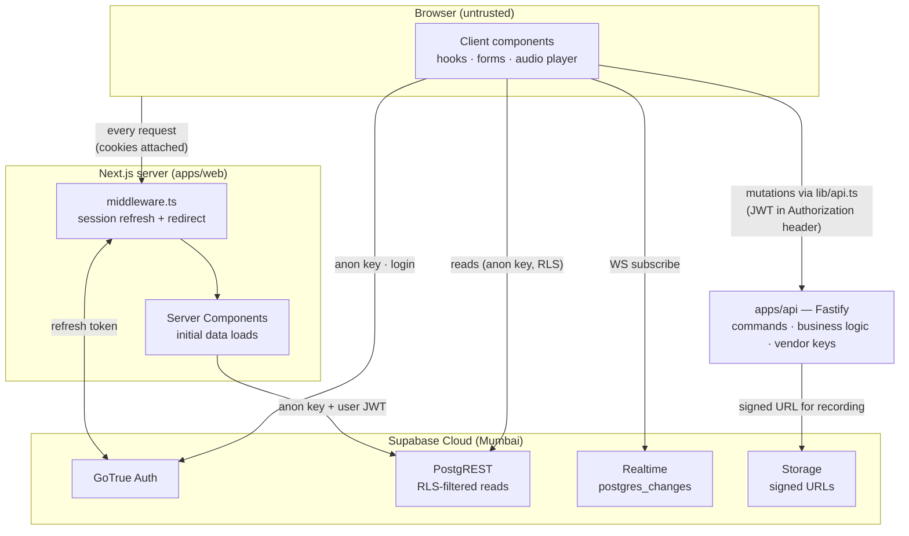
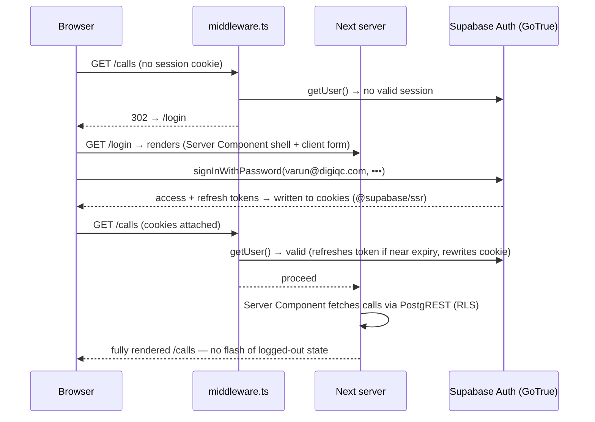
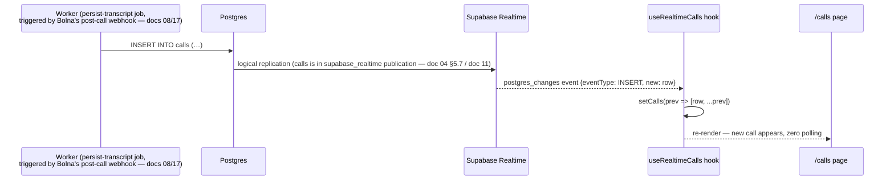

# 10 — Next.js Setup

> **RecruitPilot AI — Production-Grade AI Executive Voice Assistant**
> Document 10 of 21 · Prerequisites: docs 00–09

---

## 1. Goal

Stand up `apps/web` — the **Next.js dashboard**, Varun's one-person cockpit — scaffolded, authenticated, and wired to both halves of its world:

- The app scaffolded **inside the monorepo** as `@recruitpilot/web`, consuming `@recruitpilot/shared` like `apps/api` does (doc 03).
- **Supabase Auth** working end-to-end with cookie-based sessions: Varun logs in at `/login` with the user created manually in doc 04 §5.5 (signups are disabled — there is no register page, by design).
- The **three data paths** from doc 01 implemented in skeleton form:
  1. **Reads** → browser/server → Supabase PostgREST directly, fenced by RLS.
  2. **Live updates** → Supabase Realtime channel subscriptions (`postgres_changes`).
  3. **Commands (mutations)** → typed fetch to the Fastify API via `lib/api.ts`.
- **Middleware session refresh** so Varun's login never silently expires mid-session.
- The page inventory in place: `/login`, `/calls`, `/calls/[id]`, `/recruiters`, `/settings`.

By the end, `/login` renders, Varun can authenticate, unauthenticated visits to the dashboard bounce to `/login`, and every later doc that says "and it appears in the dashboard" has a dashboard to appear in. (The pages will show empty states until doc 11 creates the tables — that's expected and verified as such in §9.)

---

## 2. Theory

### 2.1 The App Router mental model — where does this code run?

The single most important question about any file in `apps/web/src/app/` is: **where does it execute?** Next.js App Router's answer is radical: **on the server, by default.**

| | **Server Component** (default) | **Client Component** (`"use client"`) |
|---|---|---|
| Runs | On the Next.js server, per request | In the browser (after hydration) |
| JS shipped to browser | **Zero** for the component itself | The component + its imports |
| Can do | `async/await` data fetching, read cookies, use secrets* | `useState`, `useEffect`, `onClick`, subscriptions |
| Cannot do | Hooks, event handlers, browser APIs | Read httpOnly cookies, hold secrets |
| Our usage | Page shells, initial data loads (call list, transcript) | Realtime subscription hook, forms, audio player |

*"Use secrets" in principle — we deliberately don't (see §2.4); our server components only ever hold the anon key.

The rule of thumb that keeps the dashboard fast: **start every component as a Server Component; add `"use client"` only when you need interactivity** (a click handler, a subscription, local state). The directive marks a *boundary* — everything it imports gets bundled for the browser too, so put it as low in the tree as possible (a small `<LiveBadge>` client component inside a server-rendered page, not a fully client-rendered page).

### 2.2 Layouts, pages, and route groups

The filesystem *is* the router:

- `app/calls/page.tsx` → the `/calls` route.
- `app/calls/[id]/page.tsx` → dynamic route `/calls/abc123` (the `id` param arrives as a prop).
- `app/layout.tsx` → shared shell that wraps every page (html, body, global styles); nested layouts wrap their subtree only.
- **Route groups** `(auth)` and `(dashboard)` — folders in parentheses that **organize without affecting the URL**. `app/(auth)/login/page.tsx` is still just `/login`. Why bother? Because groups can have **different layouts**: `(auth)` gets a bare, centered card layout (no nav — you're not logged in yet); `(dashboard)` gets the sidebar + header shell shared by calls/recruiters/settings. This is exactly the tree doc 03 fixed.

### 2.3 Why SSR matters for an authed dashboard

A purely client-rendered dashboard (classic SPA) checks auth *after* JavaScript loads: the user sees a flash of a logged-out screen (or a spinner), then the redirect. Worse, protected data fetching can't start until the browser has booted React and asked "am I logged in?"

With App Router SSR, the session lives in **cookies**, and cookies travel with the very first HTTP request. The Next.js server reads them *before rendering anything*:

- Unauthenticated request for `/calls` → middleware sees no valid session → **302 to `/login`** — the browser never receives a byte of dashboard markup.
- Authenticated request → the Server Component reads the session, fetches the call list from Supabase *server-side*, and streams back fully-rendered HTML. No flash, no loading-spinner-then-content waterfall, no "logged out for 200 ms" jank.

For a one-user tool this is also the honest security posture: the protected pages aren't "hidden by client-side JS", they're simply never served.

### 2.4 Supabase auth in Next.js — the `@supabase/ssr` package

`@supabase/supabase-js` alone stores sessions in `localStorage` — invisible to the server, so SSR can't know who you are. **`@supabase/ssr`** fixes this by storing the session in **cookies**, readable on both sides, and gives us the two client factories we need:

| Factory | File (doc 03) | Runs | Reads session from |
|---|---|---|---|
| `createBrowserClient` | `lib/supabase/client.ts` | Browser (client components, hooks) | Cookies via `document.cookie` API |
| `createServerClient` | `lib/supabase/server.ts` | Server Components, middleware | Request cookies (`next/headers`) |

Both are constructed with the **anon key** — safe to expose (doc 04 §2.3); RLS is what stands between any holder of that key and the data.

One subtlety makes **middleware** mandatory: Supabase access tokens are short-lived JWTs (about an hour) paired with a refresh token. Server Components **cannot write cookies** (the response headers may already be streaming), so they can't persist a refreshed token. Middleware runs *before* every matched request and *can* write cookies — so it becomes the one place sessions get refreshed. Forget it, and everything works for an hour, then silently 401s: the classic "auth works on my machine, breaks after lunch" bug (§10).

### 2.5 The data-access split — reads vs live vs commands

Doc 01 fixed this; here is the *why*, spelled out:

| Path | Route | Mechanism | Why this way |
|---|---|---|---|
| **READS** | browser/Next server → Supabase | PostgREST + anon key, RLS-filtered | Reads are shape-simple ("last 20 calls"). Piping them through Fastify adds a hop, a deploy surface, and code that PostgREST already generates. RLS caps the blast radius: even a fully compromised browser reads only what policies grant Varun. |
| **LIVE** | Supabase Realtime → browser | WebSocket channel, `postgres_changes` events | The worker's `persist-transcript` job (fed by Bolna's post-call webhook, docs 08/17) inserts rows (doc 01) → Postgres replication → Realtime → the open dashboard updates *instantly*, with zero polling code and zero API involvement. |
| **COMMANDS** | browser → Fastify API | `lib/api.ts` typed fetch, Zod-validated | Mutations carry **business logic** (validation, side effects, events) and may touch **vendor keys** (e.g., re-sending a resume). Both must stay server-side. The browser never holds a privileged credential and never calls a vendor. |

The asymmetry is the design: **Supabase's strengths (auto API, realtime, RLS) own the read/live paths; our API owns every write and every secret.** If you ever find yourself adding a Fastify `GET /calls` endpoint that just proxies the database, or a Supabase `insert()` in a client component — one of the two rules above is being violated.

---

## 3. Architecture

### 3.1 The dashboard's world — every arrow and its credential



Read the trust boundaries off the diagram: the browser holds only the anon key and Varun's session JWT; the Next.js server holds nothing more; **every privileged credential lives in Fastify** (doc 03, doc 04 §3).

### 3.2 Login flow (sequence)



### 3.3 Live call feed (sequence)



### 3.4 Pages inventory

| Route | Group | Rendering | Contents |
|---|---|---|---|
| `/login` | `(auth)` | Server shell + client form | Email/password form → `signInWithPassword`. No signup link — signups are disabled (doc 04 §5.5). |
| `/calls` | `(dashboard)` | Server Component list + client live layer | Call list (time, caller, duration, status), updating live via Realtime. |
| `/calls/[id]` | `(dashboard)` | Server Component | The full Bolna transcript (persisted turn-by-turn by the worker, doc 17), the Claude-generated summary, recruiter card, and an audio player fed by a **short-lived signed URL** to the recording the `store-recording` job downloaded from Bolna into our bucket (docs 04, 08). |
| `/recruiters` | `(dashboard)` | Server Component | Recruiter memory: who called, when, about what (doc 00). |
| `/settings` | `(dashboard)` | Server + client form | Greeting text, predefined screening questions, feature toggles — the **config-over-code surface** from doc 01: Varun edits conversation behavior here, no deploy needed. Saves go through the Fastify API (it's a mutation). |

---

## 4. Folder Structure

Filling in the `apps/web` subtree fixed by doc 03 — plus the handful of files this doc adds (marked ●):

```
apps/web/
├── src/
│   ├── app/
│   │   ├── (auth)/
│   │   │   ├── layout.tsx              # ● bare centered layout, no nav
│   │   │   └── login/page.tsx          # ● signInWithPassword form
│   │   ├── (dashboard)/
│   │   │   ├── layout.tsx              # ● sidebar + header shell
│   │   │   ├── calls/
│   │   │   │   ├── page.tsx            # ● list — Server Component + live layer
│   │   │   │   └── [id]/page.tsx       # ● transcript · summary · audio
│   │   │   ├── recruiters/page.tsx     # ●
│   │   │   └── settings/page.tsx       # ●
│   │   ├── layout.tsx                  # root: html/body, globals.css
│   │   └── globals.css                 # Tailwind directives
│   ├── components/                     # presentational pieces (CallRow, TranscriptView…)
│   ├── lib/
│   │   ├── supabase/
│   │   │   ├── client.ts               # ● createBrowserClient
│   │   │   ├── server.ts               # ● createServerClient (cookies)
│   │   │   └── middleware.ts           # ● session-refresh helper
│   │   └── api.ts                      # ● typed fetch wrapper → Fastify, Zod-parsed
│   ├── hooks/
│   │   └── useRealtimeCalls.ts         # ● postgres_changes subscription
│   └── middleware.ts                   # ● Next.js middleware entry (calls the helper)
├── .env.local                          # ● NEXT_PUBLIC_* vars — git-ignored
├── next.config.ts                      # output: 'standalone' (for doc 13)
├── package.json                        # name: @recruitpilot/web
├── tailwind.config.ts / postcss.config.mjs
└── tsconfig.json
```

Note the import direction (doc 03): `apps/web → @recruitpilot/shared` is legal; `apps/web → apps/api` internals is forbidden — web talks to the API over HTTP only, through `lib/api.ts`.

---

## 5. Manual Steps

### 5.1 Scaffold the app inside the monorepo

From the **repo root**:

```bash
npx create-next-app@latest apps/web \
  --ts --app --tailwind --eslint --src-dir --import-alias "@/*"
```

Every flag is a decision, not a default:

| Flag | What it does | Why we choose it |
|---|---|---|
| `apps/web` | Target directory | The monorepo slot fixed in doc 03; the root workspaces glob `apps/*` picks it up automatically |
| `--ts` | TypeScript | Non-negotiable across the stack (doc 02) — one type system from DB to pixel |
| `--app` | App Router (not the legacy Pages Router) | Server Components + layouts + route groups — the entire §2 mental model |
| `--tailwind` | Tailwind CSS preconfigured | Utility CSS keeps a one-person dashboard fast to build and boring to maintain (§11) |
| `--eslint` | ESLint config | Same lint gate as the API; CI (doc 14) runs it |
| `--src-dir` | Code under `src/` | Matches `apps/api/src` — one convention everywhere (doc 03) |
| `--import-alias "@/*"` | `@/lib/api` instead of `../../lib/api` | Readable imports; refactors don't churn paths |

If the CLI asks anything the flags didn't cover (e.g., Turbopack for dev), accept the default — verify in terminal, prompts evolve between releases.

### 5.2 Make it a workspace citizen

1. Edit `apps/web/package.json`: change `"name"` to **`@recruitpilot/web`** and add the shared package + a fixed dev port (the API owns 3000 — doc 09):

```jsonc
// apps/web/package.json (relevant fields)
{
  "name": "@recruitpilot/web",
  "scripts": {
    "dev": "next dev -p 3001",
    "build": "next build",
    "start": "next start -p 3001",
    "lint": "next lint"
  },
  "dependencies": {
    "@recruitpilot/shared": "*"
  }
}
```

2. Install the Supabase packages **into this workspace** from the repo root:

```bash
npm i @supabase/supabase-js @supabase/ssr -w apps/web
npm install        # re-link workspaces so @recruitpilot/shared resolves
```

`-w apps/web` targets the workspace: the dependency lands in `apps/web/package.json`, while npm hoists the actual files to the root `node_modules` (doc 03).

### 5.3 Create `.env.local`

Next.js loads `apps/web/.env.local` automatically (git-ignored by the scaffold's `.gitignore`; our root `.gitignore` covers `.env*` too — doc 04 §7). Values come straight from doc 04 §5.3:

```bash
# apps/web/.env.local
NEXT_PUBLIC_SUPABASE_URL=https://<project-ref>.supabase.co
NEXT_PUBLIC_SUPABASE_ANON_KEY=<anon-or-publishable-key>
NEXT_PUBLIC_API_URL=http://localhost:3000
```

Mirror all three with placeholders into the committed root `.env.example`.

### 5.4 The two Supabase clients

```typescript
// apps/web/src/lib/supabase/client.ts  — browser side
import { createBrowserClient } from "@supabase/ssr";

export function createClient() {
  return createBrowserClient(
    process.env.NEXT_PUBLIC_SUPABASE_URL!,
    process.env.NEXT_PUBLIC_SUPABASE_ANON_KEY!
  );
}
```

```typescript
// apps/web/src/lib/supabase/server.ts  — Server Components / route handlers
import { createServerClient } from "@supabase/ssr";
import { cookies } from "next/headers";

export async function createClient() {
  const cookieStore = await cookies();
  return createServerClient(
    process.env.NEXT_PUBLIC_SUPABASE_URL!,
    process.env.NEXT_PUBLIC_SUPABASE_ANON_KEY!,
    {
      cookies: {
        getAll: () => cookieStore.getAll(),
        setAll: (toSet) => {
          try {
            toSet.forEach(({ name, value, options }) =>
              cookieStore.set(name, value, options)
            );
          } catch {
            // Called from a Server Component — cookie writes are impossible here;
            // middleware (§5.5) is the one place refreshes get persisted.
          }
        },
      },
    }
  );
}
```

Same anon key in both — the *cookie plumbing* is what differs.

### 5.5 Middleware — session refresh + route protection

```typescript
// apps/web/src/middleware.ts
import { createServerClient } from "@supabase/ssr";
import { NextResponse, type NextRequest } from "next/server";

export async function middleware(request: NextRequest) {
  let response = NextResponse.next({ request });

  const supabase = createServerClient(
    process.env.NEXT_PUBLIC_SUPABASE_URL!,
    process.env.NEXT_PUBLIC_SUPABASE_ANON_KEY!,
    {
      cookies: {
        getAll: () => request.cookies.getAll(),
        setAll: (toSet) => {
          toSet.forEach(({ name, value }) => request.cookies.set(name, value));
          response = NextResponse.next({ request });
          toSet.forEach(({ name, value, options }) =>
            response.cookies.set(name, value, options)
          );
        },
      },
    }
  );

  // getUser() validates the JWT with Supabase AND refreshes it if stale —
  // this call is the entire point of the middleware. Never skip it.
  const { data: { user } } = await supabase.auth.getUser();

  const isAuthRoute = request.nextUrl.pathname.startsWith("/login");
  if (!user && !isAuthRoute) {
    return NextResponse.redirect(new URL("/login", request.url));
  }
  if (user && isAuthRoute) {
    return NextResponse.redirect(new URL("/calls", request.url));
  }
  return response;
}

export const config = {
  // run on everything except static assets
  matcher: ["/((?!_next/static|_next/image|favicon.ico).*)"],
};
```

### 5.6 Login page (client form — signups disabled, so this is the *only* auth UI)

```typescript
// apps/web/src/app/(auth)/login/page.tsx
"use client";
import { useState } from "react";
import { useRouter } from "next/navigation";
import { createClient } from "@/lib/supabase/client";

export default function LoginPage() {
  const [email, setEmail] = useState("");
  const [password, setPassword] = useState("");
  const [error, setError] = useState<string | null>(null);
  const router = useRouter();

  async function handleSubmit(e: React.FormEvent) {
    e.preventDefault();
    const supabase = createClient();
    const { error } = await supabase.auth.signInWithPassword({ email, password });
    if (error) return setError("Invalid credentials");
    router.push("/calls");
    router.refresh(); // re-run Server Components with the new session
  }

  return (
    <form onSubmit={handleSubmit} className="mx-auto mt-32 flex max-w-sm flex-col gap-3">
      <h1 className="text-xl font-semibold">RecruitPilot AI</h1>
      <input type="email" value={email} onChange={(e) => setEmail(e.target.value)}
        placeholder="Email" className="rounded border p-2" required />
      <input type="password" value={password} onChange={(e) => setPassword(e.target.value)}
        placeholder="Password" className="rounded border p-2" required />
      <button type="submit" className="rounded bg-black p-2 text-white">Sign in</button>
      {error && <p className="text-sm text-red-600">{error}</p>}
    </form>
  );
}
```

There is deliberately no `signUp` call anywhere in this app — doc 04 closed that door at the Supabase level; we simply never open it in UI.

### 5.7 A Server Component page reading via RLS

```typescript
// apps/web/src/app/(dashboard)/calls/page.tsx  — Server Component (no "use client")
import { createClient } from "@/lib/supabase/server";
import { CallsLive } from "./calls-live"; // client component wrapping the list

export default async function CallsPage() {
  const supabase = await createClient();
  const { data: calls } = await supabase
    .from("calls")
    .select("id, caller_number, started_at, duration_seconds, status")
    .order("started_at", { ascending: false })
    .limit(20);

  // Rendered on the server; RLS already filtered rows to what Varun may see.
  return <CallsLive initialCalls={calls ?? []} />;
}
```

The pattern: **server fetch for the initial state, client subscription for updates** — SSR speed plus live freshness.

### 5.8 The Realtime hook

```typescript
// apps/web/src/hooks/useRealtimeCalls.ts
"use client";
import { useEffect, useState } from "react";
import { createClient } from "@/lib/supabase/client";
import type { Call } from "@recruitpilot/shared";

export function useRealtimeCalls(initialCalls: Call[]) {
  const [calls, setCalls] = useState(initialCalls);

  useEffect(() => {
    const supabase = createClient();
    const channel = supabase
      .channel("calls-feed")
      .on(
        "postgres_changes",
        { event: "INSERT", schema: "public", table: "calls" },
        (payload) => setCalls((prev) => [payload.new as Call, ...prev])
      )
      .on(
        "postgres_changes",
        { event: "UPDATE", schema: "public", table: "calls" },
        (payload) =>
          setCalls((prev) =>
            prev.map((c) => (c.id === (payload.new as Call).id ? (payload.new as Call) : c))
          )
      )
      .subscribe();

    return () => { supabase.removeChannel(channel); }; // always clean up on unmount
  }, []);

  return calls;
}
```

This receives events only after doc 11 adds `calls` to the `supabase_realtime` publication (doc 04 §5.7) — wired now, lights up then.

### 5.9 The typed API wrapper — commands only

```typescript
// apps/web/src/lib/api.ts
import { z } from "zod";
import { createClient } from "@/lib/supabase/client";

const API_URL = process.env.NEXT_PUBLIC_API_URL!;

export async function apiFetch<T>(
  path: string,
  schema: z.ZodType<T>,
  init?: RequestInit
): Promise<T> {
  const supabase = createClient();
  const { data: { session } } = await supabase.auth.getSession();

  const res = await fetch(`${API_URL}${path}`, {
    ...init,
    headers: {
      "Content-Type": "application/json",
      ...(session ? { Authorization: `Bearer ${session.access_token}` } : {}),
      ...init?.headers,
    },
  });
  if (!res.ok) throw new Error(`API ${res.status}: ${await res.text()}`);
  return schema.parse(await res.json()); // the untyped boundary, closed (doc 02)
}

// usage — schemas come from the one source of shape truth:
//   import { SettingsSchema } from "@recruitpilot/shared";
//   const settings = await apiFetch("/settings", SettingsSchema, {
//     method: "PUT", body: JSON.stringify(updated),
//   });
```

Every response is **Zod-parsed with a schema from `@recruitpilot/shared`** — the same schema Fastify validated on its side (doc 03). A drifted API contract fails loudly at the parse, not silently three components later. The Fastify side verifies the `Authorization` JWT against Supabase (doc 12).

---

## 6. Official Links

| Topic | Link |
|---|---|
| Next.js App Router | https://nextjs.org/docs/app |
| Server & Client Components | https://nextjs.org/docs/app/getting-started/server-and-client-components |
| Route groups | https://nextjs.org/docs/app/api-reference/file-conventions/route-groups |
| Next.js middleware | https://nextjs.org/docs/app/api-reference/file-conventions/middleware |
| `create-next-app` flags | https://nextjs.org/docs/app/api-reference/cli/create-next-app |
| Supabase Auth for Next.js (`@supabase/ssr`) | https://supabase.com/docs/guides/auth/server-side/nextjs |
| `signInWithPassword` | https://supabase.com/docs/reference/javascript/auth-signinwithpassword |
| Realtime postgres changes | https://supabase.com/docs/guides/realtime/postgres-changes |
| Next.js `output: 'standalone'` | https://nextjs.org/docs/app/api-reference/config/next-config-js/output |
| Tailwind CSS | https://tailwindcss.com/docs |

---

## 7. Commands

All from the **repo root** — the `-w` flag targets the workspace (doc 03):

```bash
# dev server on :3001 (the -p 3001 lives in the package.json script — apps/api owns :3000)
npm run dev -w apps/web
# expect: ▲ Next.js ...  - Local: http://localhost:3001

# production build (also our earliest type/lint smoke test for the whole web tree)
npm run build -w apps/web
# expect: route table listing /login, /calls, /calls/[id], /recruiters, /settings

# serve the production build locally
npm run start -w apps/web

# lint (same gate CI runs — doc 14)
npm run lint -w apps/web
```

---

## 8. Environment Variables

Three variables enter `apps/web/.env.local` — **all three `NEXT_PUBLIC_`, all three public by definition**:

| Variable | Value | Purpose | Stored in |
|---|---|---|---|
| `NEXT_PUBLIC_SUPABASE_URL` | Project URL (doc 04 §5.3) | Both Supabase clients + Realtime WS endpoint | `.env.local` locally · Docker **build args** in prod (doc 13) |
| `NEXT_PUBLIC_SUPABASE_ANON_KEY` | anon / publishable key | Auth, RLS-bound reads, Realtime | `.env.local` · Docker build args (doc 13) |
| `NEXT_PUBLIC_API_URL` | Fastify base URL — `http://localhost:3000` in dev, the public HTTPS domain in prod (doc 15) | `lib/api.ts` command path | `.env.local` · Docker build args (doc 13) |

What `NEXT_PUBLIC_` *actually does* — and why it's a one-way door: at **build time**, Next.js finds every `process.env.NEXT_PUBLIC_*` reference and **inlines the literal value into the browser JavaScript bundle**. Anyone can read it with View Source. Two consequences:

1. **The prefix is a public declaration, never a convenience** (doc 00). If a value must not appear in a stranger's DevTools, it does not get the prefix — no exceptions, and the service_role key least of all (doc 04 §10 mistake #1).
2. **Values are baked at build time, not read at runtime.** Changing them means rebuilding the web image — which is why doc 13 passes them as Docker *build args*, not runtime env.

The anon key passes the test precisely because RLS makes it harmless (doc 04 §2.3); the API URL is public by nature (the browser must reach it anyway).

---

## 9. Verification

With the Fastify skeleton from doc 09 running on :3000 and `npm run dev -w apps/web` on :3001:

**1. The scaffold builds clean:**

```bash
npm run build -w apps/web
# expect: ✓ Compiled successfully, route table shows all five routes, zero type errors
```

**2. Route protection works** — open `http://localhost:3001/calls` in a **private browser window** (no cookies): expect an immediate redirect to `/login` with *no flash* of dashboard UI. That's the middleware doing its job before a byte of protected markup ships.

**3. Login works** — at `/login`, sign in as `varun@digiqc.com` with the dashboard password from your password manager (doc 04 §5.5): expect redirect to `/calls`. Wrong password → "Invalid credentials", no redirect. In DevTools → Application → Cookies, confirm `sb-<project-ref>-auth-token` cookies now exist.

**4. Session survives** — refresh `/calls` (stays), open it in a new tab (stays logged in — cookies, not tab state), and visit `/login` while authenticated (bounces back to `/calls`).

**5. Realtime smoke test — ⚠ forward-verification (completes in doc 11).** The `calls` table doesn't exist yet, so today you verify the *channel connects*: in DevTools → Network → WS, confirm a websocket to `<project-ref>.supabase.co/realtime/...` with `joined` frames. **After doc 11** creates the tables and enables the publication, return and finish the test: Supabase dashboard → Table Editor → `calls` → Insert row → the row must appear in the open `/calls` page **without a refresh**. Mark this checklist item done only then.

**6. Empty-state honesty** — `/calls` should render an empty list (or "No calls yet"), not crash: the `.from("calls")` query returns an error pre-doc-11, and the page must tolerate `data` being null (§5.7 uses `?? []`).

**Self-quiz** (pass = answer from memory):

1. Server Component vs Client Component — where does each run, and what does each cost the browser?
2. Why is the anon key safe to inline into public JavaScript? (What single mechanism contains it?)
3. Why do mutations go through Fastify while reads go straight to Supabase?
4. What exactly does the middleware do for sessions, and what breaks — and *when* — if you delete it?
5. Why can't a Server Component persist a refreshed token itself?
6. What happens to a `NEXT_PUBLIC_` variable at build time, and why does that rule out secrets *and* runtime changes?

---

## 10. Common Mistakes

1. **A secret with a `NEXT_PUBLIC_` prefix.** Doc 04's #1 sin, restated because it is the one that ends the project: `NEXT_PUBLIC_SUPABASE_SERVICE_ROLE_KEY` inlines the RLS-bypassing master key into JavaScript served to anyone. The prefix means *published*. Only the three §8 variables ever carry it.
2. **Calling vendor APIs from the browser.** "Just fetch Anthropic for a quick summary" — or "just hit Bolna's executions API for the recording" — ships a vendor key to the world (doc 01). The browser talks to exactly two servers: Supabase (anon key) and our Fastify API. Nothing else, ever.
3. **Supabase queries in client components when a Server Component suffices.** A `"use client"` page that fetches in `useEffect` renders empty → hydrates → *then* fetches — a request waterfall plus a loading spinner, for data the server could have streamed fully rendered. Client-side fetching is for *updates* (Realtime), not initial loads.
4. **Forgetting the middleware.** Everything works — for about an hour. Then the JWT expires, no one refreshes it, and every Supabase call silently returns empty/401 until a manual re-login. If auth "randomly breaks after a while", check the middleware matcher first.
5. **Importing Node-only code into `packages/shared`.** Shared ships in the browser bundle (doc 03): one `import fs` or Prisma type in it and `next build` dies with a cryptic module-resolution error. Shared = pure Zod schemas, types, constants.
6. **Fetching without Zod-parsing API responses.** `await res.json()` returns `any` — the untyped boundary doc 02 warned about. A renamed API field then surfaces as `undefined` deep in a component instead of a loud parse error at the boundary. Every `lib/api.ts` call takes a schema; no schema, no fetch.
7. **Checking auth with `getSession()` in the middleware instead of `getUser()`.** `getSession()` reads the cookie without validating it against Supabase — a tampered/expired JWT passes. `getUser()` round-trips to GoTrue and is the authoritative check (and triggers the refresh).
8. **Forgetting `router.refresh()` after login.** The client navigates, but Server Components still hold the pre-login render — dashboards look empty until a hard refresh. `push` moves the URL; `refresh` re-runs the server tree with the new cookies.

---

## 11. Production Best Practices

- **`output: 'standalone'` in `next.config.ts` — set it now.** It makes `next build` emit a self-contained `server.js` + minimal `node_modules` tracing, shrinking the Docker image from ~1 GB to ~150 MB. Doc 13's `web.Dockerfile` assumes it; setting it today means the first Docker build just works.
- **Error and loading boundaries per route.** `error.tsx` and `loading.tsx` beside each `page.tsx`: a failed transcript fetch shows a retry card instead of a white screen; slow queries show a skeleton instead of nothing. App Router makes resilience a file convention — use it.
- **Optimistic UI for settings edits.** When Varun edits the greeting text, update the UI immediately, fire the `apiFetch` PUT, and roll back with an error toast on failure. A one-user tool should *feel* instant; the async plane already guarantees correctness.
- **Keep the dashboard boring and readable.** It is a cockpit, not a marketing site: system font stack, honest tables, high-contrast text, no animation that delays information. Every design decision is judged by one metric — how fast can Varun, on his phone between meetings, learn what the last call was about?
- **One subscription per channel, cleaned up religiously.** Realtime channels leak if effects don't return `removeChannel` (§5.8). React StrictMode's double-mount in dev will expose sloppy cleanup early — treat its warnings as CI failures in spirit.
- **Build in CI = the type gate for web.** `npm run build -w apps/web` runs typecheck + lint + bundling; doc 14's pipeline runs it on every PR so a broken dashboard can't merge.

---

## 12. Security

The dashboard's posture — thin by design, because the heavy walls are elsewhere (deep dive: `18_SECURITY.md`):

- **Session cookies are handled by `@supabase/ssr` defaults** — the auth token cookies are set `httpOnly` where written server-side, `Secure` in production, and `SameSite=Lax`, which blunts both XSS token theft and CSRF-style riding. Do not hand-roll cookie handling around the library; its defaults encode these decisions.
- **RLS is the floor** (doc 04 §2.2). The threat model to internalize: assume the entire browser bundle, anon key included, is in an attacker's hands — because it literally is, it's public JavaScript. What do they get? Whatever RLS grants an unauthenticated stranger: **nothing**. With Varun's stolen session: whatever RLS grants Varun. The dashboard's security ceiling is set in Postgres, not in React.
- **No privileged secret exists in this app to leak.** No service_role key, no `BOLNA_API_KEY`, no `ANTHROPIC_API_KEY`, no `DATABASE_URL` — by structure (doc 03), not by carefulness. A full compromise of `apps/web` yields the anon key and nothing more.
- **Content-Security-Policy.** Add a CSP header (via `next.config.ts` `headers()` or Nginx in doc 15) restricting `connect-src` to `'self'`, the Supabase project domain, and the API domain; `script-src 'self'`. It turns "attacker injected a script" into "…which couldn't call home." Noted here, finalized with the rest of the headers in docs 15/18.
- **No PII in client-side logs or analytics.** Transcripts, recruiter names, and phone numbers are personal data (doc 00). No third-party analytics script gets added to this app, and `console.log` of call payloads doesn't ship — browser logs are visible to extensions and shoulder-surfers alike.
- **Recording playback uses short-expiry signed URLs** (doc 04 §5.6): the `/calls/[id]` audio player asks our API, which mints a signed URL (valid for minutes, not days) to *our* stored copy of the recording — never Bolna's raw recording URL, which is vendor-side and outside our access controls (docs 08, 18). The permanent storage path never reaches the browser; a shared or leaked link dies on schedule.

---

## 13. Checklist

- [ ] `apps/web` scaffolded via `create-next-app` with all six flags — each flag's purpose understood
- [ ] Package renamed `@recruitpilot/web`; dev/start scripts pinned to port **3001**
- [ ] `@supabase/supabase-js` + `@supabase/ssr` installed with `-w apps/web`; `@recruitpilot/shared` declared and resolving
- [ ] `.env.local` holds the three `NEXT_PUBLIC_*` vars; mirrored as placeholders in `.env.example`
- [ ] `lib/supabase/client.ts` and `lib/supabase/server.ts` created — the two-client model understood
- [ ] `middleware.ts` refreshing sessions via `getUser()` and redirecting unauthenticated traffic
- [ ] `/login` works with `varun@digiqc.com` (signups disabled — no signup UI anywhere)
- [ ] Route protection verified: private window → `/calls` → instant `/login` redirect, no flash
- [ ] `useRealtimeCalls` hook wired; Realtime WS connection confirmed (full insert-test deferred to doc 11 — forward-verification)
- [ ] `lib/api.ts` Zod-parses every response with `@recruitpilot/shared` schemas
- [ ] Data-access split recitable: reads → Supabase/RLS, live → Realtime, commands → Fastify
- [ ] `output: 'standalone'` set in `next.config.ts` (doc 13 depends on it)
- [ ] `NEXT_PUBLIC_` semantics understood: build-time inlining, public forever, never a secret
- [ ] Self-quiz (§9) passed from memory

---

## 14. Next Step

Proceed to **`11_DATABASE_DESIGN.md`** — the schema that makes this dashboard real: Prisma models for calls, recruiters, opportunities, and memory; migrations over the `DIRECT_URL` from doc 04; `ENABLE ROW LEVEL SECURITY` on every table with Varun-scoped policies; and adding `calls` to the Realtime publication — at which point you return to §9 step 5 and watch a hand-inserted row appear live in your dashboard.
