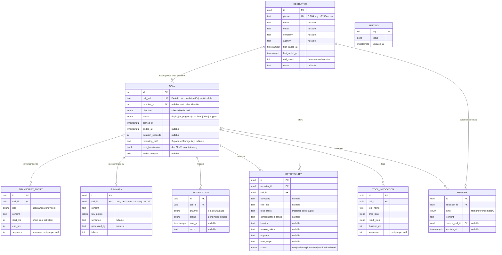
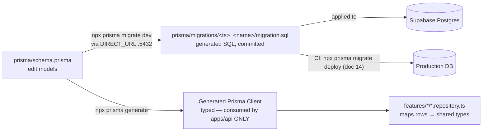

# 11 — Database Design

> **RecruitPilot AI — Production-Grade AI Executive Voice Assistant**
> Document 11 of 21 · Prerequisites: docs 00–10

---

## 1. Goal

Turn the empty Postgres from doc 04 into the system's **single source of truth** — designed, migrated, secured, and seeded:

- The **complete data model**: nine entities (recruiters, calls, transcripts, summaries, opportunities, memories, notifications, settings, tool invocations) with every relationship, cardinality, and index justified — not just listed.
- **Prisma** wired up correctly for Supabase: one `schema.prisma` at the repo root (doc 03 §11), runtime queries through the pooler (`DATABASE_URL` :6543), migrations through the direct connection (`DIRECT_URL` :5432) — the "6543 = the app talking, 5432 = the schema changing" rule from doc 04 §2.4, now enforced in the schema file itself.
- **RLS enabled on every table** with SELECT-only policies for Varun's dashboard — honoring doc 04 §2.2's rule ("a table without RLS is a bug, not a default") and the trust boundary from doc 03 §12.
- **Realtime enabled** on `calls` and `transcript_entries` so the dashboard updates live (doc 00 §5.1 step 9).
- A **seed script** installing the default settings: the greeting text and the predefined recruiter questions — the config-over-code surface from doc 01 §11.

By the end, `npx prisma studio` shows your schema, the Supabase Table Editor shows nine RLS-protected tables, and you can defend every column in an interview.

---

## 2. Theory

### 2.1 Normalization, pragmatically (1NF–3NF in plain words)

Normalization is the discipline of **storing each fact exactly once**. The formal normal forms, translated:

| Form | Plain-words rule | Violation smell |
|---|---|---|
| **1NF** | Every cell holds one atomic value; no repeating groups | `phone1, phone2, phone3` columns; comma-separated lists you parse in code |
| **2NF** | Every non-key column depends on the *whole* primary key | Only bites with composite keys — a fact about half the key is in the wrong table |
| **3NF** | Every non-key column depends on the key, the whole key, and *nothing but the key* | Recruiter's company name copied onto every call row — update it in one place, it's stale in fifty |

Why care: duplicated facts drift. If the recruiter's name lived on each `Call` row and she corrects the spelling on call #3, calls #1–2 now disagree. Normalized, her name lives once on `recruiters` and every call points at it.

**When to denormalize — deliberately, with a reason written down.** Normalization optimizes for *write correctness*; sometimes you trade a little of it for *read speed*:

- `Recruiter.callCount` and `Recruiter.lastCalledAt` are **derivable** (`COUNT(*)`/`MAX(startedAt)` over calls) — but the memory pre-fetch at call start (doc 01 §3.5) and the dashboard recruiter list read them constantly. We store them as counters, updated by the `upsert-recruiter` job. Accepted cost: a job bug could let them drift; a periodic reconciliation query catches that.
- The **summary text** could be denormalized onto `Call` to save a join. We keep a separate `Summary` table instead, because a summary has its own lifecycle (model id, token count, regeneration) — but this was a judgment call, not a law. Know the trade-off; choose consciously.

One exception to "each fact once" that is *not* denormalization: Postgres arrays. `Opportunity.techStack text[]` looks like a 1NF violation, but for a short tag list that is only ever read whole (never joined against), a normalized `opportunity_tech_stacks` join table is ceremony without benefit. Arrays are fine for tags; wrong for anything you'd JOIN or FK.

### 2.2 UUIDs vs serial integers

Two ways to mint primary keys:

| | `serial`/`identity` (1, 2, 3…) | `uuid` (`3f8a…`) |
|---|---|---|
| Guessable | Yes — `/calls/42` invites probing `/calls/43` | No — 122 random bits |
| Leaks business info | Yes — order of creation, total volume | No |
| Safe in URLs, events, logs | Risky | Yes |
| Generated where | Only by the DB (needs a round trip) | Anywhere — DB, API, even before insert |
| Size / index locality | 4–8 bytes, sequential (cache-friendly) | 16 bytes, random (slightly worse index locality) |

**We choose UUIDs**, generated *in the database* with `gen_random_uuid()` (built into Postgres 13+). Reasons ranked: (1) IDs appear in domain events, BullMQ payloads, and dashboard URLs — they must be non-guessable; (2) rows inserted from the SQL editor or a seed still get valid IDs because the DB mints them, not the client; (3) the index-locality cost is irrelevant at our row counts. Note the one ID we *don't* mint: `Call.callSid` comes from **Exotel** — it is the correlation ID that threads through every log line, job, and row (doc 01 §3.8). Our `Call.id` is the internal PK; `callSid` is the external identity, held `UNIQUE`.

### 2.3 Soft delete vs hard delete

**Soft delete** sets a `deletedAt` timestamp and filters it out everywhere; **hard delete** removes the row. Soft delete preserves history and enables undo — and it is the wrong default here, for one decisive reason: doc 00 §12 promises recruiter PII is **deletable on request**. A soft-deleted transcript still *contains* the transcript. "Deleted" that a `WHERE deletedAt IS NULL` clause can un-delete is not deletion under any privacy regime.

Our policy:

- **PII erasure is HARD delete** — memories, transcripts, opportunities gone; calls anonymized (the full design is in §12).
- **Workflow states are enums, not delete flags** — Varun dismissing an opportunity sets `status = archived`; the row stays. Soft delete is often a band-aid for a missing status column; model the status instead.

### 2.4 Enum strategy (Postgres enums via Prisma)

A column like `Call.status` has exactly five legal values. Three ways to enforce that: application code only (nothing stops a bad SQL insert), a `CHECK` constraint on `text`, or a **native Postgres enum type**. Prisma's `enum` blocks generate native enums, and we use them: the DB rejects illegal values, and the generated TypeScript client gives you `CallStatus.completed` autocompletion — one definition, two enforcement points.

The cost you must know *before* choosing them: **enums are schema**. Adding a value is a cheap migration (`ALTER TYPE … ADD VALUE`); removing or renaming one is genuinely painful (new type, column rewrite, drop old). Rule of thumb: enum when the value set is small and changes rarely with code (`status`, `role`, `channel`); plain `text` when Varun might edit the set from the dashboard (which is why `Opportunity.urgency` is text, not an enum — recruiters phrase urgency a hundred ways).

### 2.5 Timestamps convention

Every table carries `createdAt` (default `now()`) and `updatedAt` (Prisma `@updatedAt`) — no exceptions, no debates per table. Two rules with teeth:

- **Always `timestamptz`, never `timestamp`.** Plain `timestamp` stores a wall-clock reading with no zone — "14:30" meaning… Mumbai? UTC? The server's zone at the time? `timestamptz` stores an unambiguous instant (normalized to UTC internally) and converts on display. Prisma's default for `DateTime` on Postgres is plain `timestamp`, so we annotate every field `@db.Timestamptz(6)` explicitly.
- **Domain times are their own columns.** `Call.startedAt`/`endedAt` are facts about the call; `createdAt` is a fact about the row. They usually differ by milliseconds — until a delayed webhook, a retried job, or a backfill makes them differ by minutes, and you'll be glad they're separate.

### 2.6 `jsonb` — for genuinely flexible payloads (and its dangers)

`jsonb` stores structured JSON, binary-encoded, queryable (`costBreakdown->>'llmTokensOut'`). We use it exactly where the shape is **genuinely variable or vendor-defined**:

- `Call.costBreakdown` — the per-call cost telemetry from doc 02 §11 (`sttSeconds`, `llmTokensIn/Out/Cached`, `ttsCharacters`, `telephonyMinutes`). New meters will appear as vendors change; a jsonb blob absorbs that without migrations.
- `ToolInvocation.argsJson` / `resultJson` — every tool has a different argument shape; this is an audit trail, not a query target.
- `Setting.value` — greeting text, question lists, feature flags: heterogeneous by design.
- `Summary.keyPoints` — an LLM-produced list whose shape we may evolve.

The danger is **schema drift**: jsonb columns silently accumulate three generations of shapes, and code starts sprouting `payload.tokens ?? payload.llmTokens ?? 0`. Our defenses: (1) every jsonb shape has a **Zod schema in `packages/shared`**, validated at the write boundary (the job or service that writes it) and the read boundary (the repository that returns it) — jsonb is flexible *in the database*, never *in the code*; (2) the promotion rule: **the moment you filter or sort by a jsonb field in a real query, promote it to a column** with an index. jsonb is for payloads, not for dodging migrations.

### 2.7 Indexing theory — what, when, and the rule

**What an index is:** a B-tree — a sorted, balanced lookup structure maintained alongside the table. Without one, `WHERE call_sid = 'abc'` is a **sequential scan**: Postgres reads every row (fine at 100 rows, a disaster at 1M). With one, it's a tree descent: ~3–4 page reads regardless of table size.

**When Postgres actually uses it:** the planner weighs estimated costs using table statistics. It uses an index when the predicate is *selective* (matches few rows) and skips it when a seq scan is cheaper (tiny tables, or predicates matching most rows — an index on a boolean that's 95% `true` is dead weight). Indexes are not free: every `INSERT`/`UPDATE` must also update every index on the table (write amplification), and each consumes disk and cache.

**Composite indexes and the leftmost-prefix rule:** an index on `(recruiter_id, started_at)` is sorted by `recruiter_id` first, then `started_at` within it — like a phone book sorted by surname, then first name. It serves `WHERE recruiter_id = X` alone, and `WHERE recruiter_id = X ORDER BY started_at DESC` perfectly; it does **not** serve `WHERE started_at > Y` alone (you can't find "all Johns" in a surname-sorted book without reading it all). Column order in a composite index is a design decision, not a style choice.

**The working rule for this project:** index **every foreign key** (Postgres does *not* auto-index FK columns — only the referenced PK side; unindexed FKs make joins and cascading deletes crawl) **plus every `WHERE`/`ORDER BY` you actually run** (enumerate your real queries — dashboard list, caller lookup, triage board — and index those access paths). Nothing else until `EXPLAIN ANALYZE` proves the need (§11). The full index list, each with its justifying query, is in §3.3.

---

## 3. Architecture

### 3.1 The data model — entity-relationship diagram

Nine entities. Read the crow's feet: `||` exactly one · `|o` zero or one · `o{` zero or many.



Design decisions worth defending out loud:

- **`Call.recruiterId` is nullable.** A call row is created at ring time, when the caller is just a phone number. The `upsert-recruiter` job links it once identity is established. A NOT NULL FK here would force fake recruiters or delayed call rows — both worse.
- **`TranscriptEntry` is a table, not one text blob on `Call`.** Three reasons: (1) *querying* — "show every turn where the caller mentioned compensation" is SQL over rows, string surgery over a blob; (2) *Realtime streaming* — each inserted turn is one `postgres_changes` event, so the dashboard renders the conversation live, turn by turn, with zero polling; (3) *per-turn timings* — `startMs`/`endMs` per turn feed the latency-budget regression reports (doc 01 §11). A blob gives you none of these.
- **`Summary.callId` is UNIQUE** — one summary per call, and a natural idempotency guard: a retried `generate-summary` job upserts instead of duplicating (doc 01 §3.6).
- **`Memory` is per-recruiter, keyed for the pre-fetch rule.** At call start the gateway looks up `recruiters` by `phone`, then loads that recruiter's memories in the same breath — *before* the first turn, never per-turn (the doc 01 §3.5 pre-fetch rule; per-turn DB reads on the real-time plane are an architecture violation). `sourceCallId` records provenance ("where did we learn this?"); `expiresAt` lets time-bound facts ("on vacation until March") age out.
- **`ToolInvocation` is the function-calling audit trail** (doc 16): every `check_calendar`/`send_resume` call the agent made, with arguments, result, and duration. When the agent "said it sent the resume" but no email arrived, this table answers what actually happened.
- **`Setting` is a key-value table**, not columns — greeting text, the predefined questions list, feature flags. This is doc 01 §11's config-over-code surface: Varun edits behavior in the dashboard; no deploy.

### 3.2 The Prisma schema

The complete `prisma/schema.prisma`. Conventions applied throughout: fields are camelCase in TypeScript but mapped to snake_case columns (`@map`) and snake_case table names (`@@map`) — because RLS policies, Realtime publications, and SQL-editor debugging all speak SQL, and unquoted lowercase identifiers keep that SQL sane; every table gets `createdAt`/`updatedAt` as `timestamptz` (§2.5); IDs are DB-generated UUIDs (§2.2).

```prisma
// prisma/schema.prisma — single source of DB truth (doc 03 §11)

generator client {
  provider = "prisma-client-js"
}

datasource db {
  provider  = "postgresql"
  url       = env("DATABASE_URL") // pooled :6543 — the app talking (doc 04 §2.4)
  directUrl = env("DIRECT_URL")   // direct :5432 — the schema changing
}

// ---------- Enums (§2.4: small, code-coupled value sets only) ----------

enum CallDirection {
  inbound
  outbound
}

enum CallStatus {
  ringing
  in_progress
  completed
  failed
  dropped
}

enum TranscriptRole {
  assistant
  caller
  system
}

enum OpportunityStatus {
  new
  reviewing
  interested
  declined
  archived
}

enum MemoryKind {
  fact
  preference
  history
}

enum NotificationChannel {
  email
  whatsapp
}

enum NotificationStatus {
  pending
  sent
  failed
}
```

```prisma
// ---------- Recruiter — one row per human, keyed by phone ----------

model Recruiter {
  id            String   @id @default(dbgenerated("gen_random_uuid()")) @db.Uuid
  phone         String   @unique // E.164 (+9198xxxxxxxx) — caller-identification key
  name          String?
  email         String?
  company       String?
  agency        String?
  firstCalledAt DateTime @default(now()) @map("first_called_at") @db.Timestamptz(6)
  lastCalledAt  DateTime @default(now()) @map("last_called_at") @db.Timestamptz(6)
  callCount     Int      @default(0) @map("call_count") // denormalized (§2.1)
  notes         String?  @db.Text
  createdAt     DateTime @default(now()) @map("created_at") @db.Timestamptz(6)
  updatedAt     DateTime @updatedAt @map("updated_at") @db.Timestamptz(6)

  calls         Call[]
  opportunities Opportunity[]
  memories      Memory[]

  @@map("recruiters")
}
```

```prisma
// ---------- Call — one row per phone call; callSid is the correlation ID ----------

model Call {
  id              String        @id @default(dbgenerated("gen_random_uuid()")) @db.Uuid
  callSid         String        @unique @map("call_sid") // Exotel CallSid (doc 01 §3.8) — UNIQUE = webhook idempotency
  recruiterId     String?       @map("recruiter_id") @db.Uuid // null until caller identified
  direction       CallDirection @default(inbound)
  status          CallStatus    @default(ringing)
  startedAt       DateTime      @default(now()) @map("started_at") @db.Timestamptz(6)
  endedAt         DateTime?     @map("ended_at") @db.Timestamptz(6)
  durationSeconds Int?          @map("duration_seconds")
  recordingPath   String?       @map("recording_path") // Storage KEY (recordings/<callSid>.wav) — never audio bytes (§10)
  costBreakdown   Json?         @map("cost_breakdown") // { sttSeconds, llmTokensIn, llmTokensOut, llmTokensCached, ttsCharacters, telephonyMinutes } — doc 02 §11; Zod-validated (§2.6)
  endedReason     String?       @map("ended_reason") // e.g. caller_hangup, provider_error, max_duration
  createdAt       DateTime      @default(now()) @map("created_at") @db.Timestamptz(6)
  updatedAt       DateTime      @updatedAt @map("updated_at") @db.Timestamptz(6)

  recruiter       Recruiter?        @relation(fields: [recruiterId], references: [id], onDelete: SetNull)
  transcript      TranscriptEntry[]
  summary         Summary?
  opportunities   Opportunity[]
  memories        Memory[]
  notifications   Notification[]
  toolInvocations ToolInvocation[]

  @@index([recruiterId, startedAt(sort: Desc)]) // dashboard: calls per recruiter, newest first
  @@index([startedAt(sort: Desc)]) // dashboard: global call list
  @@map("calls")
}
```

```prisma
// ---------- TranscriptEntry — one row per turn (§3.1: query, stream, time) ----------

model TranscriptEntry {
  id        String         @id @default(dbgenerated("gen_random_uuid()")) @db.Uuid
  callId    String         @map("call_id") @db.Uuid
  role      TranscriptRole
  content   String         @db.Text
  startMs   Int?           @map("start_ms") // offset from call start
  endMs     Int?           @map("end_ms")
  sequence  Int            // turn order within the call
  createdAt DateTime       @default(now()) @map("created_at") @db.Timestamptz(6)

  call Call @relation(fields: [callId], references: [id], onDelete: Cascade)

  @@unique([callId, sequence]) // ordered fetch + idempotent inserts in one index
  @@map("transcript_entries")
}
```

```prisma
// ---------- Summary — exactly zero or one per call ----------

model Summary {
  id          String   @id @default(dbgenerated("gen_random_uuid()")) @db.Uuid
  callId      String   @unique @map("call_id") @db.Uuid // UNIQUE = retried job upserts, never duplicates
  content     String   @db.Text
  keyPoints   Json?    @map("key_points") // LLM-produced list — Zod-validated (§2.6)
  sentiment   String? // e.g. positive / neutral / negative
  generatedBy String   @map("generated_by") // exact model id, for auditability
  tokens      Int?
  createdAt   DateTime @default(now()) @map("created_at") @db.Timestamptz(6)
  updatedAt   DateTime @updatedAt @map("updated_at") @db.Timestamptz(6)

  call Call @relation(fields: [callId], references: [id], onDelete: Cascade)

  @@map("summaries")
}
```

```prisma
// ---------- Opportunity — the structured outcome Varun triages ----------

model Opportunity {
  id                String            @id @default(dbgenerated("gen_random_uuid()")) @db.Uuid
  recruiterId       String            @map("recruiter_id") @db.Uuid
  callId            String            @map("call_id") @db.Uuid
  company           String?
  roleTitle         String?           @map("role_title")
  techStack         String[]          @map("tech_stack") // tag list, read whole — array OK (§2.1)
  compensationRange String?           @map("compensation_range")
  location          String?
  remotePolicy      String?           @map("remote_policy")
  urgency           String? // free text — recruiters phrase this too variably for an enum (§2.4)
  nextSteps         String?           @map("next_steps")
  status            OpportunityStatus @default(new) // Varun triages in the dashboard
  createdAt         DateTime          @default(now()) @map("created_at") @db.Timestamptz(6)
  updatedAt         DateTime          @updatedAt @map("updated_at") @db.Timestamptz(6)

  recruiter Recruiter @relation(fields: [recruiterId], references: [id], onDelete: Cascade)
  call      Call      @relation(fields: [callId], references: [id], onDelete: Cascade)

  @@index([status]) // dashboard triage board
  @@index([recruiterId]) // FK
  @@index([callId]) // FK
  @@map("opportunities")
}
```

```prisma
// ---------- Memory — what the assistant remembers per recruiter (doc 00 §1.7) ----------

model Memory {
  id           String     @id @default(dbgenerated("gen_random_uuid()")) @db.Uuid
  recruiterId  String     @map("recruiter_id") @db.Uuid
  kind         MemoryKind
  content      String     @db.Text // "Prefers WhatsApp follow-ups", "Called about Staff Eng @ Acme"
  sourceCallId String?    @map("source_call_id") @db.Uuid // provenance
  expiresAt    DateTime?  @map("expires_at") @db.Timestamptz(6) // time-bound facts age out
  createdAt    DateTime   @default(now()) @map("created_at") @db.Timestamptz(6)
  updatedAt    DateTime   @updatedAt @map("updated_at") @db.Timestamptz(6)

  recruiter  Recruiter @relation(fields: [recruiterId], references: [id], onDelete: Cascade)
  sourceCall Call?     @relation(fields: [sourceCallId], references: [id], onDelete: SetNull)

  @@index([recruiterId]) // the call-start pre-fetch (doc 01 §3.5)
  @@index([sourceCallId]) // FK
  @@map("memories")
}
```

```prisma
// ---------- Notification — delivery ledger for notify-varun jobs ----------

model Notification {
  id        String              @id @default(dbgenerated("gen_random_uuid()")) @db.Uuid
  callId    String              @map("call_id") @db.Uuid
  channel   NotificationChannel
  status    NotificationStatus  @default(pending)
  sentAt    DateTime?           @map("sent_at") @db.Timestamptz(6)
  error     String? // last failure message, for the dashboard + retries
  createdAt DateTime            @default(now()) @map("created_at") @db.Timestamptz(6)
  updatedAt DateTime            @updatedAt @map("updated_at") @db.Timestamptz(6)

  call Call @relation(fields: [callId], references: [id], onDelete: Cascade)

  @@index([callId]) // FK
  @@map("notifications")
}
```

```prisma
// ---------- Setting — config over code (doc 01 §11) ----------

model Setting {
  key       String   @id // e.g. greeting_text, predefined_questions, feature_flags
  value     Json
  createdAt DateTime @default(now()) @map("created_at") @db.Timestamptz(6)
  updatedAt DateTime @updatedAt @map("updated_at") @db.Timestamptz(6)

  @@map("settings")
}
```

```prisma
// ---------- ToolInvocation — audit trail of agent function calls (doc 16) ----------

model ToolInvocation {
  id         String   @id @default(dbgenerated("gen_random_uuid()")) @db.Uuid
  callId     String   @map("call_id") @db.Uuid
  toolName   String   @map("tool_name") // check_calendar | send_resume | save_recruiter | notify_varun
  argsJson   Json     @map("args_json")
  resultJson Json?    @map("result_json")
  durationMs Int?     @map("duration_ms")
  sequence   Int      // invocation order within the call
  createdAt  DateTime @default(now()) @map("created_at") @db.Timestamptz(6)

  call Call @relation(fields: [callId], references: [id], onDelete: Cascade)

  @@unique([callId, sequence])
  @@map("tool_invocations")
}
```

### 3.3 The index list — every index, with the query that justifies it

Applying §2.7's rule (every FK + every WHERE/ORDER BY we actually run):

| Index | Kind | The query it serves |
|---|---|---|
| `recruiters(phone)` | UNIQUE | Caller identification at call start — the phone lookup that loads memory *before* turn 1 (doc 01 §3.5) |
| `calls(call_sid)` | UNIQUE | Webhook idempotency (doc 01 §3.6): a duplicate Exotel webhook hits the constraint and upserts instead of creating a second call row |
| `calls(recruiter_id, started_at DESC)` | composite | Dashboard recruiter detail: "this recruiter's calls, newest first" — leftmost-prefix also covers plain FK joins |
| `calls(started_at DESC)` | b-tree | Dashboard home: global call list, newest first |
| `transcript_entries(call_id, sequence)` | UNIQUE composite | Ordered transcript fetch for the call detail page; doubles as idempotency for retried `persist-transcript` jobs |
| `summaries(call_id)` | UNIQUE | One summary per call; the call-detail join |
| `opportunities(status)` | b-tree | Dashboard triage board (`WHERE status = 'new'`) |
| `opportunities(recruiter_id)`, `opportunities(call_id)` | b-tree | FK joins + cascading deletes (§12 erasure) |
| `memories(recruiter_id)` | b-tree | The call-start memory pre-fetch |
| `memories(source_call_id)` | b-tree | FK |
| `notifications(call_id)` | b-tree | FK; call-detail delivery status |
| `tool_invocations(call_id, sequence)` | UNIQUE composite | Ordered tool audit trail per call |

Nothing else — no speculative indexes. When the tables grow, §11's `EXPLAIN ANALYZE` habit and partial indexes take over.

### 3.4 The Prisma workflow



Three facts to internalize:

1. **`schema.prisma` lives at the repo root** (`prisma/`, per doc 03) — it is infrastructure truth shared by CI and the API, not an api-internal file. The **generated client is a dependency of `apps/api` only**: `@prisma/client` is installed in the api workspace, and `apps/web` never imports it — a rule doc 03's dependency-cruiser makes mechanical. The web app reads via PostgREST + RLS, full stop.
2. **Migrations run over `DIRECT_URL`, never the pooler.** `prisma migrate` takes a Postgres **advisory lock** (so two concurrent migrations can't interleave DDL) and relies on session state — both of which transaction-mode pooling destroys (doc 04 §2.4). The `directUrl` field in the datasource block makes this automatic: Prisma Client uses `url` (pooled) at runtime, while `migrate`/`db pull` silently switch to `directUrl`. You configure it once and never think about it again — unless you skip it, in which case you get ghost failures (§10.1).
3. **Migrations are generated SQL files, committed to git.** `migrate dev` diffs your schema against the database, writes `migration.sql`, applies it, and regenerates the client. That SQL file is reviewable in a PR (doc 14) and replayable in production via `migrate deploy` — the schema's history is version-controlled exactly like code.

### 3.5 The Repository Pattern — Prisma stops at the boundary

Doc 03 §4.1 fixed the shape: `routes → service → repository`, and the repository is the **only** file in a feature that imports Prisma. Equally important is what comes *out* of a repository — domain/shared types, never Prisma types (doc 03 §10.2):

```typescript
// apps/api/src/features/calls/calls.repository.ts
import { prisma } from "../../infra/prisma";
import type { CallRecord } from "@recruitpilot/shared";
import { toCallRecord } from "./calls.mapper"; // Prisma row → CallRecord

export async function findRecentCalls(limit = 20): Promise<CallRecord[]> {
  const rows = await prisma.call.findMany({
    orderBy: { startedAt: "desc" }, // served by calls(started_at DESC) — §3.3
    take: limit,
    include: { recruiter: true },
  });
  return rows.map(toCallRecord); // Prisma's types stop HERE
}
```

Why the mapping matters: a repository returning `Prisma.CallGetPayload<...>` couples every service — and, transitively, every route response — to the ORM. Swap Prisma for Drizzle (or change an `include`) and the type ripples through the codebase. Mapped at the boundary, the blast radius of any DB-layer change is one mapper function. Same logic as the provider pattern: the repository is the ORM's adapter.

### 3.6 The RLS strategy — two clients, two personalities (read carefully)

This is the part people get wrong, so slowly:

Our database has **two kinds of clients** with opposite trust levels (doc 04 §3):

| Client | Connects via | Postgres role | RLS applies? |
|---|---|---|---|
| `apps/api` + worker (Prisma) | `DATABASE_URL` (pooler) | `postgres` | **No — bypasses RLS** (table owner / superuser-like) |
| `apps/web` (browser) | PostgREST + anon key + Varun's JWT | `anon` → `authenticated` | **Yes — fully bound** |

Prisma connects as the `postgres` role, which **bypasses RLS entirely**. That is correct, not a hole: the api and worker are trusted by structure (doc 03 §12) — they hold the service credentials, they enforce business rules in code, and they must write freely on the async plane. RLS was never meant to constrain them.

So why bother with RLS at all, if our main DB client ignores it? Because of the *other* client. The browser talks to PostgREST directly with the anon key, and doc 04 §2.2 established that **RLS is the only thing** between a compromised browser bundle and the recruiter database. Hence the strategy, stated as rules:

1. **Enable RLS on ALL nine tables** — including `memories` and `tool_invocations`, which the dashboard doesn't read. RLS enabled + no policy = nobody reads via PostgREST — fail closed. This matters more than it looks: tables created by Prisma migrations get Supabase's default *grants* to `anon`/`authenticated`, so a Prisma-created table **without RLS is readable by anyone holding the anon key**. Doc 04 §2.2 warned exactly this: dashboard-created tables default RLS on; SQL/Prisma-created tables do not.
2. **SELECT-only policies for `authenticated`** on the read tables: `calls`, `transcript_entries`, `summaries`, `recruiters`, `opportunities`, `notifications`, `settings`. With public signups disabled (doc 04 §5.5), the only `authenticated` user that can exist is Varun — so `USING (true)` is safe here. (Extra-defensive variant: pin `USING (auth.uid() = '<varun-user-uuid>')` using the UUID you noted in doc 04 §5.5 step 5.)
3. **NO insert/update/delete policies for the web — ever.** All mutations flow through the Fastify API (which bypasses RLS as `postgres`). The dashboard's "archive opportunity" button calls our API; the API validates and writes. Business logic stays server-side (doc 01 §3.2), and the browser physically *cannot* write, no matter what its JavaScript is convinced to do.

The policies as SQL — three shown, the rest identical in shape:

```sql
-- Enable RLS on every table (fail closed — repeat for all nine)
ALTER TABLE public.recruiters         ENABLE ROW LEVEL SECURITY;
ALTER TABLE public.calls              ENABLE ROW LEVEL SECURITY;
ALTER TABLE public.transcript_entries ENABLE ROW LEVEL SECURITY;
-- ... summaries, opportunities, memories, notifications, settings, tool_invocations

-- SELECT-only policies for the dashboard (repeat for the seven read tables)
CREATE POLICY "authenticated_read_calls"
  ON public.calls FOR SELECT
  TO authenticated
  USING (true); -- safe: signups disabled → 'authenticated' means Varun (doc 04 §5.5)

CREATE POLICY "authenticated_read_transcripts"
  ON public.transcript_entries FOR SELECT
  TO authenticated
  USING (true);

CREATE POLICY "authenticated_read_settings"
  ON public.settings FOR SELECT
  TO authenticated
  USING (true);

-- memories, tool_invocations: RLS enabled, NO policies — API-only tables.
-- Deliberately absent: any INSERT/UPDATE/DELETE policy. Web never writes.
```

**Where do these live?** You could paste them into the Supabase SQL editor — but then they exist only in one database, invisibly. Instead, keep them **in a Prisma migration file** (`migrate dev --create-only`, then edit the SQL — §5.6): versioned in git, reviewed in PRs, replayed identically in production by `migrate deploy`. The SQL editor is for experiments; migrations are for truth.

### 3.7 Enabling Realtime on `calls` and `transcript_entries`

Doc 04 §5.7 deferred this until tables exist. Now they do. Realtime streams row changes by logical replication, and only tables added to the `supabase_realtime` publication flow. Two live surfaces need it:

- `calls` — the dashboard call list updates the moment a call starts/ends;
- `transcript_entries` — the call detail page renders the conversation turn-by-turn as the worker persists it.

```sql
ALTER PUBLICATION supabase_realtime ADD TABLE public.calls;
ALTER PUBLICATION supabase_realtime ADD TABLE public.transcript_entries;
```

Same versioning argument as §3.6: put this in the RLS migration file rather than clicking Database → Replication in the dashboard (the toggle exists there too — verify in dashboard, UI evolves). One more reason RLS matters: Realtime **respects RLS for `postgres_changes`** — an authenticated subscriber only receives changes for rows its policies let it SELECT. Our policies make the live stream exactly as private as the tables.

---

## 4. Folder Structure

What this document adds to the doc 03 tree:

```
RecruitPilot_AI/
├── prisma/
│   ├── schema.prisma                        # §3.2 — single source of DB truth
│   ├── seed.ts                              # §5.8 — default settings rows
│   └── migrations/
│       ├── 20260705100000_init/
│       │   └── migration.sql                # generated: tables, enums, indexes
│       ├── 20260705110000_rls_and_realtime/
│       │   └── migration.sql                # hand-written: §3.6 policies + §3.7 publication
│       └── migration_lock.toml              # provider lock — committed
├── package.json                             # + "prisma": { "seed": ... } (§5.8)
```

And what it determines elsewhere (files built in later docs):

| Path (doc 03) | Relationship to this doc |
|---|---|
| `apps/api/src/infra/prisma/` | PrismaClient singleton — one instance per process, `connection_limit=1` doing the pooling math (doc 04 §8) |
| `apps/api/src/features/*/[name].repository.ts` | The only Prisma imports in features; map rows → shared types (§3.5) |
| `packages/shared/src/schemas/` | Zod schemas for every jsonb shape: `costBreakdown`, `keyPoints`, setting values (§2.6) |
| `apps/api/src/core/domain/` | Domain types the repositories map *to* |
| `apps/web/` | No Prisma, ever — reads via PostgREST under the §3.6 policies |

---

## 5. Manual Steps

From the repo root, with the doc 04 `.env` in place.

### 5.1 Install Prisma

```bash
npm i -D prisma -w apps/api          # the CLI (dev-only: migrations, studio, generate)
npm i @prisma/client -w apps/api     # the runtime client (api + worker import this)
npm i -D tsx -w apps/api             # TS runner for the seed script (§5.8)
```

Installed into the `apps/api` workspace per doc 03 §11 ("generated client is a dependency of api only") — npm hoists them so the root-level `prisma/` schema and CLI commands still resolve.

### 5.2 Initialize — and adjust

```bash
npx prisma init --datasource-provider postgresql
```

This creates `prisma/schema.prisma` at the repo root (exactly where doc 03 wants it) and tries to append a placeholder `DATABASE_URL` to `.env`. Two adjustments:

1. **`.env`** — you already have the real `DATABASE_URL` and `DIRECT_URL` from doc 04 §7. Delete any placeholder line `prisma init` added; keep doc 04's values.
2. **The datasource block** — add `directUrl`, the one line that makes the two-connection-string design work (§3.4):

```prisma
datasource db {
  provider  = "postgresql"
  url       = env("DATABASE_URL") // pooled :6543 — runtime (has ?pgbouncer=true&connection_limit=1)
  directUrl = env("DIRECT_URL")   // direct :5432 — migrate / db pull only
}
```

### 5.3 Write the schema

Copy the models from §3.2 into `prisma/schema.prisma` (enums first, then the nine models). Then let Prisma check your work:

```bash
npx prisma validate   # schema is syntactically and referentially sound
npx prisma format     # canonical formatting — do this before every commit
```

### 5.4 Run the first migration

```bash
npx prisma migrate dev --name init
```

What happens, in order: Prisma connects via `DIRECT_URL`, creates a temporary **shadow database** to replay migration history against (on current Supabase projects the `postgres` role can create it — no `shadowDatabaseUrl` config needed; see §8), diffs it with your schema, writes `prisma/migrations/<timestamp>_init/migration.sql`, applies it to the real database, and regenerates the client. Expect `Your database is now in sync with your schema` and a generated-client message.

If it fails: `P1000` = bad password in `DIRECT_URL`; timeout = paused free-tier project (doc 04 §10.5 — Resume in dashboard) or wrong host; `P3014` (shadow DB creation denied) = see §8's fallback.

### 5.5 Verify in the Supabase Table Editor

Dashboard → **Table Editor** (or Database → Tables). You should see all nine tables: `recruiters`, `calls`, `transcript_entries`, `summaries`, `opportunities`, `memories`, `notifications`, `settings`, `tool_invocations` — plus Prisma's own `_prisma_migrations` bookkeeping table (leave it alone; it's how `migrate` knows what's applied). Click `calls` → confirm columns are snake_case and `status` shows the enum type. Notice the RLS warnings/badges the dashboard shows on these tables — Prisma-created tables have **RLS off** (doc 04 §2.2). Fixing that is the very next step.

### 5.6 Apply the RLS + Realtime migration

Create an *empty* migration and hand-write the SQL into it — this is how non-Prisma DDL (policies, publications) stays versioned:

```bash
npx prisma migrate dev --create-only --name rls_and_realtime
# → creates prisma/migrations/<timestamp>_rls_and_realtime/migration.sql, applies NOTHING yet
```

Open the generated `migration.sql` and paste in: the nine `ENABLE ROW LEVEL SECURITY` statements, the seven `CREATE POLICY ... FOR SELECT TO authenticated USING (true)` policies (one per read table — full shapes in §3.6), and the two `ALTER PUBLICATION supabase_realtime ADD TABLE ...` statements (§3.7). Then apply it:

```bash
npx prisma migrate dev
```

### 5.7 Confirm Realtime registration

Dashboard → **Database** → **Replication** (or **Publications** — verify in dashboard, UI evolves): the `supabase_realtime` publication should now list `calls` and `transcript_entries`. This is the toggle doc 04 §5.7 promised; the dashboard's live updates (doc 10) now have a data source.

### 5.8 Seed the default settings

The assistant's configurable surface (doc 01 §11) must exist before the first call: the greeting (doc 00's hard product requirement) and the predefined screening questions (doc 00 §1.4). Create `prisma/seed.ts`:

```typescript
// prisma/seed.ts — default Settings rows; idempotent (upsert, never clobber edits)
import { PrismaClient } from "@prisma/client";

const prisma = new PrismaClient();

const GREETING =
  "Hello. You've reached Varun Gandhi's AI Assistant. Varun is currently unavailable. " +
  "With your permission, I can collect information regarding this opportunity and immediately notify him.";

const PREDEFINED_QUESTIONS = [
  { id: "company",      text: "Which company is this opportunity with?" },
  { id: "role",         text: "What is the role title and its seniority level?" },
  { id: "tech_stack",   text: "What is the primary tech stack for the role?" },
  { id: "compensation", text: "What is the compensation range?" },
  { id: "location",     text: "Where is the role based, and what is the remote policy?" },
  { id: "urgency",      text: "How urgent is the hiring timeline?" },
  { id: "next_steps",   text: "What are the next steps in the process?" },
];

async function main() {
  const defaults: Array<{ key: string; value: object }> = [
    { key: "greeting_text",        value: { text: GREETING } },
    { key: "predefined_questions", value: { questions: PREDEFINED_QUESTIONS } },
    { key: "feature_flags",        value: { askCompensation: true, sendResumeEnabled: true } },
  ];
  for (const s of defaults) {
    await prisma.setting.upsert({
      where: { key: s.key },
      update: {},                       // exists → leave Varun's dashboard edits alone
      create: { key: s.key, value: s.value },
    });
  }
  console.log(`Seeded ${defaults.length} settings.`);
}

main()
  .catch((e) => { console.error(e); process.exit(1); })
  .finally(() => prisma.$disconnect());
```

Register it in the **root** `package.json` and run it:

```json
"prisma": { "seed": "npx tsx prisma/seed.ts" }
```

```bash
npx prisma db seed
# expect: Seeded 3 settings.
```

Note `update: {}` — the seed is **idempotent by design**: re-running it (and `migrate dev` auto-runs it after a reset) never overwrites greeting text Varun edited in the dashboard. Same idempotency discipline as the jobs (doc 01 §3.6), applied to ops tooling.

### 5.9 Tour the data in Prisma Studio

```bash
npx prisma studio
# opens http://localhost:5555
```

Studio is a local GUI over your schema (it connects via `DATABASE_URL` — runtime path, so it works through the pooler). Click through: **Setting** shows your three seeded rows — open `predefined_questions` and see the jsonb structure; **Call** is empty (the first row arrives in doc 17); note how relation fields render as links between models. Studio is your dev-time inspection tool; the Supabase Table Editor is its cloud twin. Close it with `Ctrl+C` when done.

---

## 6. Official Links

| Topic | Link |
|---|---|
| Prisma schema reference | https://www.prisma.io/docs/orm/reference/prisma-schema-reference |
| Prisma Migrate (mental model) | https://www.prisma.io/docs/orm/prisma-migrate/understanding-prisma-migrate/mental-model |
| Prisma + Supabase guide (Prisma side) | https://www.prisma.io/docs/orm/overview/databases/supabase |
| Supabase + Prisma guide (Supabase side) | https://supabase.com/docs/guides/database/prisma |
| `directUrl` / connection pooling with Prisma | https://www.prisma.io/docs/orm/prisma-client/setup-and-configuration/databases-connections#external-connection-poolers |
| Shadow database explained | https://www.prisma.io/docs/orm/prisma-migrate/understanding-prisma-migrate/shadow-database |
| Prisma seeding | https://www.prisma.io/docs/orm/prisma-migrate/workflows/seeding |
| Postgres indexes | https://www.postgresql.org/docs/current/indexes.html |
| Postgres RLS (`CREATE POLICY`) | https://www.postgresql.org/docs/current/sql-createpolicy.html |
| Supabase RLS guide | https://supabase.com/docs/guides/database/postgres/row-level-security |
| Supabase Realtime — postgres changes | https://supabase.com/docs/guides/realtime/postgres-changes |
| Mermaid ER diagrams | https://mermaid.js.org/syntax/entityRelationshipDiagram.html |

---

## 7. Commands

The full Prisma command set for this project — dev, prod, and drift-checking:

```bash
# --- Daily development ---
npx prisma validate                          # schema sanity check
npx prisma format                            # canonical formatting
npx prisma migrate dev --name <change>       # diff schema → write SQL → apply → regenerate client
npx prisma migrate dev --create-only --name <change>   # write the SQL file, don't apply (for hand-edited SQL: RLS, publications)
npx prisma generate                          # regenerate client only (after git pull brings schema changes)
npx prisma studio                            # local data GUI on :5555
npx prisma db seed                           # run prisma/seed.ts (idempotent)

# --- Production (executed by CI in doc 14/15 — never by hand against prod) ---
npx prisma migrate deploy                    # apply committed, unapplied migrations; generates nothing, diffs nothing
npx prisma migrate status                    # which migrations are applied vs pending

# --- Drift check (run when you suspect the DB no longer matches the migrations) ---
npx prisma db pull --print                   # introspect the live DB, print as Prisma schema — diff it against schema.prisma by eye
```

The `migrate dev` vs `migrate deploy` distinction matters: `dev` is a *development* tool (creates shadow DBs, can prompt to reset data, generates new migrations); `deploy` is the *production* tool (applies exactly the committed SQL files, nothing else). CI runs `deploy` only (doc 14). Drift happens when someone edits the DB outside migrations (SQL editor "quick fix") — `db pull --print` exposes it; the fix is to encode the change as a proper migration.

---

## 8. Environment Variables

**None introduced.** This document *consumes* two variables that doc 04 §8 already defined, captured, and explained:

| Variable | Defined in | Used here by |
|---|---|---|
| `DATABASE_URL` | doc 04 (pooled :6543, `?pgbouncer=true&connection_limit=1`) | Prisma Client at runtime; Prisma Studio |
| `DIRECT_URL` | doc 04 (direct :5432) | `prisma migrate dev/deploy`, `db pull` — via the `directUrl` datasource field (§5.2) |

**A note on the shadow database:** `prisma migrate dev` needs a scratch database to replay history against (the "shadow database"). Historically, Supabase's `postgres` role couldn't create databases and you had to configure `shadowDatabaseUrl` manually. On current Supabase projects with `directUrl` configured, `migrate dev` creates and drops the shadow database itself — **no extra variable, no extra config** (verify current guidance at the Prisma + Supabase links in §6 — this has changed over time). If you ever hit `P3014` (shadow database creation denied), the fallback is pointing `shadowDatabaseUrl` at a local Docker Postgres — but expect not to need it. Production never needs a shadow database at all: `migrate deploy` doesn't diff, so it doesn't shadow.

---

## 9. Verification

Prove each layer before moving on.

**1. Migrations are clean:**

```bash
npx prisma migrate status
# expect: "Database schema is up to date!" — 2 migrations found, all applied
```

**2. Tables exist** — Supabase dashboard → Table Editor: nine tables + `_prisma_migrations`, snake_case names, enum columns typed.

**3. RLS actually blocks and allows correctly** — in the Supabase **SQL editor** (which runs as a privileged role, so we *impersonate* the API roles inside a rolled-back transaction):

```sql
-- As the anon role (what a stranger with the public key gets):
begin;
set local role anon;
select count(*) from public.calls;   -- expect: 0 rows visible (RLS filters everything; no anon policy)
rollback;

-- As authenticated (what Varun's logged-in dashboard gets):
begin;
set local role authenticated;
select count(*) from public.settings;  -- expect: 3 (the seeded rows — SELECT policy grants it)
insert into public.settings (key, value) values ('hack', '{}');  -- expect: ERROR: new row violates row-level security policy
rollback;
```

The failed INSERT is the important one: it proves the web plane is read-only by construction, not by convention. (End-to-end confirmation with a real user JWT comes with the web client in doc 10's dashboard against live data.)

**4. Realtime registered** — Database → Replication/Publications: `supabase_realtime` lists `calls` and `transcript_entries`.

**5. Seed ran** — `npx prisma studio` → Setting model → three rows: `greeting_text`, `predefined_questions`, `feature_flags`; the greeting text matches doc 00's hard requirement word for word.

**6. Idempotency guard works** — in the SQL editor, insert a call twice with the same `call_sid`; the second must fail with a unique-constraint violation. That constraint is what doc 01 §3.6's idempotent webhook handling leans on.

**Self-quiz** (pass = answer from memory):

1. Why two connection URLs — which one do migrations use, and what specifically breaks if they go through the pooler? (Direct :5432; advisory locks + session state die under transaction pooling.)
2. Prisma bypasses RLS — so why do we enable RLS on every table anyway? (The *other* client: the browser reads via PostgREST with the anon key; RLS is the only wall, and Prisma-created tables are granted to anon by default.)
3. Why is `TranscriptEntry` a table instead of one text column on `Call`? (Querying per turn, Realtime streaming turn-by-turn, per-turn latency timings.)
4. Where does the per-call cost telemetry live, and what shape is it? (`calls.cost_breakdown` jsonb — sttSeconds, llmTokens in/out/cached, ttsCharacters, telephonyMinutes — Zod-validated at boundaries.)
5. Why must PII deletion be hard delete, not soft? (Doc 00 §12: deletable on request; a soft-deleted transcript still contains the transcript.)
6. What single constraint prevents a duplicate Exotel webhook from creating a duplicate call row? (`calls.call_sid UNIQUE`.)

---

## 10. Common Mistakes

1. **Running migrations through the pooler.** Point `migrate` at :6543 and you get advisory-lock failures, hanging DDL, or `prepared statement` ghosts — often *intermittently*, which is worse. The `directUrl` field exists so this can never happen by accident; set it in §5.2 and forget it.
2. **Leaking Prisma types out of repositories.** `Promise<Prisma.CallGetPayload<{include:{recruiter:true}}>>` in a service signature welds the whole app to the ORM. Map to shared/domain types at the repository boundary — doc 03 §10.2, enforced in review.
3. **Forgetting RLS on a new table.** Add a table in a later migration, skip the `ENABLE ROW LEVEL SECURITY` + policy lines, and one of two failures follows: the dashboard mysteriously can't read it (annoying), or — because Prisma-created tables carry default grants — the anon key *can* read it (a leak). New table = RLS + policy in the same migration, every time. The dashboard's table-level RLS badges are your visual audit.
4. **One giant transcript text column.** It "works" until you want live turn-by-turn streaming, per-turn timings, or a query over caller utterances — then you're regex-parsing your own database. Rows per turn from day one (§3.1).
5. **No unique constraint on `callSid`.** Exotel retries webhooks (vendors retry — doc 00 §11); without the unique, every retry mints a duplicate call row, and every downstream job runs twice. Doc 01 §3.6's idempotency is *implemented* by this constraint plus upserts. It is load-bearing, not decorative.
6. **Storing audio in the database.** A `bytea` column of μ-law audio bloats the DB (0.5 MB/min — doc 04 §11), wrecks backups, and buys nothing. Audio lives in the private `recordings` bucket (doc 04 §5.6); the DB stores the Storage *key* (`calls.recording_path`) and the API mints signed URLs for playback.
7. **Enum changes without migration awareness.** Renaming or removing a Postgres enum value is not a one-liner — it's a create-new-type / migrate-column / drop-old dance, and `ALTER TYPE ... ADD VALUE` historically couldn't run inside a transaction block (migration tools wrap everything in transactions — check the generated SQL when you add a value). Design enum value sets to *grow only*, and put anything user-editable in `text` or `settings` instead (§2.4).

---

## 11. Production Best Practices

- **Migrations are append-only and PR-reviewed.** Never edit an applied migration file — its checksum is recorded in `_prisma_migrations`, and editing history breaks every environment that already applied it. Made a mistake? Write a *new* migration that fixes it (roll forward). Every migration's SQL gets human eyes in the PR; doc 14's pipeline runs `migrate deploy` on merge.
- **Never `prisma db push` against production.** `db push` syncs schema *without* creating migration files — convenient for throwaway prototypes, catastrophic for a real system: no history, no review, no replay, and it can drop data to force a match. If your fingers learn `db push`, unlearn it now. `migrate dev` locally, `migrate deploy` in prod, nothing else.
- **`connection_limit=1` per container, revisited.** Doc 04 §8 set it; here's the production math: api + worker = 2 Prisma Clients = 2 pooler connections total, and Supavisor multiplexes those onto real Postgres connections. If you ever scale to N workers, budget N+1 and check the pooler's client-connection ceiling — before an incident, not during.
- **Watch Query Performance monthly.** Supabase dashboard → **Advisors / Query Performance** (naming varies — verify in dashboard, UI evolves) surfaces the slowest and most frequent queries from `pg_stat_statements`. The first time the dashboard call list feels slow, this page tells you whether it's a missing index or a chatty frontend.
- **Partial indexes when tables grow.** The triage board only ever reads `status = 'new'` rows; once `opportunities` has 50k archived rows, replace the full `(status)` index with `CREATE INDEX ... ON opportunities (created_at DESC) WHERE status = 'new'` — a fraction of the size, always hot in cache. Same trick for `notifications WHERE status = 'pending'`. Not needed on day one — the §3.3 list is right-sized for launch.
- **Make `EXPLAIN ANALYZE` a habit, not an emergency skill.** Before shipping any new repository query, run it in the SQL editor prefixed with `EXPLAIN ANALYZE` and read the plan: `Index Scan` on the index you expected = good; `Seq Scan` on a large table = your index isn't being used (wrong column order? non-selective predicate?). Ten seconds now versus a production fire later.

---

## 12. Security

The data layer's threat model, decided here and enforced by schema:

- **RLS as designed in §3.6** — enabled on all nine tables, SELECT-only for `authenticated`, zero write policies, `memories`/`tool_invocations` with no policies at all (fail closed). Combined with doc 04's key discipline this completes the blast-radius story: leaked anon key → nothing; compromised web bundle → read-only view of what Varun sees; the write path exists only behind the API's service credentials.

- **PII erasure — the hard-delete design.** Doc 00 §12 promises deletion on request; here is the mechanism. First, the tempting-but-wrong answer: `ON DELETE CASCADE` from `recruiters` to `calls`. **No** — call rows also carry non-personal *operational* telemetry (durations, per-call costs, latency evidence) that anonymizes cleanly, and a bare cascade silently vaporizes it while leaving the recording file in Storage untouched (FK cascades cannot reach object storage). Our recommendation — **full erasure via an explicit service method**, `RecruiterErasureService.erase(recruiterId)`:
  1. For each of the recruiter's calls: hard-delete `transcript_entries`, `summaries`, `tool_invocations` (they contain the recruiter's words — PII); delete the recording object from the `recordings` bucket via the StorageProvider; null `recording_path`.
  2. Hard-delete the recruiter row — the schema's `onDelete` rules finish the job: `memories` and `opportunities` **Cascade** (pure recruiter PII), `calls.recruiter_id` **SetNull** (the call survives, anonymized to a duration + cost).
  3. DB steps in one transaction; Storage deletion with retry; a non-PII audit entry ("erasure executed for recruiter <uuid> at <time>") written last.

  Why a method over pure FK mechanics: cascades can't delete Storage objects or redact logs, an explicit method is testable and auditable, and erasure should be a *deliberate* action — not a side effect any stray `DELETE` can trigger. The FK rules in §3.2 are the safety net under it, not the mechanism itself.

- **Phone numbers: E.164 in the DB, masked everywhere else.** `recruiters.phone` stores canonical E.164 (`+9198…`) — one format, so the unique constraint and caller lookup can't be defeated by formatting variants (`098…`, `98…`, spaces). Outside the database, phone numbers are PII: Pino's redaction paths mask them in application logs (doc 05's webhook handling and doc 09's logger config), and they never appear in BullMQ payloads beyond the IDs rule of doc 01 §12.
- **Backups are part of the schema's story.** Per doc 04 §11: free tier = daily backups with 7-day retention at time of writing, PITR is a paid add-on — check current limits at https://supabase.com/pricing. A bad migration is now your likeliest data-loss vector (more likely than hardware failure), which is exactly why migrations are reviewed SQL files (§11) and `migrate deploy` runs only what was committed. Before go-live (doc 15), re-decide the PITR question consciously.
- **The `_prisma_migrations` table is trusted state.** It records what's applied; nobody edits it by hand. If it ever disagrees with reality (drift — §7), fix forward with a migration, never by rewriting the ledger.

---

## 13. Checklist

- [ ] Normalization trade-offs understood; can justify the two deliberate denormalizations (`callCount`, `lastCalledAt`)
- [ ] UUID choice defensible (non-guessable, safe in URLs/events, DB-minted via `gen_random_uuid()`)
- [ ] Hard-delete-for-PII policy understood; workflow states are enums, not delete flags
- [ ] `prisma` + `@prisma/client` installed in the api workspace; schema at repo-root `prisma/`
- [ ] Datasource block has both `url` (pooled) and `directUrl` (direct) — §5.2
- [ ] All nine models + eight enums written; `prisma validate` passes
- [ ] `migrate dev --name init` succeeded; nine tables + `_prisma_migrations` visible in Table Editor
- [ ] RLS + Realtime migration applied: RLS on all nine tables, seven SELECT-only policies, zero write policies
- [ ] SQL-editor role test passed: `anon` sees 0 rows, `authenticated` reads, `authenticated` INSERT rejected
- [ ] `supabase_realtime` publication lists `calls` and `transcript_entries`
- [ ] Seed ran: `greeting_text` (doc 00's exact line), `predefined_questions` (7 questions), `feature_flags` present
- [ ] Prisma Studio opens and shows the seeded settings
- [ ] Index list (§3.3) understood — every index names the query it serves
- [ ] `migrate dev` vs `migrate deploy` vs the `db push` prohibition internalized
- [ ] Erasure design (§12) understood: explicit service method, cascade rules as safety net, Storage cleanup included
- [ ] Self-quiz (§9) passed from memory

---

## 14. Next Step

Proceed to **`12_API_DESIGN.md`** — the HTTP surface over this schema: REST conventions, route-by-route contracts for calls/recruiters/opportunities/settings, Zod request/response validation from `packages/shared`, error envelope design, and how the repositories built on this schema get exposed to the dashboard — every mutation flowing through the API, exactly as the RLS strategy demands.
