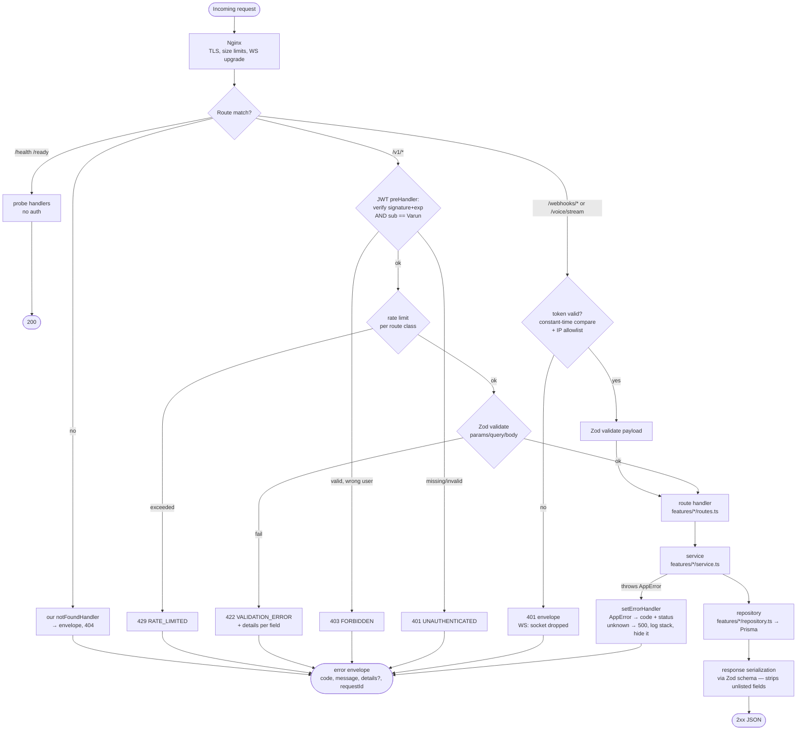

# 12 — API Design

> **RecruitPilot AI — Production-Grade AI Executive Voice Assistant**
> Document 12 of 21 · Prerequisites: docs 00–11

---

## 1. Goal

Design the **complete HTTP + WebSocket surface** of `apps/api` before implementing another endpoint — so that every route, status code, error shape, and auth rule is a *decision*, not an accident:

- Model the resources RESTfully: **nouns, plural, predictable** — a dashboard client (doc 10) should be able to guess the next URL.
- Fix **one error envelope** used by every failure path — validation, auth, business rules, and 500s all speak the same shape.
- Choose and justify **URL versioning (`/v1`)** and **cursor-based pagination** — the two contracts hardest to change later.
- Produce the **full endpoint inventory**: every route, its method, auth class, and the Zod schemas (in `packages/shared`, doc 03) that define its request/response shapes.
- Define the **WebSocket protocol boundary**: exactly one custom WS surface (Exotel voice streaming, doc 05) — and explain why the dashboard deliberately gets none.
- Keep **OpenAPI generated, never handwritten**: Zod schemas → `fastify-type-provider-zod` → Swagger UI (doc 02), so docs can never drift from code.

By the end you can state, for any URL in the system, who may call it, what it returns on success, and what it returns on every failure — from memory.

---

## 2. Theory

### 2.1 REST resource modeling — nouns, not verbs

REST models the API as a set of **resources** (things) manipulated by a small fixed set of **verbs** (HTTP methods). The verb vocabulary is already decided by HTTP — your job is only to name the nouns:

| Rule | Wrong | Right |
|---|---|---|
| Nouns, not verbs, in paths | `POST /getCalls`, `POST /createRecruiter` | `GET /v1/calls`, `POST /v1/recruiters` |
| Plural resource names | `GET /call/123` | `GET /v1/calls/123` |
| Sub-resources for owned things | `GET /v1/recording?callId=123` | `GET /v1/calls/123/recording` |
| Actions that aren't CRUD → sub-resource noun or explicit action endpoint | `POST /v1/eraseRecruiter` | `POST /v1/recruiters/:id/erase` |

Why it matters: with consistent nouns, the client learns the API's *grammar* once. `GET /v1/calls` implies `GET /v1/calls/:id` exists; `recruiters` behaves the same way. Verbs-in-URLs make every endpoint a special case to memorize.

The one honest exception: **`erase`** is a verb. PII erasure (doc 11 §12) is not a DELETE — it anonymizes in place, cascades to transcripts and memories, and writes an audit record. Modeling it as `DELETE /v1/recruiters/:id` would lie about semantics (the row survives). An explicit action sub-resource (`POST .../erase`) is the industry-standard escape hatch (compare Stripe's `POST /v1/subscriptions/:id/cancel`) — used *rarely* and only when no noun fits.

### 2.2 HTTP semantics done right

HTTP methods carry contracts, and infrastructure (caches, proxies, retry logic, browsers) *relies* on them:

- **GET** is **safe** (no side effects) and **idempotent** (calling it twice = calling it once). Never mutate on GET — a link prefetcher or monitoring probe would mutate your data.
- **POST** creates a resource or triggers an action; not idempotent by default (two POSTs = two resources) — which is exactly why webhooks need explicit idempotency keys (§2.6).
- **PATCH** partially updates: send only the fields that change (`{"status": "shortlisted"}`), the rest stay untouched. (PUT replaces the *whole* resource — we use it only for `settings`, which the dashboard always writes in full.)
- **DELETE** removes. We barely use it — see the `erase` discussion above.

Status codes are the response's machine-readable half. The ones this API uses, and when:

| Code | Meaning | We return it when |
|---|---|---|
| `200 OK` | Success with body | Every successful GET, PATCH, PUT |
| `201 Created` | Resource created | Successful creating POST (rare here — most creation happens via jobs) |
| `204 No Content` | Success, nothing to say | Successful `erase`; webhook acks may also use 200 |
| `400 Bad Request` | Malformed request (unparseable JSON, bad cursor) | Body isn't valid JSON; cursor fails to decode |
| `401 Unauthorized` | Who are you? Missing/invalid credentials | No `Authorization` header; expired/invalid JWT; wrong webhook/WS token |
| `403 Forbidden` | I know who you are; you still can't | Valid JWT but not Varun's user (single-tenant check, §12) |
| `404 Not Found` | Resource doesn't exist | `GET /v1/calls/:id` with an unknown id — **same envelope as every other error** |
| `409 Conflict` | State conflict | e.g., erase requested while erase already in progress |
| `422 Unprocessable Entity` | Well-formed but semantically invalid | Zod validation failure: right JSON, wrong shape/values |
| `429 Too Many Requests` | Rate limit exceeded | Per-route-class limits (§12) — includes `Retry-After` |
| `500 Internal Server Error` | Our bug | Anything unhandled — envelope carries `requestId`, never a stack trace |

The 400/422 split is deliberate: 400 = "I couldn't even read that"; 422 = "I read it, and it violates the schema." Clients handle them differently (retry-after-fix vs report-a-bug), so we distinguish them.

### 2.3 API versioning — why URL `/v1`

Every public contract eventually needs a breaking change. Three mainstream strategies:

| Strategy | Example | Verdict |
|---|---|---|
| **URL path** | `/v1/calls` | ✅ **Chosen.** Visible in every log line, curl, and browser bar; trivially routed (`app.register(v1Routes, { prefix: "/v1" })`); cache-friendly (different URL = different cache key); zero client cleverness required. |
| Header | `Accept: application/vnd.recruitpilot.v1+json` | ❌ Rejected: invisible in logs and URLs, easy to omit (then what's the default?), painful to test in a browser, awkward with caches/CDNs keyed on URL. |
| Query param | `/calls?version=1` | ❌ Rejected: versions aren't filters; optional-looking; pollutes every cache key ambiguously. |

The purists' objection — "URLs should identify resources, not representations" — is academically correct and practically irrelevant at our scale. We optimize for **debuggability**: when a call log says `GET /v1/calls 422`, you know everything.

Scope note: only *dashboard* routes carry `/v1`. Vendor-facing routes (`/webhooks/exotel/status`, `/voice/stream`) and infra routes (`/health`, `/ready`) are configured in external systems (Exotel dashboard, load balancer) — their "versioning" is coordinating a config change with the vendor, and a `/v1` prefix would add ceremony without the ability to actually run two versions side by side.

### 2.4 Pagination — cursor over offset

The calls list grows forever, and new calls arrive *while Varun is scrolling*. This kills offset pagination:

**Offset (`?page=2&limit=20` → SQL `OFFSET 20`)**: between page 1 and page 2, two new calls arrive. Every row shifts down by two — page 2 now re-shows the last two rows of page 1 (duplicates), or skips rows if things were deleted. Also, `OFFSET 100000` forces Postgres to walk and discard 100k rows — it gets slower the deeper you go.

**Cursor (chosen)**: instead of "give me page 2", the client says "give me 20 items *after this exact position*". The cursor encodes the sort position of the last item seen — stable under inserts (new rows appear before your position, never inside your window) and O(1) for the database (`WHERE (started_at, id) < ($1, $2)` hits the index directly).

**Our cursor contract** (this exact shape is the API's promise):

```
Request:   GET /v1/calls?limit=20&cursor=<opaque>
Response:  {
             "items": [ ...CallSummary[] ],
             "nextCursor": "eyJzdGFydGVkQXQiOiIyMDI2LTA3LTA0VDEwOjIxOjAwWiIsImlkIjoiY2xfMDFI..."  // or null
           }
```

Rules:
1. The cursor is **opaque** — base64-encoded `{startedAt, id}` internally, but clients must treat it as a black box. We may change the encoding at any time without a version bump *because* clients never parse it.
2. `nextCursor: null` means "you've reached the end". Its presence/absence is the only pagination signal — there is deliberately **no `totalCount`** (an exact count is a full table scan; if the dashboard ever needs one, it becomes a separate cached endpoint).
3. Sort is fixed per endpoint (`startedAt DESC, id DESC` for calls — `id` as tiebreaker makes ordering total, so two calls in the same millisecond can't straddle a page boundary ambiguously).
4. Filters (`status`, `recruiterId`, `from`/`to` dates) must be **identical across pages** of one walk — the cursor encodes position within *one* sorted, filtered sequence. Changing filters mid-walk = start over with no cursor.

### 2.5 The error envelope — one shape for every failure

An API with three error shapes (Fastify's default validation errors, your handler's errors, and raw 500 HTML) forces every client into three parsers. We define **one envelope, everywhere**:

```json
{
  "error": {
    "code": "CALL_NOT_FOUND",
    "message": "No call exists with id cl_01HXYZ.",
    "details": [{ "path": "params.id", "issue": "not found" }],
    "requestId": "req-9f81b2c4"
  }
}
```

Each field earns its place:

| Field | For whom | Why |
|---|---|---|
| `code` | Machines | A stable, SCREAMING_SNAKE string from the shared constants (doc 03: `packages/shared/src/constants/`). The web app switches on `code`, never on `message` — messages are allowed to improve; codes are contracts. |
| `message` | Humans | Safe to display; explains without leaking internals. |
| `details?` | Machines (optional) | Structured specifics — mainly Zod issues on 422 (`path` + `issue` per field), so forms can highlight the exact bad input. |
| `requestId` | Support | Correlation: the same id is in the Pino log line (doc 09). Varun reports "req-9f81b2c4", you grep one id, you see the whole request — without the error body ever exposing a stack trace or SQL. |

The envelope is produced in exactly **one place**: Fastify's `setErrorHandler`, which maps the `AppError` hierarchy (`core/errors`, doc 03) to `code` + status. `NotFoundError → 404`, `ValidationError → 422`, `AuthError → 401`, `ForbiddenError → 403`, `ConflictError → 409`, anything unknown → 500 with a generic message (details go to logs only). Crucially, we also override Fastify's **built-in validation error output** and the **default 404 handler** — otherwise those two paths bypass our envelope (§10.3).

### 2.6 Idempotency for webhooks

Exotel retries StatusCallbacks on timeouts and non-2xx responses (doc 05 §11) — duplicate delivery is *normal operation*, not an edge case. `POST /webhooks/exotel/status` must therefore be **idempotent**: processing the same callback twice must equal processing it once. Mechanism (doc 01 §3.6): every side effect is keyed by `CallSid` — the handler checks whether this call's terminal event was already recorded (or uses BullMQ's job-id dedupe with `jobId = callSid`) and, on a duplicate, does nothing and still returns 200. Returning an error on a duplicate would make Exotel retry *again* — the correct answer to "I already know" is "thanks, got it."

### 2.7 OpenAPI: generated, never handwritten

Handwritten OpenAPI specs rot the day after they're written. Our pipeline (doc 02) makes drift impossible:

```
Zod schemas (packages/shared) → fastify-type-provider-zod → @fastify/swagger → /docs (UI) + /docs/json (spec)
```

The same Zod schema is simultaneously: (a) runtime request validation, (b) the response **serialization** schema (which also strips unlisted fields — a security control, §10.4 and doc 09), (c) the TypeScript type via `z.infer`, and (d) the OpenAPI documentation. One definition, four jobs. If the schema says a field exists, it exists — because the schema *is* the validator.

---

## 3. Architecture

### 3.1 The endpoint inventory (the contract, in one table)

Three **auth classes** cover every route: `JWT` (Supabase JWT in `Authorization: Bearer`, verified in a Fastify `preHandler` — §12), `TOKEN` (vendor-facing, `VOICE_WS_AUTH_TOKEN`/callback token + IP allowlist, doc 05), and `NONE` (infra probes, safe by construction).

| Method | Path | Auth | Request schema | Response schema | Purpose |
|---|---|---|---|---|---|
| `GET` | `/health` | NONE | — | `HealthResponse` | Liveness probe (doc 09) — process is up |
| `GET` | `/ready` | NONE | — | `ReadyResponse` | Readiness — DB + Redis reachable (doc 09) |
| `POST` | `/webhooks/exotel/status` | TOKEN | `ExotelStatusCallback` | `204` | Call lifecycle events; idempotent by `CallSid`; emits `call.completed` (docs 01 §3.6, 05 §2.5) |
| `GET` | `/voice/stream` | TOKEN | WS upgrade + `?token=` | WS session (§3.4) | Exotel bidirectional audio stream (docs 05, 17) |
| `GET` | `/v1/calls` | JWT | `CallListQuery` | `CallListResponse` | List calls; cursor pagination; filters: `status`, `recruiterId`, `from`, `to` |
| `GET` | `/v1/calls/:id` | JWT | `CallIdParams` | `CallResponse` | One call **with transcript + summary** |
| `GET` | `/v1/calls/:id/recording` | JWT | `CallIdParams` | `RecordingUrlResponse` | Short-lived **signed URL** from Supabase Storage (§12) — never the audio bytes through our API |
| `GET` | `/v1/recruiters` | JWT | `RecruiterListQuery` | `RecruiterListResponse` | List recruiters; cursor pagination |
| `GET` | `/v1/recruiters/:id` | JWT | `RecruiterIdParams` | `RecruiterResponse` | One recruiter **with opportunities + memories** |
| `POST` | `/v1/recruiters/:id/erase` | JWT | `RecruiterIdParams` | `204` | PII erasure — anonymize + cascade + audit (doc 11 §12); rate-limited hardest (§12) |
| `PATCH` | `/v1/opportunities/:id` | JWT | `OpportunityPatch` | `OpportunityResponse` | Triage: `status` ∈ `new → reviewing → interested / declined / archived` |
| `GET` | `/v1/settings` | JWT | — | `SettingsResponse` | Greeting text, screening questions, toggles (doc 01 §11) |
| `PUT` | `/v1/settings` | JWT | `SettingsPut` | `SettingsResponse` | Full replace — dashboard always writes the whole document, hence PUT not PATCH |

Every schema named above lives in `packages/shared/src/schemas/` (doc 03) and is imported by **both** the API (validation + serialization + OpenAPI) and the web app (typed client) — one source of shape truth.

Note what is **absent**: no `POST /v1/calls` (calls are created by telephony, not the dashboard), no `DELETE` on calls or recruiters (retention is a policy in doc 11, erasure is the audited `erase` action), no user management (single tenant — Varun is provisioned in Supabase Auth directly, doc 04).

### 3.2 Request lifecycle — where auth, validation, and errors live



Read the diagram's guarantees: **no handler runs before its auth class passes**; **every failure exit converges on the same envelope**; the route → service → repository layering is doc 03 §4.1's slice, unchanged. The `setErrorHandler` is the single choke point that maps the `AppError` hierarchy (`core/errors`) to `{code, status}` — services throw domain errors and never think about HTTP.

### 3.3 Illustrative Zod schemas (the pattern, three times)

These live in `packages/shared/src/schemas/` — shown here so the inventory table isn't abstract. (Exact final fields land in doc 11's model and doc 17's implementation; the *pattern* is the point.)

```typescript
// packages/shared/src/schemas/call.schema.ts
import { z } from "zod";

// ── Query for GET /v1/calls — the cursor contract of §2.4 made concrete
export const CallListQuery = z.object({
  limit: z.coerce.number().int().min(1).max(100).default(20),
  cursor: z.string().optional(),          // opaque; decoded + verified server-side → 400 if garbage
  status: z.enum(["completed", "failed", "missed", "in_progress"]).optional(),
  recruiterId: z.string().uuid().optional(),
  from: z.coerce.date().optional(),       // filter window on startedAt
  to: z.coerce.date().optional(),
});
export type CallListQuery = z.infer<typeof CallListQuery>;

// ── Response for GET /v1/calls/:id — doubles as the serialization schema:
//    any DB column NOT listed here is stripped before it leaves the process.
export const CallResponse = z.object({
  id: z.string(),
  callSid: z.string(),                    // the correlation id (doc 01 §3.8)
  recruiterId: z.string().uuid().nullable(),
  status: z.enum(["completed", "failed", "missed", "in_progress"]),
  fromNumberMasked: z.string(),           // "+91••••••7842" — full number never serialized (doc 05 §12)
  startedAt: z.string().datetime(),
  durationSeconds: z.number().int().nullable(),
  transcript: z.array(z.object({
    role: z.enum(["assistant", "caller"]),
    text: z.string(),
    at: z.string().datetime(),
  })),
  summary: z.object({
    company: z.string().nullable(),
    role: z.string().nullable(),
    techStack: z.array(z.string()),
    compensation: z.string().nullable(),
    location: z.string().nullable(),
    urgency: z.string().nullable(),
    nextSteps: z.string().nullable(),
  }).nullable(),                          // null until generate-summary job completes
  costUsd: z.number().nullable(),         // per-call cost (doc 00 §11)
});

// ── The one error shape (§2.5) — referenced by EVERY route's error responses in OpenAPI
export const ErrorEnvelope = z.object({
  error: z.object({
    code: z.string(),                     // stable machine code, e.g. "VALIDATION_ERROR"
    message: z.string(),                  // human-safe, no internals
    details: z.array(z.object({ path: z.string(), issue: z.string() })).optional(),
    requestId: z.string(),                // == the Pino log correlation id (doc 09)
  }),
});
```

### 3.4 The WebSocket protocol — exactly one custom WS surface

**What we consume** — `GET /voice/stream` (upgrade) is Exotel's Voice Streaming connection, and *Exotel defines the protocol*, we implement it (doc 05 §2.4): event-typed JSON frames — `start` (call metadata: `CallSid`, from/to), `media` (base64 8 kHz audio chunks, both directions), `stop` (stream end), plus `mark`/`clear` for playback checkpoints and the barge-in flush. Auth is the `?token=VOICE_WS_AUTH_TOKEN` query parameter checked at upgrade, before any session exists (doc 05 §5.5). The doc-05 honesty rule applies with full force here: **exact field names, codec labels, and chunk framing must be verified against current Exotel docs before doc 17 implements the adapter** — this document fixes only *where* the surface lives and *how it authenticates*, never memory-based field names.

**What we deliberately don't build** — the dashboard gets **no custom WebSocket**. The tempting design ("push new calls to the browser over our own WS") would mean owning connection state, reconnection, heartbeats, fan-out, and auth for a second streaming protocol. But every live update the dashboard needs — new call appears, summary lands, status changes — is *a Postgres row changing*, and **Supabase Realtime** (doc 10) already streams row changes to authenticated browsers with RLS enforcement built in. So the rule: **one custom WS surface, vendor-facing, in `features/voice/` — everything browser-facing rides Supabase Realtime.** Fewer protocols, one audited unauthenticated-inbound folder (doc 03 §12), and the whole "live dashboard" feature costs us zero server code.

---

## 4. Folder Structure

Where every artifact of this design lives (canonical tree: doc 03):

```
packages/shared/src/
├── schemas/                       # THE contract: one Zod file per resource
│   ├── call.schema.ts             # CallListQuery, CallSummary, CallListResponse, CallResponse
│   ├── recruiter.schema.ts        # RecruiterListQuery, RecruiterResponse (+opportunities, memories)
│   ├── opportunity.schema.ts      # OpportunityPatch, OpportunityResponse
│   ├── settings.schema.ts         # SettingsPut, SettingsResponse
│   ├── webhook.schema.ts          # ExotelStatusCallback (fields from the saved webhook.site fixture, doc 05 §9.4)
│   └── error.schema.ts            # ErrorEnvelope + Cursor helpers
└── constants/
    └── error-codes.ts             # every `code` the envelope may carry — shared with web

apps/api/src/
├── app.ts                         # swagger plugins, setErrorHandler, setNotFoundHandler,
│                                  #   rate-limit plugin, /v1 prefix registration
├── core/errors/                   # AppError hierarchy → mapped to envelope in ONE place
├── features/
│   ├── calls/calls.routes.ts      # GET /v1/calls, /:id, /:id/recording — schemas imported, zero logic
│   ├── recruiters/recruiters.routes.ts   # GET list/detail + POST /:id/erase
│   ├── opportunities/opportunities.routes.ts  # PATCH /v1/opportunities/:id
│   ├── settings/settings.routes.ts       # GET + PUT /v1/settings
│   └── voice/voice.routes.ts      # POST /webhooks/exotel/status + GET /voice/stream (WS)
└── infra/http/
    ├── auth.prehandler.ts         # Supabase JWT verify + single-tenant check (§12)
    └── swagger.ts                 # @fastify/swagger + fastify-type-provider-zod wiring
```

The doc 03 rules hold without exception: routes import schemas from `@recruitpilot/shared` and contain **no logic**; services throw `AppError`s and know nothing of HTTP; the only unauthenticated-inbound code stays inside `features/voice/`.

---

## 5. Manual Steps

No external accounts or dashboards today — this is a design document, so the manual work is **design review**. Do these on paper before doc 13:

1. **Auth-class walk.** Cover the inventory table (§3.1), list all 13 routes from memory, and state each one's auth class (`JWT` / `TOKEN` / `NONE`). For each `NONE` and `TOKEN` route, say *why* it is safe to be non-JWT: `/health`/`/ready` return no data and mutate nothing (safe by construction); the webhook is token-gated + IP-allowlisted + idempotent (a forged duplicate is a no-op); the WS drops unauthenticated upgrades before a session exists. If you can't defend one, the design has a hole — find it now, not in doc 18's audit.
2. **Write the cursor contract by hand.** Without looking at §2.4: write the request query params, the response shape, the four rules (opacity, `nextCursor: null`, fixed sort with tiebreaker, filters-frozen-per-walk). Compare. This contract is the hardest thing to change post-launch — it must be in your fingers.
3. **Decide and document rate-limit classes.** Fill this table in your own words, then compare with §12:

   | Route class | Limit | Reasoning you should reach |
   |---|---|---|
   | Webhooks + WS (`TOKEN`) | exempt from rate limiting, but token-gated | Exotel's retry storms are *legitimate* traffic; throttling them causes duplicate-delivery cascades. The token + allowlist is the gate, not a counter. |
   | Dashboard reads/writes (`JWT`) | 100 req/min per user | One human clicking a dashboard; 100/min is invisible to Varun, a wall to a script with a stolen token. |
   | `POST /v1/recruiters/:id/erase` | 5 req/min | Destructive + irreversible + audited; nobody legitimately erases faster than this. Slow-by-design. |

4. **Play "which status code?"** — a request has a valid JWT but the JSON body's `status` field says `"banana"` (422); no `Authorization` header at all (401); Varun's JWT but a second Supabase user was somehow created and calls the API (403); `GET /v1/calls/nonexistent-id` (404, *in the envelope*); Exotel re-POSTs a StatusCallback we already processed (200/204, idempotent no-op — **not** 409).

---

## 6. Official Links

| Topic | Link |
|---|---|
| HTTP semantics (RFC 9110 — methods, status codes) | https://www.rfc-editor.org/rfc/rfc9110 |
| Fastify validation & serialization | https://fastify.dev/docs/latest/Reference/Validation-and-Serialization/ |
| fastify-type-provider-zod | https://github.com/turkerdev/fastify-type-provider-zod |
| @fastify/swagger | https://github.com/fastify/fastify-swagger |
| @fastify/rate-limit | https://github.com/fastify/fastify-rate-limit |
| Zod | https://zod.dev |
| OpenAPI specification | https://spec.openapis.org/oas/latest.html |
| Supabase Auth JWTs (verification, JWT secret vs JWKS) | https://supabase.com/docs/guides/auth/jwts |
| Cursor pagination explained (Slack engineering) | https://slack.engineering/evolving-api-pagination-at-slack/ |
| Problem Details for HTTP APIs (RFC 9457 — envelope prior art) | https://www.rfc-editor.org/rfc/rfc9457 |

---

## 7. Commands

The API skeleton from doc 09 is running (`npm run dev` in `apps/api`); these verify the design as it gets implemented.

```bash
# 1. Swagger UI — the generated (never handwritten) API docs:
open http://localhost:3000/docs
# and the raw OpenAPI spec the UI renders:
curl -s http://localhost:3000/docs/json | head -c 800

# 2. Get a test JWT (two ways):
#    a) Log in to the web app (doc 10) → browser devtools → Application → Local Storage
#       → the sb-<project-ref>-auth-token entry → copy the access_token field, OR
#    b) in the web app's browser console:
#       (await supabase.auth.getSession()).data.session.access_token
export JWT="eyJhbGciOi..."        # paste it; expires in ~1h — refetch when 401s return

# 3. Authenticated list call (200 + items/nextCursor):
curl -s http://localhost:3000/v1/calls?limit=5 \
  -H "Authorization: Bearer $JWT" | jq .

# 4. NEGATIVE test — same route, no token. Expect 401 with the envelope:
curl -si http://localhost:3000/v1/calls | tail -n 1 | jq .
# → { "error": { "code": "UNAUTHENTICATED", "message": "...", "requestId": "req-..." } }

# 5. Webhook simulation (token in query, like Exotel will send it).
#    Field names below come from YOUR saved webhook.site fixture (doc 05 §9.4) — not from memory:
curl -si "http://localhost:3000/webhooks/exotel/status?token=$VOICE_WS_AUTH_TOKEN" \
  -H "Content-Type: application/json" \
  -d '{"CallSid":"test-call-001","Status":"completed","Duration":"142"}'
# → 204. Run it AGAIN: still 204, and no duplicate jobs enqueued (idempotency, §2.6).

# 6. Validation negative test — bad limit. Expect 422 with details[]:
curl -s "http://localhost:3000/v1/calls?limit=9999" \
  -H "Authorization: Bearer $JWT" | jq .error
```

---

## 8. Environment Variables

One new variable. (Everything else this document uses — `VOICE_WS_AUTH_TOKEN`, `SUPABASE_URL`, etc. — arrived in docs 04–05.)

| Variable | Purpose | Where used | Where stored |
|---|---|---|---|
| `SUPABASE_JWT_SECRET` | Verifies the signature of Supabase-issued JWTs in the `/v1` preHandler — proof the token came from *our* Supabase Auth and wasn't forged | `infra/http/auth.prehandler.ts` | `.env` / GitHub Secrets |

**Where to find it:** Supabase dashboard → your project → **Project Settings → API → JWT Settings** → "JWT Secret" (reveal + copy). Reference doc 04 for the project itself.

> **Verify before trusting this paragraph:** newer Supabase projects are moving to **asymmetric signing keys (JWKS)** instead of a shared HS256 secret. If your project's JWT Settings page shows a **JWKS URL** (`https://<ref>.supabase.co/auth/v1/.well-known/jwks.json`) or mentions RS256/ECC signing keys, **prefer JWKS verification** — the preHandler fetches (and caches) the public keys and no secret needs to live in your env at all, which is strictly better (nothing to leak, keys rotate server-side). The shared-secret flow described here is the fallback for projects where that's what the dashboard offers. Check *your* dashboard; don't assume.

As always (doc 03 §8): the value goes in git-ignored `.env` + password manager; a placeholder + this comment goes in `.env.example`; the Zod env schema in `core/config/` refuses boot without it.

---

## 9. Verification

You pass this document when all of the following hold:

1. **OpenAPI completeness** — `curl -s localhost:3000/docs/json | jq '.paths | keys'` lists every route in the §3.1 inventory (as routes are implemented in docs 16–17; the skeleton routes from doc 09 appear immediately). Any route missing from the spec means it bypassed the Zod schema wiring — which also means it has no validation. Fix, don't shrug.
2. **Negative-path battery** — each returns the envelope with the right code: no JWT → 401; valid-signature JWT for a non-Varun user → 403; `?limit=9999` → 422 with `details[]` naming the field; unknown call id → 404; unknown *route* (`GET /v1/nope`) → 404 **in the same envelope** (this one catches the forgotten `setNotFoundHandler`).
3. **Envelope consistency probe** — collect the JSON bodies of a 401, a 404, a 422, and a forced 500; `jq 'keys'` on each must be identical: `["error"]`, and each `.error` must contain `code`, `message`, `requestId`.
4. **Idempotency probe** — fire the §7.5 webhook curl twice; second response is still 2xx and BullMQ shows one job set, not two (`jobId = callSid` dedupe).
5. **Self-quiz** (from memory):
   1. Why cursor pagination over offset — what specifically goes wrong on page 2 with offset when calls arrive mid-scroll?
   2. Why one error envelope, and which two Fastify defaults must be overridden to achieve it?
   3. Which routes are public (non-JWT), and what makes each one safe anyway?
   4. What makes the status webhook idempotent, and what key implements it?
   5. Why does the dashboard get no custom WebSocket?
   6. What's the difference between 401 and 403 in this API, concretely?

---

## 10. Common Mistakes

1. **Verbs in URLs** (`/getCalls`, `/updateSettings`). The HTTP method *is* the verb; a verb in the path means you're tunneling RPC through REST and every endpoint becomes unguessable. (Exception policy: rare explicit actions like `/erase` — §2.1.)
2. **200-with-error-body.** `200 {"success": false, "error": ...}` breaks every piece of infrastructure that reads status codes — monitoring counts it as success, caches may store it, retry logic never fires, and clients need bespoke un-wrapping. The status code is the first truth; the envelope elaborates.
3. **Inconsistent error shapes between validation and handler errors.** Fastify's *default* validation failure returns its own format (`{statusCode, error, message}`) — different from your handler's envelope, and its default 404 is a third shape. Clients end up parsing three formats. The fix is mechanical: `setErrorHandler` + `setNotFoundHandler` + the validator error mapping, all funneling into `ErrorEnvelope` — then verify with §9.3's probe.
4. **Skipping response serialization schemas.** Returning the raw Prisma row "because it works" leaks every column — including internal ones you add later (cost breakdowns, provider request ids, soft-delete flags). The Zod response schema is an allowlist: fields not named do not leave the process (doc 09). No route ships without one.
5. **Unauthenticated webhook "because the URL is obscure."** URLs leak — logs, browser history, Exotel's own dashboard, a screenshot. Obscurity is not authentication; the token + allowlist check exists because *anyone* can POST `{"Status":"completed"}` and trigger your entire async plane on a fabricated call (doc 05 §12).
6. **Offset pagination, then "why does page 2 repeat items?"** New calls arriving during scroll shift every offset — duplicates and skips are guaranteed under write load, and deep offsets get slower linearly. This is why the cursor contract is fixed *now*: retrofitting cursors after the web app ships means breaking the client.
7. **Breaking changes inside `/v1`.** Renaming `durationSeconds` to `duration`, or making a nullable field required, silently breaks the deployed dashboard. Inside a version, changes are **additive only** (§11); a change that can't be additive is the birth of `/v2` — both served side by side until the client migrates.

---

## 11. Production Best Practices

- **One shape truth, shared**: every request/response schema lives in `@recruitpilot/shared` and is imported by both apps (doc 03). The web app's fetch wrapper (`apps/web/src/lib/api.ts`) parses responses with the *same* Zod schemas — a contract violation throws in dev the moment it happens, not in production when a component renders `undefined`.
- **Additive-only within v1**: new *optional* fields and new endpoints may land anytime; removing or renaming a response field, changing a type, or tightening a constraint never happens inside v1. The pre-merge test: "could yesterday's deployed web bundle break?" If yes → it's a v2 conversation.
- **Deprecation policy, written down**: when v2 eventually exists, v1 keeps working for a documented window (e.g., 90 days), responses carry a `Deprecation` header, and usage of v1 routes is logged so you *know* when it's safe to remove — never guess from silence.
- **Contract tests** (doc 19): tests assert the *serialized* output of each route against the shared schema — so a repository refactor that changes a field type fails CI, not the dashboard.
- **The spec is a build artifact**: `/docs/json` can be snapshotted in CI and diffed per PR — an unexpected diff on an existing path is a contract change demanding explicit review (this is the API-surface equivalent of doc 03's dependency-cruiser).
- **Every list endpoint paginates from day one**: an unpaginated "it's only 30 rows" endpoint becomes a 40MB response in a year — and adding pagination later is a breaking change. `limit` is capped (100) server-side regardless of what the client asks for.

---

## 12. Security

The API surface is where doc 18's audit will spend most of its time; the design bakes in the controls now:

- **AuthZ beyond authN — the single-tenant check**: a valid Supabase JWT proves "Supabase issued this token", **not** "this is Varun". If sign-ups were ever accidentally enabled (doc 04), any stranger could self-register and hold a *valid* JWT. The `/v1` preHandler therefore checks two things: signature+expiry (authentication → 401) **and** `sub === VARUN_USER_ID` / an owner claim (authorization → 403). Two checks, two distinct status codes, two log lines.
- **Constant-time token comparison**: the webhook/WS token check uses `crypto.timingSafeEqual`, not `===`. String comparison short-circuits at the first differing byte, so response-time differences leak how many leading characters an attacker has right — a timing oracle that turns a 2^256 search into a linear one. `timingSafeEqual` takes the same time regardless.
- **Recordings via short-TTL signed URLs**: `GET /v1/calls/:id/recording` never streams audio through our API and never exposes a permanent Storage URL. It asks Supabase Storage for a **signed URL with a short TTL (~5 min)** and returns that; the browser fetches directly from Storage. A leaked URL (chat paste, screenshot, log) expires before it can circulate, and the bucket itself stays private (doc 04).
- **Rate-limit classes** (`@fastify/rate-limit`, keyed by user id for JWT routes): dashboard 100/min, `erase` 5/min, webhooks/WS exempt-but-token-gated (§5.3's reasoning). 429s return the envelope + `Retry-After`.
- **Request size limits**: Fastify `bodyLimit` set low (e.g., 100 KB) — no dashboard write is large, and the webhook payload is tiny. An unlimited body is a free memory-exhaustion vector on a public endpoint.
- **`requestId` instead of internals**: every error carries a `requestId` matching the Pino log line (doc 09) — full diagnostic power for you (grep one id, see the stack trace *in the logs*), zero information for an attacker (the 500 body never contains stack frames, SQL, file paths, or dependency names).
- **Serialization as exfiltration control**: the response-schema allowlist (§10.4) means even a bug that fetches too much cannot *send* too much — masked phone numbers (`fromNumberMasked`) are the schema's shape, so the unmasked column physically cannot serialize.

---

## 13. Checklist

- [ ] Full endpoint inventory (§3.1) reproducible from memory — 13 routes with method + auth class
- [ ] Status-code table (§2.2) internalized; 400 vs 422 and 401 vs 403 distinctions crisp
- [ ] `/v1` URL versioning rationale stated; header versioning rejection defensible
- [ ] Cursor contract written by hand (§5.2) and matching §2.4's four rules
- [ ] Error envelope fields (`code`, `message`, `details?`, `requestId`) and each one's audience known
- [ ] The two Fastify defaults to override (validation errors + not-found handler) known
- [ ] Webhook idempotency mechanism (`CallSid` keying) understood; duplicate POST = 2xx no-op
- [ ] One-custom-WS rule and the Supabase Realtime rationale (§3.4) understood
- [ ] Rate-limit classes decided and documented (§5.3 table)
- [ ] `SUPABASE_JWT_SECRET` located in the Supabase dashboard — or JWKS URL preferred if the project offers it — and added to `.env` + `.env.example`
- [ ] Single-tenant authZ check (JWT valid AND user is Varun) understood as distinct from authN
- [ ] Curl battery from §7 run (positives and negatives) once the doc-09 skeleton is up
- [ ] Self-quiz (§9.5) passed

---

## 14. Next Step

Proceed to **`13_DOCKER_SETUP.md`** — packaging the monorepo for reproducible runs: multi-stage Dockerfiles for api and web, the one-image-two-entrypoints pattern (server vs worker, doc 01 §3.2), Redis in Compose, local `docker-compose.yml` vs production `docker-compose.prod.yml`, and layer-caching discipline so builds stay fast — verified by bringing the whole stack up with one command.
