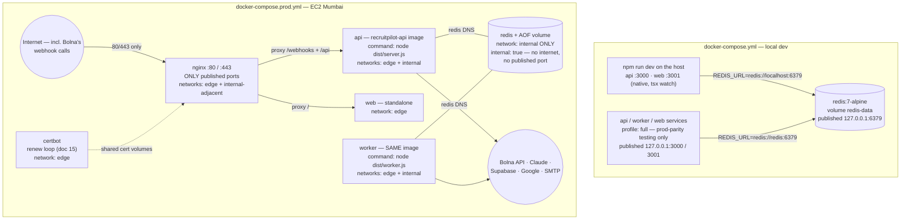

# 13 — Docker Setup

> **RecruitPilot AI — Production-Grade AI Executive Voice Assistant**
> Document 13 of 21 · Prerequisites: docs 00–12

---

## 1. Goal

Containerize the entire system so that "it works on my machine" becomes "it works, period":

- **One API image, two processes**: `docker/api.Dockerfile` builds a single image that runs as *either* the Fastify server (`node dist/server.js`) or the BullMQ worker (`node dist/worker.js`) — the compose `command:` decides (doc 01 §3.2, doc 03 §11).
- **A web image** using Next.js **standalone output** — a self-contained ~50MB runtime instead of shipping the full `node_modules`.
- **Two compose files**: `docker-compose.yml` for local dev (pragmatic default: dockerize *only Redis*, run api/web natively) and `docker-compose.prod.yml` for the EC2 box (Nginx as the single public surface, everything else on a private network).
- **Graceful shutdown that survives containerization** — the SIGTERM → finish-in-flight-webhooks-and-jobs flow from doc 09 must reach the Node process, which Docker breaks by default unless you know the PID 1 rules. (The live audio itself runs on Bolna's platform, not in our containers — but a webhook response or queue job killed mid-write is still data lost.)

By the end you can build, run, inspect, and kill every container locally, and explain *why* every line of every Dockerfile exists.

---

## 2. Theory

### 2.1 Images, containers, layers

- An **image** is an immutable, layered filesystem snapshot plus metadata (env vars, default command, exposed ports). It is the *artifact* — the thing CI builds and the server pulls.
- A **container** is a running (or stopped) *instance* of an image: the image's filesystem plus a thin writable layer, its own process namespace, and its own network interface. Delete the container → the writable layer is gone; the image is untouched.
- A **layer** is one filesystem diff, produced by one Dockerfile instruction (`COPY`, `RUN`, ...). Layers are content-addressed and shared: ten containers from one image share the same read-only layers on disk.

Mental model: image = class, container = object. You never "fix" a running container in production — you build a new image and replace the container (immutable infrastructure).

### 2.2 Layer caching economics (why instruction ORDER matters)

Docker rebuilds a layer only if its inputs changed — and **every layer after a changed layer is also rebuilt**. This makes instruction ordering an economic decision:

```dockerfile
# WRONG — any source file change invalidates the COPY layer,
# so npm ci re-downloads ~800MB of dependencies on EVERY build:
COPY . .
RUN npm ci

# RIGHT — dependency layer is cached until package*.json changes:
COPY package.json package-lock.json ./
RUN npm ci
COPY . .
```

Dependencies change weekly; source changes every minute. Order layers from *least* to *most* frequently changing, and a typical rebuild takes seconds instead of minutes.

**The monorepo twist**: npm workspaces resolve the dependency tree from the **root** `package.json` + `package-lock.json` **plus every workspace's `package.json`** (`apps/api`, `apps/web`, `packages/shared`). `npm ci` fails or mis-hoists if any manifest is missing. So the cached "deps" layer must copy **all workspace manifests** (but *no* source) before `npm ci`:

```dockerfile
COPY package.json package-lock.json ./
COPY apps/api/package.json apps/api/
COPY packages/shared/package.json packages/shared/
RUN npm ci
```

### 2.3 Multi-stage builds (deps → build → runtime)

A single-stage image would ship TypeScript sources, `tsc`, dev dependencies, and npm caches to production — hundreds of wasted MB and a bigger attack surface. **Multi-stage** builds use several `FROM` blocks; only what you explicitly `COPY --from=` a previous stage survives into the final image:

| Stage | Contains | Purpose |
|---|---|---|
| `deps` | manifests + full `node_modules` (dev + prod) | cached dependency install |
| `build` | sources + compilers (`tsc`, Prisma CLI) | `prisma generate`, compile TS → `dist/` |
| `prod-deps` | `node_modules` after `npm prune --omit=dev` | production-only dependency tree |
| `runtime` | `dist/` + pruned `node_modules` + Node itself | what actually runs — **no compilers, no devDeps, no sources** |

Smaller image = faster pulls on EC2, faster deploys, fewer CVEs to patch, and nothing for an attacker to compile with if they get shell access.

### 2.4 `.dockerignore`

The **build context** is everything Docker uploads to the builder before the first instruction runs. Without a `.dockerignore`, that includes `node_modules` (hundreds of MB, wrong platform binaries), `.git`, `.next`, and — catastrophically — **`.env`**. `.dockerignore` keeps builds fast, cache-stable, and guarantees secrets physically cannot end up in an image layer (§12).

### 2.5 Alpine vs Debian-slim (base image choice)

| | `node:22-alpine` | `node:22-slim` (Debian bookworm) |
|---|---|---|
| Size | ~55MB | ~75MB |
| libc | musl | glibc |
| Native modules | occasionally break or need `apk` build tools — musl is the less-tested path | just work — glibc is what every prebuilt binary targets |
| Prisma engines | supported but needs care | first-class |

**Our choice**: `node:22-slim` for the **api** image — it loads Prisma's native query engine, and 20MB is cheap insurance against a 2 a.m. musl segfault. `node:22-alpine` is fine for the **web** image — Next.js standalone output is pure JS with no native runtime deps. Never `node:latest` or bare `node:22` (the full 1GB image, and unpinned tags break reproducibility — §12).

### 2.6 The PID 1 problem + signal handling

Inside a container, your `CMD` runs as **PID 1**. Two traps:

1. **Shell-form CMD eats signals.** `CMD node dist/server.js` (shell form) actually runs `/bin/sh -c "node ..."` — *sh* is PID 1, and `sh` does **not** forward SIGTERM to its child. `docker stop` sends SIGTERM, nothing happens, Docker waits out the grace period, then SIGKILLs. Your graceful shutdown from doc 09 (stop accepting requests → finish in-flight webhook responses → close queue connections) **never runs** — a Bolna tool call mid-deploy gets a dropped connection, and a half-processed job dies uncommitted. Fix: **exec form** — `CMD ["node", "dist/server.js"]` — so Node itself is (effectively) PID 1 and receives SIGTERM directly.
2. **PID 1 doesn't reap zombies.** Normally `init` adopts and reaps orphaned child processes; Node as PID 1 doesn't. Fix: `init: true` in compose, which injects `tini` — a 10KB init that forwards signals and reaps zombies. We use both exec-form CMD *and* `init: true` (belt and suspenders).

Also set `stop_grace_period` sensibly: webhook responses finish in under a second (doc 08 budgets), so 30s covers the api comfortably; the worker gets 60s to finish in-flight jobs (a summary generation can take a while). Docker's default 10 seconds would cut the worker short.

### 2.7 Healthchecks

A container can be "running" while the process inside is deadlocked. A `HEALTHCHECK` runs a command (here: `curl -f http://localhost:3000/health`, the endpoint from doc 09) on an interval; the container is marked `healthy`/`unhealthy` in `docker ps`. Two payoffs:

- `depends_on: { redis: { condition: service_healthy } }` — the api genuinely waits until Redis *answers PING*, not merely until its container exists (which is what plain `depends_on` means).
- In prod, an unhealthy api is visible at a glance and can gate Nginx startup.

The **worker has no HTTP server**, so it disables the inherited healthcheck in compose (`healthcheck: disable: true`) — otherwise it would sit permanently "unhealthy".

### 2.8 Named volumes (Redis persistence)

A container's writable layer dies with the container. Redis holds our **BullMQ queues** — jobs enqueued but not yet processed (transcripts! notifications!) — so its data must outlive restarts. A **named volume** (`redis-data:/data`) is Docker-managed storage independent of any container lifecycle, combined with Redis AOF persistence (`--appendonly yes`, doc 12). `docker compose down` keeps volumes; only `down -v` destroys them — know the difference before you type it.

### 2.9 Compose networks: internal vs edge

Compose creates user-defined bridge networks with **service-name DNS**: the api reaches Redis at hostname `redis` because that's the service name — no IPs, ever. We define two networks in prod:

- **`edge`** — a normal bridge. Nginx, api, worker, web, certbot live here. Only **Nginx publishes ports** (80/443). Containers on `edge` have outbound internet (api/worker need Claude, Supabase, Google Calendar, SMTP, and Bolna's API for recording downloads).
- **`internal`** — declared `internal: true`: **no route to the host's ports and no internet at all**. Only Redis, api, and worker attach. Redis is therefore reachable *exclusively* by api/worker over container DNS — it has no published port and *couldn't* be exposed even by accident. This implements doc 01 §12 literally: "Redis has no public port — the #1 cause of hijacked servers is an exposed Redis."

### 2.10 Build-time ARG vs runtime env — the Next.js nuance

Two injection moments, easy to confuse:

- **Runtime env** (`env_file:`, `environment:`) — read by `process.env` when the container starts. Right for **all api secrets**: same image runs in any environment; config is swapped at start (12-Factor, doc 00 §11).
- **Build-time ARG** — available only while building; its value can be **baked into layers**. Never use for secrets.

The nuance: **`NEXT_PUBLIC_*` variables are build-time for Next.js.** They are string-replaced into the browser JavaScript bundle during `next build` — setting them at container start does *nothing*, the bundle is already written. So the web Dockerfile takes them as `ARG`s and compose passes them under `build.args`. This is safe *only* because `NEXT_PUBLIC_*` values are public by definition (doc 00 §8) — the anon key and URLs already ship to every browser. It also means: **changing a `NEXT_PUBLIC_*` value requires rebuilding the web image**, not just restarting it.

---

## 3. Architecture

The compose topology — dev vs prod. Same api image appears twice in prod (server + worker entrypoints):



Key decisions:

| Decision | Why |
|---|---|
| Dev default = **Redis in Docker, api/web native** | `tsx watch` restarts in ~300ms natively; inside a container you fight bind-mount latency and platform-mismatched `node_modules`. Redis, by contrast, is identical everywhere — containerize the boring part. |
| Full-stack compose kept behind a `full` profile | Prod-parity testing before deploys ("does the *image* work?") without polluting daily dev. |
| One api image, two services | `command:` overrides the Dockerfile `CMD`. API and worker literally cannot drift in version — same digest (doc 03 §11). |
| Nginx publishes 80/443, nothing else publishes anything | Single public surface (doc 01 §12). Fastify/web are reachable only through the proxy. |
| Redis on an `internal: true` network | Unpublishable by construction, not by discipline. |
| Dev ports bound to `127.0.0.1:` | Even locally, don't expose Redis/api to your LAN/coffee-shop Wi-Fi. |

---

## 4. Folder Structure

Files created in this document (paths canonical per doc 03):

```
RecruitPilot_AI/
├── docker/
│   ├── api.Dockerfile          # multi-stage: deps → build → prod-deps → runtime
│   ├── web.Dockerfile          # Next.js standalone, NEXT_PUBLIC_* build ARGs
│   └── nginx/
│       └── nginx.conf          # reverse proxy for webhooks/API/dashboard (TLS finalized in doc 15)
├── docker-compose.yml          # dev: redis (default) + api/worker/web (profile: full)
├── docker-compose.prod.yml     # EC2: nginx + certbot + api + worker + web + redis
└── .dockerignore
```

The complete contents follow. Read every comment — the comments *are* the lesson.

### 4.1 `.dockerignore`

```
# Dependencies & build output — rebuilt inside the image, never uploaded
node_modules
**/node_modules
**/dist
apps/web/.next

# Secrets — MUST never reach the build context (and therefore can never
# end up inside an image layer). .env.example is safe and useful docs.
.env
.env.*
!.env.example

# Repo noise — irrelevant to builds, churns the cache
.git
.github
.claude
docs
coverage
*.log
.DS_Store
README.md
```

### 4.2 `docker/api.Dockerfile`

```dockerfile
# syntax=docker/dockerfile:1
# One image, two entrypoints (doc 01 §3.2): the default CMD runs the API
# server; the worker service overrides it with `command:` in compose.
# Base: node:22-slim (Debian) — glibc for Prisma engines (§2.5).
# Version-pinned, never :latest.

# ---------- Stage 1: deps — cached until a manifest changes (§2.2) ----------
FROM node:22-slim AS deps
WORKDIR /repo
# Monorepo twist: npm workspaces need ALL workspace manifests before npm ci.
# Copy manifests ONLY — no sources — so this expensive layer survives
# every source-code change.
COPY package.json package-lock.json ./
COPY apps/api/package.json apps/api/
COPY packages/shared/package.json packages/shared/
RUN npm ci

# ---------- Stage 2: build — compile TS, generate Prisma client ----------
FROM deps AS build
WORKDIR /repo
COPY prisma ./prisma
COPY packages/shared ./packages/shared
COPY apps/api ./apps/api
# Generate the Prisma client (into node_modules) BEFORE tsc — api code
# imports the generated types.
RUN npx prisma generate
RUN npm run build --workspace=@recruitpilot/shared \
 && npm run build --workspace=@recruitpilot/api

# ---------- Stage 3: prod-deps — production-only node_modules ----------
FROM deps AS prod-deps
WORKDIR /repo
RUN npm prune --omit=dev

# ---------- Stage 4: runtime — small, no compilers, no devDeps (§2.3) ----------
FROM node:22-slim AS runtime
ENV NODE_ENV=production
# openssl: required by Prisma's query engine on Debian.
# curl: used by the HEALTHCHECK below. Nothing else.
RUN apt-get update \
 && apt-get install -y --no-install-recommends openssl ca-certificates curl \
 && rm -rf /var/lib/apt/lists/*
WORKDIR /repo
# Pruned production dependency tree (npm hoists workspace deps to the root)
COPY --from=prod-deps /repo/node_modules ./node_modules
# The Prisma client is GENERATED code — prune doesn't know about it,
# so copy it explicitly from the build stage over the pruned tree.
COPY --from=build /repo/node_modules/.prisma ./node_modules/.prisma
COPY --from=build /repo/node_modules/@prisma/client ./node_modules/@prisma/client
# Compiled output + the manifests Node needs to resolve workspace packages
COPY --from=build /repo/package.json ./package.json
COPY --from=build /repo/packages/shared/package.json ./packages/shared/package.json
COPY --from=build /repo/packages/shared/dist ./packages/shared/dist
COPY --from=build /repo/apps/api/package.json ./apps/api/package.json
COPY --from=build /repo/apps/api/dist ./apps/api/dist
COPY --from=build /repo/prisma ./prisma

# Never run as root (§12). The node base images ship a 'node' user (uid 1000).
USER node

# Final working directory is the api package, so CMD is simply dist/server.js
# and Node resolves node_modules by walking up to /repo/node_modules.
WORKDIR /repo/apps/api
EXPOSE 3000

# Container-level liveness: hits the /health endpoint from doc 09.
# start-period covers boot (config validation, Redis connect).
HEALTHCHECK --interval=15s --timeout=3s --start-period=20s --retries=3 \
  CMD curl -fsS http://localhost:3000/health || exit 1

# EXEC FORM — mandatory. Shell form would make /bin/sh PID 1 and swallow
# SIGTERM, breaking graceful shutdown (§2.6) and killing in-flight
# webhook responses and queue work.
CMD ["node", "dist/server.js"]
```

### 4.3 `docker/web.Dockerfile`

Requires `output: "standalone"` in `apps/web/next.config.js` (set in doc 10): `next build` then emits `.next/standalone/` — a minimal server with only the runtime files it actually imports.

```dockerfile
# syntax=docker/dockerfile:1
# Alpine is safe here: standalone Next.js output is pure JS (§2.5).

# ---------- Stage 1: deps ----------
FROM node:22-alpine AS deps
WORKDIR /repo
COPY package.json package-lock.json ./
COPY apps/web/package.json apps/web/
COPY packages/shared/package.json packages/shared/
RUN npm ci

# ---------- Stage 2: build ----------
FROM deps AS build
WORKDIR /repo
COPY packages/shared ./packages/shared
COPY apps/web ./apps/web

# NEXT_PUBLIC_* values are inlined into the browser bundle AT BUILD TIME
# (§2.10). They arrive as build ARGs, exported as env for `next build`.
# They are public by definition — NEVER pass a secret through ARG.
ARG NEXT_PUBLIC_SUPABASE_URL
ARG NEXT_PUBLIC_SUPABASE_ANON_KEY
ARG NEXT_PUBLIC_API_URL
ENV NEXT_PUBLIC_SUPABASE_URL=$NEXT_PUBLIC_SUPABASE_URL \
    NEXT_PUBLIC_SUPABASE_ANON_KEY=$NEXT_PUBLIC_SUPABASE_ANON_KEY \
    NEXT_PUBLIC_API_URL=$NEXT_PUBLIC_API_URL

RUN npm run build --workspace=@recruitpilot/shared \
 && npm run build --workspace=@recruitpilot/web

# ---------- Stage 3: runtime — standalone output only ----------
FROM node:22-alpine AS runtime
ENV NODE_ENV=production PORT=3001 HOSTNAME=0.0.0.0
WORKDIR /app
# In a monorepo, standalone preserves the repo layout: the server entry
# lands at apps/web/server.js inside the standalone folder.
COPY --from=build /repo/apps/web/.next/standalone ./
COPY --from=build /repo/apps/web/.next/static ./apps/web/.next/static
COPY --from=build /repo/apps/web/public ./apps/web/public
USER node
EXPOSE 3001
CMD ["node", "apps/web/server.js"]
```

### 4.4 `docker-compose.yml` (local dev)

Two honest options, one recommendation:

- **Option A (recommended daily driver)**: `docker compose up -d redis` + `npm run dev` on the host. Native `tsx watch`/`next dev` give sub-second reloads and real debugger attachment; the only stateful infra (Redis) is containerized and identical to prod.
- **Option B (prod-parity testing)**: the `full` profile runs the *built images* — exactly what EC2 will run. Use it before every deploy and whenever debugging "works natively, fails in Docker". (A third pattern — bind-mounting sources into a container running `tsx watch` — exists, but on macOS file-watch latency through the VM makes it strictly worse than Option A; we skip it deliberately.)

```yaml
name: recruitpilot

services:
  # ---- The daily-dev default: `docker compose up -d redis` ----
  redis:
    image: redis:7-alpine
    command: ["redis-server", "--appendonly", "yes"]   # AOF: queued jobs survive restarts (§2.8)
    ports:
      - "127.0.0.1:6379:6379"    # loopback only — never expose Redis to the LAN
    volumes:
      - redis-data:/data
    healthcheck:
      test: ["CMD", "redis-cli", "ping"]
      interval: 5s
      timeout: 3s
      retries: 5

  # ---- Prod-parity profile: `docker compose --profile full up --build` ----
  api:
    profiles: ["full"]
    build:
      context: .
      dockerfile: docker/api.Dockerfile
    init: true                    # tini as PID 1: signal forwarding + zombie reaping (§2.6)
    env_file: .env                # all secrets injected at RUNTIME, never baked in
    environment:
      HOST: 0.0.0.0               # doc 09: bind all interfaces or the port mapping is dead air
      REDIS_URL: redis://redis:6379   # service-name DNS (§2.9), not localhost
    ports:
      - "127.0.0.1:3000:3000"
    depends_on:
      redis:
        condition: service_healthy    # waits for PING, not just container existence (§2.7)

  worker:
    profiles: ["full"]
    build:
      context: .
      dockerfile: docker/api.Dockerfile   # SAME image as api...
    command: ["node", "dist/worker.js"]   # ...different entrypoint (doc 01 §3.2)
    init: true
    env_file: .env
    environment:
      REDIS_URL: redis://redis:6379
    healthcheck:
      disable: true               # no HTTP server in the worker — inherited curl check would lie
    depends_on:
      redis:
        condition: service_healthy

  web:
    profiles: ["full"]
    build:
      context: .
      dockerfile: docker/web.Dockerfile
      args:                       # BUILD-time, because NEXT_PUBLIC_* is baked into the bundle (§2.10)
        NEXT_PUBLIC_SUPABASE_URL: ${NEXT_PUBLIC_SUPABASE_URL}
        NEXT_PUBLIC_SUPABASE_ANON_KEY: ${NEXT_PUBLIC_SUPABASE_ANON_KEY}
        NEXT_PUBLIC_API_URL: ${NEXT_PUBLIC_API_URL}
    init: true
    ports:
      - "127.0.0.1:3001:3001"

volumes:
  redis-data:
```

(Compose reads `${...}` values from the root `.env` automatically. Naming a profiled service explicitly — `docker compose up api worker` — activates its profile without the `--profile` flag.)

### 4.5 `docker-compose.prod.yml` (EC2 Mumbai — deployed in docs 14/15)

```yaml
name: recruitpilot

# Reused logging block: cap container logs so they can't fill the EC2 disk (§11).
x-logging: &default-logging
  driver: json-file
  options:
    max-size: "10m"
    max-file: "3"

services:
  nginx:
    image: nginx:1.27-alpine
    restart: unless-stopped
    ports:
      - "80:80"      # the ONLY published ports on the whole host (doc 01 §12)
      - "443:443"
    volumes:
      - ./docker/nginx/nginx.conf:/etc/nginx/nginx.conf:ro
      - certbot-webroot:/var/www/certbot:ro     # ACME challenges (doc 15)
      - letsencrypt:/etc/letsencrypt:ro         # certificates (doc 15)
    depends_on:
      api:
        condition: service_healthy   # don't proxy to an api that isn't ready
      web:
        condition: service_started
    networks: [edge]
    logging: *default-logging

  certbot:
    image: certbot/certbot
    restart: unless-stopped
    # Renewal loop; issuance + full TLS wiring is doc 15's job.
    entrypoint: /bin/sh -c 'trap exit TERM; while :; do certbot renew --webroot -w /var/www/certbot; sleep 12h & wait $${!}; done'
    volumes:
      - certbot-webroot:/var/www/certbot
      - letsencrypt:/etc/letsencrypt
    networks: [edge]
    logging: *default-logging

  api:
    image: ghcr.io/gandhi120/recruitpilot-api:${IMAGE_TAG:-latest}   # tag = git SHA, set by doc 14
    restart: unless-stopped
    init: true
    env_file: .env                # server-side /opt/recruitpilot/.env (doc 15) — never in the image
    environment:
      HOST: 0.0.0.0
      REDIS_URL: redis://redis:6379
    stop_grace_period: 30s        # §2.6: finish in-flight webhook responses, then exit
    mem_limit: 1g                 # sized for the EC2 instance; tuned in doc 15
    depends_on:
      redis:
        condition: service_healthy
    networks: [edge, internal]    # edge: vendors + nginx · internal: redis
    logging: *default-logging

  worker:
    image: ghcr.io/gandhi120/recruitpilot-api:${IMAGE_TAG:-latest}   # same image, same digest as api
    command: ["node", "dist/worker.js"]
    restart: unless-stopped
    init: true
    env_file: .env
    environment:
      REDIS_URL: redis://redis:6379
    healthcheck:
      disable: true
    stop_grace_period: 60s        # doc 09: finish in-flight jobs, then exit
    mem_limit: 512m
    depends_on:
      redis:
        condition: service_healthy
    networks: [edge, internal]
    logging: *default-logging

  web:
    image: ghcr.io/gandhi120/recruitpilot-web:${IMAGE_TAG:-latest}   # NEXT_PUBLIC_* already baked in by CI (doc 14)
    restart: unless-stopped
    init: true
    mem_limit: 512m
    networks: [edge]
    logging: *default-logging

  redis:
    image: redis:7-alpine
    command: ["redis-server", "--appendonly", "yes"]
    restart: unless-stopped
    # NO ports: — Redis is reachable only via container DNS on `internal`.
    volumes:
      - redis-data:/data
    healthcheck:
      test: ["CMD", "redis-cli", "ping"]
      interval: 5s
      timeout: 3s
      retries: 5
    mem_limit: 256m
    networks: [internal]          # internal:true network — no host ports, no internet (§2.9)
    logging: *default-logging

networks:
  edge:                           # normal bridge: outbound internet, nginx publishes here
  internal:
    internal: true                # NO external routing — Redis physically unexposable

volumes:
  redis-data:
  certbot-webroot:
  letsencrypt:
```

### 4.6 `docker/nginx/nginx.conf` (essentials — TLS finalized in doc 15)

The public surface is **plain HTTPS** now: Bolna's webhook calls (identify, tools, post-call — doc 08), the dashboard's REST calls, and the dashboard itself. No WebSocket voice path, no long-lived connections, no special upgrade headers — the config is deliberately boring. Shown here with the port-80 server block; doc 15 adds `listen 443 ssl`, certificates, and the real `server_name` + HTTP→HTTPS redirect.

```nginx
worker_processes auto;

events {
    worker_connections 1024;
}

http {
    include       /etc/nginx/mime.types;
    default_type  application/octet-stream;

    sendfile on;
    client_max_body_size 10m;      # resume uploads via dashboard; Bolna webhook bodies are far smaller

    gzip on;
    gzip_types text/plain text/css application/json application/javascript;

    # Service-name DNS from the compose `edge` network (§2.9)
    upstream api_upstream { server api:3000; }
    upstream web_upstream { server web:3001; }

    server {
        listen 80;
        server_name _;             # doc 15 sets the real domain + 443/TLS block

        # ACME HTTP-01 challenges for certbot (doc 15)
        location /.well-known/acme-challenge/ {
            root /var/www/certbot;
        }

        # ---- The Bolna webhook surface (docs 08/12): identify, tools, post-call ----
        # Token auth happens in Fastify (Bearer BOLNA_WEBHOOK_TOKEN); nginx just
        # proxies. Keep timeouts DEFAULT — identify must answer in <500ms anyway
        # (doc 08); a webhook that needs a long timeout is a bug, not a config task.
        location /webhooks/ {
            proxy_pass http://api_upstream;
            proxy_http_version 1.1;
            proxy_set_header Host $host;
            proxy_set_header X-Forwarded-For $proxy_add_x_forwarded_for;
            proxy_set_header X-Forwarded-Proto $scheme;
        }

        # Dashboard REST API
        location /api/ {
            proxy_pass http://api_upstream;
            proxy_http_version 1.1;
            proxy_set_header Host $host;
            proxy_set_header X-Forwarded-For $proxy_add_x_forwarded_for;
            proxy_set_header X-Forwarded-Proto $scheme;
        }

        # Everything else → Next.js dashboard
        location / {
            proxy_pass http://web_upstream;
            proxy_http_version 1.1;
            proxy_set_header Host $host;
            proxy_set_header X-Forwarded-For $proxy_add_x_forwarded_for;
            proxy_set_header X-Forwarded-Proto $scheme;
        }
    }
}
```

---

## 5. Manual Steps

Docker Desktop is already installed and running (doc 00 §5). Now:

1. **Create the five files** exactly as in §4: `.dockerignore` (repo root), `docker/api.Dockerfile`, `docker/web.Dockerfile`, `docker-compose.yml`, `docker-compose.prod.yml`, and `docker/nginx/nginx.conf`. Type or paste them — then re-read every inline comment; each encodes a §2 concept.
2. **Adopt the dev workflow**: daily development is `docker compose up -d redis` once, then `npm run dev` (doc 09/10). Redis keeps running in the background across sessions; the whale icon menu → Dashboard shows it.
3. **Do one full prod-parity build now** (§7 commands): build the api image, run api + worker + redis, hit `/health`. Expect the *first* build to take several minutes (downloading base images + `npm ci`); rebuild after touching only a source file and watch it finish in seconds — that's §2.2 working.
4. **Learn to read logs**: `docker compose logs -f api` tails the api container's stdout — which is Pino JSON (doc 09). `-f` follows, `--since 10m` limits history, `docker compose logs -f` (no service) interleaves all services with color-coded prefixes. In prod this is your primary debugging tool, so build the habit now.
5. **Know the rebuild rules**: source change → `docker compose build api` reuses the cached deps layer (fast). Changed `package.json`/`package-lock.json` → the deps layer busts and `npm ci` reruns (slow, correct). Changed a `NEXT_PUBLIC_*` value → the **web** image must rebuild (§2.10) — restarting is not enough.
6. **Reclaim disk periodically**: images accumulate (every build that changes a layer leaves the old one dangling). `docker system df` shows usage; `docker system prune` removes dangling images/stopped containers/unused networks (it will *not* touch named volumes unless you add `--volumes` — don't, that's your Redis data).
7. **Validate the prod file without running it**: `docker compose -f docker-compose.prod.yml config` renders the fully-resolved YAML (env interpolation applied) or fails with a line-numbered error — this runs in CI too (doc 14).

---

## 6. Official Links

| Topic | Link |
|---|---|
| Dockerfile reference | https://docs.docker.com/reference/dockerfile/ |
| Multi-stage builds | https://docs.docker.com/build/building/multi-stage/ |
| Build cache best practices | https://docs.docker.com/build/cache/ |
| `.dockerignore` | https://docs.docker.com/reference/dockerfile/#dockerignore-file |
| Compose file reference | https://docs.docker.com/reference/compose-file/ |
| Compose networking | https://docs.docker.com/compose/how-tos/networking/ |
| Compose profiles | https://docs.docker.com/compose/how-tos/profiles/ |
| Docker init / tini (PID 1) | https://docs.docker.com/reference/cli/docker/container/run/#init |
| Healthchecks | https://docs.docker.com/reference/dockerfile/#healthcheck |
| Node.js Docker best practices | https://github.com/nodejs/docker-node/blob/main/docs/BestPractices.md |
| Next.js standalone output | https://nextjs.org/docs/app/api-reference/config/next-config-js/output |
| Prisma in Docker | https://www.prisma.io/docs/orm/prisma-client/deployment/deploy-to-docker |
| Nginx reverse-proxy docs | https://nginx.org/en/docs/http/ngx_http_proxy_module.html |
| Docker Scout | https://docs.docker.com/scout/ |

---

## 7. Commands

The full local sequence, in order:

```bash
# Daily dev default: Redis only, detached
docker compose up -d redis
docker compose ps                      # STATUS should show (healthy)

# Prod-parity: build the api image (first run: minutes; cached: seconds)
docker compose build api
docker compose build web               # needs NEXT_PUBLIC_* present in .env

# Run api + worker against the containerized redis
# (naming profiled services activates the `full` profile automatically)
docker compose up api worker

# In a second terminal — verify through the published port:
curl -s localhost:3000/health | jq     # expect {"status":"ok",...} (doc 09)

# Inspect a running container from the inside
docker compose exec api sh             # note: `sh` — slim has no bash by default
# inside: ls dist/  ·  env | grep REDIS  ·  exit

# Tail structured logs
docker compose logs -f api
docker compose logs -f worker          # look for the "queue consumers started" line (doc 12)

# Graceful-shutdown proof (§9)
docker compose stop api                # sends SIGTERM, waits, then SIGKILL

# Validate the production compose file without executing anything
docker compose -f docker-compose.prod.yml config

# Housekeeping
docker system df                       # what's using disk
docker system prune                    # remove dangling images/containers/networks (keeps volumes)

# Tear down dev (keeps the redis-data volume; `-v` would destroy it)
docker compose down
```

---

## 8. Environment Variables

**No new secrets** are introduced — this document changes *where existing variables are injected*, not what they are:

| Variable | Value in containers | Why |
|---|---|---|
| `REDIS_URL` | `redis://redis:6379` | Inside compose, `redis` is a **DNS name** resolving to the Redis container on the shared network (§2.9). Natively-run api (dev Option A) keeps `redis://localhost:6379` from doc 12 — same variable, environment decides the value (12-Factor). |
| `HOST` | `0.0.0.0` | Doc 09: Fastify defaulting to `127.0.0.1` inside a container means the port mapping points at an interface nothing listens on — `curl` gets "connection reset". Set in compose `environment:`, not baked into the image. |
| `PORT` | `3000` (api) / `3001` (web) | Matches `EXPOSE`, healthcheck, and nginx upstreams. |
| `IMAGE_TAG` | git SHA (prod only) | Interpolated into image references in `docker-compose.prod.yml`; written by the deploy pipeline (doc 14). Defaults to `latest` for manual runs. |

**Injection mechanics recap:**

- `env_file: .env` — the root `.env` (doc 03 §8) is loaded into the container **at start**. Right for every secret (`ANTHROPIC_API_KEY`, `DATABASE_URL`, `BOLNA_API_KEY`, `BOLNA_WEBHOOK_TOKEN`, ...). The image contains none of them.
- `environment:` — inline non-secret overrides (`HOST`, `REDIS_URL`) that are *facts about the container topology*, so they live in the compose file, visibly.
- `build.args` — **build-time only**, for the web image's `NEXT_PUBLIC_*` values (§2.10):

| Build ARG (web image only) | Public? | Baked into |
|---|---|---|
| `NEXT_PUBLIC_SUPABASE_URL` | ✅ yes | browser JS bundle at `next build` |
| `NEXT_PUBLIC_SUPABASE_ANON_KEY` | ✅ yes (RLS-guarded, doc 04) | browser JS bundle |
| `NEXT_PUBLIC_API_URL` | ✅ yes | browser JS bundle |

Iron rule: if a value is *not* safe on a billboard, it must never appear in `ARG`, `ENV` in a Dockerfile, or `build.args` — runtime `env_file` only (§12).

---

## 9. Verification

Run each check; all must pass before doc 14:

1. **Healthy api container**: `docker compose up -d redis api` → wait ~30s → `docker compose ps` shows api `Up ... (healthy)` — that's the Dockerfile `HEALTHCHECK` passing repeatedly.
2. **Health endpoint through the container**: `curl -s localhost:3000/health` returns the doc 09 payload. This proves the port mapping, `HOST=0.0.0.0`, and the running server all line up.
3. **Worker consuming**: `docker compose up -d worker` → `docker compose logs worker` shows the BullMQ consumers-started log line from doc 12 and a successful Redis connection to `redis://redis:6379`.
4. **Redis persistence survives restart**: `docker compose exec redis redis-cli SET smoke:test hello` → `docker compose restart redis` → `docker compose exec redis redis-cli GET smoke:test` returns `hello`. The named volume + AOF did their job — queued jobs would survive the same way.
5. **Web builds and serves standalone**: `docker compose build web && docker compose up -d web` → `curl -sI localhost:3001` returns `200` and the login page loads at http://localhost:3001. Check the image size: `docker images | grep web` — standalone should be dramatically smaller than a naive image.
6. **SIGTERM reaches Node (the big one)**: with a `docker compose logs -f api` tail open, run `docker compose stop api` in another terminal. You must see the doc 09 graceful-shutdown logs ("SIGTERM received", drain messages, clean exit) and the stop must complete *well before* the grace period — no 10-second hang ending in SIGKILL. If it hangs: you have a shell-form CMD or a missing signal handler.
7. **Prod file validates**: `docker compose -f docker-compose.prod.yml config` prints resolved YAML with zero errors, and the output shows **no `ports:` under redis, api, worker, or web** — only nginx.

**Self-quiz** (from memory):

1. Why multi-stage builds — name three concrete things the runtime stage does *not* contain, and why that matters.
2. Why exec-form `CMD` — trace exactly what happens to an in-flight Bolna tool webhook and a half-processed queue job when `docker stop` hits a shell-form container.
3. Why does Redis have no published port in prod, and which two compose mechanisms make exposure impossible rather than merely avoided?
4. `NEXT_PUBLIC_API_URL` changed — why does restarting the web container do nothing, and what is the correct fix?
5. Why copy only `package*.json` files before `npm ci`, and which files must be copied in a workspaces monorepo?

---

## 10. Common Mistakes

1. **`COPY . .` before `npm ci`.** Every source edit busts the dependency layer → every build re-downloads all dependencies → 5-minute builds forever. Manifests first, install, *then* sources (§2.2).
2. **Running as root.** The default container user is root; a compromised process then owns the container and has a head start on the host. `USER node` costs one line (§12).
3. **Alpine native-module surprises.** A dependency with a prebuilt glibc binary segfaults or falls back to compiling on musl — often discovered only in prod. That's why the api uses `node:22-slim`; if you ever switch, re-run the full verification (§2.5).
4. **Forgetting `HOST=0.0.0.0`.** The container runs, the healthcheck passes (it curls localhost *inside*), but `curl localhost:3000` from your machine resets — Fastify bound `127.0.0.1` inside the container's namespace. Classic, maddening, one env var (doc 09).
5. **Publishing Redis's port in prod.** `- "6379:6379"` on an internet-facing EC2 box = your Redis is scanned within minutes and used for crypto-mining or data theft — the exact hijack doc 01 §12 warns about. In prod Redis gets *no* `ports:` and sits on `internal: true`.
6. **Shell-form `CMD` eating SIGTERM.** `CMD node dist/server.js` (no brackets) breaks graceful shutdown silently: deploys SIGKILL the process, in-flight webhook responses drop, queue jobs die uncommitted. Always `CMD ["node", ...]` + `init: true` (§2.6).
7. **Baking secrets into images via `ARG`/`ENV`.** `ARG DATABASE_URL` + `RUN` that reads it = the secret is recoverable with `docker history`. Anyone who can pull the image has your database. Secrets are runtime `env_file` only, and `.dockerignore` excludes `.env` so it can't even enter the build context.
8. **Unbounded container logs.** The default json-file driver grows without limit; a chatty worker fills the EC2 disk in weeks and *everything* falls over. `max-size`/`max-file` logging options on every prod service (§4.5) — set once, forget forever.
9. **`docker compose down -v` reflexes.** The `-v` flag deletes named volumes — including `redis-data` and every queued-but-unprocessed job. `down` alone is almost always what you meant.

---

## 11. Production Best Practices

- **Image tags = git SHA, never a floating `latest`** in real deploys: `ghcr.io/gandhi120/recruitpilot-api:<sha>` means you always know exactly what code is running and can roll back by redeploying the previous SHA (pipeline built in doc 14).
- **`restart: unless-stopped` on every prod service** — a crashed api resurrects in seconds without a human; `unless-stopped` (vs `always`) respects deliberate manual stops during maintenance.
- **Log rotation via logging driver options** (`max-size: 10m`, `max-file: 3`) applied through a YAML anchor so no service can be forgotten — disk-full is the most preventable outage there is.
- **Healthcheck-gated `depends_on`** everywhere order matters: api waits for Redis to *answer*, nginx waits for api to be *healthy* — eliminating the crash-loop-on-boot race that plain `depends_on` invites.
- **Prod parity on demand**: `docker-compose.prod.yml` is runnable locally (`config` to validate, or point it at locally-built tags) — the file that runs Mumbai is testable on your laptop, so "compose file typo" is a local failure, not an outage.
- **Resource limits (`mem_limit`) on every service**, summing comfortably under the EC2 instance's RAM (sized in doc 15) — one leaking process gets OOM-killed and restarted by Docker instead of taking the whole box (and your webhook surface) down with it.
- **`stop_grace_period` matched to the workload**: 30s for the api (in-flight webhook responses finish, doc 08 budgets), 60s for the worker (in-flight jobs drain, doc 09/12) — Docker's 10s default would nullify graceful shutdown you carefully built.

---

## 12. Security

Container-level posture (deep dive: `18_SECURITY.md`):

- **Non-root by default**: both Dockerfiles end with `USER node`. Container escape vulnerabilities and file-permission mistakes are dramatically less useful to an attacker running as uid 1000.
- **No secrets in images — verifiable**: `.dockerignore` blocks `.env` from the build context; no `ARG`/`ENV` ever carries a secret; audit any image with `docker history --no-trunc ghcr.io/gandhi120/recruitpilot-api:latest | grep -iE 'key|secret|token'` — it must return nothing.
- **Network isolation by construction**: Redis on an `internal: true` network with zero published ports cannot be reached from the internet even by misconfiguration; only nginx touches 80/443 (doc 01 §12). Dev ports bind `127.0.0.1` for the same reason.
- **Pinned base images**: `node:22-slim`, `redis:7-alpine`, `nginx:1.27-alpine` — never `:latest`, which makes builds non-reproducible and silently pulls unvetted majors. (Digest-pinning is the next level; the CI scanner below flags stale bases.)
- **Read-only root filesystem (noted, deferred)**: `read_only: true` + explicit `tmpfs` mounts is the hardened end-state for the api/web services; we adopt it in doc 18 after confirming no runtime writes are needed — flagged now so the design doesn't accidentally depend on writing inside the container.
- **Image scanning**: Docker Scout (`docker scout cves recruitpilot-api`) or Trivy runs against every built image in CI (wired in doc 14) — CVEs in base layers get caught at PR time, not by an attacker.

---

## 13. Checklist

- [ ] `.dockerignore` created; `.env` confirmed excluded from build context
- [ ] `docker/api.Dockerfile` created — multi-stage, workspace-aware, `USER node`, exec-form CMD, HEALTHCHECK
- [ ] `docker/web.Dockerfile` created — standalone output, `NEXT_PUBLIC_*` as build ARGs
- [ ] `docker-compose.yml` created — redis default, api/worker/web behind `full` profile
- [ ] `docker-compose.prod.yml` created — nginx-only ports, `internal: true` network, log caps, restart policies
- [ ] `docker/nginx/nginx.conf` created — plain HTTPS proxy blocks for `/webhooks/`, `/api/`, and the dashboard
- [ ] Dev workflow adopted: `docker compose up -d redis` + `npm run dev`
- [ ] Layer caching witnessed: source-only rebuild finishes in seconds
- [ ] All seven verification checks (§9) passed — especially the SIGTERM graceful-shutdown test
- [ ] Redis persistence test passed (key survives restart)
- [ ] `docker compose -f docker-compose.prod.yml config` validates cleanly
- [ ] Self-quiz (§9) answered from memory
- [ ] Understood: build-time ARG vs runtime env, and why `NEXT_PUBLIC_*` is build-time

---

## 14. Next Step

Proceed to **`14_GITHUB_ACTIONS.md`** — CI/CD for these images: lint/typecheck/test on every PR, multi-stage builds with GitHub Actions layer caching, pushing SHA-tagged images to GHCR, image scanning, and the deploy job that SSHes into the Mumbai EC2 box and rolls `docker-compose.prod.yml` forward gracefully — webhooks answered throughout.
