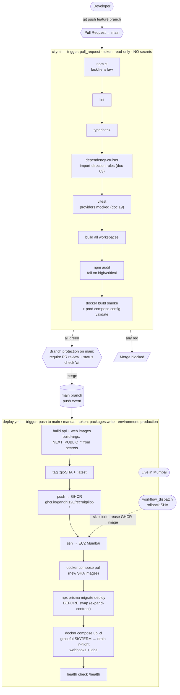

# 14 — GitHub Actions (CI/CD)

> **RecruitPilot AI — Production-Grade AI Executive Voice Assistant**
> Document 14 of 21 · Prerequisites: docs 00–13

---

## 1. Goal

Turn "it builds on my laptop" into "it builds, is verified, ships as a signed image, and deploys to Mumbai — automatically, on every merge, with zero downtime on the webhook surface." Concretely, by the end of this document you will have two workflows in `.github/workflows/`:

- **`ci.yml` — the gate.** Runs on every pull request. Installs with `npm ci` (doc 02 "lockfile is law"), then lints, typechecks, validates import direction with dependency-cruiser (doc 03), runs Vitest, builds every workspace, runs `npm audit`, and smoke-builds the Docker images. If any step fails, the PR **cannot be merged** — branch protection enforces it. This is what stops broken code from ever reaching `main`.
- **`deploy.yml` — the shipper.** Runs on every push to `main` (i.e. every merged PR). Builds the `api` and `web` images (doc 13), tags them with the **git SHA** and `latest`, pushes them to **GHCR** (GitHub Container Registry), then SSHes into the EC2 box, runs `prisma migrate deploy` *before* swapping containers, and rolls `docker-compose.prod.yml` forward. It also runs on-demand (`workflow_dispatch`) with a **rollback SHA** input.

You will also enable **Dependabot** (automated dependency and action-version PRs) and configure the GitHub-side **Secrets** the pipeline needs. The actual server (the values behind `EC2_HOST`, the `.env` on the box, the domain and TLS) is provisioned in **doc 15** — this document builds the *automation* and wires the *empty sockets* it will plug into.

Why automate at all? Because the alternative — a human running `npm test` "when they remember," then `scp`-ing a tarball to a server and restarting it by hand — fails in three predictable ways: someone skips the tests under deadline pressure, someone deploys the wrong commit, and nobody can say with certainty what code is running in production. CI/CD makes the correct path the *only* path, and the automated path the *easy* one.

---

## 2. Theory

### 2.1 What CI/CD actually is (and the two rots it prevents)

**Continuous Integration (CI)** is the discipline of merging every change into a shared mainline frequently — many times a day — and having an automated build+test suite verify each merge. **Continuous Delivery/Deployment (CD)** extends that: once the mainline is green, an automated pipeline packages the artifact and releases it (delivery = ready to release at the push of a button; deployment = released automatically).

Two failure modes motivate the whole practice:

- **Integration rot.** Five developers (or five branches of one developer) each work for a week in isolation. Every branch works alone; none work together. The longer code lives unmerged, the more expensive the eventual merge — a superlinear cost. CI attacks this by making integration *continuous and small*: merge daily, catch conflicts and contract-breaks while they're one-line fixes, not thousand-line archaeology.
- **Deploy fear.** When deploying is a manual, error-prone ritual, teams deploy *rarely*, which makes each deploy *huge*, which makes it *riskier*, which makes teams deploy even more rarely — a doom loop. The cure is counter-intuitive: deploy **more** often, in **smaller** increments, through an **automated, identical, boring** pipeline. A deploy you've run 200 times and can roll back in 90 seconds is not scary. Fear-free deploys are an *engineering property you build*, not a personality trait.

For a voice-agent system this matters twice over: a bad deploy doesn't just show a 500 page — if Bolna's identify or tool webhook (doc 08) hits a half-swapped container mid-call, the agent **fumbles a live conversation** (no memory injected, a tool that "fails" on air). The graceful-shutdown machinery from docs 09/13 (SIGTERM → finish in-flight webhook responses and jobs) only pays off if the deploy process actually *sends* SIGTERM and *waits* — which is exactly what a scripted, repeatable deploy guarantees and a panicked `docker restart` does not.

### 2.2 GitHub Actions vocabulary (workflows → jobs → steps → runners)

GitHub Actions is GitHub's built-in CI/CD engine. Its object model, outermost to innermost:

| Concept | What it is | In our project |
|---|---|---|
| **Workflow** | One YAML file in `.github/workflows/`. Triggered by events. | `ci.yml`, `deploy.yml` |
| **Event / trigger** | What starts a workflow: `pull_request`, `push`, `workflow_dispatch` (manual), `schedule`, … | PR opens → CI; merge to `main` → deploy |
| **Job** | A named unit that runs on **one runner**. Jobs run in parallel by default; `needs:` sequences them. | `verify` (CI); `build` + `deploy` (CD) |
| **Runner** | The machine executing a job. **GitHub-hosted** (`ubuntu-latest`) = a fresh, throwaway Ubuntu VM per job. | We use hosted `ubuntu-latest` — no servers to maintain |
| **Step** | One command (`run:`) or one **action** (`uses:`) inside a job. Steps share the runner's filesystem. | `npm ci`, then `npm run lint`, … |
| **Action** | A reusable, versioned unit of steps published by someone (e.g. `actions/checkout`). | `actions/checkout`, `docker/build-push-action` |

Mental model: a **workflow** is a recipe, an **event** rings the bell, a **runner** is a fresh clean kitchen rented by the minute, **jobs** are cooks who can work simultaneously, **steps** are the ordered instructions each cook follows, and **actions** are pre-packaged mixes you didn't have to make from scratch.

The runner being **fresh and throwaway** is the single most important property: there is no "works because of something left over on the machine." Every run starts from an empty Ubuntu VM, checks out your code, and installs from the lockfile. If it passes there, it passes anywhere — that's the whole point of CI.

### 2.3 The three triggers we use, and why

- **`pull_request`** — fires when a PR is opened or updated. This is the CI gate: verify the *proposed* merge before a human reviews it. Crucially, for PRs from forks it runs with a **read-only** token and **no access to secrets** (§2.7) — a deliberate safety property, not a limitation.
- **`push`** (to `main`) — fires after a PR merges. `main` only advances through merges (branch protection), so "push to `main`" is precisely "a change just landed" — the correct moment to deploy.
- **`workflow_dispatch`** — a manual "Run workflow" button (and `gh workflow run`). We add it to `deploy.yml` with an optional **rollback SHA** input, so a human can redeploy a *known-good previous image* in seconds without reverting git history (§11 rollback runbook).

### 2.4 Caching and why `npm ci`, not `npm install`

Every job starts on a blank VM, so a naive CI re-downloads the entire dependency tree every run — slow and flaky. `actions/setup-node` has a built-in `cache: npm` option: it hashes `package-lock.json`, and on a cache hit restores npm's download cache, so `npm ci` installs from local tarballs instead of the network. Order matters: cache is keyed on the **lockfile**, so it only busts when dependencies actually change.

We use **`npm ci`** (clean install), never `npm install`, and this is doctrine from doc 02 §11 ("lockfile is law"):

- `npm ci` installs **exactly** what `package-lock.json` pins — reproducible, byte-for-byte, the same tree every time.
- `npm ci` **deletes** `node_modules` first and **refuses to run** if `package.json` and the lockfile disagree — it fails loudly instead of silently "fixing" the lockfile.
- `npm install` may *mutate* the lockfile (resolving new minor/patch versions), meaning CI could test a different dependency tree than the one you committed. In CI that's a correctness bug: you'd be verifying code you aren't shipping.

The Docker builds (doc 13) already use `npm ci` for the same reason. CI and the image build agree on the resolver.

### 2.5 Artifacts vs registry images (two very different outputs)

Actions can produce two kinds of output, and confusing them is a classic mistake:

| | **Artifact** | **Registry image** |
|---|---|---|
| What | A zip of files attached to a workflow run (logs, coverage, a built bundle) | A Docker image in a container registry (GHCR) |
| Lifespan | Days (retention setting), then auto-deleted | Permanent until you delete it |
| Addressed by | Run ID, in the Actions UI | `ghcr.io/owner/name:tag` — pullable by any machine |
| Our use | (optional) coverage/test reports | **the deploy unit** — EC2 pulls `ghcr.io/gandhi120/recruitpilot-api:<sha>` |

Our deployable **is a registry image**, not an artifact. Artifacts are for humans to inspect a run; images are for machines to run. The EC2 box never touches the CI runner's filesystem — it pulls a versioned, immutable image from GHCR.

### 2.6 SHA tags — why we tag images with the git commit

Every image we push is tagged with the full **git commit SHA** (`${{ github.sha }}`) *and* the moving tag `latest`. The SHA tag is the load-bearing one:

- **Traceability.** `ghcr.io/gandhi120/recruitpilot-api:9f3c1a…` maps to exactly one commit. "What's running in prod?" is answerable to the line of code.
- **Rollback = redeploy a prior SHA.** Because old images stay in GHCR, rolling back is not a rebuild or a `git revert` scramble — it is `IMAGE_TAG=<previous-sha> docker compose up -d`. Seconds, deterministic, no compile. This is why `docker-compose.prod.yml` (doc 13 §4.5) references `${IMAGE_TAG:-latest}` instead of hardcoding a tag.
- **Immutability.** `latest` moves; a SHA never does. Deploying by SHA means "the artifact I tested is byte-identical to the artifact I ran."

### 2.7 The `GITHUB_TOKEN` permissions model

Every workflow run is handed an automatically-generated, short-lived credential: **`GITHUB_TOKEN`** (available as `${{ secrets.GITHUB_TOKEN }}`). You never create or store it; GitHub mints it at job start and revokes it at job end. Two things to internalize:

- **It is least-privilege by policy.** We set the repo/organization default to **read-only**, then grant *just* what each workflow needs, in that workflow, via a `permissions:` block. CI needs only `contents: read`. The deploy workflow additionally needs `packages: write` to push to GHCR — nothing more.
- **Fork PRs get a neutered token and no secrets.** A `pull_request` from someone's fork runs with a read-only `GITHUB_TOKEN` and **cannot read your secrets**. This is what makes it safe to run CI on contributions from strangers. (The dangerous opposite, `pull_request_target`, is a foot-gun covered in §10.)

Because CI has no secrets and a read-only token, an attacker who opens a malicious PR *cannot* exfiltrate your Bolna or Anthropic key or push a poisoned image — the blast radius is "they wasted some free CI minutes."

### 2.8 Environments and protection rules

A GitHub **Environment** (Settings → Environments) is a named deployment target — we create one called **`production`**. A job that declares `environment: production` gains:

- **Scoped secrets/variables** that only jobs targeting that environment can read (an extra containment boundary around `EC2_SSH_PRIVATE_KEY`).
- **Protection rules** — optionally, **required reviewers** (a human must click "Approve deployment" before the deploy job proceeds) and wait timers. For a solo project this is optional; the *mechanism* is what matters — it's how you'd add a manual gate before touching prod without changing a line of workflow code.
- **A deployment history** in the GitHub UI: what shipped, when, by whom.

### 2.9 Concurrency groups (cancel superseded CI, serialize deploys)

Two workflows, two opposite concurrency needs — both expressed with a `concurrency:` block:

- **CI: cancel superseded runs.** If you push three commits to a PR in five minutes, you don't care about CI results for the first two — only the latest tree matters. `concurrency: { group: ci-${{ github.ref }}, cancel-in-progress: true }` cancels the older, now-pointless runs. Saves minutes, gives faster feedback.
- **Deploy: never overlap, never cancel.** Two deploys running at once — both SSHing in, both running migrations, both swapping containers — is how you corrupt a database or leave half-old/half-new containers. `concurrency: { group: deploy-production, cancel-in-progress: false }` serializes deploys: a second one **queues and waits** for the first to finish. `cancel-in-progress: false` is critical — you must **never** kill a deploy mid-migration.

The one word that distinguishes them, `cancel-in-progress`, encodes the whole difference: throwaway verification vs irreversible production action.

---

## 3. Architecture

The two pipelines and the branch-protection gate between them. A PR must go green through `ci.yml` before it can merge; merging pushes to `main`, which triggers `deploy.yml`.



The shape to hold in your head: **CI is a wall** (nothing crosses without going green), **branch protection is the gatekeeper** (it enforces the wall mechanically), and **CD is a conveyor belt** (green merge → running in Mumbai, hands-off) with a **manual override lever** (rollback) beside it.

Ordering inside CI is deliberate — **fail-fast, cheapest first** (§11): a lint error should fail in 20 seconds, not after a five-minute Docker build. `npm audit` and the Docker smoke build are last because they're the slowest and the least likely to fail on a normal code change.

---

## 4. Folder Structure

Everything in this document lives under `.github/` at the repo root (canonical per doc 03 §3, doc 00 §4):

```
RecruitPilot_AI/
├── .github/
│   ├── workflows/
│   │   ├── ci.yml            # PR gate: install → lint → typecheck → depcruise → test → build → audit → docker smoke
│   │   └── deploy.yml        # push to main / manual: build+push images → ssh EC2 → migrate → compose up
│   └── dependabot.yml        # weekly PRs: npm dependencies + github-actions versions
├── .nvmrc                     # Node version, single source of truth (doc 02 §11) — read by CI & Dockerfiles
├── .dependency-cruiser.cjs    # import-direction rules validated in CI (doc 03)
├── docker/
│   ├── api.Dockerfile         # built & pushed by deploy.yml (doc 13)
│   └── web.Dockerfile         # built with NEXT_PUBLIC_* build-args (doc 13 §2.10)
├── docker-compose.prod.yml    # the file deploy.yml rolls forward on EC2 (doc 13 §4.5)
└── package.json               # root scripts: lint, typecheck, test, build across workspaces
```

`.github/` is a magic directory: GitHub automatically discovers any `.yml` in `.github/workflows/` and reads `.github/dependabot.yml`. There is nothing to "register" — commit the file and it's live.

The complete, runnable contents of the three files follow. As in doc 13, **read every inline comment — the comments are the lesson.**

### 4.1 `.github/workflows/ci.yml`

```yaml
name: CI

# WHY these triggers: verify every proposed merge (pull_request) before a human
# reviews it. workflow_dispatch lets you re-run the gate manually from the UI.
# We deliberately do NOT run heavy CI on every push to every branch — the PR is
# the integration point that matters.
on:
  pull_request:
    branches: [main]
  workflow_dispatch:

# Least privilege (§2.7): CI reads code and needs nothing else. No package
# writes, no deployments. If this workflow were ever compromised, a read-only
# token is a non-event.
permissions:
  contents: read

# Cancel superseded runs (§2.9): push 3 commits to a PR quickly → only the
# newest tree is worth testing. Group per PR ref so different PRs don't cancel
# each other.
concurrency:
  group: ci-${{ github.ref }}
  cancel-in-progress: true

jobs:
  verify:
    name: Lint · Typecheck · Test · Build
    runs-on: ubuntu-latest        # GitHub-hosted throwaway VM (§2.2)
    timeout-minutes: 20           # a hung job self-destructs instead of burning minutes

    steps:
      # Full-SHA-pinned actions (§12 supply chain). The trailing "# vX" comment is
      # for humans; the 40-char SHA is what actually runs. Dependabot bumps these.
      - name: Checkout
        uses: actions/checkout@11bd71901bbe5b1630ceea73d27597364c9af683  # v4.2.2

      - name: Set up Node (version from .nvmrc) + npm cache
        uses: actions/setup-node@1e60f620b9541d16bece96c5465dc8ee9832be0b  # v4.4.0
        with:
          node-version-file: .nvmrc   # single source of truth — CI never drifts from Dockerfiles (doc 02 §11)
          cache: npm                  # hash package-lock.json, restore npm's download cache (§2.4)

      # npm ci, NEVER npm install (§2.4). Reproducible, fails if lockfile drifts.
      - name: Install dependencies
        run: npm ci

      # FAIL-FAST ORDER (§11): cheapest checks first. A style error should fail in
      # seconds, long before we spend minutes building Docker images.
      - name: Lint
        run: npm run lint

      - name: Typecheck
        run: npm run typecheck

      # Import-direction rules from doc 03: features/core must not import providers
      # directly. Mechanical enforcement of the Provider Pattern (doc 00 §3.3).
      - name: Validate dependency directions
        run: npx depcruise apps/api/src --validate

      # Vitest across every workspace. Providers are MOCKED (doc 19) — which is why
      # CI needs no Bolna/Claude/Google keys (§8, and a security property §2.7).
      - name: Test
        run: npm test

      # Compile every workspace exactly as the Dockerfiles do — catches type-only or
      # build-config breakage that tests alone miss.
      - name: Build all workspaces
        run: npm run build

      # Supply-chain gate (doc 02 §12): fail the PR on a known high/critical CVE in a
      # dependency. --audit-level=high ignores low/moderate noise but blocks the serious ones.
      - name: Audit dependencies
        run: npm audit --audit-level=high

      # Docker "smoke" build: prove the Dockerfiles still build (no push — CI has no
      # packages:write, §2.7). build-args are throwaway placeholders: we're testing that
      # the image BUILDS, not shipping it. Real values are injected by deploy.yml.
      - name: Smoke-build Docker images
        run: |
          docker build -f docker/api.Dockerfile -t recruitpilot-api:ci .
          docker build -f docker/web.Dockerfile -t recruitpilot-web:ci \
            --build-arg NEXT_PUBLIC_SUPABASE_URL=http://localhost \
            --build-arg NEXT_PUBLIC_SUPABASE_ANON_KEY=ci-not-a-real-key \
            --build-arg NEXT_PUBLIC_API_URL=http://localhost .

      # Validate the production compose file renders (doc 13 §5.7) — a typo here would
      # otherwise surface only at deploy time, on the live box.
      - name: Validate production compose file
        run: docker compose -f docker-compose.prod.yml config
```

**Line-by-line on the non-obvious parts:**

- `on.pull_request.branches: [main]` — CI runs for PRs *targeting* `main`. Combined with branch protection (§5), this is the wall every change must cross.
- `permissions: { contents: read }` — this single block downgrades the job's `GITHUB_TOKEN` to read-only. Even though CI never uses the token, declaring least privilege is the habit (§12).
- `concurrency.group: ci-${{ github.ref }}` — `github.ref` is the PR's branch, so each PR has its own concurrency lane; a new push cancels only *that* PR's stale run, not everyone's.
- `node-version-file: .nvmrc` — reads the *same* file the Dockerfiles pin against (doc 13 uses `node:22-slim`). One version number, one place, zero dev/CI/prod drift (doc 02 §11). Bump `.nvmrc` and the base image tag together and everything follows.
- `cache: npm` needs no path config — `setup-node` knows npm's cache location and keys on the lockfile automatically.
- The **`npx depcruise apps/api/src --validate`** step is the CI half of doc 03's promise: the Provider-Pattern import rule is "mechanical, not aspirational." A feature that sneaks in `import Anthropic` fails here, before review.
- `npm test` needs **no vendor secrets** because tests fake every provider and replay recorded Bolna webhook payloads as fixtures (doc 19). That's not a shortcut — it's the design (§8, §12): CI that can't reach the internet can't leak keys or flake on a vendor outage.
- The Docker smoke build passes deliberately-fake `--build-arg` values. `NEXT_PUBLIC_*` are baked at build time (doc 13 §2.10), so `next build` needs *something* present or it errors — but since we `push: false`, this throwaway image is discarded. We're testing "does the Dockerfile build," not producing a deployable.
- `docker compose -f docker-compose.prod.yml config` is the exact doc 13 §5.7 validation, now automated: a malformed prod compose file fails a PR instead of a 2 a.m. deploy.

### 4.2 `.github/workflows/deploy.yml`

```yaml
name: Deploy

# Trigger 1: every push to main (i.e. every merged PR) → ship it.
# Trigger 2: manual button with an optional rollback SHA (§2.3, §11). Leave the
# input blank for a normal manual redeploy of HEAD; fill it to redeploy an OLD image.
on:
  push:
    branches: [main]
  workflow_dispatch:
    inputs:
      sha:
        description: "Image SHA to (re)deploy for rollback. Blank = build & deploy current commit."
        required: false
        type: string

# The deploy needs to WRITE images to GHCR. Everything else stays read-only (§2.7).
permissions:
  contents: read
  packages: write

# Serialize deploys, NEVER cancel one mid-flight (§2.9). A second deploy queues
# and waits — no overlapping migrations, no half-swapped container sets.
concurrency:
  group: deploy-production
  cancel-in-progress: false

# Reused across jobs. GHCR wants a lowercase owner; ${{ github.repository_owner }}
# happens to be lowercase for us (gandhi120), shown explicitly for clarity.
env:
  REGISTRY: ghcr.io
  IMAGE_OWNER: gandhi120

jobs:
  # ---------------------------------------------------------------------------
  # JOB 1: build both images and push them to GHCR, tagged by git SHA + latest.
  # Skipped entirely on a rollback dispatch (the image already exists in GHCR).
  # ---------------------------------------------------------------------------
  build:
    name: Build & push images to GHCR
    runs-on: ubuntu-latest
    if: github.event_name == 'push' || github.event.inputs.sha == ''
    timeout-minutes: 30
    steps:
      - name: Checkout
        uses: actions/checkout@11bd71901bbe5b1630ceea73d27597364c9af683  # v4.2.2

      # Log in to GHCR using the auto-minted GITHUB_TOKEN (§2.7) — no PAT to manage.
      # github.actor is whoever triggered the run; the token authorizes packages:write.
      - name: Log in to GHCR
        uses: docker/login-action@74a5d142397b4f367a81961eba4e8cd7edddf772  # v3.4.0
        with:
          registry: ${{ env.REGISTRY }}
          username: ${{ github.actor }}
          password: ${{ secrets.GITHUB_TOKEN }}

      # Buildx enables cache export/import and multi-stage build features.
      - name: Set up Docker Buildx
        uses: docker/setup-buildx-action@e468171a9de216ec08956ac3ada2f0791b6bd435  # v3.11.1

      - name: Build & push API image
        uses: docker/build-push-action@471d1dc4e07e5cdedd4c2171150001c434f0b7a4  # v6.15.0
        with:
          context: .
          file: docker/api.Dockerfile
          push: true
          # Two tags: immutable SHA (for rollback/traceability, §2.6) + moving latest.
          tags: |
            ${{ env.REGISTRY }}/${{ env.IMAGE_OWNER }}/recruitpilot-api:${{ github.sha }}
            ${{ env.REGISTRY }}/${{ env.IMAGE_OWNER }}/recruitpilot-api:latest
          # GitHub Actions layer cache: reuse unchanged layers across runs (§2.4 idea,
          # applied to Docker). deps layer survives until a manifest changes (doc 13 §2.2).
          cache-from: type=gha
          cache-to: type=gha,mode=max

      - name: Build & push Web image
        uses: docker/build-push-action@471d1dc4e07e5cdedd4c2171150001c434f0b7a4  # v6.15.0
        with:
          context: .
          file: docker/web.Dockerfile
          push: true
          tags: |
            ${{ env.REGISTRY }}/${{ env.IMAGE_OWNER }}/recruitpilot-web:${{ github.sha }}
            ${{ env.REGISTRY }}/${{ env.IMAGE_OWNER }}/recruitpilot-web:latest
          # NEXT_PUBLIC_* are build-time and baked into the browser bundle (doc 13 §2.10).
          # They come from SECRETS here (they are "public" values, but keeping them out
          # of the repo is still correct — see §8). Miss these → empty config in the UI (§10).
          build-args: |
            NEXT_PUBLIC_SUPABASE_URL=${{ secrets.NEXT_PUBLIC_SUPABASE_URL }}
            NEXT_PUBLIC_SUPABASE_ANON_KEY=${{ secrets.NEXT_PUBLIC_SUPABASE_ANON_KEY }}
            NEXT_PUBLIC_API_URL=${{ secrets.NEXT_PUBLIC_API_URL }}
          cache-from: type=gha
          cache-to: type=gha,mode=max

  # ---------------------------------------------------------------------------
  # JOB 2: ssh into EC2, pull the SHA-tagged images, migrate, roll forward.
  # Runs after build (push) OR directly on rollback (build was skipped).
  # ---------------------------------------------------------------------------
  deploy:
    name: Deploy to EC2 (Mumbai)
    needs: build
    # Run even if `build` was SKIPPED (rollback path). Only bail if build actually FAILED.
    if: ${{ always() && (needs.build.result == 'success' || needs.build.result == 'skipped') }}
    runs-on: ubuntu-latest
    timeout-minutes: 20
    # Bind to the protected Environment (§2.8): scopes prod secrets and enables
    # optional required-reviewer approval before this job runs.
    environment: production
    steps:
      # Resolve which image tag to deploy: the manual rollback SHA if provided,
      # otherwise the commit that triggered this run.
      - name: Resolve image tag
        id: tag
        run: echo "sha=${{ github.event.inputs.sha || github.sha }}" >> "$GITHUB_OUTPUT"

      # The remote deploy. appleboy/ssh-action opens an SSH session to EC2 and runs
      # `script` there. `envs:` forwards named env vars INTO the remote shell.
      - name: SSH deploy
        uses: appleboy/ssh-action@2ead351f79bb6ef86372b0b3f36c96b06d0dc1e9  # v1.2.2
        env:
          IMAGE_TAG: ${{ steps.tag.outputs.sha }}
          GHCR_TOKEN: ${{ secrets.GITHUB_TOKEN }}
          GHCR_USER: ${{ github.actor }}
        with:
          host: ${{ secrets.EC2_HOST }}
          username: ${{ secrets.EC2_USER }}
          key: ${{ secrets.EC2_SSH_PRIVATE_KEY }}
          # Forward these into the remote script's environment.
          envs: IMAGE_TAG,GHCR_TOKEN,GHCR_USER
          # set -euo pipefail: fail the deploy on the FIRST error, never limp forward.
          script: |
            set -euo pipefail
            cd /opt/recruitpilot                      # compose file + .env live here (doc 15)

            # Auth to GHCR so the private images can be pulled onto the box.
            echo "$GHCR_TOKEN" | docker login ghcr.io -u "$GHCR_USER" --password-stdin

            # Pin the tag the compose file will use (doc 13 §4.5 reads ${IMAGE_TAG}).
            export IMAGE_TAG="$IMAGE_TAG"

            # 1) PULL the new SHA-tagged images (does NOT touch running containers yet).
            docker compose -f docker-compose.prod.yml pull api web

            # 2) MIGRATE FIRST, using the NEW image, BEFORE swapping (expand-contract).
            #    A one-off container runs prisma migrate deploy against the live DB.
            #    --rm: throwaway. Old containers keep serving calls during this step.
            docker compose -f docker-compose.prod.yml run --rm api npx prisma migrate deploy

            # 3) SWAP: recreate only changed services. Graceful SIGTERM → finish
            #    in-flight webhook responses + jobs (doc 09/13 stop_grace_period)
            #    → start new containers.
            docker compose -f docker-compose.prod.yml up -d

            # 4) HEALTH CHECK: confirm the new api answers /health (doc 09) before we
            #    call the deploy a success. Fails the job (set -e) if it doesn't.
            docker compose -f docker-compose.prod.yml exec -T api \
              curl -fsS http://localhost:3000/health

            # Housekeeping: drop dangling old images so the disk doesn't fill (doc 13 §5.6).
            docker image prune -f
```

**Line-by-line on the non-obvious parts:**

- `workflow_dispatch.inputs.sha` — the rollback lever. Blank on a normal manual run (build + deploy HEAD); set to a previous commit SHA to **redeploy an existing GHCR image** with no rebuild (§2.6). The `build` job's `if:` skips building when `inputs.sha` is non-empty — you don't rebuild what already exists.
- `permissions: { contents: read, packages: write }` — the *only* elevation over CI. `packages: write` is what lets `docker/login-action` + `build-push-action` push to GHCR using `GITHUB_TOKEN`. No personal access token to create, store, or rotate.
- `concurrency.cancel-in-progress: false` — re-read §2.9: killing a deploy between "migrate" and "up -d" is how you get new schema + old code, or a partial container swap. Deploys **queue**, never cancel.
- **`docker/login-action` with `password: ${{ secrets.GITHUB_TOKEN }}`** — the auto-minted token *is* the GHCR credential during the run. This is the payoff of the permissions model: publishing images needs zero long-lived secrets.
- `cache-from/cache-to: type=gha` — GitHub Actions' own layer cache. The expensive `npm ci` deps layer (doc 13 §2.2) is restored from cache across runs, so a source-only change rebuilds in seconds. `mode=max` caches intermediate stages too.
- `build-args:` on the **web** image — this is the doc 13 §2.10 nuance made concrete: `NEXT_PUBLIC_*` are string-replaced into the browser bundle *at build time*. They **must** be present here or the deployed dashboard ships empty Supabase config and silently fails to log in (§10). They live in Secrets, not the repo (§8).
- `needs: build` + `if: always() && (…'success' || …'skipped')` — this is the rollback plumbing. On a normal push, `build` succeeds and `deploy` proceeds. On a rollback dispatch, `build` is skipped; `always()` lets `deploy` still run, and the guard ensures we bail only on a genuine build **failure**.
- `environment: production` — binds the job to the protected Environment (§2.8): the SSH secrets are environment-scoped, and if you add required reviewers, this job pauses for approval.
- `appleboy/ssh-action` `envs: IMAGE_TAG,GHCR_TOKEN,GHCR_USER` — only *named* variables cross into the remote shell; everything else stays on the runner. `key:` is the private SSH key (secret); the deploy user is a **deploy-only** account (§12, doc 15).
- **The remote `script` order is the whole doc:** `pull` (fetch new images, nothing swapped) → `migrate deploy` (schema forward, old code still serving) → `up -d` (graceful swap) → `/health` check → prune. `set -euo pipefail` means any failing step aborts the deploy instead of leaving a half-updated box.

#### Why `prisma migrate deploy` runs BEFORE the container swap (expand-contract)

During a deploy there is a brief window where **old code and new code coexist** — old containers are finishing in-flight requests while new ones start. If the new code needs a new column that doesn't exist yet, or the migration drops a column the still-running old code reads, that window throws errors on a *live call*. The discipline that makes this safe is **expand-contract** (a.k.a. parallel-change):

1. **Expand** — a migration only *adds* (new nullable column, new table, new index). It is **backward-compatible**: old code ignores what it doesn't know about, new code uses it. Run this migration **before** swapping containers, so the schema is ready when new code arrives and harmless while old code drains.
2. **Contract** — *removing* the old column/table happens in a **later, separate deploy**, only after no running code references it anymore.

Running `migrate deploy` before `up -d`, with every migration written expand-only, means the coexistence window is always old-code-on-new-schema (safe) — never new-code-on-old-schema (broken). Destructive changes are split across two deploys on purpose. This is the database half of zero-downtime deploys; the graceful-shutdown drain (docs 09/13) is the process half. (`migrate deploy`, unlike `migrate dev`, only applies already-committed migrations and never generates or prompts — it's the production-safe command.)

### 4.3 `.github/dependabot.yml`

```yaml
# Dependabot opens automated PRs to keep dependencies and actions current.
# Each PR is small, isolated, and MUST pass ci.yml before it can merge (§5) —
# so "auto-update" never means "auto-break".
version: 2
updates:
  # 1) npm dependencies across the whole monorepo. "/" = the root, and because
  #    npm workspaces hoist to the root lockfile, one entry covers api/web/shared.
  - package-ecosystem: npm
    directory: "/"
    schedule:
      interval: weekly          # a digest of updates once a week, not a daily flood
    open-pull-requests-limit: 10
    groups:                     # bundle related bumps into fewer PRs to review
      dev-dependencies:
        dependency-type: development

  # 2) The GitHub Actions we pinned to SHAs (§12). Dependabot bumps the SHA AND the
  #    "# vX" comment together — this is how pinning-to-SHA stays maintainable.
  - package-ecosystem: github-actions
    directory: "/"              # means .github/workflows/
    schedule:
      interval: weekly
```

**Why both ecosystems:** the `npm` updater fights dependency rot in your application code (doc 02 §12 supply-chain policy: minor/patch auto-proposed, majors reviewed). The `github-actions` updater is what makes §12's "pin every action to a full SHA" *sustainable* — without it, pinned SHAs would silently rot and you'd stop getting security patches for the actions themselves. Every Dependabot PR flows through the exact same `ci.yml` gate as a human PR, so nothing merges unless it's green.

---

## 5. Manual Steps

Click-level. Do these once, in order. (Values behind the SSH/EC2 secrets are placeholders until doc 15 — that's expected; §8 explains.)

### 5.1 Push the repo to GitHub

1. Go to **https://github.com** → top-right **+** → **New repository**.
2. **Repository name**: `RecruitPilot_AI`. **Owner**: your account (`gandhi120`).
3. Visibility: **Private** (this is a personal assistant handling PII — doc 00 §12).
4. **Do not** initialize with a README/.gitignore/license (the repo already exists locally). Click **Create repository**.
5. In your local repo, wire the remote and push (skip `git remote add` if it's already set — for this repo it is):
   ```bash
   git remote add origin https://github.com/gandhi120/RecruitPilot_AI.git   # if not already added
   git branch -M main
   git push -u origin main
   ```
6. Confirm the code and the `.github/workflows/` files appear on github.com.

### 5.2 Confirm Actions is enabled

- **Settings → Actions → General**. Actions is **on by default** for new repos. Under "Actions permissions" leave **Allow all actions and reusable workflows** (or, tighter: "Allow actions created by GitHub, and select non-GitHub actions" — we pin by SHA anyway, §12).
- Scroll to **Workflow permissions** → set **Read repository contents and packages permissions** (the read-only default, §2.7). Our workflows request `packages: write` explicitly where needed — the repo default stays least-privilege.

### 5.3 Create the `production` Environment

1. **Settings → Environments → New environment** → name it exactly `production` → **Configure environment**.
2. (Optional, recommended for a real gate) **Required reviewers** → add yourself → save. Now the `deploy` job pauses for a manual "Approve deployment" click before it touches Mumbai (§2.8). Leave it off for fully-automatic deploys.
3. Environment secrets vs repository secrets: you can attach `EC2_*` secrets to *this environment* instead of the whole repo, so only environment-scoped jobs can read them. Either works; environment-scoped is tighter.

### 5.4 Add the Secrets

**Settings → Secrets and variables → Actions → New repository secret.** Add each of the following (name exactly as shown; §8 has the full table):

| Secret name | What goes in it | Source |
|---|---|---|
| `EC2_HOST` | EC2 public IP / DNS | **placeholder for now — real value added in doc 15** |
| `EC2_USER` | deploy-only SSH username (e.g. `deploy`) | **placeholder for now — real value added in doc 15** |
| `EC2_SSH_PRIVATE_KEY` | the private half of the deploy keypair (full PEM, incl. `-----BEGIN…`) | **placeholder for now — real value added in doc 15** |
| `NEXT_PUBLIC_SUPABASE_URL` | your Supabase project URL | doc 04 |
| `NEXT_PUBLIC_SUPABASE_ANON_KEY` | Supabase anon (public, RLS-guarded) key | doc 04 |
| `NEXT_PUBLIC_API_URL` | public API base URL (e.g. `https://api.yourdomain.com`) | doc 10 / doc 15 |

You can create the three `EC2_*` secrets now with throwaway placeholder values so the workflow file is valid, then paste the real values in doc 15. The three `NEXT_PUBLIC_*` values are already known (docs 04/10) — add them for real now so the first deploy builds a working dashboard.

### 5.5 Enable Dependabot

1. **Settings → Code security** → enable **Dependabot alerts** (notifies you of vulnerable deps) and **Dependabot security updates** (auto-PRs for vulnerable deps).
2. **Dependabot version updates** is driven by the `.github/dependabot.yml` you committed (§4.3) — once that file is on `main`, GitHub picks it up automatically. Verify under the repo's **Insights → Dependency graph → Dependabot** tab that both ecosystems (`npm`, `github-actions`) are listed.

### 5.6 Protect `main`

1. **Settings → Branches → Add branch ruleset** (or classic **Add rule**) → branch name pattern `main`.
2. Enable **Require a pull request before merging** (blocks direct pushes to `main`).
3. Enable **Require status checks to pass before merging** → search and select the **`verify`** check (the job name from `ci.yml`; it appears in the list after CI has run at least once on any PR).
4. (Recommended) **Require branches to be up to date before merging** and **Do not allow bypassing the above settings** (applies the rule to admins too — the whole point).
5. Save. Now `main` advances *only* through a reviewed PR whose CI is green — the wall in §3 is enforced by GitHub, not by discipline.

---

## 6. Official Links

| Topic | Link |
|---|---|
| GitHub Actions docs (home) | https://docs.github.com/en/actions |
| Workflow syntax reference | https://docs.github.com/en/actions/using-workflows/workflow-syntax-for-github-actions |
| Events that trigger workflows | https://docs.github.com/en/actions/using-workflows/events-that-trigger-workflows |
| `GITHUB_TOKEN` permissions | https://docs.github.com/en/actions/security-guides/automatic-token-authentication |
| Deployment environments | https://docs.github.com/en/actions/deployment/targeting-different-environments/using-environments-for-deployment |
| Concurrency | https://docs.github.com/en/actions/using-jobs/using-concurrency |
| Caching dependencies | https://docs.github.com/en/actions/using-workflows/caching-dependencies-to-speed-up-workflows |
| Publishing to GHCR | https://docs.github.com/en/packages/managing-github-packages-using-github-actions-workflows/publishing-and-installing-a-package-with-github-actions |
| Branch protection / rulesets | https://docs.github.com/en/repositories/configuring-branches-and-merges-in-your-repository/managing-protected-branches |
| Dependabot version updates | https://docs.github.com/en/code-security/dependabot/dependabot-version-updates |
| `actions/checkout` | https://github.com/actions/checkout |
| `actions/setup-node` | https://github.com/actions/setup-node |
| `docker/login-action` | https://github.com/docker/login-action |
| `docker/build-push-action` | https://github.com/docker/build-push-action |
| `appleboy/ssh-action` | https://github.com/appleboy/ssh-action |
| Prisma `migrate deploy` | https://www.prisma.io/docs/orm/prisma-migrate/workflows/development-and-production |
| Pinning actions to a full SHA | https://docs.github.com/en/actions/security-guides/security-hardening-for-github-actions#using-third-party-actions |
| `nektos/act` (run Actions locally) | https://github.com/nektos/act |
| `gh` CLI manual | https://cli.github.com/manual/ |

> **On the pinned SHAs in §4:** the 40-character SHAs shown (with `# vX` comments) are illustrative of the current releases. Before committing, copy the **exact** current commit SHA from each action's Releases/tags page (or let Dependabot's `github-actions` updater pin and bump them for you — §4.3). Never pin to a moving tag like `@v4` in production workflows (§12).

---

## 7. Commands

Run CI's checks locally **before** you push, so red CI is the exception, not the norm — pre-push parity:

```bash
# The exact gate ci.yml runs, in the same fail-fast order. Green here → green there.
npm ci                                   # match CI's reproducible install (never `npm install` for this)
npm run lint && npm run typecheck && npm test
npx depcruise apps/api/src --validate    # the Provider-Pattern import rule (doc 03)
npm run build                            # compile every workspace
npm audit --audit-level=high             # same CVE gate as CI
docker compose -f docker-compose.prod.yml config   # prod compose still valid (doc 13 §5.7)
```

Optionally run the whole workflow locally with **`act`** — honestly, with caveats:

```bash
# nektos/act simulates Actions in Docker. Great for iterating on YAML wiring
# without push-wait-read cycles.
brew install act        # macOS
act pull_request        # run the ci.yml jobs locally
```

`act` is a *convenience*, not gospel: it approximates `ubuntu-latest` with a community image, its `GITHUB_TOKEN`/secrets/OIDC behavior differs, `services:` and some cache backends don't fully match, and Docker-in-Docker steps can behave differently. Use it to catch YAML/step-ordering mistakes fast; **treat the real GitHub run as the source of truth.**

Drive the pipeline with the **`gh` CLI** once pushed:

```bash
gh auth login                            # one-time
gh run list                              # recent workflow runs + status
gh run watch                             # live-tail the latest run
gh run view --log-failed                 # jump straight to the failed step's logs
gh workflow run deploy.yml               # manually deploy current HEAD
gh workflow run deploy.yml -f sha=<previous-good-sha>   # ROLLBACK (§11 runbook)
gh pr checks                             # see CI status on the current branch's PR
```

---

## 8. Environment Variables

The critical mental split for this document: **GitHub Secrets** (build/deploy-time, owned here) are a *different set* from the **server-side runtime `.env`** (owned by doc 15). CI/CD needs only enough to build images and reach the box; the *application's* vendor keys live on the server and never enter the pipeline.

### 8.1 GitHub Actions Secrets (introduced here)

| Secret | Used by | When | Public? | Notes |
|---|---|---|---|---|
| `GITHUB_TOKEN` | login to GHCR, package write | every deploy | n/a | **Automatic** — GitHub mints/revokes it per run (§2.7). Never create it. |
| `EC2_HOST` | `appleboy/ssh-action` | deploy | no | Real value in doc 15 |
| `EC2_USER` | `appleboy/ssh-action` | deploy | no | Deploy-only account (§12), real value doc 15 |
| `EC2_SSH_PRIVATE_KEY` | `appleboy/ssh-action` | deploy | **no — most sensitive** | Full PEM; real value doc 15 |
| `NEXT_PUBLIC_SUPABASE_URL` | web image `build-arg` | build | yes (baked into bundle) | doc 04 |
| `NEXT_PUBLIC_SUPABASE_ANON_KEY` | web image `build-arg` | build | yes (RLS-guarded) | doc 04 |
| `NEXT_PUBLIC_API_URL` | web image `build-arg` | build | yes | doc 10 |

Why store the `NEXT_PUBLIC_*` values as Secrets even though they're "public"? Because "public" means "safe once shipped in a browser bundle," **not** "belongs in git." Keeping them in Secrets means one place to change the deployed URL/keys, and no environment values committed to history (doc 00 §8). They still arrive as `build-args` because `NEXT_PUBLIC_*` are build-time for Next.js (doc 13 §2.10).

### 8.2 Server-side runtime `.env` (NOT here — owned by doc 15)

The application's real secrets — `ANTHROPIC_API_KEY`, `BOLNA_API_KEY`, `BOLNA_AGENT_ID`, `BOLNA_WEBHOOK_TOKEN`, `DATABASE_URL`, `SUPABASE_SERVICE_ROLE_KEY`, `GOOGLE_SERVICE_ACCOUNT_JSON`, `REDIS_URL`, SMTP creds — live **only** in `/opt/recruitpilot/.env` on the EC2 box (doc 13 §4.5 `env_file: .env`; provisioned in doc 15). They are injected into containers **at runtime**, never baked into images, and **never** enter GitHub.

### 8.3 The deliberate security property: CI needs no vendor keys

CI runs `npm test` with **every provider mocked** (doc 19) — Bolna's webhooks are replayed from recorded JSON fixtures, and Claude, Google Calendar, and email are all fakes in tests. Therefore **CI requires zero vendor API keys.** This is not an oversight to fix later; it is a designed property:

- **Nothing to leak.** A malicious PR or a compromised third-party action running in CI has no vendor secret to exfiltrate — there isn't one present (§2.7).
- **No flakiness.** Tests can't fail because Bolna or Anthropic had a bad minute — they don't call either.
- **Fast + free.** No metered vendor calls in CI, ever.

The only place real vendor keys exist is the server's `.env` (doc 15). Draw a hard line: **CI = mocked, key-free, internet-optional; server = the one place real keys live.**

---

## 9. Verification

Do these in order; each proves one link of the chain works.

1. **CI gates a trivial PR.** Create a branch, make a harmless change (a README line), open a PR. Watch **`verify`** run and go green under **Checks** (or `gh pr checks`). Then intentionally break it — add a type error — push, and confirm the PR now shows a **red** check and the **Merge** button is blocked. Revert.
2. **Branch protection blocks direct pushes.** From a clean local `main`, try `git commit --allow-empty -m "direct" && git push origin main`. It must be **rejected** ("protected branch"). If it succeeds, §5.6 isn't configured.
3. **Merge triggers deploy.** Merge the green PR. `deploy.yml` should start on the `push` to `main`. (End-to-end success — SSH, migrate, health — is **forward-verified after doc 15**, when `EC2_*` hold real values. Until then, expect the `build` job to succeed and push images, and the `deploy` job to fail at the SSH step against the placeholder host — that's the expected pre-doc-15 state.)
4. **GHCR shows the images.** Repo → **Packages** (or your profile → Packages): `recruitpilot-api` and `recruitpilot-web` each with a `latest` tag and a git-SHA tag matching the merge commit.
5. **Dependabot's first PRs appear.** Within a day (or trigger via Insights → Dependency graph → Dependabot → "Check for updates"), Dependabot opens PRs for outdated deps/actions — each running through the same CI gate.
6. **(Post doc 15) A real deploy goes fully green** — build → push → SSH → migrate → up -d → `/health` 200, with the webhook surface answering throughout.

**Self-quiz** (answer from memory before moving on):

1. **Why `npm ci`, not `npm install`, in CI?** (Reproducible install from the lockfile; fails on lockfile drift; never mutates it — you test exactly what you ship.)
2. **Why tag images with the git SHA?** (Immutable traceability, and rollback = redeploy the prior SHA — no rebuild, no revert scramble.)
3. **Why does CI have no vendor API keys?** (Tests mock all providers; a key-free CI has nothing to leak and nothing to flake on — a designed security property.)
4. **Where do migrations run, and why before the container swap?** (On the server, as a one-off container from the new image, *before* `up -d` — expand-contract keeps the old-code/new-schema overlap window safe.)
5. **Why `cancel-in-progress: true` for CI but `false` for deploy?** (Stale CI runs are worthless — cancel them; a killed deploy corrupts state mid-migration — never cancel, always serialize.)

---

## 10. Common Mistakes

1. **Echoing a secret into the logs.** `run: echo ${{ secrets.EC2_SSH_PRIVATE_KEY }}` — or a debug `env` dump — prints it to a world-readable log (on a public repo) or to anyone with read access. GitHub masks *known* secret values, but derived/encoded forms slip through. Never print secrets; pass them only into the steps that consume them.
2. **`pull_request_target` with fork secrets — the classic RCE.** `pull_request_target` runs in the **base** repo's context *with* secrets, but can be tricked into checking out and executing **the fork's code** → an attacker's PR runs arbitrary code with your secrets. We use plain `pull_request` (no secrets on fork PRs, §2.7). Only reach for `pull_request_target` if you fully understand the threat model, and never check out untrusted PR head code in it.
3. **Cache poisoning.** Trusting a cache key an attacker can influence, or caching build outputs and later executing them, lets a poisoned cache entry run in a trusted job. Key caches on the lockfile (as `setup-node` does), don't cache executables you'll run with elevated permissions, and don't share caches across trust boundaries.
4. **Deploying on a failed build.** Forgetting `needs: build` (or writing an `if:` that ignores build's result) lets `deploy` push out an untested/unbuilt tree. Deploy jobs must depend on their build/verify job — and here, `always()` is scoped to only permit `success` or `skipped`, never `failure` (§4.2).
5. **No concurrency group on deploy.** Two merges land 30 seconds apart → two deploys SSH in and run migrations simultaneously → corrupted schema or a half-swapped container set. `concurrency: { group: deploy-production, cancel-in-progress: false }` serializes them (§2.9).
6. **Missing `build-args` → empty `NEXT_PUBLIC_*`.** Forget to pass the three build-args to the web image and `next build` bakes **empty strings** into the bundle. The app builds, deploys, looks fine — and the dashboard silently can't reach Supabase or the API. There's no error at build time; it fails only in the user's browser (doc 13 §2.10).
7. **Migrating *after* the container swap.** Run `up -d` first, then `migrate deploy`, and for a window the new code runs against the *old* schema → live-call errors. Migrate **before** swap, expand-only (§4.2). This ordering is not cosmetic.
8. **Pinning actions to moving tags.** `uses: some/action@v3` re-resolves to whatever `v3` points at today; a compromised or force-pushed tag runs unreviewed code in a job with your permissions. Pin to a full SHA (§12) and let Dependabot bump it.

---

## 11. Production Best Practices

- **Fail-fast ordering.** Cheap, high-signal checks first: lint → typecheck → depcruise → test → build → audit → docker smoke. A style error fails in 20 seconds; you never wait five minutes for a Docker build to learn you had a typo (§3, §4.1).
- **A deploy that's boring, idempotent, and rerunnable.** `deploy.yml` produces the same result whether it's the first run or the fifth: `pull` → `migrate deploy` (a no-op if already applied) → `up -d` (recreates only changed services) → health check. Re-running a deploy is safe by construction — the antidote to deploy fear (§2.1).
- **A deploy notification step.** Add a final step that posts to Slack/email on success/failure (e.g. a `curl` to a webhook, `if: always()`), so a red deploy pages you instead of hiding in the Actions tab. (Wire the actual channel in doc 15/observability.)
- **SHA-tagged images + a rollback runbook.** Because every image is tagged by SHA (§2.6) and old images persist in GHCR, rollback is a one-liner, not an incident:

  **Rollback runbook.** Prod is broken after a deploy:
  1. Find the last known-good commit SHA (Actions history, or the SHA tag on the previous GHCR image).
  2. Run: `gh workflow run deploy.yml -f sha=<previous-good-sha>`.
  3. The `build` job **skips** (image already in GHCR); `deploy` pulls that SHA, runs any pending (expand-only) migrations, and swaps containers gracefully.
  4. Confirm `/health` and place a test call through Bolna (doc 05). Then investigate the bad commit at leisure — prod is already safe.

- **Timeouts on every job** (`timeout-minutes`) so a hung step self-destructs instead of burning the runner budget.
- **One version manifest.** `.nvmrc` feeds both `setup-node` and the Dockerfiles (doc 02 §11) — CI, local, and prod Node versions cannot drift.

---

## 12. Security

- **Least-privilege permissions.** Repo default is read-only; each workflow declares the minimum it needs. CI: `contents: read`. Deploy: `contents: read` + `packages: write` — and nothing else. A compromised workflow can't do what it was never granted (§2.7).
- **`GITHUB_TOKEN` scoping over long-lived PATs.** We publish to GHCR with the auto-minted, per-run, auto-revoked `GITHUB_TOKEN` — there is no personal access token to leak, rotate, or over-scope.
- **Environment protection for prod.** The `deploy` job binds to the `production` Environment (§2.8): prod secrets are environment-scoped, and required-reviewer approval can gate every deploy with zero workflow changes.
- **The SSH key is a deploy-only user.** `EC2_SSH_PRIVATE_KEY` authenticates a restricted `deploy` account on EC2 (created in doc 15), not root — its blast radius is deploying, not owning the box.
- **Pin third-party actions to a full commit SHA.** `uses: docker/build-push-action@471d1dc…` (not `@v6`) means you run *exactly* the reviewed code; a tag can be moved to point at malicious code, a SHA cannot (supply-chain hardening, doc 02 §12). Dependabot's `github-actions` updater keeps the SHAs current (§4.3).
- **Dependency + audit gates.** `npm audit --audit-level=high` fails a PR on a known high/critical CVE (doc 02 §12), and Dependabot proposes fixes continuously — both flowing through the same CI wall.
- **Secrets never in workflow files.** Every sensitive value is a `${{ secrets.* }}` reference resolved at runtime; not one secret is written into YAML, and nothing is `echo`'d (§10). The `.dockerignore` (doc 13 §12) additionally guarantees `.env` can't enter an image build context.

---

## 13. Checklist

- [ ] Repo pushed to GitHub (`github.com/gandhi120/RecruitPilot_AI`, private), `.github/workflows/` visible
- [ ] `.github/workflows/ci.yml` created — install → lint → typecheck → depcruise → test → build → audit → docker smoke → compose validate
- [ ] `.github/workflows/deploy.yml` created — build+push SHA/latest to GHCR → ssh EC2 → migrate deploy → up -d → health, with rollback `workflow_dispatch` input
- [ ] `.github/dependabot.yml` created — weekly `npm` + `github-actions`
- [ ] Actions enabled; repo default workflow permissions set read-only
- [ ] `production` Environment created (optional required reviewers)
- [ ] Secrets added: `EC2_HOST`, `EC2_USER`, `EC2_SSH_PRIVATE_KEY` (placeholders → doc 15), `NEXT_PUBLIC_SUPABASE_URL`, `NEXT_PUBLIC_SUPABASE_ANON_KEY`, `NEXT_PUBLIC_API_URL`
- [ ] Dependabot alerts + security updates + version updates enabled
- [ ] Branch protection on `main`: require PR + require `verify` status check; no admin bypass
- [ ] Third-party actions pinned to full SHAs (verified against release pages)
- [ ] Concurrency: CI `cancel-in-progress: true`; deploy `cancel-in-progress: false`
- [ ] Trivial PR gated by CI; direct push to `main` blocked; images visible in GHCR
- [ ] Understood: CI is mocked/key-free; real vendor keys live only on the server (doc 15)
- [ ] Understood: `migrate deploy` runs BEFORE the swap (expand-contract); rollback = redeploy prior SHA
- [ ] Self-quiz (§9) answered from memory

---

## 14. Next Step

Proceed to **`15_DEPLOYMENT.md`** — provisioning the AWS EC2 box in Mumbai that this pipeline deploys to: launching the instance and security group, creating the deploy-only user and the SSH keypair whose private half becomes `EC2_SSH_PRIVATE_KEY`, laying down `/opt/recruitpilot/.env` with the real vendor keys, pointing DNS + issuing TLS certificates (the certbot loop from doc 13), repointing Bolna's webhooks from ngrok to the production domain, and finally watching a merge to `main` sail all the way from a green PR to a live, health-checked deploy in Mumbai.
