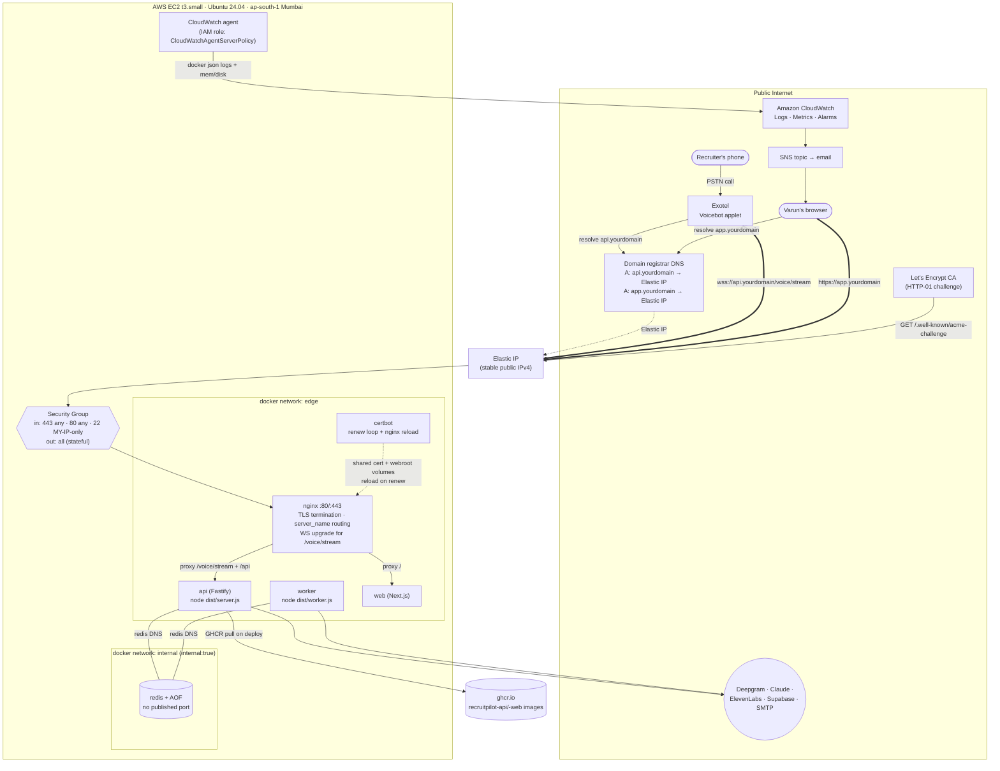

# 15 — Deployment (AWS EC2)

> **RecruitPilot AI — Production-Grade AI Executive Voice Assistant**
> Document 15 of 21 · Prerequisites: docs 00–14

---

## 1. Goal

Take the container images CI now builds (doc 14) and run them on a real, public, always-on server in Mumbai — the box that answers actual recruiter phone calls.

By the end of this document you will have:

- **A production server**: one AWS EC2 instance (`t3.small`, Ubuntu 24.04) in `ap-south-1` (Mumbai), running the exact `docker-compose.prod.yml` stack from doc 13 — nginx + certbot + api + worker + web + redis.
- **A stable public address**: an Elastic IP so the server's address never changes, plus two DNS records (`api.yourdomain` and `app.yourdomain`) pointing at it.
- **Real TLS**: Let's Encrypt certificates issued and auto-renewing, so `https://` shows a padlock and — critically — **Exotel will accept the `wss://` voice stream** (self-signed certs are rejected; §2.8).
- **The Exotel cutover**: the Voicebot applet repointed from the throwaway ngrok tunnel (doc 05) to your permanent `wss://api.yourdomain/voice/stream`.
- **Monitoring**: the CloudWatch agent shipping container logs and system metrics, with alarms that email you when the api errors, the box wedges, or the disk fills.
- **The deploy loop closed**: the GitHub secrets doc 14 referenced but couldn't fill (`EC2_HOST`, `EC2_USER`, `EC2_SSH_PRIVATE_KEY`) now have real values, so merging to `main` auto-deploys with zero dropped calls.

This is the document where "it works in Docker on my laptop" (doc 13) becomes "a recruiter in Bangalore dials a number and an AI answers." Every step is click-level from an empty AWS signup page — assume nothing.

> **Cost honesty up front.** This is not a free-tier project. The free-tier `t3.micro` has 1 GB RAM — too little for the doc-13 stack (nginx + api + worker + web + redis + the CloudWatch agent). A `t3.small` (2 GB) plus a 20 GB disk and an Elastic IP runs roughly **US$15–25/month** in `ap-south-1`, before vendor API costs. A domain is about **US$10/year**. We set a billing alarm in the very first step so there are no surprises.

---

## 2. Theory

### 2.1 What EC2 actually is (and regions / AZs)

**EC2 (Elastic Compute Cloud)** is AWS's rent-a-computer service: you ask for a virtual machine of a given size, it boots in ~60 seconds, and you pay by the hour until you stop it. That's the whole idea — a Linux box you SSH into, except AWS owns the hardware, the network, and the power.

Two geography words you must get right:

- A **Region** is a physical cluster of data centres in one part of the world. `ap-south-1` is **Mumbai**. We choose it deliberately: doc 01 §3.5 budgets ~100 ms for Exotel→server audio transit, and Exotel's Indian telephony plus your recruiters live in India. A server in Virginia would add 200+ ms round-trip to *every* audio frame and blow the latency budget. **Region is a latency decision, and Mumbai is non-negotiable for this product.**
- An **Availability Zone (AZ)** is one isolated data centre *within* a region (`ap-south-1a`, `-1b`, `-1c`). Multi-AZ designs survive one data centre losing power. Stage 1 (doc 01 §3.7) is a single instance in a single AZ — deliberately. We are not building HA yet; we are building a working product. AWS picks the AZ for us.

### 2.2 Instance families and why `t3.small`

AWS names instances `<family><generation>.<size>` — `t3.small` = the **t** (burstable) family, generation 3, "small" size (2 vCPU, 2 GB RAM). Families encode a resource ratio:

| Family | Optimized for | Example use |
|---|---|---|
| **t** (burstable) | Cheap, spiky CPU | Web apps, small services — **us** |
| **m** (general) | Balanced sustained CPU/RAM | Steady mid-size workloads |
| **c** (compute) | CPU-heavy | Video encoding, simulation |
| **r** (memory) | RAM-heavy | In-memory caches, big DBs |

**Why `t` (burstable) fits us honestly.** Burstable instances earn **CPU credits** while idle and spend them when busy; if you run the CPU hot *continuously* you exhaust credits and get throttled to a low baseline. That would be fatal for a CPU-bound service — but look at what our box actually does (doc 01 §3.2): during a call it **streams** audio between vendors. The heavy compute (STT, the LLM, TTS) happens on Deepgram / Anthropic / ElevenLabs servers, not ours. Our steady-state CPU is light — shuffling ~20 ms audio frames and running a Node event loop. The one CPU-heavier task, post-call summary generation, runs in the **worker** and is Claude's work anyway (doc 01 §3.6). So bursty, mostly-idle CPU with occasional spikes is exactly the burstable profile. We will still **watch `CPUCreditBalance`** (§9, §10) — honesty means measuring, not assuming.

**Why 2 GB / `small`, not 1 GB / `micro`.** Sum the doc-13 `mem_limit`s: api 1g + worker 512m + web 512m + redis 256m + nginx/certbot (~50m) ≈ **2.3 GB of ceilings**. Real resident usage is lower, but a 1 GB `micro` would OOM-kill the api mid-call the first time three things spike together. 2 GB gives working headroom for a single-instance stage-1 build. **The upgrade path is trivial** (§11): stop the instance, change the instance type in the console, start it — same disk, same Elastic IP, ~2 minutes of downtime. So start small and grow on evidence, never on fear.

### 2.3 Elastic IP — why a *stable* address is mandatory here

By default, an EC2 instance's public IP is **ephemeral**: stop and start the instance (e.g. to resize it, §2.2) and AWS hands you a *different* public IP. That is catastrophic for us because **two external systems hard-code our address**:

1. **DNS A records** (`api.yourdomain` → an IP). If the IP changes, the domain points at a stranger's server until you notice and edit DNS.
2. **The Exotel Voicebot applet** ultimately resolves `wss://api.yourdomain/...` — anchored to that DNS record.

An **Elastic IP** is a public IPv4 address AWS *reserves for your account* and you *associate* with an instance. It survives stop/start, resize, even detaching and reattaching to a replacement instance. One caveat AWS enforces to discourage hoarding: an Elastic IP is **free while associated with a running instance**, but billed a small hourly rate when allocated and *not* attached (e.g. after you terminate the instance but forget to release the IP). Allocate it, associate it, and it's part of the ~$15–25/mo estimate.

### 2.4 Security groups — stateful firewalls

A **security group (SG)** is a virtual firewall wrapped around your instance's network interface. You write **inbound rules** ("allow TCP 443 from anywhere") and **outbound rules** ("allow all"). Two properties matter:

- **Default-deny inbound.** Nothing reaches the box unless a rule explicitly allows it. An unlisted port is invisible to the internet — this is your first and most important line of defence.
- **Stateful.** If an inbound rule allows a connection, the *reply* traffic is automatically allowed back out — you do not write a matching outbound rule. (Contrast with old-school stateless ACLs where you'd hand-write both directions.) This is why the default "allow all outbound" is fine: the api *initiating* a call to Deepgram is outbound, and Deepgram's streamed responses come back on that established connection automatically.

Our SG opens exactly three inbound ports (§5 step 2): **443** (HTTPS/WSS, from anywhere — the public product), **80** (HTTP, from anywhere — only for the Let's Encrypt challenge and the redirect to 443), and **22** (SSH, **from your IP only**). Everything else — including Redis's 6379 — is denied at the cloud edge, layered *on top of* the fact that doc 13 already gives Redis no published port at all (defence in depth, §12).

### 2.5 SSH key authentication (no passwords)

**SSH** is the encrypted protocol you use to get a shell on the server. We authenticate with a **key pair**, never a password:

- A **private key** (the `.pem` file AWS gives you, or a key you generate) stays on your laptop and is never shared.
- A **public key** lives on the server in `~/.ssh/authorized_keys`.

The server proves you hold the matching private key via a cryptographic challenge — nothing guessable travels over the wire. This defeats the single most common attack on internet servers: bots brute-forcing SSH passwords 24/7. Passwords for SSH are so dangerous that we *disable* them entirely (§5 step 5). The `.pem` file's permissions must be `400` (read-only, owner-only) or SSH refuses to use it — a deliberate guardrail against a world-readable private key.

### 2.6 DNS and why *two* subdomains

**DNS** translates a name (`api.recruitpilot.example`) into an IP address. The record type that maps a name → an IPv4 is an **A record**. When you buy a domain, the registrar gives you a DNS control panel where you add records; each has a **TTL** (how long resolvers may cache it — start low, e.g. 300 s, so mistakes correct quickly).

We create **two subdomains, both A records pointing at the same Elastic IP**:

| Name | Serves | Why separate |
|---|---|---|
| `app.yourdomain` | the Next.js dashboard (web) | Varun's browser |
| `api.yourdomain` | the Fastify API + the `wss://` voice stream | Exotel + the dashboard's API calls |

Why not one host with paths (`yourdomain/app`, `yourdomain/api`)? **Cleaner cookies and CORS.** Auth cookies are scoped by *host*; keeping the dashboard on its own origin means its session cookie never rides along on API/voice requests it has no business touching, and CORS rules between `app.` and `api.` are explicit and auditable. It also lets you reason about — and later split — the two workloads independently. Both names resolve to one box today; the separation is architectural hygiene that costs nothing now and saves pain later. (nginx routes by `server_name`, §5 step 7.)

### 2.7 TLS via Let's Encrypt (HTTP-01) and certbot renewal

**TLS** is the encryption behind `https://` and `wss://`. To serve it you need a **certificate** that a trusted **Certificate Authority (CA)** has signed, vouching that you control the domain. **Let's Encrypt** is a free, automated CA; **certbot** is the client that talks to it.

The proof-of-control method we use is **HTTP-01**: certbot asks Let's Encrypt for a certificate for `api.yourdomain`; Let's Encrypt replies "put this random token at `http://api.yourdomain/.well-known/acme-challenge/<token>`"; certbot writes the token to a webroot that nginx serves (doc 13's nginx.conf already has that `location` block and a shared `certbot-webroot` volume); Let's Encrypt fetches it over port 80, confirms you control the name, and issues the cert. This is why **port 80 must be open** even though the product runs on 443.

Let's Encrypt certs are **valid for 90 days** by design, to force automation. Doc 13's `certbot` service already runs a renewal loop (`certbot renew` every 12 h); `renew` is a no-op until a cert is within 30 days of expiry, then it reissues. After renewal, **nginx must reload** to pick up the new cert file (§7 shows the reload hook). You verify the whole machine works *before* you rely on it with `certbot renew --dry-run` (§9, §10) — the number-one cause of a 2 a.m. outage is a renewal that was never tested.

### 2.8 Why WSS specifically demands a *valid* TLS cert

Exotel's Voicebot applet opens a **secure WebSocket (`wss://`)** to our voice gateway (doc 01 §3.2). A `wss://` handshake begins with a normal TLS handshake — and **Exotel validates the certificate against the public CA trust store and rejects anything self-signed or expired.** During local development you tunnelled through ngrok (doc 05), which supplied a real, publicly-trusted cert for you. In production *you* are the origin, so *you* must present a real Let's Encrypt cert on `api.yourdomain`. Get this wrong and the symptom is brutal and specific: **every call fails at connect with no audio**, because the socket never upgrades. A valid cert on `api.` is therefore not "nice security hygiene" — it is a hard functional dependency of the product.

### 2.9 CloudWatch — logs, metrics, filters, alarms, SNS

A server you can't see is a server you can't operate. **Amazon CloudWatch** is AWS's monitoring service; the **CloudWatch agent** is a small process you install on the instance that ships two things to CloudWatch:

- **Logs** — we point it at Docker's `json-file` logs (doc 13 already caps them at 10 MB × 3). Our api emits **Pino JSON** (doc 09), so each log line is structured `{"level":50,"msg":"...","callSid":"..."}` — machine-queryable, not a wall of text.
- **Metrics** — CPU, memory, disk. (EC2 reports CPU/network/status *for free* from the hypervisor, but **memory and disk usage are inside the OS** and only the agent can see them — a classic gap that leaves you blind to a full disk until it's too late.)

The alerting chain, in order:

1. A **metric filter** scans the log group for a pattern — e.g. Pino's `"level": 50` (error) — and increments a **custom metric** each time it matches.
2. An **alarm** watches a metric and changes state (OK → ALARM) when a threshold is crossed (e.g. ≥1 error in 5 minutes, or disk >80%, or `StatusCheckFailed`).
3. On ALARM, the alarm publishes to an **SNS topic** (Simple Notification Service — a pub/sub fan-out).
4. An **email subscription** on that topic delivers the alert to your inbox (after a one-time confirmation click).

The agent needs AWS permissions to write logs/metrics — granted not by putting AWS keys on the box, but by attaching an **IAM role** to the instance (§2.10). This wires up doc 01 §11's promise: "alert when the SLO is breached, via CloudWatch metric filters."

### 2.10 IAM roles for EC2 — permissions without secrets

Your server needs to *call AWS APIs* (to push logs/metrics), which requires AWS credentials. The **wrong** way is to paste an access key onto the box — a long-lived secret that leaks the day the box is compromised. The **right** way is an **IAM role**: you attach a role (a bundle of permissions, here the AWS-managed `CloudWatchAgentServerPolicy`) to the instance, and AWS delivers **short-lived, auto-rotating credentials** to the instance's metadata service. The agent picks them up transparently. Nothing to store, nothing to rotate, nothing to leak. Forget this role and the agent installs fine but **silently ships nothing** — a common, maddening failure (§10).

---

## 3. Architecture

The production topology — DNS, TLS, the single public box, and the private network inside it. Compare with doc 13 §3 (the compose view) and doc 01 §3.2 (the container view); this adds the *edge*: how the internet reaches the box and how the box is observed.



Read the diagram as three flows:

- **Inbound product traffic** (bold arrows): recruiter → Exotel → DNS → Elastic IP → SG (443) → nginx → api (WSS) / web (HTTPS). Redis is unreachable from here by construction — it lives on `internal:true` with no port.
- **The TLS lifeline** (dotted): Let's Encrypt reaches port 80 for the challenge; certbot and nginx share the cert volumes; certbot reloads nginx on renewal. Break this and WSS dies (§2.8).
- **The observability spine**: the CloudWatch agent (authorized by the IAM role) ships Docker logs + OS metrics to CloudWatch, whose alarms fan out through SNS to your inbox.

---

## 4. Folder Structure

This document creates almost nothing in the **repo** — the artifacts are the *server's* filesystem and cloud resources. Repo-side, doc 13's files are reused verbatim except `nginx.conf`, which this doc finalizes (adds the 443/TLS block).

```
# On the SERVER (not the repo): /opt/recruitpilot/
/opt/recruitpilot/
├── docker-compose.prod.yml     # copied from repo (doc 13 §4.5)
├── .env                        # PRODUCTION secrets, hand-created, chmod 600 (§8)
└── docker/
    └── nginx/
        └── nginx.conf          # finalized here — 443 ssl + server_name (§5 step 7)

# Repo change made in this doc:
docker/nginx/nginx.conf         # doc 13 shipped the :80 block; §5.7 adds :443 ssl
```

Everything else this document produces is cloud state that has no file: the EC2 instance, the Elastic IP, the security group, the IAM role, the CloudWatch config, the SNS topic, and the GitHub Actions secrets.

---

## 5. Manual Steps

The longest section in the suite. Do it in order; each step verifies before the next depends on it. Where a value is unique to you, it appears as `UPPERCASE_PLACEHOLDER` — substitute your real value.

### 5.1 Create and secure the AWS account

**Create the account:**

1. Go to **https://aws.amazon.com** → **Create an AWS Account** (top-right).
2. Enter a **root email** (use your consistent project identity from doc 00 §5, e.g. `varun@digiqc.com`) and an account name (`recruitpilot`). Set a strong, unique password (into your password manager).
3. Choose **Personal** account type; fill contact details.
4. Add a **payment card**. AWS pre-authorizes a small amount to verify it. (Reminder from §1: the free tier will *not* comfortably fit this stack — budget ~$15–25/mo.)
5. **Verify your phone** (SMS/voice code).
6. Choose the **Basic support** plan (free).

**Now lock the account down — before launching anything.** The email/password you just made is the **root user**: it can close the account and change billing. You almost never use it again.

7. **Set a billing budget FIRST** (so a mistake can't run for a month unseen): sign in as root → search bar → **Billing and Cost Management** → **Budgets** → **Create budget** → **Use a template** → **Zero spend** or **Monthly cost budget** → set amount **$30** → enter your email for the alert → Create. You'll now get an email if spend approaches the threshold.
8. **Enable MFA on the root user**: top-right account menu → **Security credentials** → **Multi-factor authentication (MFA)** → **Assign MFA device** → choose **Authenticator app** → scan the QR with Google Authenticator / 1Password / Authy → enter two consecutive codes → done. Root without MFA is the single scariest AWS misconfiguration.
9. **Create an IAM admin user for daily work** (stop using root): search **IAM** → **Users** → **Create user** → name `admin` → tick **Provide user access to the AWS Management Console** → set a password → **Next** → **Attach policies directly** → tick **AdministratorAccess** → Create. Then open that user → **Security credentials** → enable **MFA** for it too. Note its sign-in URL (`https://ACCOUNT_ID.signin.aws.amazon.com/console`).
10. **Sign out of root. Sign in as `admin`.** From here on, everything is done as `admin`. Root is for emergencies only.

### 5.2 Launch the EC2 instance

1. **Select the region**: top-right region selector → **Asia Pacific (Mumbai) ap-south-1**. Confirm it reads "Mumbai" before continuing — resources are region-scoped, and Mumbai is the latency choice (§2.1, doc 01 §3.5).
2. Search **EC2** → **Instances** → **Launch instances**.
3. **Name**: `recruitpilot-prod`.
4. **Application and OS Image (AMI)**: choose **Ubuntu** → **Ubuntu Server 24.04 LTS** (64-bit x86, "Free tier eligible" label — the AMI is free even though our chosen size isn't).
5. **Instance type**: choose **`t3.small`** (2 vCPU, 2 GB). (Reasoning in §2.2. If the picker defaults to `t3.micro`, change it.)
6. **Key pair (login)** → **Create new key pair**:
   - Name: `recruitpilot-key`
   - Type: **ED25519** (modern, short, fast)
   - Format: **.pem**
   - Click **Create key pair** — your browser downloads `recruitpilot-key.pem`. **This is your only chance to get the private key; AWS never shows it again.** Move it somewhere safe and lock its permissions immediately:
     ```bash
     mkdir -p ~/.ssh
     mv ~/Downloads/recruitpilot-key.pem ~/.ssh/
     chmod 400 ~/.ssh/recruitpilot-key.pem   # SSH refuses a world-readable key (§2.5)
     ```
7. **Network settings** → **Edit** → **Create security group**, name it `recruitpilot-sg`, and add exactly these **inbound** rules:

   | Type | Port | Source | Why |
   |---|---|---|---|
   | SSH | 22 | **My IP** | Only you can attempt a shell (§2.4, §2.5) |
   | HTTP | 80 | Anywhere `0.0.0.0/0` | Let's Encrypt HTTP-01 challenge + redirect to 443 (§2.7) |
   | HTTPS | 443 | Anywhere `0.0.0.0/0` | The public product: dashboard + WSS voice (§2.8) |

   > **"My IP" caveat:** it fills in *your current* home/office IP. Most consumer ISPs hand out **dynamic IPs that change**, so SSH may stop working from home in a few days — that's expected. Fix it by re-editing this rule (EC2 → Security Groups → `recruitpilot-sg` → edit inbound → "My IP" again). Never "fix" it by opening 22 to `0.0.0.0/0` (§10).
8. **Configure storage**: change the root volume to **20 GiB**, type **gp3** (gp3 is faster and cheaper than the default gp2). 8 GB is too small once images accumulate.
9. Review the summary, click **Launch instance**. Wait ~1 minute; **Instances** shows it `Running`, status checks `2/2`.

### 5.3 Allocate and associate an Elastic IP

1. EC2 left menu → **Network & Security → Elastic IPs** → **Allocate Elastic IP address** → **Allocate**. A new public IPv4 appears — note it; call it `ELASTIC_IP`.
2. Select it → **Actions → Associate Elastic IP address** → Resource type **Instance** → choose `recruitpilot-prod` → **Associate**.
3. The instance's public IP is now permanently `ELASTIC_IP` and survives stop/start/resize (§2.3).

### 5.4 Buy a domain and create DNS records

1. Buy a domain at any registrar (Namecheap, Cloudflare, Google Domains successor, GoDaddy — ~$10/yr). Call it `yourdomain`.
2. In the registrar's **DNS** panel, add two **A records** (§2.6):

   | Type | Host / Name | Value | TTL |
   |---|---|---|---|
   | A | `api` | `ELASTIC_IP` | 300 |
   | A | `app` | `ELASTIC_IP` | 300 |

   (Some panels want the full name `api.yourdomain`; others just the host `api`. Match your panel's convention.)
3. **Verify propagation** from your laptop (DNS can take minutes to an hour):
   ```bash
   dig +short api.yourdomain
   dig +short app.yourdomain
   ```
   Both must print `ELASTIC_IP`. Do not proceed to TLS (step 7) until they do — HTTP-01 fails if the name doesn't resolve to this box yet.

### 5.5 First SSH in, server prep, and hardening

1. **Connect** (substitute your key path and Elastic IP):
   ```bash
   ssh -i ~/.ssh/recruitpilot-key.pem ubuntu@ELASTIC_IP
   ```
   Accept the host fingerprint (`yes`) on first connect. You're now `ubuntu@ip-...`.
2. **Update the OS:**
   ```bash
   sudo apt update && sudo apt upgrade -y
   ```
3. **Install Docker Engine + the compose plugin** (the official `docs.docker.com/engine/install/ubuntu` sequence — *not* the `docker.io` Ubuntu package, which is older):
   ```bash
   # Add Docker's official GPG key and apt repo
   sudo apt install -y ca-certificates curl
   sudo install -m 0755 -d /etc/apt/keyrings
   sudo curl -fsSL https://download.docker.com/linux/ubuntu/gpg -o /etc/apt/keyrings/docker.asc
   sudo chmod a+r /etc/apt/keyrings/docker.asc
   echo "deb [arch=$(dpkg --print-architecture) signed-by=/etc/apt/keyrings/docker.asc] \
     https://download.docker.com/linux/ubuntu $(. /etc/os-release && echo $VERSION_CODENAME) stable" \
     | sudo tee /etc/apt/sources.list.d/docker.list > /dev/null
   sudo apt update
   sudo apt install -y docker-ce docker-ce-cli containerd.io docker-buildx-plugin docker-compose-plugin
   ```
4. **Run docker without sudo** (add your user to the `docker` group), then re-login so it takes effect:
   ```bash
   sudo usermod -aG docker ubuntu
   exit
   ```
   Reconnect (`ssh -i ... ubuntu@ELASTIC_IP`) and verify:
   ```bash
   docker version && docker compose version
   ```
5. **Create a dedicated `deploy` user** for CI to SSH in as (the pipeline should not use the `ubuntu` login, and it needs its own key — this becomes doc 14's `EC2_SSH_PRIVATE_KEY`):
   ```bash
   sudo adduser --disabled-password --gecos "" deploy
   sudo usermod -aG docker deploy
   # Generate a dedicated ED25519 keypair FOR the deploy user (run on the server):
   sudo -u deploy ssh-keygen -t ed25519 -f /home/deploy/.ssh/deploy_key -N ""
   # Authorize its PUBLIC half so that key can log in as deploy:
   sudo -u deploy sh -c 'cat /home/deploy/.ssh/deploy_key.pub >> /home/deploy/.ssh/authorized_keys'
   sudo -u deploy chmod 600 /home/deploy/.ssh/authorized_keys
   # Print the PRIVATE half — copy ALL of it (including BEGIN/END lines):
   sudo cat /home/deploy/.ssh/deploy_key
   ```
   Save that private key text — it is the `EC2_SSH_PRIVATE_KEY` GitHub secret (§8). Then **delete the private key from the server** (CI holds it now; the box shouldn't):
   ```bash
   sudo rm /home/deploy/.ssh/deploy_key
   ```
6. **Harden SSH and the firewall:**
   ```bash
   # Host firewall (belt-and-suspenders with the SG, §2.4):
   sudo ufw allow 22/tcp && sudo ufw allow 80/tcp && sudo ufw allow 443/tcp
   sudo ufw --force enable
   sudo ufw status                      # verify 22/80/443 allowed

   # Automatic security updates:
   sudo apt install -y unattended-upgrades
   sudo dpkg-reconfigure -f noninteractive unattended-upgrades

   # Disable SSH password auth entirely (keys only, §2.5):
   sudo sed -i 's/^#*PasswordAuthentication.*/PasswordAuthentication no/' /etc/ssh/sshd_config
   sudo systemctl restart ssh
   ```

### 5.6 App directory, production `.env`, GHCR login, first boot

1. **Create the app directory** and give `deploy` ownership (CI writes here):
   ```bash
   sudo mkdir -p /opt/recruitpilot/docker/nginx
   sudo chown -R deploy:deploy /opt/recruitpilot
   ```
2. **Copy the compose file and nginx config** from your repo to the server (run these from your **laptop**, in the repo root):
   ```bash
   scp -i ~/.ssh/recruitpilot-key.pem docker-compose.prod.yml \
       ubuntu@ELASTIC_IP:/tmp/docker-compose.prod.yml
   scp -i ~/.ssh/recruitpilot-key.pem docker/nginx/nginx.conf \
       ubuntu@ELASTIC_IP:/tmp/nginx.conf
   # then on the server, move them into place:
   ssh -i ~/.ssh/recruitpilot-key.pem ubuntu@ELASTIC_IP \
     'sudo mv /tmp/docker-compose.prod.yml /opt/recruitpilot/ && \
      sudo mv /tmp/nginx.conf /opt/recruitpilot/docker/nginx/ && \
      sudo chown -R deploy:deploy /opt/recruitpilot'
   ```
   (In steady state CI keeps these current, doc 14. This first copy bootstraps the box.)
3. **Hand-create the production `.env`** at `/opt/recruitpilot/.env`. **Do NOT scp your dev `.env`** — production gets *its own freshly-minted keys* (§8, §12). Build it from `.env.example` and paste **new production values** you created in the vendor consoles (docs 04–08, 12):
   ```bash
   sudo -u deploy nano /opt/recruitpilot/.env     # paste production values (full inventory in §8)
   sudo chmod 600 /opt/recruitpilot/.env          # owner-only — the crown-jewel file (§12)
   ```
4. **Log Docker into GHCR** so the box can pull your private images (doc 14 pushes them). Create a GitHub **Personal Access Token (classic)** with **`read:packages`** scope: GitHub → **Settings → Developer settings → Personal access tokens → Tokens (classic) → Generate new token (classic)** → tick `read:packages` → generate → copy. Then on the server:
   ```bash
   echo 'YOUR_GHCR_PAT' | docker login ghcr.io -u YOUR_GITHUB_USERNAME --password-stdin
   ```
5. **First boot** (still without TLS — nginx will serve only port 80 until step 7 adds certs):
   ```bash
   cd /opt/recruitpilot
   docker compose -f docker-compose.prod.yml pull
   docker compose -f docker-compose.prod.yml up -d
   docker compose -f docker-compose.prod.yml ps    # api should read (healthy)
   ```

### 5.7 Issue TLS certificates and finalize nginx

The doc-13 nginx.conf serves the ACME challenge on port 80 and has no 443 block yet — a deliberate chicken-and-egg fix: **nginx must be up on 80 to answer the challenge before the cert it needs to listen on 443 exists.** So issue first, then add the 443 block.

1. **Issue certificates** for both names using certbot in webroot mode, reusing the running nginx and the shared volume:
   ```bash
   docker compose -f docker-compose.prod.yml run --rm certbot certonly \
     --webroot -w /var/www/certbot \
     -d api.yourdomain -d app.yourdomain \
     --email varun@digiqc.com --agree-tos --no-eff-email
   ```
   Success prints "Congratulations!" and paths under `/etc/letsencrypt/live/api.yourdomain/`.
2. **Add the TLS server blocks** to `/opt/recruitpilot/docker/nginx/nginx.conf` — this finalizes doc 13's placeholder. Replace the single `listen 80` server block with: a port-80 block that keeps the ACME location and redirects everything else to HTTPS, plus a port-443 block per subdomain. Commit this change to the repo too (doc 4) so CI stays the source of truth:
   ```nginx
   # Redirect all HTTP → HTTPS, but keep the ACME challenge on 80 (renewals)
   server {
       listen 80;
       server_name api.yourdomain app.yourdomain;
       location /.well-known/acme-challenge/ { root /var/www/certbot; }
       location / { return 301 https://$host$request_uri; }
   }

   # API + voice WebSocket — api.yourdomain
   server {
       listen 443 ssl;
       server_name api.yourdomain;
       ssl_certificate     /etc/letsencrypt/live/api.yourdomain/fullchain.pem;
       ssl_certificate_key /etc/letsencrypt/live/api.yourdomain/privkey.pem;

       # --- the voice WebSocket (doc 13 §4.6) ---
       location /voice/stream {
           proxy_pass http://api_upstream;
           proxy_http_version 1.1;
           proxy_set_header Upgrade $http_upgrade;
           proxy_set_header Connection $connection_upgrade;
           proxy_set_header Host $host;
           proxy_set_header X-Forwarded-For $proxy_add_x_forwarded_for;
           proxy_read_timeout 3600s;
           proxy_send_timeout 3600s;
           proxy_buffering off;
       }
       location /api/ {
           proxy_pass http://api_upstream;
           proxy_http_version 1.1;
           proxy_set_header Host $host;
           proxy_set_header X-Forwarded-For $proxy_add_x_forwarded_for;
           proxy_set_header X-Forwarded-Proto $scheme;
       }
   }

   # Dashboard — app.yourdomain
   server {
       listen 443 ssl;
       server_name app.yourdomain;
       ssl_certificate     /etc/letsencrypt/live/api.yourdomain/fullchain.pem;
       ssl_certificate_key /etc/letsencrypt/live/api.yourdomain/privkey.pem;
       location / {
           proxy_pass http://web_upstream;
           proxy_http_version 1.1;
           proxy_set_header Host $host;
           proxy_set_header X-Forwarded-For $proxy_add_x_forwarded_for;
           proxy_set_header X-Forwarded-Proto $scheme;
       }
   }
   ```
   (The `map $http_upgrade $connection_upgrade`, `upstream api_upstream`, and `upstream web_upstream` blocks from doc 13 §4.6 remain in the `http {}` wrapper unchanged.)
3. **Reload nginx** to pick up the certs and new blocks:
   ```bash
   docker compose -f docker-compose.prod.yml exec nginx nginx -t     # test config
   docker compose -f docker-compose.prod.yml exec nginx nginx -s reload
   ```
4. **The renewal loop is already running** (doc 13's `certbot` service). Add an nginx-reload-after-renew so a fresh cert is actually served — either a deploy hook or a periodic reload. Simplest robust option: the certbot service's `certbot renew` plus a nightly nginx reload. Verify renewal works *without* waiting 60 days:
   ```bash
   docker compose -f docker-compose.prod.yml run --rm certbot renew --dry-run
   ```
   A clean dry-run is your proof the auto-renewal machine works (§2.7, §10).

### 5.8 Exotel cutover — repoint the applet from ngrok to production

1. Log in to your **Exotel dashboard** (doc 05) → **App Bazaar / Voicebot applet** used by your ExoPhone's call flow.
2. Change the stream URL from the dev **ngrok** value (doc 05) to your permanent production URL:
   ```
   wss://api.yourdomain/voice/stream?token=VOICE_WS_AUTH_TOKEN
   ```
   Use the **production** `VOICE_WS_AUTH_TOKEN` (the one now in the server `.env`, §8) — not the dev token.
3. Save/publish the applet. The ngrok tunnel from doc 05 can now be shut down for good. (Leaving the applet on a dead ngrok URL is a classic post-launch outage — §10.)

### 5.9 CloudWatch — role, agent, logs, metrics, alarms

1. **Create and attach the IAM role** (§2.10) so the agent can talk to AWS without stored keys:
   - IAM → **Roles → Create role** → trusted entity **AWS service** → use case **EC2** → Next → attach **`CloudWatchAgentServerPolicy`** → name it `recruitpilot-cwagent-role` → Create.
   - EC2 → **Instances** → select `recruitpilot-prod` → **Actions → Security → Modify IAM role** → choose `recruitpilot-cwagent-role` → **Update IAM role**.
2. **Install the CloudWatch agent** on the server (SSH in):
   ```bash
   wget https://amazoncloudwatch-agent.s3.amazonaws.com/ubuntu/amd64/latest/amazon-cloudwatch-agent.deb
   sudo dpkg -i amazon-cloudwatch-agent.deb
   ```
3. **Write the agent config** to `/opt/aws/amazon-cloudwatch-agent/etc/config.json` (ship Docker json logs + memory + disk):
   ```bash
   sudo tee /opt/aws/amazon-cloudwatch-agent/etc/config.json > /dev/null <<'JSON'
   {
     "agent": { "metrics_collection_interval": 60, "run_as_user": "root" },
     "metrics": {
       "namespace": "RecruitPilot/EC2",
       "metrics_collected": {
         "mem":  { "measurement": ["mem_used_percent"] },
         "disk": { "measurement": ["used_percent"], "resources": ["/"] }
       }
     },
     "logs": {
       "logs_collected": {
         "files": {
           "collect_list": [
             {
               "file_path": "/var/lib/docker/containers/*/*-json.log",
               "log_group_name": "/recruitpilot/prod",
               "log_stream_name": "{instance_id}-docker"
             }
           ]
         }
       }
     }
   }
   JSON
   ```
4. **Start the agent** with that config:
   ```bash
   sudo /opt/aws/amazon-cloudwatch-agent/bin/amazon-cloudwatch-agent-ctl \
     -a fetch-config -m ec2 -c file:/opt/aws/amazon-cloudwatch-agent/etc/config.json -s
   sudo /opt/aws/amazon-cloudwatch-agent/bin/amazon-cloudwatch-agent-ctl -m ec2 -a status
   ```
   Within a minute, CloudWatch → **Log groups** shows `/recruitpilot/prod`, and **Metrics → RecruitPilot/EC2** shows `mem_used_percent` / disk `used_percent`. (Empty after 5 minutes = the IAM role isn't attached — §10.)
5. **Create the alert fan-out (SNS)**: CloudWatch (or SNS console) → **Topics → Create topic** → **Standard** → name `recruitpilot-alerts` → Create. Then **Create subscription** → protocol **Email** → your address → Create → **click the confirmation link** in the email AWS sends (unconfirmed = no alerts).
6. **Metric filter → alarm on Pino errors** (`"level": 50`, doc 09): CloudWatch → **Log groups → /recruitpilot/prod → Metric filters → Create metric filter** → filter pattern `{ $.level = 50 }` → assign metric `RecruitPilot/Logs` / `ApiErrorCount`, value `1` → Create. Then **Create alarm** on that metric: statistic **Sum**, period **5 min**, threshold **≥ 1**, action → notify **`recruitpilot-alerts`**.
7. **Alarm on instance health** (`StatusCheckFailed`): CloudWatch → **Alarms → Create alarm** → metric **EC2 → Per-Instance → `StatusCheckFailed`** for `recruitpilot-prod` → threshold **≥ 1** → action **`recruitpilot-alerts`**. (Consider also adding the "recover instance" EC2 action.)
8. **Alarm on disk >80%**: **Create alarm** → metric **RecruitPilot/EC2 → `used_percent`** (disk `/`) → threshold **> 80** → action **`recruitpilot-alerts`**. A full disk is the most preventable outage there is (doc 13 §11).
9. *(Recommended)* **Alarm on `CPUCreditBalance`** (§2.2, §10): metric **EC2 → `CPUCreditBalance`** → threshold **< 50** for a sustained period → notify — your early warning that a `t3` upgrade is due.

---

## 6. Official Links

| Topic | Link |
|---|---|
| AWS free tier / pricing | https://aws.amazon.com/free/ |
| EC2 user guide | https://docs.aws.amazon.com/ec2/ |
| Choosing an instance type | https://aws.amazon.com/ec2/instance-types/t3/ |
| Elastic IP addresses | https://docs.aws.amazon.com/AWSEC2/latest/UserGuide/elastic-ip-addresses-eip.html |
| Security groups | https://docs.aws.amazon.com/AWSEC2/latest/UserGuide/ec2-security-groups.html |
| Connect via SSH | https://docs.aws.amazon.com/AWSEC2/latest/UserGuide/connect-linux-inst-ssh.html |
| Install Docker Engine on Ubuntu | https://docs.docker.com/engine/install/ubuntu/ |
| Let's Encrypt | https://letsencrypt.org/getting-started/ |
| certbot | https://eff-certbot.readthedocs.io/ |
| CloudWatch agent install | https://docs.aws.amazon.com/AmazonCloudWatch/latest/monitoring/install-CloudWatch-Agent-on-EC2-Instance.html |
| Metric filters | https://docs.aws.amazon.com/AmazonCloudWatch/latest/logs/MonitoringLogData.html |
| SNS email subscriptions | https://docs.aws.amazon.com/sns/latest/dg/sns-email-notifications.html |
| IAM roles for EC2 | https://docs.aws.amazon.com/AWSEC2/latest/UserGuide/iam-roles-for-amazon-ec2.html |
| UptimeRobot (external monitor) | https://uptimerobot.com |

---

## 7. Commands

Copy-pasteable, grouped by task. Replace `ELASTIC_IP` / `yourdomain` / key paths.

```bash
# --- SSH ---
ssh -i ~/.ssh/recruitpilot-key.pem ubuntu@ELASTIC_IP        # admin/ops login
ssh -i ~/.ssh/deploy_key deploy@ELASTIC_IP                  # what CI uses (doc 14)

# --- Server prep (Ubuntu) ---
sudo apt update && sudo apt upgrade -y
# Docker Engine + compose plugin: see §5.5 step 3 (official repo sequence)
docker version && docker compose version                   # verify

# --- DNS verification (from laptop) ---
dig +short api.yourdomain      # must print ELASTIC_IP
dig +short app.yourdomain      # must print ELASTIC_IP

# --- App lifecycle on the server (cd /opt/recruitpilot) ---
docker compose -f docker-compose.prod.yml pull             # fetch new GHCR images
docker compose -f docker-compose.prod.yml up -d            # start / roll forward
docker compose -f docker-compose.prod.yml ps               # STATUS: api (healthy)
docker compose -f docker-compose.prod.yml logs -f api      # tail Pino JSON logs
docker compose -f docker-compose.prod.yml logs -f worker   # queue consumer logs
docker compose -f docker-compose.prod.yml restart nginx

# --- TLS (certbot) ---
docker compose -f docker-compose.prod.yml run --rm certbot certonly \
  --webroot -w /var/www/certbot -d api.yourdomain -d app.yourdomain \
  --email varun@digiqc.com --agree-tos --no-eff-email       # first issuance
docker compose -f docker-compose.prod.yml run --rm certbot renew --dry-run  # test renewal
docker compose -f docker-compose.prod.yml exec nginx nginx -t              # test config
docker compose -f docker-compose.prod.yml exec nginx nginx -s reload       # apply new cert

# --- CloudWatch agent ---
sudo /opt/aws/amazon-cloudwatch-agent/bin/amazon-cloudwatch-agent-ctl \
  -a fetch-config -m ec2 -c file:/opt/aws/amazon-cloudwatch-agent/etc/config.json -s
sudo /opt/aws/amazon-cloudwatch-agent/bin/amazon-cloudwatch-agent-ctl -m ec2 -a status

# --- Operations / housekeeping ---
df -h                                        # disk usage — watch the / line
free -m                                      # memory headroom
docker compose -f docker-compose.prod.yml exec redis redis-cli ping   # PONG
docker system df                             # docker disk breakdown
docker system prune                          # remove dangling images/containers (keeps volumes)
docker compose -f docker-compose.prod.yml down   # stop stack (KEEPS volumes; never add -v here)
```

---

## 8. Environment Variables

Two distinct secret stores exist in production — do not confuse them.

**A. The server-side `.env` — the single production secret store.** Lives at `/opt/recruitpilot/.env`, `chmod 600`, owned by `deploy`, loaded into api/worker at container start via doc 13's `env_file:`. It is **hand-created on the box from `.env.example` with fresh production values** — never scp'd from your dev machine (§12). This is the complete inventory, with the doc that introduced each variable:

| Variable | Introduced in | Purpose in production |
|---|---|---|
| `SUPABASE_URL` | 04 | Supabase project URL (api + worker) |
| `SUPABASE_ANON_KEY` | 04 | anon key (user-scoped ops) |
| `SUPABASE_SERVICE_ROLE_KEY` | 04 | service_role — **api/worker only**, never web |
| `SUPABASE_JWT_SECRET` | 12 | Verify Supabase-issued JWTs at the `/v1` preHandler |
| `DATABASE_URL` | 04 (+11) | Pooled Prisma connection (`:6543`, `pgbouncer=true`) |
| `DIRECT_URL` | 04 (+11) | Direct connection (`:5432`) for migrations |
| `EXOTEL_ACCOUNT_SID` | 05 | Exotel account id in REST paths |
| `EXOTEL_API_KEY` | 05 | Exotel REST basic-auth username |
| `EXOTEL_API_TOKEN` | 05 | Exotel REST basic-auth password (secret) |
| `EXOTEL_SUBDOMAIN` | 05 | Exotel API cluster host (`api.in.exotel.com`) |
| `EXOTEL_VIRTUAL_NUMBER` | 05 | The ExoPhone (E.164) |
| `VOICE_WS_AUTH_TOKEN` | 05 | Token appended to the applet WSS URL; checked at WS upgrade |
| `DEEPGRAM_API_KEY` | 06 | Deepgram STT auth |
| `DEEPGRAM_MODEL` | 06 | STT model (`nova-2-phonecall`) |
| `DEEPGRAM_ENDPOINTING_MS` | 06 | Silence threshold (owns 300 ms of the budget) |
| `ANTHROPIC_API_KEY` | 07 | Claude auth |
| `ANTHROPIC_MODEL_REALTIME` | 07 | Fast model for live turns |
| `ANTHROPIC_MODEL_SUMMARY` | 07 | Strong model for post-call summaries |
| `ELEVENLABS_API_KEY` | 08 | TTS auth |
| `ELEVENLABS_VOICE_ID` | 08 | The assistant's voice |
| `ELEVENLABS_MODEL_ID` | 08 | `eleven_flash_v2_5` (live) |
| `ELEVENLABS_OUTPUT_FORMAT` | 08 | `ulaw_8000` (matches Exotel) |
| `REDIS_URL` | 13 | `redis://redis:6379` (internal network DNS) |
| `NODE_ENV` | 09 | **`production`** — JSON logs, terse errors |
| `LOG_LEVEL` | 09 | **`info`** — the level CloudWatch ships |
| `PORT` | 09 | `3000` (nginx upstream) |
| `HOST` | 09/13 | `0.0.0.0` (set in compose, not `.env`) |
| `NEXT_PUBLIC_SUPABASE_URL` | 04/10 | Baked into the **web image at build** (doc 14) — not read at runtime |
| `NEXT_PUBLIC_SUPABASE_ANON_KEY` | 04/10 | Baked into the web image at build |
| `NEXT_PUBLIC_API_URL` | 10 | `https://api.yourdomain` — baked into the web image at build |

> `NODE_ENV=production` and `LOG_LEVEL=info` are the two values this document *pins* for the box. `NEXT_PUBLIC_*` are not runtime server secrets — they are build-time public values compiled into the browser bundle by CI (doc 13 §2.10, doc 14). Google Calendar and email/notification keys arrive in doc 16 and join this same file.

**B. GitHub Actions Secrets — deploy plumbing only.** These let CI reach the box; they hold **no vendor keys** (§12). Doc 14 referenced these as forward-declared placeholders — set their **real values now**:

| GitHub Secret | Real value (set now) | Used by |
|---|---|---|
| `EC2_HOST` | your `ELASTIC_IP` (or `api.yourdomain`) | doc 14 deploy job SSH target |
| `EC2_USER` | `deploy` | the CI SSH login (§5.5 step 5) |
| `EC2_SSH_PRIVATE_KEY` | the `deploy_key` **private** half printed in §5.5 step 5 | authenticates the deploy SSH |
| `NEXT_PUBLIC_SUPABASE_URL` | prod value | web image build (baked in) |
| `NEXT_PUBLIC_SUPABASE_ANON_KEY` | prod value | web image build |
| `NEXT_PUBLIC_API_URL` | `https://api.yourdomain` | web image build |

Setting these three EC2 secrets is what finally lets doc 14's deploy job run: merge to `main` → CI builds & pushes SHA-tagged images to GHCR → SSHes in as `deploy` → `docker compose pull && up -d` → zero-drop rollover.

---

## 9. Verification

Work top to bottom; each proves a layer of the stack.

1. **Dashboard padlock:** open `https://app.yourdomain` in a browser → the login page loads and the address bar shows a valid padlock (click it → "Connection is secure", issued by Let's Encrypt / R-series). No warning = real TLS (§2.7).
2. **API health:** `curl -s https://api.yourdomain/health` returns the doc 09 payload (`{"status":"ok",...}`) with HTTP 200. Proves DNS → SG → nginx → api and the cert on `api.` all line up.
3. **WSS upgrade (the one that gates the product):**
   ```bash
   npm i -g wscat
   wscat -c "wss://api.yourdomain/voice/stream?token=VOICE_WS_AUTH_TOKEN"
   ```
   The connection must **upgrade** (wscat prints `Connected`), not error on the TLS handshake. A cert failure here is exactly what would silently kill every Exotel call (§2.8).
4. **A REAL end-to-end phone call:** from any phone, **dial the ExoPhone** (`EXOTEL_VIRTUAL_NUMBER`). The assistant must answer with the doc 00 greeting: *"Hello. You've reached Varun Gandhi's AI Assistant..."* Speak a sentence; it should respond within ~1.5 s (doc 01 §3.5). **This is the product working** — telephony → WSS → STT → Claude → TTS, on real infrastructure.
5. **CI/CD loop closed:** make a trivial change on a branch, open a PR, merge to `main`. Watch the doc 14 Actions run build → push → deploy. Then `https://api.yourdomain/health` stays green and `docker compose ... ps` shows the new image tag — an auto-deploy with no dropped calls.
6. **CloudWatch shows logs:** CloudWatch → Log groups → `/recruitpilot/prod` contains recent Pino JSON lines from the call in step 4.
7. **Alarm fires on failure:** `docker compose -f docker-compose.prod.yml kill api` (or stop it). Within the alarm window you get the **SNS email** (StatusCheck/health alarm), and `docker compose ps` shows `restart: unless-stopped` bringing it back (doc 13 §11). Restore with `up -d`.
8. **Renewal machine proven:** `docker compose ... run --rm certbot renew --dry-run` completes cleanly (§2.7).

**Self-quiz** (answer from memory):

1. Why an **Elastic IP** — what two external systems break if the server's IP changes?
2. Why does **WSS require a real (not self-signed) TLS cert**, and what exact symptom appears if `api.`'s cert is invalid?
3. Why a separate **`deploy` user** with its own key instead of CI using the `ubuntu` login or root?
4. Recap doc 14's **expand-contract** deploy: how does merging to `main` reach this box, and why are no calls dropped?
5. What does the **$30 billing budget** protect you from, and why set it *before* launching anything?
6. Why `t3.small` not `t3.micro`, and which metric warns you a `t3` upgrade is due?

---

## 10. Common Mistakes

1. **Skipping the billing alarm.** A forgotten resource or a mistake can bill for a month unseen. The $30 budget is step 1 of the whole document for a reason (§5.1).
2. **SSH (22) open to `0.0.0.0/0`.** Bots brute-force the entire IPv4 space continuously; an open 22 with any weak credential is compromised in hours. 22 is **My IP only**; when your ISP rotates your address, re-edit the rule — never widen it (§2.4).
3. **Using root for daily ops.** Root can close the account and change billing. Create the `admin` IAM user, MFA it, and never sign in as root again (§5.1).
4. **Putting the dev `.env` on prod.** `scp`ing your local `.env` means dev and prod **share vendor keys** — one leak, one revocation, and *both* environments die together (shared blast radius). Prod gets freshly-minted keys, hand-entered (§8, §12).
5. **Forgetting the IAM role → CloudWatch silently ships nothing.** The agent installs and "runs" but has no permission to write; you discover you have zero monitoring during your first incident. Attach `CloudWatchAgentServerPolicy` (§2.10, §5.9).
6. **Never testing cert renewal.** The 90-day cert expires quietly at 3 a.m. and every `wss://` call fails (§2.8). Run `certbot renew --dry-run` now and know it passes (§2.7).
7. **`t3` CPU-credit exhaustion.** If something pins the CPU, credits drain and you're throttled to baseline — calls stutter. Watch `CPUCreditBalance`; a sustained drop means upgrade to `t3.medium` (§2.2, §11).
8. **Leaving the Exotel applet on the dead ngrok URL.** After launch, if you forget §5.8, calls hit a tunnel that no longer exists — the assistant never answers. Repoint to `wss://api.yourdomain/...` and delete ngrok (§5.8).
9. **`docker compose down -v` on the server.** The `-v` destroys the `redis-data` volume — every queued-but-unprocessed job (transcripts, notifications) gone (doc 13 §10). `down` alone, always.

---

## 11. Production Best Practices

- **Rollback runbook.** Deploys are SHA-tagged images (doc 13 §11, doc 14). To roll back: set `IMAGE_TAG` to the previous known-good SHA and `docker compose -f docker-compose.prod.yml pull && up -d`. Because the image is immutable, the previous SHA is *exactly* the code that worked — no guesswork.
- **AMI snapshot before risky changes.** Before an OS upgrade, an instance resize, or a config experiment: EC2 → select instance → **Actions → Image and templates → Create image**. That AMI is a full-disk restore point you can launch a fresh instance from.
- **Instance resize when you outgrow `t3.small`.** Stop the instance → **Actions → Instance settings → Change instance type** → `t3.medium` → start. Same Elastic IP, same disk, ~2 minutes down (§2.2).
- **Monthly patch cadence.** `unattended-upgrades` handles security patches automatically; once a month also `sudo apt update && sudo apt upgrade -y`, `docker compose pull` for base-image CVEs, and reboot if the kernel updated.
- **Cost review.** Monthly, open **Billing → Cost Explorer**; confirm the bill matches the ~$15–25 expectation and nothing orphaned (an unassociated Elastic IP, an unused volume) is quietly charging.
- **External uptime monitor.** CloudWatch can't tell you the *whole box* is unreachable if AWS networking to it dies. Add a free **UptimeRobot** monitor: uptimerobot.com → sign up → **Add New Monitor** → type **HTTPS** → URL `https://api.yourdomain/health` → interval 5 min → alert contact = your email → Create. An independent pinger catches outages CloudWatch (living *inside* AWS) can miss.
- **Capacity signal → scale up.** Sustained **CPU > 60%** or **memory > 80%** (both now on CloudWatch, §5.9) is your data-driven trigger to move to `t3.medium` — grow on evidence, not anxiety (doc 01 §3.7).

---

## 12. Security

- **Separate production keys per vendor.** Every vendor key in the server `.env` is a *new* key minted for production (docs 04–08, 12), distinct from dev. Rotation is then **independent**: revoking a leaked prod Deepgram key touches neither dev nor any other vendor. Shared keys mean shared blast radius (§10 #4).
- **`chmod 600` on `/opt/recruitpilot/.env`.** The file holds every production vendor secret — owner-read-only, owned by `deploy`. This box *is* where the secrets live, which makes it the **crown jewel**: everything else here (SG, ufw, SSH hardening) exists to protect this file.
- **Defence in depth at the network edge.** Two firewalls agree: the AWS **security group** (cloud edge) and **ufw** (host). Both permit only 22/80/443, and 22 only from your IP. Redis is triply protected — no published port (doc 13 §2.9), `internal:true` network, and denied by both firewalls anyway.
- **No vendor keys in GitHub.** GitHub Secrets hold **only deploy plumbing** (`EC2_HOST/USER/SSH_PRIVATE_KEY` + public `NEXT_PUBLIC_*`). Anthropic/Deepgram/ElevenLabs/Exotel/Supabase keys live *only* on the box (§8). A compromised GitHub account can deploy code but cannot exfiltrate vendor keys.
- **SSH hardening recap.** Key-only auth (`PasswordAuthentication no`), a dedicated non-root `deploy` user for CI, and the private key held by CI — not sitting on the server (§5.5). No password ever authenticates a shell here.
- **Automatic security updates.** `unattended-upgrades` closes known OS CVEs without waiting for a human — the internet scans for unpatched boxes constantly.
- **The EC2 box holds the secrets, so treat it as the crown jewel.** Minimize what can touch it, log what does (CloudWatch), and assume that anyone who gets a shell as a privileged user has everything — which is why non-root containers (doc 13 §12), least-privilege SSH, and the tight SG all compound here.

---

## 13. Checklist

- [ ] AWS account created; **billing budget ($30) set first**; root MFA enabled; `admin` IAM user created and in use; root retired
- [ ] `t3.small` Ubuntu 24.04 instance launched in **ap-south-1 (Mumbai)** with 20 GB gp3
- [ ] Security group: 443 & 80 from anywhere, **22 from My IP only**
- [ ] ED25519 key pair downloaded and `chmod 400`
- [ ] Elastic IP allocated and associated
- [ ] Domain bought; `api.` and `app.` A records → Elastic IP; `dig` confirms both
- [ ] Docker Engine + compose plugin installed; runs without sudo
- [ ] `deploy` user created with its own key; private half saved as GitHub secret; removed from server
- [ ] ufw enabled (22/80/443); unattended-upgrades on; SSH password auth **disabled**
- [ ] `/opt/recruitpilot` set up; **production `.env` hand-created, `chmod 600`** (no dev `.env` copied)
- [ ] `docker login ghcr.io` succeeds; first `docker compose ... up -d` runs; api `(healthy)`
- [ ] TLS certs issued for `api.` + `app.`; nginx 443 blocks live; `renew --dry-run` passes
- [ ] Exotel Voicebot applet repointed to `wss://api.yourdomain/voice/stream?token=...`; ngrok retired
- [ ] IAM role `CloudWatchAgentServerPolicy` attached; agent shipping logs to `/recruitpilot/prod` + mem/disk metrics
- [ ] SNS topic + confirmed email; alarms on Pino errors, `StatusCheckFailed`, disk >80% (and `CPUCreditBalance`)
- [ ] GitHub secrets `EC2_HOST`, `EC2_USER`, `EC2_SSH_PRIVATE_KEY` set (doc 14 forward-ref resolved)
- [ ] Verification §9 all pass — **especially a real phone call answered with the greeting**
- [ ] Self-quiz (§9) answered from memory

---

## 14. Next Step

Proceed to **`16_AI_AGENT.md`** — with the system now live in Mumbai, we build the brain that runs on it: the **AgentOrchestrator** and its state machine (GREETING → LISTENING → THINKING → SPEAKING → TOOL_CALL → CLOSING), the streaming turn loop, barge-in handling, memory pre-fetch, and the tool registry (`check_calendar`, `send_resume`, `save_recruiter`, `notify_varun`) — the components doc 01 §3.3 sketched, implemented against the Claude and Google Calendar integrations, and deployed through the exact pipeline you just finished wiring.
