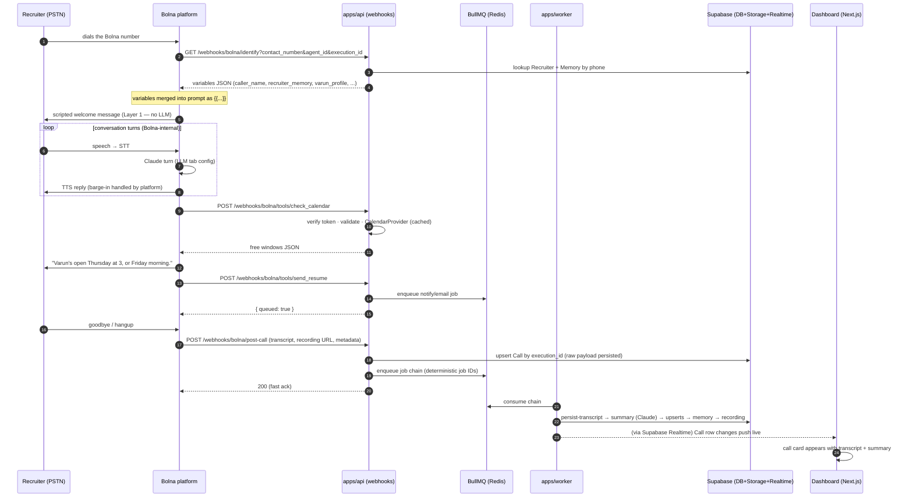
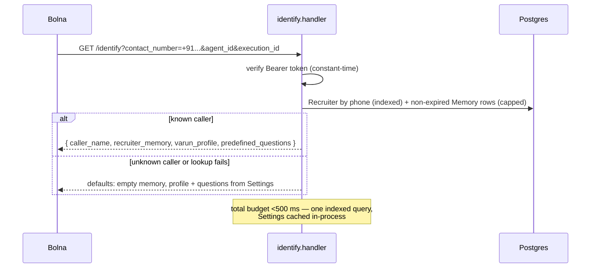
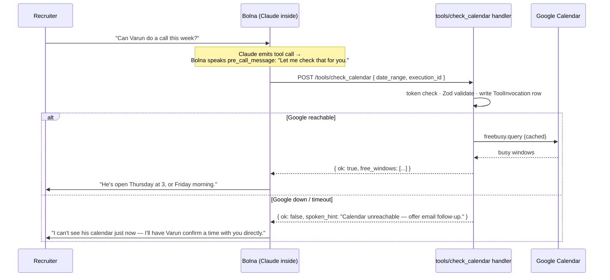
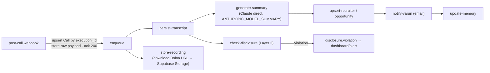

# 17 — Call Lifecycle

> **RecruitPilot AI — Production-Grade AI Executive Voice Assistant**
> Document 17 of 21 · Prerequisites: docs 00–16 (especially 06 — agent config, 08 — webhook contracts, 16 — the agent brain)

---

## 1. Goal

Trace the **complete life of one call** through the new system — from the recruiter's phone ringing to Varun's dashboard updating live — and build the **local development rig** that lets you exercise every step without waiting for a real phone call.

Docs 05–16 built the pieces: the Bolna account and agent (05, 06), the three webhook surfaces (08), the Fastify routes (09), the data model (11), and the agent brain (16). This document is where they run *in order*, as one system. By the end you will have:

- The **end-to-end sequence** in your head: inbound ring → identify → welcome message → conversation → tool calls → hangup → post-call webhook → BullMQ job chain → dashboard realtime — with a sequence diagram for each phase.
- A **local dev loop**: the api running on your machine, exposed to Bolna via **ngrok**, with a real test call flowing through your laptop.
- **curl fixtures for every webhook surface**, so you can develop and debug handlers without placing a call at all.
- **Idempotency and retry drills**: prove a duplicate post-call webhook doesn't double-process.
- **Graceful-degradation drills**: kill a dependency mid-call and hear the agent speak its fallback instead of dying.

What you will *not* find here: audio engineering. Jitter buffers, endpointing, barge-in cancellation, codec math — the DIY pipeline theory — moved to `docs/phase2-diy-reference/` with the rest of the Phase-2 material. Bolna owns the audio; we own the HTTP.

---

## 2. Theory

### 2.1 A call is three HTTP moments (plus everything after)

Here is the mental shift from the DIY design: we never touch a byte of audio. From our system's point of view, a phone call is **three HTTP moments** on our public surface, then a burst of async work:

| Moment | Direction | Surface (doc 08) | Budget | Why the budget |
|---|---|---|---|---|
| **Call start** | Bolna → us | `GET /webhooks/bolna/identify` | **<500 ms** | The caller is hearing ringing/silence; Bolna needs the variables before the prompt is assembled |
| **Mid-call, per tool use** | Bolna → us | `POST /webhooks/bolna/tools/*` | **<800 ms** | The caller is waiting in conversational silence for the agent's next sentence |
| **Call end** | Bolna → us | `POST /webhooks/bolna/post-call` | **<1 s to ack** | Nobody is waiting — but Bolna's delivery should never be stalled by our processing; ack fast, enqueue, return |

If you come from React Native: think of Bolna as the mobile client and our api as its backend. The client owns the UI (the audio conversation); it calls our endpoints at defined moments; and everything slow happens behind a queue, never inside a request handler. The two-plane rule from doc 01 survives intact — it just reads as **webhook response budgets** now instead of an audio latency budget.

### 2.2 The two planes, revisited

- **Live-call plane (fast, synchronous):** identify + tool endpoints. Rules: no slow I/O, no LLM calls, no email sends. Reads are indexed or cached; anything slower **enqueues and returns**. A violation here is *audible* — the caller hears dead air.
- **Async plane (reliable, eventual):** everything triggered by the post-call webhook. Rules: idempotent, retryable, observable. A violation here is *invisible until it isn't* — a silently failed `update-memory` job means a repeat caller gets treated as a stranger three days later (doc 16).

The post-call handler is the **bridge**: it lives on the live plane (respond fast) but its only job is to feed the async plane (enqueue the chain).

### 2.3 Idempotency: at-least-once is the contract you must assume

Webhook producers retry. Whether Bolna retries the post-call webhook on a non-2xx, on a timeout, or on its own schedule is a platform detail — verify against https://www.bolna.ai/docs — but the **defensive posture is not optional**: design every webhook handler as if it can be delivered **at least once**, i.e. possibly twice, possibly out of order with your own reads.

The correlation key is Bolna's **`execution_id`** — present on identify, on tool calls, and in the post-call payload (doc 08). It is our `Call` row's unique key (doc 11). Idempotency then falls out of two habits:

1. **Upsert, don't insert.** The post-call handler upserts the `Call` by `execution_id`. A duplicate delivery updates the same row instead of creating a twin.
2. **Deterministic job IDs.** Every enqueued job uses `{jobName}:{execution_id}` as its BullMQ job ID. BullMQ treats a second add with the same ID as a no-op — the duplicate webhook enqueues nothing new, so no double summary, no double email to Varun.

The same key doubles as the **observability spine**: every log line, every `ToolInvocation` row, every job in the chain carries `execution_id`, so one grep reconstructs a call across api, worker, and Bolna's own execution logs (doc 01).

### 2.4 Graceful degradation: decide the caller's experience in advance

Every dependency will eventually fail during a live call. The design stance: for each failure, *choose* what the caller experiences, rather than discovering it. The failure matrix this document drills in §9:

| Failure | What the caller experiences (designed) | Mechanism |
|---|---|---|
| Identify endpoint slow/down | Call proceeds as a first-time caller — generic but functional | Bolna proceeds without variables; prompt treats empty memory as "first-time caller" (doc 16); our handler also self-imposes a timeout and returns defaults rather than hanging |
| Google Calendar down | Agent: "I'll have Varun confirm a time with you directly" | Tool handler catches, returns spoken-fallback JSON (doc 16) |
| Redis down mid-call | `send_resume`/`notify_varun` fail; agent apologizes and promises follow-up; call continues | Enqueue wrapped in try/catch → fallback JSON; post-call handler *persists the raw payload first* so nothing is lost (§11) |
| Our api entirely down | Bolna's platform behavior (verify against https://www.bolna.ai/docs/tool-calling/custom-function-calls); prompt-level fallback rule still steers the agent | Layered fallbacks: prompt rule works even when we never saw the request |
| Post-call webhook missed | Nothing visible — until reconciliation | Backstop: fetch the execution via Bolna's API (`get_execution`) for any answered call with no post-call record (§11) |

The theme: **the call must survive our bugs.** Bolna keeps the conversation alive; our job is to fail in ways the model can gracefully voice.

---

## 3. Architecture

### 3.1 The whole life of a call



The phases below zoom into the four moments that deserve detail.

### 3.2 Phase: identify (the memory read)



Design notes: **never 500 on an unknown caller** — an unknown number is the normal case for a first-time recruiter, and the correct response is the default variable set, HTTP 200. The handler's own failure mode (DB timeout) also degrades to defaults: an agent without memory beats a call that never starts. The exact request/response contract is doc 08; verify Bolna's parameter names against https://www.bolna.ai/docs/customizations/identify-incoming-callers.

### 3.3 Phase: a tool call (happy path and failure path)



Both branches return **HTTP 200 with model-consumable JSON** — the failure is expressed *in the payload*, not the status code, because the consumer is a language model that must keep talking (doc 16). The `pre_call_message` filler is Bolna configuration (doc 08), so the caller never sits in unexplained silence while our handler runs.

### 3.4 Phase: post-call → the job chain



Chain rules (doc 01): each job is **small, idempotent, retryable with backoff**; each carries `execution_id`; downstream jobs are enqueued by upstream completion so a mid-chain failure retries *that* job, not the whole chain. `check-disclosure` and `store-recording` hang off the chain independently — a summary failure must not delay the Layer-3 audit or the recording download (the Bolna recording URL should be treated as *retrievable now, not forever* — download promptly; verify retention against https://www.bolna.ai/docs/api-reference/executions/get_execution).

### 3.5 Phase: dashboard realtime

No polling, no custom socket server. The worker writes rows; **Supabase Realtime** (doc 04) pushes Postgres changes to the browser; the Next.js dashboard (doc 10) subscribes to `Call` (and `disclosure.violation` flags) and updates the call list and detail pages live. By the time Varun opens his laptop after the notification email, the call card, transcript, summary, and recruiter card are already there.

---

## 4. Folder Structure

This document adds no production modules — it *exercises* the ones from docs 08/09/16 — but it does add the test rig:

```
apps/api/
├── src/features/webhooks/bolna/     # the three surfaces under test (docs 08, 16)
│   ├── identify.handler.ts
│   ├── post-call.handler.ts
│   └── tools/
└── test/
    └── fixtures/bolna/              # recorded/synthetic payloads — the curl + Vitest inputs
        ├── identify.query.json      # query-param sets: known caller, unknown caller
        ├── tool.check_calendar.json
        ├── tool.save_recruiter.json
        ├── tool.send_resume.json
        ├── tool.notify_varun.json
        └── post-call.completed.json # a full execution payload (sanitized real capture)

scripts/
└── fire-webhook.sh                  # thin curl wrapper: surface + fixture → local endpoint (§7)
```

Fixture discipline (doc 19 expands this): the post-call fixture starts as our best guess against doc 08 and is **replaced by a sanitized real capture** after the first live test call — the post-call handler logs the raw payload precisely so you can promote it to a fixture. Handlers validate with Zod `.passthrough()`, so extra fields Bolna sends never break parsing, and fixtures stay honest about what the platform actually delivers.

---

## 5. Manual Steps — local dev loop from zero

The problem: Bolna lives on the public internet; your api lives on `localhost:3000`. **ngrok** bridges them — it gives you a public HTTPS URL that tunnels to your machine, so a real phone call reaches the code in your editor.

### 5.1 Install and connect ngrok

1. Sign up at **https://ngrok.com** (free tier is fine) → dashboard → copy your authtoken.
2. Install: `brew install ngrok` (macOS) — or download from the dashboard.
3. Connect your account: `ngrok config add-authtoken <your-token>`.

### 5.2 Run the stack and open the tunnel

4. Start Redis and the api + worker locally (doc 13 compose, or `npm run dev` per doc 09) with `.env` loaded — including `BOLNA_WEBHOOK_TOKEN` (doc 08).
5. Open the tunnel: `ngrok http 3000`. Note the forwarding URL, e.g. `https://a1b2c3.ngrok-free.app`.
6. Sanity-check the tunnel: `curl https://a1b2c3.ngrok-free.app/health` should return the api's health response through the public URL.

### 5.3 Point the Bolna agent at your tunnel

7. In the Bolna dashboard, open your agent (created in docs 05–06) and set the three URLs to the tunnel (exact tab locations in docs 06 and 08):
   - Inbound caller identification URL → `https://a1b2c3.ngrok-free.app/webhooks/bolna/identify`
   - Each custom function's `value.url` → `https://a1b2c3.ngrok-free.app/webhooks/bolna/tools/<tool_name>`
   - Post-call webhook URL → `https://a1b2c3.ngrok-free.app/webhooks/bolna/post-call`
8. Confirm each URL config sends your `BOLNA_WEBHOOK_TOKEN` as the Bearer token (doc 08).

**Free-tier gotcha:** the ngrok URL **changes every time you restart ngrok**, and every change means re-editing the Bolna agent URLs. Two mitigations: keep the tunnel running across your dev session, or pay for a reserved/static domain — worth it the third time you forget (§10).

### 5.4 Place the first end-to-end test call

9. Call the Bolna number (doc 05) from your own phone. You should hear the verbatim welcome message, then hold a short conversation — ask "when is Varun free this week?" to force a `check_calendar` round trip through your laptop.
10. Watch it happen: the ngrok inspector at **http://127.0.0.1:4040** shows every webhook request/response live (and lets you **replay** any of them — §7); your api logs show the same requests with the `execution_id`.
11. Hang up, then watch the worker logs run the chain, and the dashboard (doc 10) update. Full verification checklist in §9.

---

## 6. Official Links

| Resource | Link | Why |
|---|---|---|
| Bolna docs root | https://www.bolna.ai/docs | The platform behind every arrow marked "Bolna" |
| Caller identification | https://www.bolna.ai/docs/customizations/identify-incoming-callers | The identify surface (§3.2; contract in doc 08) |
| Custom function calls | https://www.bolna.ai/docs/tool-calling/custom-function-calls | The tool surface, `pre_call_message`, failure behavior (§3.3) |
| Analytics tab (post-call) | https://www.bolna.ai/docs/agent-setup/analytics-tab | Where the post-call webhook + summarization/extraction are configured (doc 06) |
| Inbound tab | https://www.bolna.ai/docs/agent-setup/inbound-tab | Linking number → agent → identify URL (doc 06) |
| Executions API | https://www.bolna.ai/docs/api-reference/executions/get_execution | The reconciliation backstop for missed webhooks (§11) |
| ngrok docs | https://ngrok.com/docs | Tunnel, inspector, replay, reserved domains (§5) |
| BullMQ docs | https://docs.bullmq.io | Job IDs, retries, backoff — the idempotency mechanics (§2.3) |
| Supabase Realtime | https://supabase.com/docs/guides/realtime | The dashboard live-update mechanism (§3.5) |

---

## 7. Commands

The curl fixtures — one per webhook surface. These are the fast inner loop: develop a handler, fire the fixture, read the response, no phone required. Run with the api up locally and `.env` loaded. (Exact payload shapes: doc 08; where a field is a guess, the fixture carries a `_comment` and you promote a real capture over it after the first live call — §4.)

**1. Identify — known and unknown caller:**

```bash
# unknown caller → expect 200 with default variables (never a 500)
curl -s "http://localhost:3000/webhooks/bolna/identify?contact_number=%2B919999999999&agent_id=agent_test&execution_id=exec_test_001" \
  -H "Authorization: Bearer $BOLNA_WEBHOOK_TOKEN" | jq

# known caller (seed a Recruiter+Memory row first, doc 11) → expect populated recruiter_memory
curl -s "http://localhost:3000/webhooks/bolna/identify?contact_number=%2B919876543210&agent_id=agent_test&execution_id=exec_test_002" \
  -H "Authorization: Bearer $BOLNA_WEBHOOK_TOKEN" | jq
```

**2. Tools — one per handler** (bodies in `apps/api/test/fixtures/bolna/`):

```bash
for TOOL in check_calendar save_recruiter send_resume notify_varun; do
  curl -s -X POST "http://localhost:3000/webhooks/bolna/tools/$TOOL" \
    -H "Authorization: Bearer $BOLNA_WEBHOOK_TOKEN" \
    -H "Content-Type: application/json" \
    --data @apps/api/test/fixtures/bolna/tool.$TOOL.json | jq
done
# expect: check_calendar → free windows · save_recruiter → recruiterId
#         send_resume / notify_varun → { queued: true } and a job visible in Redis
```

**3. Post-call — and the idempotency drill (fire it twice):**

```bash
curl -s -X POST http://localhost:3000/webhooks/bolna/post-call \
  -H "Authorization: Bearer $BOLNA_WEBHOOK_TOKEN" \
  -H "Content-Type: application/json" \
  --data @apps/api/test/fixtures/bolna/post-call.completed.json | jq   # → 200, chain enqueued

# fire the EXACT same payload again — the retry simulation
curl -s -X POST http://localhost:3000/webhooks/bolna/post-call \
  -H "Authorization: Bearer $BOLNA_WEBHOOK_TOKEN" \
  -H "Content-Type: application/json" \
  --data @apps/api/test/fixtures/bolna/post-call.completed.json | jq   # → 200, NOTHING new enqueued
```

Verify the drill: **one** `Call` row for the fixture's `execution_id`, and job counts unchanged after the second curl:

```bash
docker compose exec redis redis-cli KEYS 'bull:*:exec_test_*' | sort   # job IDs contain execution_id — no duplicates
```

**4. Auth negative test** (must run before anything is public — doc 18):

```bash
curl -s -o /dev/null -w "%{http_code}\n" -X POST http://localhost:3000/webhooks/bolna/post-call \
  -H "Content-Type: application/json" --data '{}'          # no token → expect 401
```

**5. Replay real traffic:** after a live test call through ngrok (§5.4), open **http://127.0.0.1:4040**, select any webhook request, and hit **Replay** — the fastest way to re-drive a real Bolna payload against changed handler code. Save the body into `test/fixtures/bolna/` (sanitize the phone number) to upgrade your fixtures to reality.

---

## 8. Environment Variables

**This document introduces none.** The local rig runs entirely on variables from earlier docs:

| Variable | From | Used here for |
|---|---|---|
| `BOLNA_WEBHOOK_TOKEN` | doc 08 | Every curl fixture and the Bolna-side URL config (§5.3) |
| `BOLNA_API_KEY` | doc 05 | The `get_execution` reconciliation backstop (§11) |
| `REDIS_URL` | doc 09 | The chain the drills observe |
| `GOOGLE_*`, `RESUME_STORAGE_PATH` | doc 16 | The tool handlers under test |
| `ANTHROPIC_MODEL_SUMMARY`, `ANTHROPIC_API_KEY` | doc 07 | The `generate-summary` job in the chain |
| `SUPABASE_*`, `DATABASE_URL` | doc 04 | Persistence + Realtime |

The ngrok authtoken lives in ngrok's own config (`ngrok config add-authtoken`), not in `.env` — it is a dev-machine credential, not an application setting.

---

## 9. Verification

Work through the ladder — each rung assumes the one below it passed.

**1. Fixtures pass locally (no phone, no ngrok).** All §7 curls return the expected shapes; `send_resume`/`notify_varun` show queued jobs; `ToolInvocation` rows exist; the auth negative test returns 401.

**2. Idempotency drill passes.** The double post-call curl (§7.3) leaves exactly one `Call` row and no duplicate jobs. Also test *out-of-order tolerance*: fire a tool fixture for an `execution_id` whose post-call already arrived — nothing should crash.

**3. Degradation drills pass — the call survives your bugs (§2.4):**
- **Calendar down:** unset `GOOGLE_SERVICE_ACCOUNT_JSON` (or block the network), fire the `check_calendar` fixture → expect HTTP 200 with `ok:false` + `spoken_hint`, not a 500. On a live call, the agent should *say* the fallback.
- **Redis down:** stop Redis, fire `send_resume` → expect a graceful `ok:false` fallback JSON; restart Redis and confirm the system recovers.
- **Identify degraded:** point the handler at a bad DB URL → expect the default-variables response within budget, not a hang.

**4. The full live loop (§5.4).** On a real call through ngrok: welcome message plays verbatim first (Layer 1, doc 06) → conversation flows → "when is Varun free?" produces a `check_calendar` request in the ngrok inspector and a spoken, *plausible* answer → hangup → post-call arrives → worker logs show the chain completing → recording lands in Supabase Storage → dashboard shows the call with transcript and summary, live, without a refresh.

**5. Memory round trip.** Call again from the same number after the chain finished: the identify response now carries memory, and the agent acknowledges the earlier conversation (doc 16).

**6. One-grep reconstruction.** Pick the call's `execution_id` and grep api + worker logs: you should be able to reconstruct the entire call — identify, each tool, ack, every job — from that one key (§2.3).

**Self-quiz** (answer from memory):

1. What are the **three HTTP moments** of a call, and the response budget for each? (§2.1)
2. Why must the post-call handler be **idempotent**, and what two mechanisms make it so? (§2.3)
3. A tool handler hits an exception mid-call. What does it return — status code and payload — and what does the caller hear? (§3.3)
4. The identify lookup times out. What does the handler return, and why is that better than a 500? (§3.2)
5. Bolna's post-call webhook never arrives for a completed call. How do you find out, and how do you recover? (§2.4, §11)

---

## 10. Common Mistakes

1. **Testing only the happy path.** The drills in §9 exist because the failure paths are where callers get hurt: a 500 from a tool endpoint during a real call is dead air with a recruiter on the line. If you have not *watched* the degradation drills pass, they don't pass.
2. **Forgetting the ngrok URL rotated.** Free-tier ngrok mints a new URL on every restart; the Bolna agent still points at the old one, and every webhook silently goes nowhere — the call "works" (Bolna keeps talking) but no memory, no tools, no post-call. Symptom: an eerily generic agent. Fix: check the inspector for *zero traffic*, update the URLs (§5.3), or reserve a static domain.
3. **Returning 500 for an unknown caller on identify.** Unknown numbers are the *normal* first-time case, not an error. 200 + default variables, always (§3.2).
4. **Non-idempotent post-call handling.** Plain `INSERT` + non-deterministic job IDs means one Bolna retry produces two summaries and two "new opportunity!" emails to Varun. Upsert by `execution_id`, deterministic job IDs (§2.3) — and prove it with the double-curl drill.
5. **Slow work sneaking into the ack path.** Downloading the recording or calling Claude *inside* the post-call handler works fine in dev and times out in production. The handler persists the raw payload, enqueues, returns — everything else is the worker's job (§2.2).
6. **Skipping the Bearer check locally.** "It's just dev" — but the ngrok URL is a public internet endpoint the moment it exists. Anyone who finds it can enqueue emails from Varun's assistant. The token check runs in every environment; the negative test (§7.4) is part of the fixture suite.
7. **Fixtures drifting from reality.** Hand-written fixtures encode your assumptions, not Bolna's payloads. After the first live call, promote sanitized real captures (§7.5) — and keep handlers on Zod `.passthrough()` so unknown extra fields never break parsing (doc 08).
8. **Speaking raw status codes to the model.** Encoding tool failure as an HTTP error status gives Bolna nothing useful to say. Failures the model must voice travel as 200 + `spoken_hint` payloads (§3.3); real HTTP errors are reserved for auth/validation, where retrying or apologizing is meaningless.

---

## 11. Production Best Practices

- **Respond, then work.** The single organizing rule of the webhook surface: every handler's synchronous section is token check → validate → (fast read | persist raw + enqueue) → return. If a handler's timing log shows growth, something slow crept inside the request path.
- **Persist the raw payload before processing it.** The post-call handler stores the raw JSON (a `rawPayload` column or Storage object) *before* enqueuing. A worker bug can then never lose call data — reprocessing is re-running jobs over stored payloads, and every stored payload is a future test fixture.
- **`execution_id` in every log line.** Api and worker both bind it into the Pino logger context (doc 09) at entry. The §9 "one-grep reconstruction" check is the acceptance test; it is also exactly how you will debug the first weird call in production.
- **Reconcile against Bolna's executions API.** Webhooks are at-least-once, not exactly-once — a delivery can still be lost (our downtime, DNS, a deploy). A daily reconciliation job lists recent executions via `get_execution`/the executions API (`BOLNA_API_KEY`) and flags any completed execution with no `Call` row, then backfills by fetching transcript/recording directly. The webhook is the fast path; the API is the truth.
- **Download recordings promptly.** The `store-recording` job copies the Bolna recording URL into Supabase Storage as soon as the post-call arrives. Treat vendor-hosted URLs as convenience, not archive — our Storage is the system of record (doc 04), and retention on Bolna's side is their policy, not ours.
- **Alert on chain failures, not just errors.** A failed `update-memory` job throws no user-visible error — it just quietly breaks returning-caller recognition. Dead-letter queues + an alert when a job exhausts retries (doc 01, doc 15) make the async plane's failures as loud as the live plane's.
- **Keep a staging agent.** A second Bolna agent pointed at your dev/staging URL (or the ngrok tunnel) lets you test prompt and tool changes with real calls without touching the production number. Cheap insurance at Bolna's prepaid pricing (doc 05).

---

## 12. Security

The lifecycle view adds a few sharp edges to doc 18's full treatment:

- **The tunnel is public.** An ngrok URL is a real internet-facing endpoint, discovered by scanners within minutes. The Bearer-token check (constant-time compare, doc 08) is therefore non-negotiable *in every environment* — the §7.4 negative test enforces it. Don't paste tunnel URLs into public issues or commit them to fixtures.
- **Webhook abuse posture.** The three surfaces are token-gated with strict body-size limits and schema validation; unauthenticated requests are rejected before any parsing beyond the header (doc 18 covers rate posture and the removed WS-DoS surface).
- **Fixtures contain PII.** Real captured payloads hold a recruiter's phone number, name, and possibly email inside the transcript. Sanitize before committing (replace numbers with reserved test ranges, names with placeholders) — the repo is not a place for call data (doc 00 PII rule).
- **The inspector sees everything.** ngrok's local inspector (and ngrok's cloud, on some plans) observes full request bodies — transcripts included. Fine for your dev machine with test calls; never route production traffic through a tunnel.
- **Recording downloads happen server-side.** The worker fetches Bolna recording URLs and writes to private Storage buckets (doc 04); the dashboard gets short-lived signed URLs (doc 10). Recording URLs from the post-call payload are never handed to the browser directly.

---

## 13. Checklist

- [ ] Can narrate the **whole life of a call** (§3.1) from ring to dashboard without looking
- [ ] The three HTTP moments + budgets known cold: identify <500 ms, tools <800 ms, post-call ack <1 s (§2.1)
- [ ] Idempotency mechanics understood: upsert by `execution_id` + deterministic BullMQ job IDs (§2.3)
- [ ] The degradation matrix (§2.4) internalized: for each dependency failure, you can say what the caller hears
- [ ] ngrok installed, authed, tunnel up; Bolna agent URLs pointed at the tunnel (§5)
- [ ] All §7 curl fixtures pass: identify (known/unknown), four tools, post-call
- [ ] Double post-call curl → one `Call` row, no duplicate jobs (§7.3, §9.2)
- [ ] Auth negative test returns 401 (§7.4)
- [ ] Degradation drills pass: calendar down → spoken fallback; Redis down → graceful failure JSON (§9.3)
- [ ] Full live test call completed: welcome message → tool round trip → post-call → chain → dashboard live (§9.4)
- [ ] Memory round trip verified on a second call from the same number (§9.5)
- [ ] One grep on `execution_id` reconstructs the whole call across api + worker logs (§9.6)
- [ ] Real captured payloads promoted to fixtures, sanitized (§7.5, §12)
- [ ] Reconciliation backstop understood: executions API fills webhook gaps (§11)
- [ ] Self-quiz (§9) passed from memory

---

## 14. Next Step

Proceed to **`18_SECURITY.md`** — the attack-surface review of everything this lifecycle exposed: three public webhook endpoints and their token discipline, prompt injection through recruiter speech and the identify response, tool authorization rules, PII handling for transcripts and recordings now transiting Bolna, and the vendor-key inventory with `BOLNA_API_KEY` at the top.
