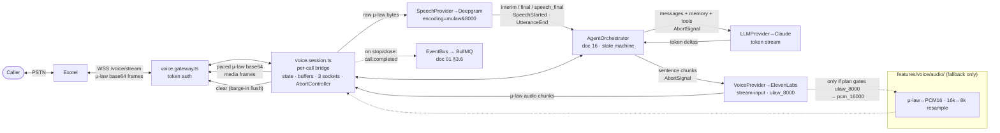
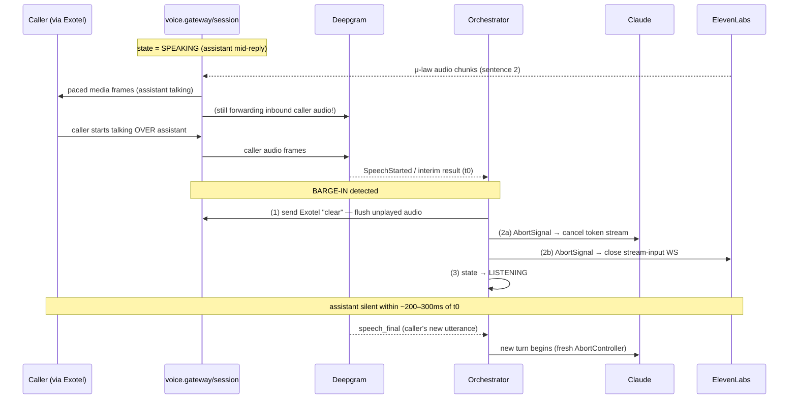

# 17 — Voice Pipeline

> **RecruitPilot AI — Production-Grade AI Executive Voice Assistant**
> Document 17 of 21 · Prerequisites: docs 00–16

---

## 1. Goal

Assemble everything the previous documents configured — Exotel telephony (05), Deepgram STT (06), Claude (07/16), ElevenLabs TTS (08) — into the **one real-time streaming loop** that turns a phone call into a conversation. This is the hardest document in the suite because it is where the latency budget (doc 01 §3.5) is either met or lost, and where four independent vendors, three concurrent WebSockets, and one interrupting human have to be choreographed in `features/voice/` without ever putting slow work on the audio path.

By the end you will be able to:

- Trace **one byte of caller audio** from the recruiter's mouth, through Exotel, Deepgram, Claude, ElevenLabs, and back to their ear — naming every format, socket, and buffer it passes through.
- Explain **why the happy path does zero transcoding** (μ-law end to end) and where the fallback transcode path lives when a vendor forces PCM.
- Implement **barge-in** correctly: detect the caller talking over the assistant and stop the assistant within ~200–300ms — flushing Exotel's playback buffer *and* cancelling the in-flight Claude + ElevenLabs streams.
- Build a **local test rig** (ngrok + a WebSocket replay client) to develop and measure the pipeline before spending a single real telephony minute.
- Read a `callSid`-tagged log and reconstruct exactly where a turn spent its milliseconds.

This document is architecture + illustrative code + operational practice. The real implementation lands here in the build; docs 00–16 gave you every part in isolation, and this is where they interlock.

---

## 2. Theory

### 2.1 Digital audio from first principles (why 8kHz, why μ-law)

Sound is a continuous pressure wave. A computer cannot store "continuous" — it must **sample**: measure the wave's amplitude at fixed time intervals and store each measurement as a number. Two knobs define the fidelity of that capture:

- **Sample rate** — how many measurements per second, in Hz. The Nyquist theorem says you can faithfully represent frequencies up to *half* the sample rate. Human speech intelligibility lives mostly below 4kHz, so telephony standardised on **8,000 samples/second (8kHz)** — it captures everything below 4kHz and throws away the rest. Studio/podcast audio uses 16kHz, 44.1kHz, or 48kHz to capture the sparkle above 4kHz (consonant crispness, music). **We are a phone system: 8kHz is our world, top to bottom.**
- **Bit depth** — how many bits encode each sample. **Linear PCM** (Pulse-Code Modulation) is the raw, uncompressed representation: 16-bit linear PCM (`PCM16`) stores each sample as a signed integer from −32,768 to +32,767. That is 2 bytes per sample × 8,000 samples/s = **128 kbit/s** for one direction of a phone call — wasteful for a network built in the 1960s.

**Companding (μ-law / G.711).** The telephone network's answer to that waste is **μ-law** (pronounced "mu-law"), a *companding* codec standardised as ITU-T **G.711**. Human hearing is logarithmic — we perceive loudness ratios, not absolute differences, and we are far more sensitive to detail in quiet sounds than loud ones. μ-law exploits this: it maps the 16-bit linear range onto **8 bits** (one byte per sample) using a logarithmic curve that gives fine resolution to quiet samples and coarse resolution to loud ones. The result: **8kHz μ-law = 8 bits × 8,000/s = 64 kbit/s**, half the bandwidth of linear PCM, with speech that sounds essentially identical to the human ear. This is *the* format of the PSTN. Every phone call you have ever made was μ-law (or its European cousin A-law) somewhere along the wire.

The one-line summary that governs this whole document:

> **Telephony audio is 8kHz, mono, μ-law, one byte per sample. Everything in our pipeline is chosen to speak that natively so we never have to convert it.**

### 2.2 The format map across the pipeline (why the happy path transcodes nothing)

Transcoding — converting audio from one format to another — costs CPU and, worse, *latency* and buffering complexity on the hottest path in the system. The single most important design win of this pipeline is that **on the happy path, we transcode nothing.** Here is why, stage by stage:

| Hop | Format on the wire | Do we convert? | Why not |
|---|---|---|---|
| Exotel → gateway (inbound audio) | 8kHz μ-law, base64 in JSON `media` frames (doc 05 §2.4) | **No** | It is already telephone μ-law |
| gateway → Deepgram (STT) | 8kHz μ-law, raw bytes | **No** | Deepgram accepts `encoding=mulaw&sample_rate=8000&channels=1` and transcribes μ-law directly (doc 06 §2.7) |
| Claude (LLM) | text only | n/a | No audio here — text in, text out |
| gateway → ElevenLabs (TTS) | text in | n/a | We send sentences, not audio |
| ElevenLabs → gateway (outbound audio) | 8kHz μ-law (`output_format=ulaw_8000`, doc 08 §2.6) | **No** | ElevenLabs emits telephone μ-law on request |
| gateway → Exotel (outbound audio) | 8kHz μ-law, base64 in JSON `media` frames | **No** | Byte-for-byte forward of ElevenLabs' output |

Every arrow that carries audio carries **the same format**. Deepgram was told "the bytes are μ-law" and ElevenLabs was told "give me μ-law back," so the gateway is a pure *router* of μ-law bytes — decode the base64 envelope, forward the bytes, re-encode base64 on the way out. No sample-rate math, no codec tables, no re-buffering. That is latency we never pay and a class of bugs we never write.

**The fallback transcode path (`features/voice/audio/`).** Vendors change plans and gates. Doc 08 §2.6 warns that `ulaw_8000` output can be plan-gated; if so, the fallback is to request `pcm_16000` from ElevenLabs and convert it ourselves. That means two operations, both living in `features/voice/audio/`:

1. **μ-law ↔ PCM16 conversion.** μ-law → PCM16 is a fixed 256-entry lookup table (one byte in, one 16-bit sample out) — trivial and fast. PCM16 → μ-law is the inverse companding formula. This is pure arithmetic, no allocation per sample if you write into a pre-sized buffer.
2. **Resampling 16k ↔ 8k.** If ElevenLabs gives PCM at 16kHz, you must *downsample* to 8kHz before μ-law-encoding for Exotel: low-pass filter (to avoid aliasing above 4kHz) then take every second sample. Upsampling 8k→16k (needed only if some future STT vendor demanded 16kHz input) interpolates. Resampling is the genuinely expensive step — a real FIR filter per chunk — which is exactly why we prefer vendors that speak 8kHz μ-law and keep this code on the shelf, reserved but unused on the happy path.

The lesson from doc 06 §10 stands: **declare the format, don't convert it.** The transcode module exists so a plan gate can't break us, not because we expect to run it.

### 2.3 Frames, packets, and base64 over WebSocket

Exotel does not send one giant audio blob — it streams **frames**, small fixed-duration slices of audio, typically **~20ms each** (the telephony standard packetisation interval). At 8kHz μ-law, 20ms of audio = 0.020 × 8,000 = **160 samples = 160 bytes**. Each frame is:

1. Base64-encoded (WebSocket text/JSON frames are UTF-8; base64 makes raw bytes safe to embed in JSON). Base64 inflates size ~33%, so 160 bytes → ~216 characters — negligible.
2. Wrapped in a JSON `media` message (doc 05 §2.4) with the base64 `payload` and stream metadata.

So a live call is **~50 tiny JSON messages per second per direction**. The gateway's inner loop runs 50×/s: parse JSON, base64-decode the payload, forward 160 bytes to Deepgram. This is why the real-time plane rule (doc 01 §2.3) is absolute — a single `await db.save()` in that loop, running 50 times a second, stutters the call. Decode, route, done; anything else is a queued job.

### 2.4 Jitter and buffering (the small-buffer tradeoff)

Frames are sent 20ms apart, but they do **not arrive** exactly 20ms apart — the internet delivers them bunched and gapped. That variance in inter-arrival time is **jitter**. If you play audio out the instant each frame arrives, jitter becomes audible: clicks, gaps, choppiness.

The classic fix is a **jitter buffer**: hold a *small* amount of audio (say 2–3 frames) so that when the network hiccups, you have a reserve to keep playback smooth, refilling it as frames catch up. The tradeoff is stark and directly hits our SLO:

| Jitter buffer size | Effect |
|---|---|
| **Zero** | Every network hiccup is an audible gap — choppy, robotic |
| **Small (~40ms, our default)** | Absorbs normal jitter; adds only ~40ms of latency |
| **Large (200ms+)** | Silky smooth, but adds 200ms+ of pure delay to every turn — eats the budget, feels laggy |

We default `VOICE_JITTER_BUFFER_MS=40` (§8) — two frames of slack. Note the asymmetry: the **outbound** direction (assistant → caller) is where a jitter buffer helps most, because we control the pacing of ElevenLabs output into Exotel (see backpressure, §2.8). On the **inbound** direction, Deepgram does its own internal buffering and endpointing, so we forward caller frames straight through and let the STT own that concern (doc 06).

### 2.5 VAD and endpointing recap (who owns "when did they stop / start talking")

Two different questions, two different owners:

- **"Has the caller finished their turn?"** — **endpointing**, owned entirely by **Deepgram** (doc 06 §2.3). Deepgram watches for a configurable stretch of silence (`DEEPGRAM_ENDPOINTING_MS=300`) and marks the final transcript `speech_final: true`. That flag is the turn trigger. `UtteranceEnd` (doc 06 §2.4) is the safety net for noisy lines. **We do not reimplement this** — it is a solved, tuned, budgeted 300ms slice.
- **"Is the caller talking *right now*, while the assistant is speaking?"** — **VAD for barge-in**. This is the one place client-side voice-activity awareness earns its keep. We have two ways to answer it, discussed next.

### 2.6 Barge-in, in depth (the hardest 300ms in the system)

A human conversation is **interruptible**. When the assistant is halfway through "Varun is generally open to relocation, though he'd want to under—" and the caller cuts in with "no, remote only," the assistant must **stop instantly and listen**. Failing to do this is the single most damning flaw a voice agent can have — it feels like talking to a machine that isn't listening, because it literally isn't.

**Detecting the interruption.** While the assistant is in `SPEAKING` state, we need the earliest possible signal that the caller has started talking. Two options, and we can use either or both:

1. **Deepgram-driven (recommended default).** Deepgram is *already* receiving the caller's inbound audio for the whole call (we never stop forwarding it). With `vad_events=true` it emits **`SpeechStarted`** the instant voice activity begins, and interim results (`is_final: false`) arrive within ~300ms of speech (doc 06 §2.2, §2.5). Either signal, received while in `SPEAKING`, means "human is talking — barge-in now." This reuses a socket and a service we already run, needs no audio math, and is our default.
2. **Client-side energy VAD.** Compute the short-term **energy** (roughly, the average absolute amplitude) of each inbound frame; if it crosses `BARGE_IN_ENERGY_THRESHOLD` (§8) for a few consecutive frames while the assistant is speaking, treat it as barge-in. This can fire a few milliseconds sooner than Deepgram and works even if the STT socket is momentarily stalled, but it is dumber — it cannot tell speech from a cough, a door slam, or line noise. Offer it as a tunable; keep Deepgram as the smart primary.

**The barge-in sequence — three actions, in order, immediately:**

Once barge-in is detected, three things must happen with no `await` on slow I/O between them:

1. **Stop sending TTS audio to Exotel, and flush what Exotel has already buffered.** We send a **`clear`** message on the Exotel socket (doc 05 §2.4 — the "barge-in kill switch"), which tells Exotel to discard any audio we already streamed that hasn't played yet. Without this, the assistant keeps talking over the caller from Exotel's own playback buffer even though we've stopped generating — the worst symptom. (`mark` messages help you know *how much* had played, for bookkeeping.)
2. **Fire the `AbortSignal` to cancel the in-flight Claude and ElevenLabs streams.** The orchestrator holds **one `AbortController` per turn** (doc 03 §4.2, doc 07 §3, doc 16). Aborting it: cancels Claude's HTTP token stream (tokens we never receive are tokens we never pay for or speak, doc 07 §3) and closes the ElevenLabs `stream-input` WebSocket (closing *is* the cancel — there is no cancel message, doc 08 §3.2, which also frees the concurrency slot).
3. **Transition state → `LISTENING`.** The state machine (doc 01 §3.3, doc 16) leaves `SPEAKING` and re-enters `LISTENING`; Deepgram is already streaming the caller's new utterance, and the next `speech_final` starts a fresh turn.

Do all three and the assistant goes quiet within ~200–300ms of the caller opening their mouth. Skip step 1 and the assistant keeps talking. Skip step 2 and you burn tokens/characters synthesising a reply nobody will hear and leak an ElevenLabs session.

### 2.7 Echo, feedback, and half-duplex reality

Could the assistant's own audio bleed into the inbound stream and trigger a false barge-in — the assistant interrupting *itself*? On the PSTN this is largely mitigated for us: telephone connections are effectively **half-duplex-ish** with carrier-grade echo cancellation, so the caller's inbound channel is mostly their own voice, not a loud echo of the assistant. We lean on Exotel + Deepgram's endpointing rather than building our own acoustic echo canceller. If false barge-ins ever appear in testing, the tuning knobs are `BARGE_IN_ENERGY_THRESHOLD` (raise it) or preferring Deepgram's `SpeechStarted` (which is less fooled by faint bleed than raw energy). Building an AEC is explicitly *not* in scope — it is the carrier's job.

### 2.8 Backpressure (when ElevenLabs outruns Exotel)

ElevenLabs, generating faster than real time (doc 08 §2.2), can hand us **audio faster than Exotel can play it**. Exotel plays at exactly 1× real time (it's a phone call), so if we blast every chunk the instant it arrives, we overfill Exotel's buffer — which then makes barge-in `clear` less precise (more unplayed audio to discard) and, in the worst case, drops frames. The fix is **pacing**: forward outbound frames to Exotel at roughly real time (20ms of audio every ~20ms), using the small jitter buffer (§2.4) as the smoothing reservoir. This is *backpressure-aware writing* (doc 01 §11): don't write faster than the downstream drains. Practically, it means the outbound path is a small timed queue, not a firehose.

### 2.9 Pipelining recap and the metric that matters (§3.4 of doc 01)

The trick that makes the whole thing feel fast (doc 01 §3.4): we do **not** wait for Claude's full reply before speaking. The orchestrator (doc 16) chunks Claude's token stream at **sentence boundaries** and feeds each completed sentence to ElevenLabs' `stream-input` socket the moment it's ready. Sentence 1's audio is already playing to the caller while Claude is still generating sentence 3. The stages overlap instead of stacking serially.

The consequence is the metric we optimise: not "how long is the reply" but **time-to-first-audio** — end of caller speech → first assistant audio byte reaching Exotel. That is the ≤1.5s p95 SLO (doc 01 §3.5). Everything in this document is in service of that one number.

**Why sentence-level, not word-level, chunking?** Prosody needs context (doc 08 §2.1, §2.5). Feeding ElevenLabs raw token drips ("Varun" … "is" … "open") starves the prosody model and produces flat, choppy speech. Feeding whole sentences gives it a full clause to intonate. Sentence-level is the sweet spot: enough context for natural prosody, small enough to start audio fast.

---

## 3. Architecture

### 3.1 Three concurrent WebSockets, one session object

The defining fact of this document: **a single live call holds three WebSocket connections open simultaneously**, all bridged inside `voice.session.ts`:

| Socket | Between | Carries | Owned/managed by | Doc |
|---|---|---|---|---|
| **Exotel WS** | Exotel ⇄ gateway | 8kHz μ-law audio (both ways) + `start`/`stop`/`mark`/`clear` control | `voice.gateway.ts` (accept + token auth) → `voice.session.ts` | 05 |
| **Deepgram WS** | gateway ⇄ Deepgram | inbound μ-law out, transcript events (interim/final/`speech_final`/`SpeechStarted`) back | `providers/deepgram/` (via `SpeechProvider` port) | 06 |
| **ElevenLabs WS** | gateway ⇄ ElevenLabs | sentences out, μ-law audio chunks back | `providers/elevenlabs/` (via `VoiceProvider` port), **one per assistant turn** | 08 |

Note the lifecycle asymmetry: the Exotel and Deepgram sockets live **exactly as long as the call**; the ElevenLabs socket is opened **per assistant turn** and closed at turn end or on barge-in (doc 08 §3.2). The orchestrator (doc 16) sits logically in the middle, consuming transcript events from Deepgram and driving Claude → ElevenLabs.

### 3.2 End-to-end audio dataflow



Read it as the life of a byte: caller voice → Exotel → gateway (base64-decode) → session → Deepgram (transcribe) → orchestrator (on `speech_final`) → Claude (think, streaming) → per sentence → ElevenLabs (synthesise, streaming) → session (pace) → gateway (base64-encode) → Exotel → caller's ear. The dotted `audio/` box is the fallback transcode path (§2.2), dark on the happy path.

### 3.3 The per-call session object

`voice.session.ts` owns one object per call. Everything the call needs lives here, in memory, keyed by `callSid` (doc 01 §3.8):

| Field | Purpose |
|---|---|
| `callSid` | Correlation ID from Exotel's `start` event — threads into every log line, job, DB row (doc 01 §3.8, doc 05) |
| `state` | The state-machine state: `GREETING → LISTENING → THINKING → SPEAKING → TOOL_CALL → CLOSING` (doc 01 §3.3, doc 16) |
| `exotelWs` | The inbound Exotel socket (accepted by the gateway) |
| `speech` | `SpeechProvider` handle — the Deepgram socket lifetime = call lifetime |
| `voiceTurn` | The current-turn `VoiceProvider` handle — the ElevenLabs socket, opened per turn |
| `abortController` | **One per turn.** `.abort()` cancels Claude + ElevenLabs on barge-in (doc 07 §3, doc 08 §3.2) |
| `outboundQueue` | The small paced jitter buffer for assistant audio → Exotel (§2.4, §2.8) |
| `transcriptBuffer` | Accumulated final transcript text for the current utterance (doc 06 §2.2) |
| `deepgramKeepAlive` | The ~5s timer that keeps Deepgram alive during agent speech (doc 06 §3.2) |
| `callTimer` | The `VOICE_MAX_CALL_SECONDS` safety cap (§8) |

**Reconnect-once policy** (doc 01 §11, doc 06 §3.2): if the Deepgram or ElevenLabs socket drops mid-call, the provider attempts **exactly one** immediate reconnect. If that fails, it surfaces a provider-failure event and the orchestrator plays a pre-synthesised scripted apology (doc 08 §3.3) — never a silent retry loop while the caller talks into the void.

**KeepAlive during agent speech** (doc 06 §3.2): while the assistant is in `SPEAKING`, no caller audio flows to Deepgram, and Deepgram closes idle sockets after ~10s. The session sends `{"type":"KeepAlive"}` every ~5s of inbound silence so the STT socket survives long agent turns — otherwise transcription mysteriously dies from turn two onward.

### 3.4 Mapping to the folder structure (doc 03)

| Responsibility | Path |
|---|---|
| WS accept + `VOICE_WS_AUTH_TOKEN` check at upgrade (doc 05 §5.5) | `features/voice/voice.gateway.ts` |
| Per-call bridge: 3 sockets, state, buffers, barge-in, cleanup | `features/voice/voice.session.ts` |
| μ-law↔PCM16 transcode + resample + jitter buffer helpers | `features/voice/audio/` |
| WS route registration (`/voice/stream`) + Exotel StatusCallback webhook (`/voice/status-callback`) | `features/voice/voice.routes.ts` |
| Turn loop, sentence chunking, tool dispatch, AbortController | `features/agent/agent.orchestrator.ts` (doc 16) |
| STT / LLM / TTS behind ports | `providers/{deepgram,claude,elevenlabs}/` |

Per doc 03 §12, `features/voice/` is the **single folder** holding all unauthenticated-inbound surface — one place to audit auth (§12).

### 3.5 Illustrative code — a trimmed `voice.session.ts`

Short, real, readable — a *sketch*, not the full implementation (that lands in the build). It shows the shape: how the three sockets bridge, where barge-in fires, and how cleanup enqueues the async plane. It uses the ports exactly as docs 03/06/07/08/16 defined them — no vendor SDK appears here (that would break the dependency rule, doc 03 §3).

```typescript
// apps/api/src/features/voice/voice.session.ts  (illustrative sketch)
import type { SpeechProvider, LLMProvider, VoiceProvider } from "@/core/ports";
import type { AgentOrchestrator } from "@/features/agent/agent.orchestrator";
import type { EventBus } from "@/infra/queue";
import { decodeMediaFrame, encodeMediaFrame, PacedOutbound, energyOf } from "./audio";

type State = "GREETING" | "LISTENING" | "THINKING" | "SPEAKING" | "TOOL_CALL" | "CLOSING";

export class VoiceSession {
  private state: State = "GREETING";
  private turnAbort = new AbortController();      // one per turn — barge-in cancels it
  private readonly outbound: PacedOutbound;       // small jitter buffer → Exotel at ~1x
  private callSid = "";

  constructor(
    private readonly exotelWs: WebSocket,
    private readonly speech: SpeechProvider,       // Deepgram behind the port
    private readonly orchestrator: AgentOrchestrator,
    private readonly bus: EventBus,
    jitterMs: number,                              // VOICE_JITTER_BUFFER_MS
    private readonly bargeInThreshold: number,     // BARGE_IN_ENERGY_THRESHOLD
  ) {
    this.outbound = new PacedOutbound(exotelWs, jitterMs);
    this.exotelWs.on("message", (raw) => this.onExotelMessage(raw));
    this.exotelWs.on("close", () => this.cleanup("exotel-closed"));
  }

  private async onExotelMessage(raw: Buffer) {
    const msg = JSON.parse(raw.toString());
    switch (msg.event) {
      case "start":
        this.callSid = msg.start.callSid;                        // correlation id (doc 01 §3.8)
        await this.speech.open({ callSid: this.callSid });       // Deepgram WS: mulaw/8000 params
        this.speech.onTranscript((t) => this.onTranscript(t));   // interim/final/speech_final/SpeechStarted
        await this.playGreeting();                               // pre-synthesised asset (doc 08 §3.3)
        this.state = "LISTENING";
        break;

      case "media": {
        const bytes = decodeMediaFrame(msg.media.payload);       // base64 → raw μ-law, NO transcode
        this.speech.send(bytes);                                 // forward untouched to Deepgram
        if (this.state === "SPEAKING" && energyOf(bytes) > this.bargeInThreshold) {
          this.onBargeIn();                                      // client-side energy fallback (§2.6)
        }
        break;
      }

      case "stop":
        this.cleanup("exotel-stop");
        break;
    }
  }

  private onTranscript(t: { text: string; speechFinal: boolean; speechStarted: boolean }) {
    // Deepgram-driven barge-in: any caller speech while we're SPEAKING (§2.6, doc 06 §2.5)
    if (this.state === "SPEAKING" && (t.speechStarted || t.text.length > 0)) {
      this.onBargeIn();
      return;
    }
    if (t.speechFinal && this.state === "LISTENING") {
      void this.runTurn(t.text);                                 // fire the turn on the endpoint
    }
  }

  private async runTurn(utterance: string) {
    this.state = "THINKING";
    this.turnAbort = new AbortController();                       // fresh controller for this turn
    const voiceTurn: VoiceProvider = await this.orchestrator.openVoiceTurn(this.turnAbort.signal);

    // Orchestrator streams Claude → yields completed SENTENCES (doc 16 pipelining, §2.9)
    for await (const sentence of this.orchestrator.handleUtterance({
      callSid: this.callSid,
      utterance,
      signal: this.turnAbort.signal,                             // barge-in cancels Claude
    })) {
      this.state = "SPEAKING";
      voiceTurn.sendSentence(sentence);                          // → ElevenLabs stream-input (ulaw_8000)
    }
    voiceTurn.flush();                                           // force tail synthesis (doc 08 §3.2)

    for await (const audio of voiceTurn.audio()) {               // μ-law chunks back
      this.outbound.enqueue(encodeMediaFrame(audio));            // base64 media frame, paced → Exotel
    }
    if (this.state === "SPEAKING") this.state = "LISTENING";     // turn ended without interruption
  }

  private onBargeIn() {
    this.exotelWs.send(JSON.stringify({ event: "clear" }));      // (1) flush Exotel playback buffer (doc 05)
    this.outbound.clear();                                       //     drop our own queued frames
    this.turnAbort.abort();                                      // (2) cancel Claude + ElevenLabs (doc 07/08)
    this.state = "LISTENING";                                    // (3) back to listening
  }

  private cleanup(reason: string) {
    this.state = "CLOSING";
    this.turnAbort.abort();                                      // kill any in-flight turn
    this.speech.close();                                         // CloseStream → flush finals (doc 06 §3.2)
    this.outbound.clear();
    try { this.exotelWs.close(); } catch { /* already closed */ }
    // async plane: one event fans out transcript→summary→notify (doc 01 §3.6). NO DB writes here.
    this.bus.emit("call.completed", { callSid: this.callSid, reason });
  }
}
```

What to notice: the `media` handler is tiny and synchronous (no `await` on slow I/O — doc 01 §2.3); barge-in does its three actions with zero slow work between them (§2.6); cleanup **emits an event** rather than writing to the DB (doc 01 §3.6); every vendor is reached through a port, never an SDK (doc 03 §3).

### 3.6 Barge-in state + timing diagram



The whole point: from the caller's first syllable over the assistant (`t0`) to silence is **~200–300ms**. Anything longer and the interruption feels ignored.

---

## 4. Folder Structure

Everything this document produces lives under `features/voice/` — the vertical slice fixed in doc 03 §4. No new top-level folders.

```
apps/api/src/features/voice/
├── voice.gateway.ts        # WS upgrade accept + VOICE_WS_AUTH_TOKEN check (doc 05 §5.5);
│                           #   creates one VoiceSession per accepted call
├── voice.session.ts        # THE bridge: 3 sockets, state machine, barge-in, cleanup (§3.5)
├── voice.routes.ts         # registers WS route /voice/stream + webhook /voice/status-callback
├── audio/                  # codec + buffering helpers (mostly dormant on the happy path)
│   ├── mulaw.ts            #   μ-law ↔ PCM16 lookup-table conversion (§2.2 fallback)
│   ├── resample.ts         #   16k ↔ 8k resampling (§2.2 fallback, expensive — avoid)
│   ├── frames.ts           #   base64 decode/encode of Exotel media payloads (happy path)
│   ├── paced-outbound.ts   #   the jitter buffer + real-time pacing → Exotel (§2.4, §2.8)
│   └── energy.ts           #   short-term energy for client-side barge-in VAD (§2.6)
└── voice.session.test.ts   # Vitest: fake sockets, assert barge-in fires clear+abort+LISTENING

# consumed via ports (no SDKs here):
apps/api/src/core/ports/{speech,llm,voice,telephony}.provider.ts
apps/api/src/providers/{deepgram,claude,elevenlabs,exotel}/     # the only SDK homes
apps/api/src/features/agent/agent.orchestrator.ts               # doc 16 — the turn loop
apps/api/assets/audio/greeting.ulaw                             # pre-synthesised greeting (doc 08 §3.3)
```

Note that `frames.ts` (base64 decode/encode) is the *only* audio helper on the happy path; `mulaw.ts` and `resample.ts` are the reserved fallback (§2.2). Keep them, test them, but expect them idle.

---

## 5. Manual Steps

You cannot iterate on a real-time pipeline by placing real phone calls — each one is metered, slow to set up, and non-reproducible. Build a **local rig** that replays known audio so you can develop and measure deterministically before doc 15's real deployment.

### 5.1 Stand up the ngrok bridge

Exotel needs a public `wss://` URL; your laptop isn't one (doc 05 §2.6). With Fastify running on port 3000 (doc 09):

```bash
ngrok http 3000
# copy the https://xxxx.ngrok-free.app forwarding URL; wss:// uses the same host
```

Paste `wss://xxxx.ngrok-free.app/voice/stream?token=<VOICE_WS_AUTH_TOKEN>` into the Voicebot applet (doc 05 §5.7). This is for full end-to-end tests with a real call. For fast iteration, skip Exotel entirely and use the replay client below.

### 5.2 Build a local WebSocket test-client (describe, don't ship it)

Write a tiny throwaway Node script — **do not add it to `src/`** — that impersonates Exotel:

1. Opens a WebSocket to `ws://localhost:3000/voice/stream?token=<VOICE_WS_AUTH_TOKEN>`.
2. Sends a `start` JSON message with a fake `callSid` (e.g. `test-0001`) in the exact shape your `voice.routes.ts` parses (use the **real** frame you captured from webhook.site / a real call in doc 05 as the fixture — never invent the shape).
3. Reads a recorded **μ-law/8kHz** file (or a `.wav` you convert once with `ffmpeg -i sample.wav -ar 8000 -ac 1 -f mulaw sample.ulaw`), slices it into **160-byte / 20ms** frames, base64-encodes each, and emits them as `media` messages **on a 20ms timer** (real-time pacing — don't blast them, or you won't exercise the jitter buffer or endpointing realistically).
4. Prints every `media` message it receives back (the assistant's audio) and, optionally, writes them to a `.ulaw` file you can play with `ffplay -f mulaw -ar 8000 out.ulaw`.
5. Sends `stop` at the end.

This one script lets you replay "a recruiter asking about compensation" a hundred times identically, watch the transcript appear, hear the reply, and — crucially — measure timings. It is the most valuable 60 lines you'll write this week.

### 5.3 Source test audio

- **Deepgram's sample audio** (doc 06 §7): `https://dpgr.am/spacewalk.wav` — convert to μ-law/8kHz as above and replay it to prove the STT leg end to end.
- **ElevenLabs playground outputs** (doc 08 §5): synthesise a few recruiter-style utterances, use them as replay input.
- **Record yourself** asking the predefined screening questions (doc 00 §1) on a phone-quality mic; these are your most realistic fixtures.

### 5.4 Instrument per-stage timestamps

Add `callSid`-tagged log lines (doc 01 §3.8) at each stage boundary so you can compute the budget in practice, not in theory:

- `t0` — `speech_final` received (end of caller speech)
- `t1` — utterance sent to Claude
- `t2` — Claude first token
- `t3` — first sentence sent to ElevenLabs
- `t4` — **first assistant audio byte enqueued to Exotel** ← this minus `t0` is time-to-first-audio, the SLO (doc 01 §3.5)

Log them as structured fields (`{ callSid, stage, t }`) so a single grep reconstructs one turn's timeline (§7).

---

## 6. Official Links

| Topic | Link |
|---|---|
| Exotel voice streaming (WS frame formats) | https://developer.exotel.com/api/#voice-streaming |
| Deepgram live streaming STT | https://developers.deepgram.com/docs/live-streaming-audio |
| Deepgram encoding & sample-rate params | https://developers.deepgram.com/docs/encoding |
| Deepgram KeepAlive | https://developers.deepgram.com/docs/keep-alive |
| ElevenLabs WebSocket streaming input | https://elevenlabs.io/docs/api-reference/websockets |
| ElevenLabs latency optimisation | https://elevenlabs.io/docs/api-reference/reducing-latency |
| Anthropic streaming API | https://docs.anthropic.com/en/docs/build-with-claude/streaming |
| ITU-T G.711 (μ-law / A-law standard) | https://www.itu.int/rec/T-REC-G.711 |
| WebSocket protocol (RFC 6455) | https://datatracker.ietf.org/doc/html/rfc6455 |
| ffmpeg (audio conversion for fixtures) | https://ffmpeg.org/ffmpeg.html |
| websocat (WS CLI) | https://github.com/vi/websocat |

---

## 7. Commands

```bash
# 1. Poke the WS route by hand — confirm token auth gates it (doc 05 §5.5).
#    Wrong/absent token must be rejected at upgrade, BEFORE any session/vendor socket opens (§12).
websocat "ws://localhost:3000/voice/stream?token=WRONG"                 # expect: immediate close / 401
websocat "ws://localhost:3000/voice/stream?token=$VOICE_WS_AUTH_TOKEN"  # expect: stays open

# 2. Convert any sample to the telephony format your replay client feeds in (§5.2):
ffmpeg -i sample.wav -ar 8000 -ac 1 -f mulaw sample.ulaw

# 3. Replay a recorded call into the pipeline (your throwaway test-client from §5.2):
node scripts/replay-exotel.mjs --file sample.ulaw --callSid test-0001

# 4. Play the assistant audio your client captured back (μ-law 8kHz):
ffplay -f mulaw -ar 8000 out.ulaw

# 5. Reconstruct ONE turn's timing from logs by callSid (doc 01 §3.8):
grep 'test-0001' logs/api.log | grep -E 'stage=(t0|t1|t2|t3|t4)' | sort

# 6. Compute p95 time-to-first-audio across many turns (t4 - t0 per turn, in ms):
#    (assumes a "ttfa_ms" field logged when the first assistant frame is enqueued)
grep 'ttfa_ms' logs/api.log \
  | grep -oE 'ttfa_ms=[0-9]+' | cut -d= -f2 \
  | sort -n | awk '{a[NR]=$1} END{print "p95 =", a[int(NR*0.95)], "ms"}'
```

Command 6 is the SLO check made concrete: the number it prints is the ≤1,500ms contract from doc 01 §3.5, measured on your own traffic rather than hoped for.

---

## 8. Environment Variables

**No new vendor keys** — every credential this pipeline needs already exists: `EXOTEL_*` + `VOICE_WS_AUTH_TOKEN` (doc 05), `DEEPGRAM_*` (doc 06), `ANTHROPIC_*` (doc 07), `ELEVENLABS_*` (doc 08). This document introduces only **three tuning knobs** — pipeline behaviour, config-not-code (doc 02 §11), so they're tunable from real-call data without a deploy.

```bash
# .env.example — Voice pipeline tuning (doc 17)
VOICE_JITTER_BUFFER_MS=40           # outbound smoothing reservoir; small = low latency (§2.4)
BARGE_IN_ENERGY_THRESHOLD=800       # client-side energy VAD for barge-in; OR rely on Deepgram (§2.6)
VOICE_MAX_CALL_SECONDS=600          # hard safety cap on call/session duration (§12, DoS + cost)
```

| Variable | Required | Default | Used by | Notes |
|---|---|---|---|---|
| `VOICE_JITTER_BUFFER_MS` | optional | `40` | `features/voice/audio/paced-outbound.ts` | Outbound pacing reservoir (§2.4/§2.8). Raise only if you hear choppiness; every ms added is latency spent. |
| `BARGE_IN_ENERGY_THRESHOLD` | optional | `800` | `features/voice/audio/energy.ts` | Amplitude threshold for the **client-side** barge-in path. **Alternative:** leave the energy path off and rely on Deepgram `SpeechStarted`/interim results (§2.6) — the recommended default; this knob is the belt-and-braces fallback. Raise it if faint audio bleed causes false barge-ins (§2.7). |
| `VOICE_MAX_CALL_SECONDS` | optional | `600` | `features/voice/voice.session.ts` | Hard cap; on expiry the session plays a scripted wrap-up and closes. Bounds per-call vendor spend and blocks slow-loris/stuck-socket resource exhaustion (§12). |

All three are validated at boot by the Zod env schema in `core/config/` (doc 03 §8), and read **only** there (the `process.env` grep rule, doc 03 §12). Barge-in *detection strategy* itself is a policy choice, not a secret — pick Deepgram-primary and treat the energy knob as optional hardening.

---

## 9. Verification

You are done with this document when **all** of the following hold. Use the local replay rig (§5) for 1–5; a real call for 6–7.

1. **Full simulated turn, end to end.** Start the server, run the replay client (§5.2): you hear the **greeting** first (pre-synthesised, instant — doc 08 §3.3), the client's replayed utterance produces a **transcript** in the logs, and the assistant's **reply audio** streams back and plays cleanly.
2. **Barge-in works.** Mid-reply, have the client start sending a second utterance's audio (talk over the assistant). The assistant goes silent **within ~200–300ms**: logs show `clear` sent to Exotel, the AbortController fired, state → `LISTENING`, and the new utterance starts a fresh turn (§3.6).
3. **Time-to-first-audio ≤ budget on a real call.** Place a real call through Exotel (doc 05); compute `t4 − t0` (§5.4, §7 command 6). p95 ≤ **1,500ms** (doc 01 §3.5). If not, the first suspect is Claude TTFT (doc 01 §3.3), then endpointing (doc 06 §2.3).
4. **No audio artifacts.** The reply has natural prosody with no robotic gaps or choppiness — confirms sentence-level (not word-level) chunking (§2.9, doc 08 §10.4) and a correctly sized jitter buffer (§2.4).
5. **KeepAlive holds Deepgram through long agent turns.** Trigger a long (>15s) assistant reply, then have the caller speak again — the second utterance still transcribes. If it doesn't, KeepAlive (§3.3, doc 06 §3.2) is missing or mistimed.
6. **No leaks under repeated calls.** Run 20 replay calls in a row; process memory and open-socket count return to baseline after each (`lsof -p <pid> | grep -c TCP` steady). A climbing count means leaked sockets/AbortControllers (§10).
7. **Self-quiz** (from memory, per the doc-00 convention):
   1. Why does the happy path do **zero** transcoding — name the format at each audio hop (§2.2).
   2. What are the **three** WebSockets a single call holds open, and which one is per-turn rather than per-call (§3.1)?
   3. State the **exact barge-in sequence** — the three actions, in order, and which doc-05 message flushes Exotel's buffer (§2.6).
   4. What causes **choppy** audio, and what causes **laggy** audio (§2.4)?
   5. Where is the **latency budget** spent, and which slice is biggest and most variable (doc 01 §3.5)?

---

## 10. Common Mistakes

1. **Needless transcoding.** Converting μ-law→PCM (or forgetting `output_format=ulaw_8000`) adds CPU + latency on the hottest path for nothing. Declare the format to Deepgram and ElevenLabs; forward bytes. (doc 06 §10, doc 08 §10.2.)
2. **Buffering whole utterances instead of streaming.** Waiting for Claude's full reply before calling TTS, or for full TTS before playing, stacks vendor latencies serially and blows the budget. Stream at sentence boundaries (§2.9).
3. **Word-level chunking to TTS.** Feeding raw token drips starves the prosody model — flat, choppy speech. Chunk at **sentence** boundaries (doc 08 §10.4).
4. **Not flushing Exotel's playback buffer on barge-in.** Stopping generation but skipping the `clear` message means the assistant keeps talking over the caller from Exotel's buffer — the worst possible symptom (§2.6, doc 05 §2.4).
5. **Forgetting Deepgram KeepAlive.** The socket dies after ~10s of no audio — exactly what a long agent turn is. Transcription mysteriously stops from turn two. Send `{"type":"KeepAlive"}` every ~5s of silence (§3.3, doc 06 §10.6).
6. **Jitter buffer wrong-sized.** None → choppy; too big → laggy. Start at 40ms and change only from evidence (§2.4).
7. **Leaking sockets / AbortControllers per call.** A barge-in path or error that doesn't close the ElevenLabs WS leaks a concurrency slot (doc 08 §10.5); an un-cleared timer or un-aborted controller leaks memory. Under load these compound into outages. Cleanup must be airtight, including on exceptions (§3.5).
8. **Blocking the audio event loop.** A synchronous transcode, a `console.log` of a whole frame, or — cardinal sin — an `await db.save()` inside the `media` handler running 50×/s stutters the call. Real-time plane = memory + routing only (doc 01 §2.3).
9. **Mishandling base64 boundaries.** Assuming one WS message = one clean frame, or concatenating base64 strings before decoding, corrupts audio. Decode each `media` payload independently; treat 160-byte/20ms frames as the unit (§2.3).
10. **Acting on interim transcripts as final.** Interims change (doc 06 §2.2). Using them to *trigger a turn* double-fires Claude on text that then rewrites itself. Interims are for barge-in detection and display only; `speech_final` triggers the turn.

---

## 11. Production Best Practices

- **Per-stage latency telemetry per turn.** Log `t0–t4` (§5.4) on every turn with `callSid`; roll up p95 time-to-first-audio as an SLO with an alert when it breaches 1.5s (doc 01 §3.5/§3.8). The budget is a regression test, not a one-time measurement.
- **Graceful degradation to scripted fallback audio.** When any vendor stalls or the reconnect-once fails, play a pre-synthesised phrase from local disk (`assets/audio/`, doc 08 §3.3) — the zero-vendor fallback (doc 01 §10). Never dead air, never a raw error to the caller.
- **Reconnect-once-then-degrade** on the Deepgram and ElevenLabs sockets (§3.3, doc 06 §3.2). One immediate retry, then the scripted apology path. Unbounded retry loops on the real-time plane turn a vendor blip into 30 seconds of silence.
- **Backpressure-aware writing to Exotel.** Pace outbound audio at ~1× real time via the jitter buffer (§2.8); don't firehose ElevenLabs' faster-than-real-time output into Exotel's buffer.
- **Bound concurrency to instance capacity.** Track open calls as a gauge; cap concurrent sessions to what the instance can serve within budget (doc 13/15), and shed or queue beyond it rather than degrading every live call.
- **Load-test with the replay client before every demo.** Fire N concurrent replay sessions (§5.2) and watch p95 latency and socket counts. Find the ceiling in a test, not in front of a recruiter.
- **Keep the real-time plane free of awaitable slow I/O.** Every DB write, email, and summary is a BullMQ job fired from `call.completed` (doc 01 §3.6). The audio path touches memory and sockets only.

---

## 12. Security

`/voice/stream` is the project's **primary unauthenticated-inbound surface** — the one endpoint the whole internet can reach that opens *paid* downstream connections. Confined to `features/voice/` by design (doc 03 §12) so there is exactly one place to audit.

- **Token check before any downstream socket.** The gateway verifies `VOICE_WS_AUTH_TOKEN` (doc 05 §5.5) at the WS **upgrade**, and — where deployed — an **Exotel IP allowlist** at Nginx (doc 05 §12). Both happen **before** a `VoiceSession` is created or any Deepgram/ElevenLabs socket opens. Spending vendor money (and CPU) on unauthenticated connections is the failure mode this prevents — an open `/voice/stream` lets anyone burn your STT/LLM/TTS budget and inject garbage audio (doc 05 §10.5).
- **Per-call resource caps.** `VOICE_MAX_CALL_SECONDS` (§8) bounds any single call's vendor spend and defuses stuck/slow-loris sockets. A **max-concurrent-sessions** cap (§11) bounds total exposure. Together they cap blast radius under abuse.
- **Audio is PII, transient in memory.** Caller audio and transcripts are personal data (doc 00 §12, doc 06 §12). In the pipeline they live **only in memory**, per call, and are gone at cleanup. The **only** persisted audio is the recording path via `StorageProvider` (Supabase Storage, doc 04/11), gated by consent (the greeting, doc 00 §2.3). **Never write raw audio or transcript content to application logs** — log `callSid`, stage, and lengths, not bytes or words (Pino redaction, doc 09).
- **DoS considerations.** A public WS endpoint invites connection floods. Defences: token-drop at the edge (cheap rejection, no session), IP allowlist, per-IP/global concurrency limits, and the duration cap. Reject early and cheaply — never let an unauthenticated socket reach a vendor.
- **Untrusted audio → untrusted transcript → LLM prompt.** Everything the caller says is untrusted input flowing into Claude's context (doc 01 §12). Prompt-injection defence lives in the orchestrator (doc 16), not here — but the pipeline is the entry point of that untrusted data, so it must never be treated as safe.

---

## 13. Checklist

- [ ] Digital-audio fundamentals understood: sample rate (8kHz vs 16kHz), bit depth, PCM, μ-law/G.711 companding (§2.1)
- [ ] Format map memorised: μ-law at every audio hop → **zero transcoding** on the happy path (§2.2)
- [ ] Fallback transcode path understood: μ-law↔PCM16 + 16k↔8k resample in `features/voice/audio/`, dormant unless a plan gates `ulaw_8000` (§2.2)
- [ ] Frame timing understood: ~20ms / 160-byte μ-law frames, base64 over WS, ~50/s per direction (§2.3)
- [ ] Jitter-buffer tradeoff internalised (none = choppy, too big = laggy; default 40ms) (§2.4)
- [ ] Endpointing (Deepgram, §2.5) vs barge-in VAD distinction clear
- [ ] Barge-in sequence memorised: (1) Exotel `clear` flush, (2) AbortSignal cancels Claude+ElevenLabs, (3) → LISTENING, all within ~200–300ms (§2.6)
- [ ] Backpressure + pacing to Exotel understood (§2.8)
- [ ] Pipelining + time-to-first-audio as the metric understood (§2.9)
- [ ] Three concurrent WebSockets per call named; ElevenLabs socket is per-turn (§3.1)
- [ ] Per-call session object fields understood, incl. KeepAlive + reconnect-once (§3.3)
- [ ] Local replay rig built (ngrok + WS test-client + fixtures) and per-stage timestamps logged (§5)
- [ ] Verification 1–7 passed, incl. measured p95 time-to-first-audio ≤ 1.5s on a real call (§9)
- [ ] Three tuning knobs added to `.env`/`.env.example`; no new vendor keys (§8)
- [ ] `/voice/stream` token check + resource caps confirmed **before** any downstream socket (§12)

---

## 14. Next Step

Proceed to **`18_SECURITY.md`** — with the real-time pipeline complete, the largest attack surface in the system (`/voice/stream`, the vendor keys it spends, and the PII it carries) is now fully exposed. Doc 18 consolidates every security decision seeded across docs 00–17 into one coherent posture: secrets management, webhook/WS authentication, RLS and PII handling, prompt-injection defence at the trust boundary, network isolation, and the incident-response basics that turn a leaked key from a catastrophe into a rotation.
