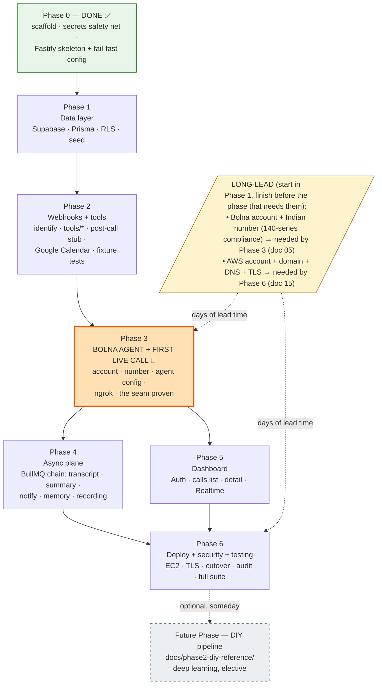

# 20 — Roadmap

> **RecruitPilot AI — Production-Grade AI Executive Voice Assistant**
> Document 20 of 21 · Prerequisites: docs 00–19

---

## 1. Goal

Turn the twenty preceding design and setup documents into a single **ordered, phased build plan** — the exact sequence in which to write, test, deploy, and demo the system, from the scaffold you already have to a live Bolna number a recruiter can call.

Docs 00–19 taught you *what* each part is and *how* each service is configured in isolation. This document answers the question those docs deliberately left open: **in what order do you assemble them so that risk falls fast, something works early, and nothing is discovered too late to fix?**

Concretely, by the end of this document you will have:

- A **phase-by-phase plan** (Phase 0 → Phase 6, plus an optional future DIY phase), each phase a set of milestones, each milestone a table of tasks mapped to the doc that specifies it and a precise *done-when* condition.
- An honest **time budget**: roughly **40 hours of focused work**, which at ~1 hour/day lands the whole build in **6–8 weeks** — with a per-phase breakdown so you can see where the hours go.
- A **critical-path view** of the long-lead items (the Bolna number — Indian 140-series compliance takes calendar days; AWS/domain/TLS) that must start early or they block everything.
- A **definition of done** per phase — tested (doc 19), deployable (docs 13–15), secure (doc 18) — so "done" is never a matter of opinion.
- A single acceptance test that proves the product from doc 00 is real.
- The **optional future phase**: rebuilding the voice pipeline yourself from the archived DIY docs (`docs/phase2-diy-reference/`) — deep learning, entirely elective, and possible precisely *because* the provider-pattern seams survive the pivot.

**Phase 0 is already done.** The git history shows it: the monorepo scaffold with the secrets safety net (M1) and the Fastify skeleton with fail-fast config (M2) are committed. This document starts you at Phase 1.

---

## 2. Theory

### 2.1 Why sequencing is an engineering decision, not a formality

You could implement docs 04–19 in numeric order — but that order is a *teaching* order (services in the sequence they're easiest to learn), not a *build* order (the sequence that minimizes risk). Build order is its own design problem. Get it wrong and you discover, in week six, that Bolna's identify payload doesn't carry the field you assumed — after you've already built the dashboard, the summary jobs, and the memory system on top of that assumption. Get it right and the scariest unknown is proven or disproven early, while changing course is still cheap.

The governing idea: **de-risk the unknowns first.** And here is the pleasant surprise of the pivot — the DIY plan's terrifying unknown (real-time telephony, jitter buffers, barge-in, the 1.5s latency budget) is **gone**. Bolna owns it. What remains unknown is much smaller and cheaper to prove:

1. **The webhook contract** — does Bolna actually call our three endpoints with the shapes doc 08 describes, inside the latency budgets? (Proven in Phase 3 with one test call; *pre*-proven in Phase 2 with curl and fixtures.)
2. **The agent's behaviour** — does the prompt, with our identify variables injected, screen the way doc 16 designs? (Proven iteratively from Phase 3 on, guarded by the doc 19 eval set.)

Everything else — Postgres, BullMQ, Next.js, Docker — is well-trodden ground.

### 2.2 The walking skeleton (tracer bullet), relocated

A **walking skeleton** is a thin, end-to-end slice of the system that is fully wired but does almost nothing — it *walks* (runs end to end) but has no *muscle*. The related **tracer bullet** metaphor (from *The Pragmatic Programmer*): fire a visible round, watch where it lands, adjust — build a complete path through every layer immediately and refine it in place.

In the DIY plan the skeleton was a heroic effort: a real call reaching our WebSocket and hearing a pre-synthesized greeting. In the Bolna plan the skeleton is **Phase 3, and it is small**: a Bolna agent, pointed at our ngrok-tunnelled identify endpoint, answers a real call with the scripted disclosure greeting and holds a conversation. The telephony, STT, TTS, and turn-taking all *walk on day one* because they are Bolna's product, not our project. Our tracer bullet only has to prove the **seam**: Bolna ⇄ our webhooks ⇄ our database.

That relocation is worth stating plainly because it drives the whole plan: **we build our side of the seam first (Phases 1–2), entirely testable with fixtures and curl, and only then bring Bolna to it (Phase 3).** When the first live call happens, our side has already passed its tests.

### 2.3 Vertical slices over horizontal layers

Two ways to build a layered system:

| | Horizontal (layer by layer) | Vertical (slice by slice) |
|---|---|---|
| Order | All of the DB, then all of the API, then all of the UI | One feature end-to-end (DB→API→agent), then the next |
| First working demo | Only at the very end | After the first slice |
| Integration risk | All deferred to one terrifying "integration phase" | Paid down continuously, a little per slice |
| Feedback | Late | Early and constant |

We build **vertically**. Phase 3 completes the first vertical slice (call → identify → conversation → tools firing → rows in the DB), touching Bolna, the API, and the database — thin in each, complete through all. Phases 4–5 *thicken* that slice (the async plane, the dashboard window onto it) rather than bolting on disconnected layers. The nightmare this avoids is **big-bang integration**: wiring everything together at the end, where every bug is entangled with every other bug.

### 2.4 Make it work → make it right → make it fast (Kent Beck's order)

For each capability, in this order:

1. **Make it work** — the crudest thing that produces the right end-to-end behavior (an identify endpoint that returns a hardcoded name; one tool; a summary with a fixed prompt).
2. **Make it right** — clean it against the architecture (behind a port, tested per doc 19, secured per doc 18, idempotent per doc 08).
3. **Make it fast** — only now tune against the webhook budgets (identify <500ms, tools <800ms — doc 01/08) with real measurements from live-call logs.

The trap is doing these in reverse. The good news: with Bolna owning the audio path, "fast" is mostly *structural* — cache the calendar, enqueue the slow tools, index the phone-number lookup — decisions docs 08/16 already made for you. There is no jitter buffer to tune. There never will be (unless you choose the optional DIY phase).

### 2.5 MVP vs iteration — what "done enough to demo" means

Not every doc-00 requirement must ship in the first demoable build. The **MVP** is the smallest system that proves the concept: a recruiter calls, the AI declares itself (**non-negotiable**, doc 00 §2.3), screens with a few questions, and Varun is notified with a transcript. Memory, all four tools, a polished dashboard — these are *iteration*. §5.3 lists exactly what is safe to cut for a first demo and the one thing that is never cut.

### 2.6 The cost of big-bang integration vs incremental

Integration cost is roughly quadratic in the number of components combined *at once*, because every pair is a potential interaction bug and you're debugging all pairs simultaneously. Incremental integration adds one component to a known-good base at a time, so a new failure has exactly one likely cause: the thing you just added. This is why **every phase ends deployed, demoable, tested, and secure** — each phase is an integration checkpoint that keeps the known-good base genuinely known-good.

### 2.7 Definition of done (per milestone, non-negotiable)

A milestone is **done** only when all three hold — not one, not two:

- **Tested** — the tests specified for that surface in doc 19 exist and pass (Vitest unit/integration; webhook fixtures; idempotency; agent evals where the milestone touches the prompt). Green CI (doc 14).
- **Deployable** — it runs in the containerized environment (doc 13) and, from Phase 6 on, is actually deployed to EC2 via merge (docs 14/15). Before Phase 6, "deployable" means the Docker build succeeds and it runs under `docker compose`.
- **Secure** — the security controls that apply at that layer are in place *now*, not deferred (doc 18): RLS from Phase 1, the webhook Bearer token from the first endpoint in Phase 2, spend posture before the first paid call, secrets never committed. Security is per-phase, not a final phase (§12).

"It works on my machine" is not done. "It works, it's tested, it deploys, and it's secure" is done.

---

## 3. Architecture

The build is a dependency graph of phases. Each node is a phase; an arrow means "must substantially exist before." The guiding principle: **each phase ends DEPLOYED + DEMOABLE** — a running thing you can show, not a pile of half-wired code.



Read the graph as three truths:

1. **Phase 3 is the pivot** (highlighted). Everything before it builds and *proves* our side of the Bolna seam with fixtures and curl; everything after it thickens the slice the first live call validates.
2. **Phases 4 and 5 can run in parallel** — the async plane and the dashboard are independent given a working Phase 3, and both feed Phase 6. A solo builder does them sequentially; the graph just says nothing breaks if you interleave.
3. **The dotted long-lead items are not phases** — they are procurement with lead times you don't control (Indian telephony compliance for the Bolna number; DNS/TLS propagation). Start the Bolna signup + number purchase during Phase 1, the AWS/domain work during Phase 4, and neither ever blocks you. See §5.2.

The same plan as time — illustrative, at ~1 focused hour per day:

```mermaid
gantt
    title RecruitPilot AI — Phased Build (~40h at 1h/day ≈ 6–8 weeks)
    dateFormat  X
    axisFormat  %s

    section Long-lead (procurement)
    Bolna account + number compliance (doc 05)  :crit, num, 4, 14
    AWS + domain + DNS + TLS (doc 15)           :aws, 18, 30

    section Build phases (bar length ≈ hours)
    P0 Foundations — DONE                        :done, p0, 0, 4
    P1 Data layer (docs 04/11)                   :p1, 4, 10
    P2 Webhooks + tools (docs 08/09/16)          :p2, 10, 18
    P3 Bolna agent + first call (docs 05/06/17)  :crit, p3, 18, 22
    P4 Async plane (docs 01/07/11/16)            :p4, 22, 29
    P5 Dashboard (docs 10/12)                    :p5, 29, 35
    P6 Deploy + security + testing (13/14/15/18/19) :crit, p6, 35, 43
```



The numbers are illustrative, not commitments — the *shape* is the point: the number-compliance bar starts during Phase 1 so Phase 3 never waits; the AWS bar starts during Phase 4 so Phase 6 never waits; and the whole thing sums to about 40 focused hours.

---

## 4. Folder Structure

This document creates **no new folders** — it is the plan for populating the tree that doc 03 already fixed. What it adds is a *when*: the order in which the canonical tree comes into existence. Map each phase to the region of the tree it fills:

| Phase | Primary folders populated | Doc(s) |
|---|---|---|
| 0 ✅ | root (workspaces, `.gitignore`, `.env.example`), `apps/api/src/{core/config,infra/logger}`, `app.ts`, `server.ts`, `.github/workflows/ci.yml`, `packages/shared` skeleton | 03, 09, 14 |
| 1 | `prisma/schema.prisma` + `migrations/` (+ RLS), `prisma/seed.ts`, `apps/api/src/features/calls/{repository,service}` | 04, 11 |
| 2 | `apps/api/src/features/webhooks/` (identify/tools/post-call routes + token preHandler), `features/agent/tools/*` handler logic, `providers/{google-calendar,email}/`, `apps/api/test/{fakes,fixtures}` | 08, 09, 16, 19 |
| 3 | almost nothing in the repo — Bolna dashboard config (agent, prompt, welcome message, tools JSON, inbound + analytics tabs) + captured real fixtures replacing provisional ones | 05, 06, 17 |
| 4 | `apps/api/src/jobs/*`, `infra/queue/`, `worker.ts` consumers, `providers/bolna/` (executions fetch, recording download) | 01, 07, 11, 16 |
| 5 | `apps/web/src/app/(auth)` & `(dashboard)`, calls list + detail (transcript/summary/playback), Realtime hook; `features/calls/routes` REST | 10, 12 |
| 6 | `docker/` (both Dockerfiles, nginx.conf), `docker-compose*.yml`, `.github/workflows/deploy.yml`, server-side `/opt/recruitpilot` | 13, 14, 15, 18 |
| future (optional) | `features/voice/`, `providers/{exotel,deepgram,elevenlabs}/` — resurrected from the archived docs | `docs/phase2-diy-reference/` |

The **Dependency Rule** (doc 03) is not a phase — it is honored in *every* phase from the first file, enforced mechanically by `dependency-cruiser` in CI from Phase 0. You never "add architecture later"; you build inside it from commit one.

---

## 5. Manual Steps

### 5.1 How to actually use this roadmap

1. **Pick the current phase.** You are always in exactly one build phase. Do not start Phase *n+1* until Phase *n*'s checklist (§13) is fully green — that discipline is what keeps the known-good base known-good (§2.6).
2. **Work milestone by milestone, top to bottom.** Each phase's milestone tables (§9A) are ordered; the order within a phase matters as much as the order of phases.
3. **Close every milestone with the three-part definition of done** (§2.7): the doc-19 tests for that surface pass, it builds/runs in Docker, and its security controls are in place.
4. **Deploy at the end of each phase.** Before Phase 6, "deploy" means a green Docker build under `docker compose` locally. From Phase 6 on, it means a real merge-to-`main` auto-deploy to EC2 (doc 14).
5. **Demo at the end of each phase.** Keep one continuously-working demo (§11). If you can't show it, the phase isn't done.
6. **Track progress with the per-phase checklists** in §13. Tick as you go; the master checklist is your burndown.

### 5.2 The critical path — start the long-lead items early

Two things take *calendar* time you cannot compress by working harder:

| Long-lead item | Lead time | Blocks | Start it |
|---|---|---|---|
| **Bolna account + Indian number** (doc 05) | Signup is instant ($5 free credits); a **regulated 140-series number** involves compliance steps measured in days (doc 05 links Bolna's guidance) | **Phase 3** — no number, no inbound call | **during Phase 1** |
| **AWS account + domain + DNS + TLS** (doc 15) | Hours-to-days (DNS propagation, cert issuance, possible account verification) | **Phase 6** — no domain, no production webhooks | **during Phase 4** |

Note how much shorter this list is than the DIY plan's (which led with a multi-day Exotel KYC before *anything* could ring). The sequential spine is `1 → 2 → 3 → {4 ∥ 5} → 6`. The one thing that can still wreck the schedule is treating the regulated-number purchase as a Phase-3 task — kick it off while you're building the data layer, and use Bolna's test-call facilities in the meantime.

### 5.3 Adjusting scope honestly — what to cut for a first demo, what never to cut

If you need a demoable system *fast*, cut **iteration**, never the **MVP core**:

| Safe to cut for a first demo (add back in iteration) | Never cut |
|---|---|
| **Memory** of returning recruiters (doc 16) — deliver the MVP with fresh-context calls (identify can return just the name) | **The self-declaration greeting** (doc 00 §2.3) — configured as Bolna's scripted welcome message (doc 06) before the LLM ever speaks. Cutting it isn't a smaller MVP, it's a non-compliant product. |
| **Three of the four tools** — ship with only `notify_varun`; add `check_calendar`, `send_resume`, `save_recruiter` later (doc 16) | **Webhook Bearer-token auth** (docs 08/18) — an open identify endpoint leaks recruiter data; an open tool endpoint sends email for strangers |
| **Dashboard polish** — a plain calls list beats a beautiful empty one (doc 10) | **Idempotency on post-call** (doc 08) — Bolna retries; without the dedupe you double-notify Varun on day one |
| **The full async chain** — start with persist-transcript + notify; add summary/memory/recording later | **Green CI + the fixture tests** (docs 14/19) — the safety net that lets you move fast without breaking the demo |

The rule: cut **breadth** (fewer tools, no memory, plainer UI), never **integrity** (the declaration, the token, idempotency, the tests).

---

## 6. Official Links

The primary "links" for this document are the **other documents in this suite** — the roadmap is a map *of them*:

| Reference | Where | Consumed by phase |
|---|---|---|
| Project overview & the hard rules | [`00_PROJECT_OVERVIEW.md`](./00_PROJECT_OVERVIEW.md) | all |
| System architecture, webhook budgets, two planes | [`01_SYSTEM_ARCHITECTURE.md`](./01_SYSTEM_ARCHITECTURE.md) | 2, 4, 6 |
| Tech stack + the Bolna ADR & cost math | [`02_TECH_STACK.md`](./02_TECH_STACK.md) | 1 (context), 3 |
| Canonical folder structure | [`03_FOLDER_STRUCTURE.md`](./03_FOLDER_STRUCTURE.md) | every phase |
| Supabase setup | [`04_SUPABASE_SETUP.md`](./04_SUPABASE_SETUP.md) | 1 |
| Bolna account, credits, number (long-lead!) | [`05_BOLNA_SETUP.md`](./05_BOLNA_SETUP.md) | 1 (start) → 3 |
| Bolna agent configuration | [`06_BOLNA_AGENT_CONFIG.md`](./06_BOLNA_AGENT_CONFIG.md) | 3 |
| Claude / Anthropic (summaries) | [`07_CLAUDE_SETUP.md`](./07_CLAUDE_SETUP.md) | 4 |
| The webhook contract (THE Phase-2 spec) | [`08_BOLNA_WEBHOOKS.md`](./08_BOLNA_WEBHOOKS.md) | 2, 3 |
| Fastify foundation | [`09_FASTIFY_SETUP.md`](./09_FASTIFY_SETUP.md) | 0 ✅, 2 |
| Next.js dashboard | [`10_NEXTJS_SETUP.md`](./10_NEXTJS_SETUP.md) | 5 |
| Prisma schema, RLS, Realtime | [`11_DATABASE_DESIGN.md`](./11_DATABASE_DESIGN.md) | 1, 4, 5 |
| REST API / auth classes | [`12_API_DESIGN.md`](./12_API_DESIGN.md) | 2, 5 |
| Docker & local dev | [`13_DOCKER_SETUP.md`](./13_DOCKER_SETUP.md) | 2 (Redis), 6 |
| CI/CD (GitHub Actions) | [`14_GITHUB_ACTIONS.md`](./14_GITHUB_ACTIONS.md) | 0 ✅, 6 |
| EC2 / Nginx / TLS / CloudWatch / cutover | [`15_DEPLOYMENT.md`](./15_DEPLOYMENT.md) | 6 |
| AI agent: prompt, tools, memory, disclosure | [`16_AI_AGENT.md`](./16_AI_AGENT.md) | 2, 3, 4 |
| Call lifecycle + local dev with ngrok | [`17_CALL_LIFECYCLE.md`](./17_CALL_LIFECYCLE.md) | 2, 3 |
| Security (the audit gate) | [`18_SECURITY.md`](./18_SECURITY.md) | every phase; gate in 6 |
| Testing, fixtures, idempotency, evals | [`19_TESTING.md`](./19_TESTING.md) | every phase |
| Archived DIY voice-pipeline docs | `docs/phase2-diy-reference/` | optional future phase |

External references on the sequencing method used here:

| Topic | Link |
|---|---|
| Walking skeleton / tracer bullet (*The Pragmatic Programmer*) | https://pragprog.com/titles/tpp20/the-pragmatic-programmer-20th-anniversary-edition/ |
| Walking Skeleton (Alistair Cockburn) | https://wiki.c2.com/?WalkingSkeleton |
| "Make it work, make it right, make it fast" (Kent Beck) | https://wiki.c2.com/?MakeItWorkMakeItRightMakeItFast |
| Evolutionary design (Martin Fowler) | https://martinfowler.com/bliki/EvolutionaryDesign.html |
| Vertical slice architecture | https://www.jimmybogard.com/vertical-slice-architecture/ |
| Bolna docs (the external system we integrate) | https://www.bolna.ai/docs |

---

## 7. Commands

Phase 0 is committed, so the on-ramp is not scaffolding — it is **verifying the foundation still stands, then starting Phase 1**:

```bash
# 0. Confirm the Phase-0 foundation (should all be green already):
git log --oneline | head -3            # expect the M1 scaffold + M2 Fastify commits
npm ci                                  # lockfile-exact install
npm run lint && npm run typecheck       # the CI gate, locally
npm run dev --workspace=@recruitpilot/api &
curl -s localhost:3000/health | jq      # {"status":"ok",...} from the doc-09 skeleton
kill %1

# 1. Start Phase 1 (doc 04): create the Supabase project (Mumbai), then:
cp .env.example .env                    # fill DATABASE_URL / DIRECT_URL / SUPABASE_* (doc 04)
npx prisma init                         # if not already present
# ... write schema.prisma per doc 11, then:
npx prisma migrate dev --name init      # first migration: tables + RLS in the same migration
npx prisma db seed                      # default settings (idempotent)

# 2. And on the same day, start the long-lead clock (§5.2):
#    → sign up at bolna.ai ($5 free credits), begin the Indian-number purchase (doc 05).
```

After the first migration applies and CI stays green, you are inside Phase 1 proper. Everything below §7 is the map for what to build next.

---

## 8. Environment Variables

This document introduces **no new variables**. Its job is to say **when** each existing group is needed, so you provision accounts *just in time* — except the long-lead ones (the Bolna number), which you start early even though you use them later (§5.2). The **single source of truth** for the full inventory is doc 18's master table; this is the *scheduling* view of it:

| Phase | Variable group | Source doc | Provision by |
|---|---|---|---|
| 0 ✅ | `NODE_ENV`, `PORT`, `HOST`, `LOG_LEVEL` (`.env.example` exists, fail-fast config validates) | 03, 09 | done |
| 1 | `DATABASE_URL`, `DIRECT_URL`, `SUPABASE_URL`, `SUPABASE_ANON_KEY`, `SUPABASE_SERVICE_ROLE_KEY` | 04, 11 | Phase 1 |
| 1 (start) | **Bolna account created; number purchase begun** — no env vars yet, just the clock | 05 | start in Phase 1 |
| 2 | `BOLNA_WEBHOOK_TOKEN` (**we mint it**: `openssl rand -hex 32`), `GOOGLE_CALENDAR_ID`, `GOOGLE_SERVICE_ACCOUNT_JSON`, `RESUME_STORAGE_PATH`, SMTP/email creds, `REDIS_URL` (tools enqueue) | 08, 16, 13 | Phase 2 |
| 3 | `BOLNA_API_KEY`, `BOLNA_AGENT_ID` | 05, 06 | Phase 3 |
| 4 | `ANTHROPIC_API_KEY` (**set the spend limit first — §12**), `ANTHROPIC_MODEL_SUMMARY` | 07 | Phase 4 |
| 5 | `SUPABASE_JWT_SECRET`, `NEXT_PUBLIC_SUPABASE_URL`, `NEXT_PUBLIC_SUPABASE_ANON_KEY`, `NEXT_PUBLIC_API_URL` | 04, 10, 12 | Phase 5 |
| 6 | GitHub Actions secrets (`EC2_*`, `NEXT_PUBLIC_*`), the server-side `/opt/recruitpilot/.env` with **fresh production values**, `TEST_DATABASE_URL`/`TEST_REDIS_URL`/`USE_FAKE_PROVIDERS` in CI | 14, 15, 18, 19 | Phase 6 |
| future (optional) | the retired `EXOTEL_*` / `DEEPGRAM_*` / `ELEVENLABS_*` / `VOICE_*` set | `docs/phase2-diy-reference/` | only if you take the DIY phase |

Two rules carried from doc 00 and enforced here: secrets live only in git-ignored `.env` (local) / the server `.env` (prod — doc 15), and **the Anthropic spend limit is set before the key is ever used** in Phase 4 (§12). Provision an account the phase before you need it — but never later, or the phase stalls.

---

## 9. Verification

### 9.1 Per-phase definition of done (recap)

Each phase is verified against the *done-when* in its milestone tables (§9A) plus the three-part rule (§2.7). Summary:

| Phase | ~Hours | Phase is DONE when… | Deployed? | Demo |
|---|---|---|---|---|
| 0 ✅ | ~4 (spent) | `npm run dev` boots; `/health` 200; fail-fast config proven; CI green | local | *(already demoable)* |
| 1 | ~6 | Schema migrated with RLS; seed applied; repositories tested against the test DB | local Docker build | `prisma studio` showing seeded settings; RLS deny test passing |
| 2 | ~8 | All three webhook surfaces answer **fixture-driven tests**: identify returns recruiter JSON, tools execute/enqueue with authorization rules, post-call is idempotent — all token-gated | local Docker | curl each surface with/without the token; watch a tool enqueue |
| 3 | ~4 | **You dial the Bolna number and the agent answers with the disclosure greeting**, knows a seeded caller by name, and a tool fires mid-call through ngrok | local + ngrok | Place a real call on speaker 🎯 |
| 4 | ~7 | After a call ends, the job chain runs: transcript persisted, summary generated, Varun notified, memory updated, recording stored — idempotently | local Docker | Complete a call → check inbox + DB rows |
| 5 | ~6 | Varun logs in; calls list + detail (transcript, summary, playback) live-update via Realtime | local Docker | Watch a call appear in the dashboard without refresh |
| 6 | ~8 | Live on the real domain; Bolna cut over from ngrok; deploys via merge; CloudWatch alarms live; doc-18 audit + full doc-19 suite green | **EC2 Mumbai, real deploy** | A recruiter calls the *production* number |

Total ≈ **43 focused hours** → at ~1 hour/day, **6–8 weeks** end to end. If a phase runs long, §5.3 tells you what to cut; the total is honest, not optimistic.

### 9.2 The ultimate acceptance test (the whole point)

The project is complete when **the product described in doc 00 §1 exists and is live**:

> A recruiter dials Varun's real number → Bolna answers and **plays the scripted AI disclosure** (*"Hello. You've reached Varun Gandhi's AI Assistant…"*, doc 00 §2.3) → Bolna hits our **identify** webhook and greets a returning recruiter by name → the agent **screens** the opportunity, calling our **tool** webhooks during the conversation → the call ends and the **post-call** webhook fires our job chain → **Varun is notified** with a transcript and structured summary → everything is visible in the dashboard, live → and it is **deployed on EC2, monitored via CloudWatch, and secured per the doc-18 audit**.

If a recruiter can call and that entire sentence happens, you are done. Everything in this suite existed to make that one sentence true.

### 9.3 Self-quiz (from memory, per the doc-00 convention)

1. **Why do we build the webhooks (Phase 2) before touching Bolna (Phase 3)?** (§2.2 — our side of the seam is fixture-testable; the first live call then validates a pre-tested surface.)
2. **What is the riskiest remaining unknown after the pivot, and which phase proves it?** (The Bolna↔us webhook contract on a real call; Phase 3.)
3. **Which long-lead item starts in Phase 1, and why?** (The Bolna number — Indian 140-series compliance is calendar days; §5.2.)
4. **What would you cut for an MVP demo, and what would you never cut?** (§5.3.)
5. **State the definition of done** for any milestone. (Tested per doc 19 · deployable per docs 13–15 · secure per doc 18 — all three.)
6. **Why do Phases 4 and 5 parallelize**, but Phase 4 cannot start before Phase 3? (§3 — both hang off a proven live-call slice; the async plane consumes real post-call payloads.)
7. **What is the optional future phase, and why is it possible at all?** (The DIY pipeline from `docs/phase2-diy-reference/`; the provider seams mean Bolna is one adapter surface, swappable for our own.)

---

## 9A. The Phased Plan

> This is the heart of the document. Each phase is a set of milestones; each milestone is a table of **task → doc that specifies it → done-when**. Do them in order. Close each with §2.7's definition of done.

### Phase 0 — Foundations ✅ DONE
*Shipped in the first two commits: the safe scaffold (M1) and the Fastify skeleton (M2).*

| What exists | Doc | Proof |
|---|---|---|
| Monorepo workspaces, `.gitignore` + `.env.example` before any secret, dependency-cruiser rules | 03 | `chore: Phase 0 M1 — monorepo scaffold + secrets safety net` |
| Fastify app with Zod fail-fast config, Pino logger, `/health`, CI | 09, 14 | `feat(api): Phase 0 M2 — Fastify skeleton with fail-fast config` |

Nothing to do here except keep the foundation green (§7 command 0).

---

### Phase 1 — Data layer (~6h)
*Goal: the database that every later phase reads and writes — schema, RLS, seed, repositories. Start the Bolna number purchase now (§5.2).*

**Milestone 1.1 — Supabase + Prisma + schema**

| Task | Doc | Done-when |
|---|---|---|
| Create Supabase project in **Mumbai**; capture both connection strings | 04 | `DATABASE_URL` + `DIRECT_URL` set; `prisma migrate dev` connects |
| `prisma/schema.prisma`: `Call` (correlated by **`executionId`**), `Recruiter`, `Opportunity`, `Memory`, `ToolInvocation`, `Setting` | 11 | first migration applies cleanly |
| **RLS policies in the same migration** as each table | 11, 18 | anon reads zero rows; fail-closed tables have no policy |
| Seed script: default settings, screening questions, one test recruiter | 11, 16 | `prisma db seed` idempotent; rerunning changes nothing |
| Enable **Realtime** on `Call` | 11 | inserting a row via SQL emits to a subscriber |

**Milestone 1.2 — Repositories, tested**

| Task | Doc | Done-when |
|---|---|---|
| `features/calls/` + `features/recruiters/` repositories returning shared types | 11, 03 | repository integration tests pass against the test DB (doc 19) |
| `docker-compose.test.yml` + test-DB helpers | 19 | `npm run test:int` green locally and in CI |
| **Start Bolna signup + number purchase** | 05 | account live, $5 credits visible, number request submitted |

**Phase 1 done:** migrated, seeded, RLS-proven, repositories tested; the compliance clock is ticking in the background.

---

### Phase 2 — Webhooks + tools (~8h)
*Goal: our entire side of the Bolna seam, built and proven with fixtures and curl — before Bolna ever calls it.*

**Milestone 2.1 — The token gate + identify**

| Task | Doc | Done-when |
|---|---|---|
| Mint `BOLNA_WEBHOOK_TOKEN` (`openssl rand -hex 32`); Bearer preHandler with **constant-time compare** | 08, 18 | all `/webhooks/bolna/*` routes 401 without/with-wrong token, *before any work* |
| `GET /webhooks/bolna/identify`: phone lookup → recruiter + prompt-safe memory JSON | 08, 16 | curl with a seeded number returns the doc-08 shape in <500ms locally |
| Identify contract test incl. the **no-private-field invariant** | 19, 18 | test fails if a private column leaks into the response |

**Milestone 2.2 — The four tools**

| Task | Doc | Done-when |
|---|---|---|
| `check_calendar` → Google service account (read-only), cached free/busy | 16 | fixture test returns canned windows; live curl reads the real calendar |
| `save_recruiter` → fast upsert | 16, 08 | fixture-driven handler test proves the parsed-args upsert |
| `send_resume` + `notify_varun` → **enqueue and return `{queued:true}`** (Redis via doc 13's dev compose) | 16, 08 | handler tests assert enqueue-not-await; nothing slow on the request path |
| Tool **authorization rules**: resume only to the stated address; notify destination server-configured | 16, 18 | negative tests pass |

**Milestone 2.3 — Post-call intake (stub) + fixtures**

| Task | Doc | Done-when |
|---|---|---|
| `POST /webhooks/bolna/post-call`: validate (Zod `.passthrough()`), persist raw payload + Call row, ack 200 fast | 08, 12 | fixture delivery creates one Call row |
| **Idempotency by `execution_id`** | 08, 19 | the duplicate-delivery test passes (one row, one enqueue) |
| Provisional fixtures for all three surfaces (from doc 08's documented shapes; marked for re-capture in Phase 3) | 19 | fixture suite green in CI with zero vendor keys |

**Phase 2 done:** every surface Bolna will ever call answers correctly, fast, token-gated, and idempotent — proven without a single phone call.

---

### Phase 3 — Bolna agent + FIRST LIVE CALL (~4h) 🎯
*Goal: bring Bolna to the seam. The walking skeleton walks. Needs the number (started Phase 1).*

**Milestone 3.1 — Agent configuration**

| Task | Doc | Done-when |
|---|---|---|
| Create the agent (dashboard Quick Start); pick Claude in the **LLM tab**; transcriber + voice | 05, 06 | a Bolna test call converses (no webhooks yet) |
| **Scripted welcome message = the verbatim disclosure greeting** (Layer 1) | 06, 00 §2.3 | test call opens with the exact doc-00 sentence — before the LLM speaks |
| System prompt with `{{caller_name}}`/`{{memory}}` variables; the four **custom_task tool JSONs** with `%(param)s` mappings + `api_token` | 06, 08, 16 | agent config saved; `BOLNA_AGENT_ID` recorded |
| ngrok tunnel; point identify/tools/post-call at it (dev token) | 17 | Bolna dashboard shows our ngrok URLs on all three surfaces |

**Milestone 3.2 — The first real call**

| Task | Doc | Done-when |
|---|---|---|
| Link the inbound number to the agent | 05, 06 | dialing the number reaches the agent |
| **Dial from the seeded test recruiter's phone** | 17 | greeting plays → agent addresses you **by name** (identify worked) → ask "is Varun free Thursday" → `check_calendar` fires in your logs |
| Let the call end; watch post-call arrive | 17, 08 | a real Call row with a real transcript exists |
| **Re-capture fixtures from the real payloads** (scrub PII), replacing the provisional ones | 19 | fixture suite green against *real* shapes; discrepancies vs doc 08 reconciled against https://www.bolna.ai/docs |

**Phase 3 done — THE SEAM IS PROVEN:** a real phone call, the AI disclosure, memory injected, a tool fired, a transcript landed. Celebrate this (§11). Everything after thickens a spine you now *know* works.

---

### Phase 4 — Async plane (~7h)
*Goal: everything that happens after the call — reliably, idempotently, off the webhook path. (Parallelizable with Phase 5.)*

**Milestone 4.1 — The job chain**

| Task | Doc | Done-when |
|---|---|---|
| BullMQ queues + `worker.ts` consumers wired | 01, 13 | worker consumes from dev Redis |
| `persist-transcript` → `generate-summary` (Claude direct, `ANTHROPIC_MODEL_SUMMARY`; **spend limit set first**) | 07, 16 | summary row generated from a real transcript |
| `upsert-recruiter` / `upsert-opportunity` | 11, 16 | rows created/updated from call data |
| `store-recording`: download from the Bolna recording URL → Supabase Storage (private bucket) | 04, 08 | recording object stored; signed URL plays |
| **Idempotency + retries keyed by `execution_id`** across the chain | 01, 08 | replaying post-call twice yields no duplicates anywhere |

**Milestone 4.2 — Notify + memory**

| Task | Doc | Done-when |
|---|---|---|
| `notify-varun` email with summary (+ resume when sent) | 16 | Varun's inbox after a test call |
| `update-memory` distillation job (prompt-safe output — it feeds the next identify) | 16, 18 | calling again → the agent recalls the prior conversation |
| Layer-3 **disclosure transcript check** job | 16, 18 | a synthetic "I am Varun" transcript raises the violation flag |

**Phase 4 done:** a call becomes a complete, deduplicated record — summary, notification, memory, recording — with no human in the loop.

---

### Phase 5 — Dashboard (~6h)
*Goal: the window onto everything. (Parallelizable with Phase 4.)*

| Task | Doc | Done-when |
|---|---|---|
| Next.js app + Supabase Auth login (signups disabled) | 10, 04 | Varun logs in; strangers can't |
| Calls list (RLS-guarded reads) + Realtime live updates | 10, 11 | a new call appears without refresh |
| Call detail: transcript, summary, recruiter card, **recording playback** via short-TTL signed URL | 10, 12 | full record viewable and playable |
| REST routes for what PostgREST doesn't cover; contract tests against `packages/shared` | 12, 19 | `CallListResponse`/`CallResponse` parse in CI |

**Phase 5 done:** Varun sees every call, live, with the full record one click deep.

---

### Phase 6 — Deploy + security + testing (~8h)
*Goal: leave ngrok behind — live on real infrastructure, deployed by merge, audited, fully tested. Needs AWS/domain/TLS (started Phase 4).*

**Milestone 6.1 — Infrastructure + cutover**

| Task | Doc | Done-when |
|---|---|---|
| Docker images + compose files finished; prod compose validates | 13 | `docker compose -f docker-compose.prod.yml config` clean |
| EC2 (**ap-south-1 Mumbai**) + Elastic IP + DNS + TLS via certbot | 15 | `https://api.yourdomain/health` 200 with a padlock |
| **Bolna cutover**: all three webhook URLs → production, with the **production** `BOLNA_WEBHOOK_TOKEN` | 15, 06 | a real call hits EC2, not your laptop; ngrok retired |
| CloudWatch logs/metrics/alarms; correlation by `execution_id` | 15 | one query reconstructs a call end to end |

**Milestone 6.2 — Pipeline + gates**

| Task | Doc | Done-when |
|---|---|---|
| `deploy.yml`: merge → build → GHCR → SSH → migrate → swap → health | 14 | merging deploys; rollback drill (`-f sha=`) rehearsed |
| **Security audit pass** (the doc-18 gate): negative auth battery, identify-response check, spend posture, gitleaks/Trivy | 18 | audit checklist green *before* go-live |
| Full doc-19 suite as the merge gate: fixtures, idempotency, contracts, RLS, evals | 19 | CI green with zero vendor keys |
| Production smoke test: the two §7-of-doc-15 curls + **one real call via Bolna** | 15 | §9.2's acceptance sentence happens on production infrastructure |

**Phase 6 done:** the acceptance test (§9.2) passes on the real number. The product exists.

---

### Future Phase (optional) — the DIY voice pipeline
*Goal: deep learning, not product need. Entirely elective, indefinitely deferrable.*

The original hand-built pipeline design — Exotel WebSocket streaming, Deepgram STT, ElevenLabs TTS, jitter buffers, barge-in, the 1.5s latency budget — is preserved **unchanged** in `docs/phase2-diy-reference/`. If you ever want to understand what Bolna does for you (or need to leave it), that folder is a complete build guide for doing it yourself.

| Why you might | Why you might not |
|---|---|
| Deepest possible learning: real-time audio, socket management, turn-taking | ~2–3 months of engineering for behaviour you already have |
| An escape hatch if Bolna's pricing/quality/roadmap disappoints | The provider pattern already gives cheaper escapes (Vapi/Retell — doc 02's ADR) |
| The interview story: "I built the whole pipeline" | The current story is arguably better: "I knew what *not* to build" |

The architecture keeps this honest: Bolna is one adapter surface (doc 03), so the DIY phase is *additive* — new `features/voice/` + three providers — not a rewrite. **Do not start it before Phase 6 is done and the product has taken real calls for a while.**

---

## 10. Common Mistakes

1. **Building all layers horizontally before any vertical slice works.** Full DB → full API → full UI, then a big-bang integration where every bug is entangled. Build vertically; Phase 3 completes a thin full slice early (§2.3, §2.6).
2. **Touching the Bolna dashboard before the webhooks exist.** An agent with nowhere to send identify/tool calls teaches you nothing and burns test credits. Build and fixture-test the surface first (Phase 2), then connect Bolna to it (Phase 3) — the seam-first order (§2.2).
3. **Starting the regulated-number purchase late.** Indian 140-series compliance takes *days* (doc 05). Begin it during Phase 1 or Phase 3 stalls waiting for a number (§5.2).
4. **Starting AWS/domain/TLS late.** DNS propagation and cert issuance are calendar time you don't control. Start during Phase 4, use in Phase 6 (§5.2).
5. **Gold-plating the dashboard before the call works.** A beautiful dashboard over a number nobody can call is a demo of nothing. The call is the product; the dashboard is the window (§5.3).
6. **Skipping the idempotency work "for now."** Bolna retries webhooks; without the `execution_id` dedupe you will double-email Varun and double-count calls in your very first week (doc 08, §5.3). It is a Phase-2 task, not a hardening task.
7. **Cutting the scripted disclosure greeting "to save time."** It is a hard product/legal/ethical rule (doc 00 §2.3), enforced as Bolna's welcome-message config before the LLM speaks (doc 06). Cutting it isn't a smaller MVP — it's a non-compliant product. Never cut it (§5.3).
8. **Skipping tests and deploys until "the end."** Then "the end" is a multi-week integration-and-QA death march. Every phase ends tested + deployed + demoable (§2.7, §11).
9. **Putting private data in the identify response to "improve the agent."** Everything in that JSON is recitable to a stranger on the phone (doc 18 §12.2). Memory that reaches the prompt is distilled and prompt-safe, always.
10. **Doing docs in numeric (teaching) order as if it were build order.** Numeric order teaches services in isolation; *this* document is the build order. Follow the phases, not the doc numbers.

---

## 11. Production Best Practices

- **Every phase ends deployed + demoable + tested + secure** — never a single terrifying integration phase at the end. Each phase is an integration checkpoint (§2.6, §2.7).
- **Keep one continuously-working demo.** After Phase 3 there is always a number you can dial live. If a change breaks the demo, that change isn't done. The running demo is your truth-teller.
- **Watch the webhook budgets from Phase 3 onward.** Log per-request handler timings; the identify <500ms / tools <800ms budgets (docs 01/08) are regression tests, not one-time checks — and CloudWatch alarms them in Phase 6.
- **Security and tests as you go, not after.** RLS lands in Phase 1, the Bearer token with the first webhook in Phase 2, the Anthropic spend limit before Phase 4's first paid call, the audit gate in Phase 6 (§12). Retrofitting either is far more expensive than building with them.
- **Config over code.** Screening questions and agent behaviour live in Settings and the Bolna dashboard (docs 06/11/16) — behaviour changes without a deploy. But **prompt changes still run the eval set first** (doc 19): the dashboard makes changing the prompt easy, which makes regressing it easy too.
- **Celebrate the first live call (Phase 3).** The moment the agent answers with the disclosure and greets a caller by name is the momentum event of the whole build — the abstract becomes real. Treat it as the milestone it is.
- **Prefer parallelism where the graph allows it.** Phases 4 and 5 are independent (§3); interleave them solo for variety — but never start Phase 3 before Phase 2's fixture suite is green.
- **Re-capture fixtures whenever Bolna's payloads change.** The fixture suite is only as honest as its samples (doc 19); a real-payload refresh after any Bolna platform update keeps the contract tests truthful.

---

## 12. Security

Security in this build is **per-phase, not a phase.** There is no "security sprint" at the end — each phase ships with the controls its new surface requires, and Phase 6 is only the final *audit gate*, not the first time security is considered.

| When | Control | Doc |
|---|---|---|
| **Phase 0 ✅** | `.gitignore` before any `.env`; secrets never committed; dependency-cruiser + `process.env`-only-in-`core/config` in CI | 03, 14 |
| **Phase 1** | **RLS on every table in the same migration that creates it**; Supabase signups disabled | 04, 11, 18 |
| **Phase 2** | **Bearer `BOLNA_WEBHOOK_TOKEN` (constant-time) before any work** on all three surfaces; idempotency by `execution_id`; tool authorization rules; the identify no-private-field invariant as a test | 08, 16, 18, 19 |
| **Phase 3** | Prompt hardening (untrusted-input framing, never-impersonate) in the Bolna LLM tab; **max call duration** in the call tab; dev vs prod webhook tokens kept separate | 06, 16, 18 |
| **Before Phase 4's first Claude call** | **Anthropic spend limit set** in the console; Bolna prepaid balance treated as the telephony cap | 07, 05, 18 |
| **Phase 4** | PII discipline in jobs/logs (log `executionId` + lengths, never transcript content); recordings into **private** buckets only | 01, 04, 18 |
| **Phase 5** | Dashboard auth + single-tenant check; anon key only in the browser; short-TTL signed URLs for playback | 10, 12, 04 |
| **Phase 6 (gate)** | **Full doc-18 audit before go-live**: negative auth battery, gitleaks/Trivy, single public surface (Nginx :443), Redis unexposed, fresh production keys incl. a new webhook token, Bolna data-residency choice reviewed | 18, 15 |
| **Throughout** | Secrets discipline: password manager (humans) · git-ignored `.env` (local) · server `.env` (prod); rotate any leaked key immediately per the doc-18 runbook | 00, 18 |

The rule to carry into implementation: **an unauthenticated webhook surface leaks recruiter data and sends email for strangers the instant it's public** (doc 18). That's why the token gate is a Phase-2 birthright, not a Phase-6 afterthought. The doc-18 audit in Phase 6 *verifies* a posture that was built in from Phase 0 — it doesn't create one.

---

## 13. Checklist

**Master phase-completion checklist** — one line per phase; each phase's milestone tables (§9A) are the detail behind it. A phase is ticked only when tested + deployable + secure (§2.7).

- [x] **Phase 0 — Foundations:** monorepo scaffold + secrets safety net (M1) · Fastify skeleton with fail-fast config (M2) · CI green — **done, in git history**
- [ ] **Long-lead started on time:** Bolna account + number purchase begun in Phase 1; AWS/domain begun in Phase 4 (§5.2)
- [ ] **Phase 1 — Data layer:** schema + RLS migrated · seed idempotent · Realtime on `Call` · repositories tested against the test DB
- [ ] **Phase 2 — Webhooks + tools:** all three surfaces token-gated (constant-time) · identify prompt-safe + fast · four tools with authorization rules, slow ones enqueue · post-call idempotent · fixture suite green with zero vendor keys
- [ ] **Phase 3 — Bolna agent + first live call:** disclosure greeting scripted in Bolna · a real call greeted a seeded caller by name · a tool fired mid-call · real fixtures captured · **the seam is proven** 🎯
- [ ] **Phase 4 — Async plane:** full job chain (transcript → summary → upserts → notify → memory → recording) · idempotent under replay · Layer-3 disclosure check running
- [ ] **Phase 5 — Dashboard:** login works, signups closed · live calls list · detail with transcript/summary/playback · contract tests green
- [ ] **Phase 6 — Deploy + security + testing:** live on the real domain · Bolna cut over from ngrok · merge-to-`main` deploys · CloudWatch alarms · doc-18 audit passed · full doc-19 suite gating merges
- [ ] **THE PRODUCT FROM DOC 00 IS REAL AND DEPLOYED:** a recruiter calls → the AI declares itself → knows returning callers → screens with tools → Varun notified with transcript + summary → all visible live in the dashboard → on EC2, monitored, secured (§9.2)
- [ ] *(Optional, someday)* **Future DIY phase:** the archived pipeline in `docs/phase2-diy-reference/` built as a learning exercise — only after the product has been live and boring for a while

---

## 14. Next Step

**Begin Phase 1, Milestone 1.1 — the data layer (docs 04/11).** Run §7's commands: verify the Phase-0 foundation is still green, create the Supabase project in Mumbai, write the schema with RLS in the first migration, seed it — and, the same day, **sign up at Bolna and start the number purchase** (doc 05) so the compliance clock runs while you build (§5.2).

This documentation suite is complete. Docs 00–19 designed the system around the Bolna platform and configured every service; this document sequenced them into a plan that builds our side of the seam first, proves the live-call integration in a single afternoon, and defines "done" as tested, deployable, and secure at every step — about 40 focused hours to a live product, with the hand-built pipeline preserved in `docs/phase2-diy-reference/` for the day you want to learn what you didn't have to build.

The reading is over. Implementation begins now. Go build RecruitPilot AI.
